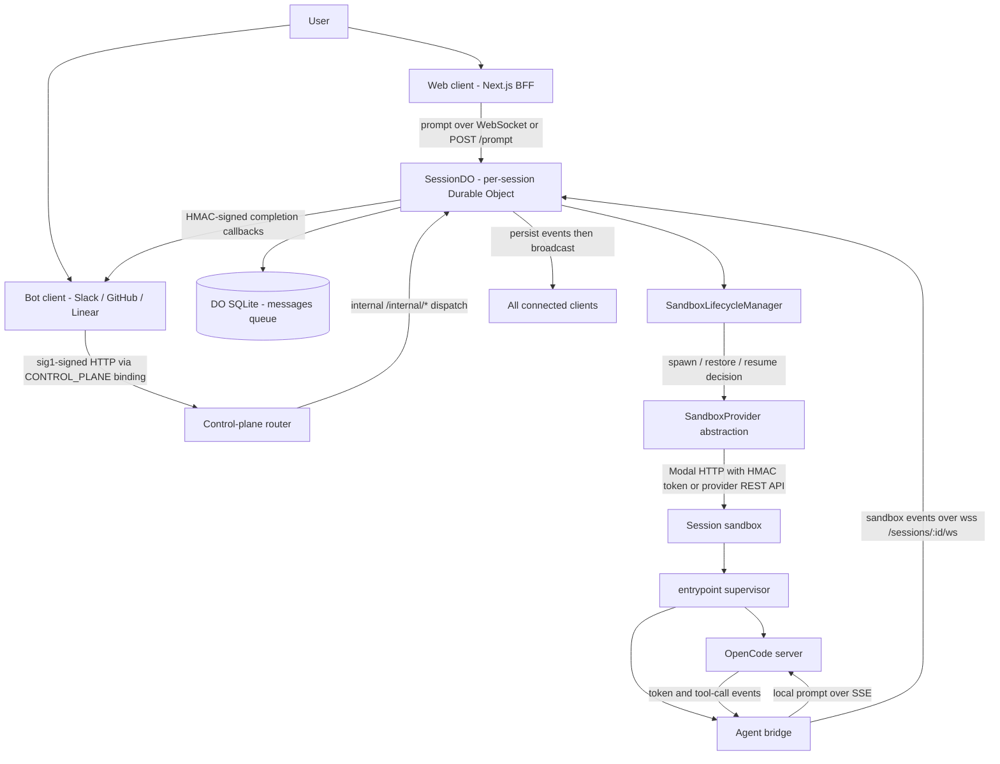
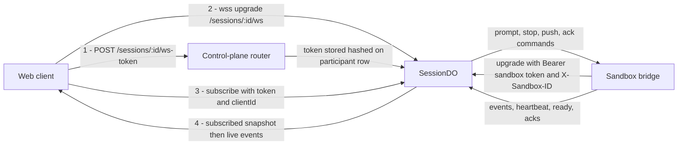

# Architecture Overview

Open-Inspect is a background coding agent system: you send a prompt, a session runs in the cloud
independently of your connection, and you check the results later. The system is single-tenant by
design and spans three tiers connected by WebSockets: clients that originate prompts, a Cloudflare
control plane that owns session state and routes messages, and a sandbox data plane where coding
agents actually run. This page is the map of that shape; the deeper pages it links to cover each
tier's internals.

## The three tiers

**1. Clients.** The web app (Next.js on Vercel or on Cloudflare Workers via OpenNext), the Slack
bot, the GitHub bot, the Linear bot, and authenticated inbound webhooks. Clients make HTTP calls
and hold WebSocket connections; they never own session state. The Slack bot turns messages into
sessions, the GitHub bot opens PR reviews or `@mention` sessions, and the Linear bot starts
sessions from issue activity — all by calling the same control plane API the web app uses.

**2. Control plane** (`packages/control-plane`, a single Cloudflare Worker). The coordinator: it
does not execute code, it manages state and routes messages. Responsibilities:

- Session state management in per-session Durable Objects backed by embedded SQLite
- WebSocket connections for real-time streaming (Hibernation API keeps idle connections alive
  without compute cost)
- Sandbox lifecycle orchestration (spawn, restore, snapshot, resume, timeout)
- Source-control integration (repo listing, PR creation, brokered git credentials)
- Authentication and access control (Better Auth for browsers, sig1 for services, sandbox tokens)

**3. Data plane** (sandbox backends, Python). Each session runs in an isolated sandbox with a
full development environment (Node.js 22, Python 3.12, git, browser automation, OpenCode). Five
sandbox providers are supported — Modal, Daytona, Vercel, OpenComputer, and E2B. Only Modal
requires a deployed Python data-plane service (`packages/modal-infra`); the other providers are
driven directly over their public REST APIs.

## The prompt data path



The prompt data path across the three tiers: a prompt is durably queued in the control plane,
dispatched to a sandbox agent, and its events stream back to every connected client.

Step by step:

1. **A prompt arrives.** From the web it goes over the session WebSocket (or `POST /sessions/:id/prompt`);
   bots post it with a signed service request. Either way it lands in the session's Durable Object.
2. **The DO queues it.** The prompt is persisted as a pending message in the DO's SQLite
   `messages` table. A session may hold at most 10 unfinished prompts, and exactly one message may
   be in `processing` at a time (enforced by a unique partial index), so prompts run FIFO. Invalid
   submissions are rejected with structured error codes: `INVALID_ATTACHMENTS`,
   `SESSION_NOT_PROMPTABLE`, and `PROMPT_QUEUE_FULL` (plus `PROMPT_REQUEST_CONFLICT` for a reused
   idempotency key).
3. **A sandbox is ensured.** If no sandbox is connected, dispatch defers: the message stays
   pending, the lifecycle manager decides spawn/restore/resume, and the spawn runs in the
   background so the HTTP response is not held open. A fresh prompt sent while the agent works is
   simply queued behind the current one.
4. **The DO dispatches the prompt.** The claimed message is sent to the sandbox as a `prompt`
   command carrying the author identity (for git attribution), model, reasoning effort, and
   attachments. An execution-timeout deadline is scheduled on the DO alarm.
5. **OpenCode works.** The in-sandbox supervisor drives OpenCode over its local API; each action
   (tokens, tool calls, steps) becomes an event.
6. **Events stream back.** The agent bridge forwards events over its WebSocket to the DO, which
   persists them in the `events` table and broadcasts `sandbox_event` to every authenticated
   client in real time.
7. **Results land.** PRs and screenshots become artifacts; completion callbacks (HMAC-signed) go
   back to the originating bot so Slack/Linear threads hear about it, and web clients see the
   same events live.

## The two WebSocket chains

Both chains terminate in the same per-session Durable Object, which is what makes the session a
single hub. The Worker's upgrade path checks the session id against the D1 index (404 if unknown)
and forwards the upgrade to the DO resolved by `env.SESSION.idFromName(sessionId)`.



The two WebSocket chains of a session: browser clients authenticate with short-lived WebSocket
tokens, while the sandbox bridge authenticates with the session's sandbox token. Both meet in one
Durable Object.

### Client chain (browser → DO)

1. The web client mints a token with `POST /sessions/:id/ws-token` (the DO upserts the
   participant and rotates the token, stored only as a hash with a 24-hour TTL).
2. It opens `wss://…/sessions/:id/ws` (URL from `NEXT_PUBLIC_WS_URL`) and sends a `subscribe`
   message with the token and a `clientId`.
3. The DO validates the token hash and TTL, then performs the synchronous snapshot handoff: it
   sends one authoritative `subscribed` snapshot (session state, participants, event timeline) and
   registers the socket with no `await` in between, so a mutation is either inside the snapshot or
   delivered after registration on the ordered stream.
4. Live messages follow: `sandbox_event`, `presence_update`, `sandbox_status`, `prompt_queued`,
   and friends. Close code `4001` means authentication is required (the client drops its token and
   refetches); `4002` means the session expired and a fresh reconnect is needed.

### Sandbox chain (bridge → DO)

The sandbox-side agent bridge (`sandbox_runtime.bridge`) connects to
`wss://…/sessions/:id/ws?type=sandbox` with `Authorization: Bearer <sandbox token>` and an
`X-Sandbox-ID` header. The DO validates the sandbox id against the persisted row, the token hash,
that the session is still promptable, and that the sandbox is not in a reconnect-blocked state
(`stopped`/`stale`). On success it marks the sandbox `ready`, broadcasts `sandbox_status`, resets
the inactivity alarm, and drains the pending prompt queue — this is how a prompt dispatched before
the sandbox existed actually reaches the agent. Over this socket the DO sends commands (`prompt`,
`stop`, `push`, `snapshot`, acks) and receives events with heartbeats.

## Sessions are client-agnostic

The architecture is deliberately client-agnostic: any client that can make HTTP requests and hold
a WebSocket connection can participate, because **state lives in the control plane, not in any
client**. A prompt sent from Slack shows up live in the web session view; a second browser tab
joins the same stream; presence shows everyone watching. Concretely, this rests on two invariants:

- Every subscribe (first connect or reconnect) receives the same authoritative snapshot from the
  DO's canonical SQLite database — the database, not a delta log, is the synchronization source of
  truth, and credentials are never part of the snapshot.
- Events are broadcast to all authenticated client sockets from the single DO registry, and each
  prompt carries its author so multi-player attribution survives across clients.

## Package dependency graph

```text
@open-inspect/shared  ←  control-plane, web, slack-bot, github-bot, linear-bot
```

`@open-inspect/shared` is the dependency root of every TypeScript package: shared types, auth
utilities (`sig1` service auth, HMAC helpers), model definitions, cron and trigger helpers, and
the WebSocket/sandbox-event protocol contracts. Per ADR 0002, shared is the protocol source of
truth — `ClientMessage`, `ServerMessage`, `SandboxEvent`, and `SessionState` are defined there and
re-exported, never duplicated — so build `@open-inspect/shared` first whenever it changes; the
other packages import its build output.

On the Python side, `sandbox-runtime` is the provider-agnostic in-sandbox runtime (supervisor,
agent bridge, OpenCode integration, credential helper, event forwarder). `modal-infra` depends on
it as a sibling package (uv resolves it automatically), and the other providers' infra packages
bake it into their images: `daytona-infra` seeds its base snapshot from the repo-local runtime,
`e2b-infra` stages `sandbox_runtime` into its template build, and `opencomputer-infra` reads the
runtime manifest when building snapshots. This is why one runtime fix propagates to every sandbox
backend through each provider's image lifecycle.

### How the tiers talk

- **Bots → control plane**: each bot worker holds a `CONTROL_PLANE` service binding and signs
  requests with its own per-service `sig1` secret (`SERVICE_AUTH_SECRET_<SERVICE>`); the signature
  binds method, path, query, body hash, and asserted actor, so a captured credential cannot be
  replayed against a different request.
- **Control plane → bots**: completion and tool-call callbacks are HMAC-signed with the
  destination bot's own key and delivered through service bindings (or HTTP for Linear), with
  bounded retries.
- **Control plane → Modal**: the Modal client calls `https://{workspace}--open-inspect-*.modal.run`
  endpoints with a shared-secret HMAC token (`MODAL_API_SECRET`,
  `Authorization: Bearer timestamp.signature`). The other four providers are called over their
  public REST APIs with deployment-specific API keys.
- **Web → control plane**: on Cloudflare the BFF dispatches through the `CONTROL_PLANE_WORKER`
  service binding; on Vercel and in local development it falls back to URL-based fetch. The
  browser itself talks only to the web origin; the control plane is the browser-authentication
  authority and the web app is a BFF that proxies an `/api/auth/*` allowlist with its `service:web`
  credential and never stores provider secrets.

## Where each kind of state lives

| State | Home | Examples |
| --- | --- | --- |
| Per-session hot state | **DO SQLite** (`ctx.storage.sql`) | `session`, `participants`, `messages`, `events`, `artifacts`, `sandbox`, `session_repositories`, `ws_client_mapping`, `attachments` |
| Cross-session system of record | **D1** (`env.DB`) | Sessions index, repo metadata, environments, automations/invocations/runs, image builds, encrypted secrets, provider accounts, users/identities |
| Session binaries | **R2** (`MEDIA_BUCKET`) | Prompt attachments, screenshots, video recordings |
| Caches | **KV** (`REPOS_CACHE`, per-bot namespaces) | Repository listings, GitHub App installation tokens, Slack thread maps, webhook dedupe |
| Workspace state | **Provider sandboxes** | Clones, snapshots/prebuilt images, running processes |

Each session gets its own SQLite database inside its Durable Object, which is what keeps hundreds
of concurrent sessions isolated and fast; anything more than one session needs to list, query, or
fan out over lives in D1 instead. Notable ownership rules:

- **D1 is written first** at session creation — the index row must succeed before DO init (which
  starts sandbox warming) — so a create failure is caught and the session is marked `failed` before
  any sandbox is spawned.
- **R2 media** uses deterministic keys — `sessions/{sessionId}/attachments/{attachmentId}` and
  `sessions/{sessionId}/media/{artifactId}.{ext}` — served back through authenticated routes with
  byte-range support. Attachments not referenced by a message are pruned (object + row) after a
  24-hour TTL.
- **The repos cache** is stale-while-revalidate in KV: fresh for 5 minutes, retained for 1 hour,
  refreshed in the background; the same namespace caches GitHub App installation tokens in memory
  plus KV.

Sandbox lifecycle state (status, credentials, snapshot ids, tunnel URLs) is authoritative in the
control plane across WebSocket reconnects: losing the sandbox WebSocket does not stop the sandbox
(the bridge reconnects while the DO schedules a heartbeat check), and explicit lifecycle paths
persist `stopped`/`stale` *before* closing the connection, which is what prevents a reconnection.

## Lifecycle and failure semantics worth knowing

- **Spawn decisions are pure functions.** `evaluateSpawnDecision` returns one of `skip`, `wait`,
  `restore`, `resume`, or `spawn`; the lifecycle manager only executes side effects. Restore is
  chosen when the sandbox is stopped/stale/failed and a snapshot with a compatible runtime version
  exists (snapshots below the minimum runtime floor fail closed to a fresh spawn, so a runtime fix
  always reaches sessions that keep restoring). Providers that support persistent resume
  (Daytona, E2B) resume the same sandbox instead of restoring.
- **A circuit breaker guards spawning.** Only *permanent* `SandboxProviderError`s (HTTP 400/401/403/422,
  configuration) count toward the breaker (3 consecutive failures within a 5-minute window);
  transient ones (502/503/504, network errors) are logged without tripping it, so a brief provider
  outage cannot lock a deployment out of spawning.
- **Proactive warming.** A `typing` message with no connected sandbox and no spawn in progress
  broadcasts `sandbox_warming` and spawns a sandbox before you hit Enter.
- **Stop and timeouts are durable.** Stopping marks the message failed, schedules a
  stop-confirmation deadline, and terminates an unresponsive sandbox; execution timeouts share the
  DO's single alarm with lifecycle checks.

## Operations snapshot

Terraform provisions the whole estate: Cloudflare Workers (control plane + bots), KV namespaces,
the D1 database and its migrations, the R2 media bucket, and the Queues used for image-build
finalization and Slack/GitHub autofix delivery. There is no checked-in `wrangler.toml` —
control-plane config is generated by Terraform. `SANDBOX_PROVIDER` selects the data-plane backend
(`modal` is the default); the web app deploys either to Vercel or to Cloudflare Workers via
OpenNext (`web_platform`), with `NEXT_PUBLIC_WS_URL` inlined at build time.

## Related pages

- [Control Plane Worker](/openwiki/architecture/control-plane-worker.md) — the Worker shell: entrypoints, router, auth edges, D1 stores
- [Session Durable Object](/openwiki/architecture/session-durable-object.md) — the per-session runtime: WebSocket hub, message queue, event stream
- [Sandbox Providers](/openwiki/architecture/sandbox-providers.md) — the `SandboxProvider` abstraction and the five backends
- [Sandbox Runtime](/openwiki/architecture/sandbox-runtime.md) — the in-sandbox supervisor, bridge, and OpenCode integration
- [Web Client](/openwiki/architecture/web-client.md) — the Next.js BFF and `useSessionSocket`
- [Data Model](/openwiki/architecture/data-model.md) — the full D1 and DO SQLite schemas
- [Quickstart](/openwiki/quickstart.md) — getting a deployment running
penwiki/quickstart.md) — getting a deployment running
