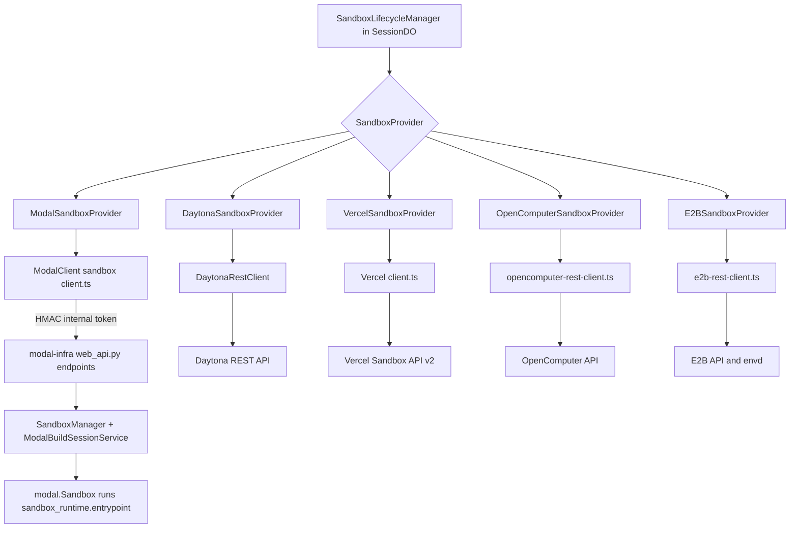
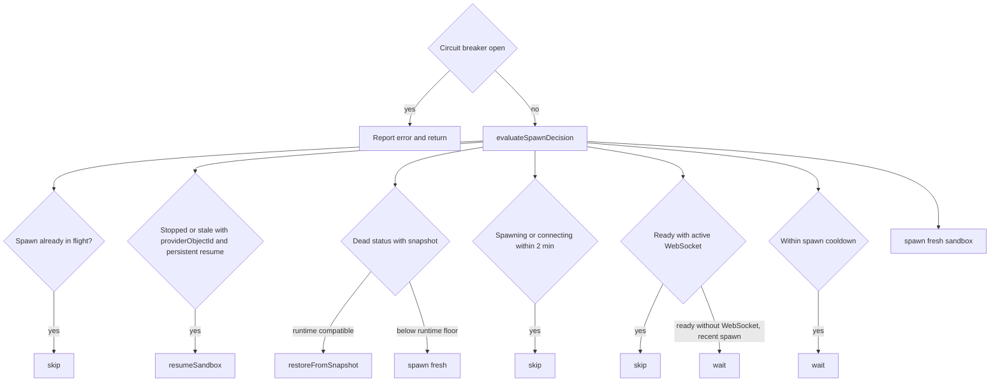

# Sandbox Providers & Infra

Every Open-Inspect session runs its agent inside a sandbox provided by one of five backends. The control plane (a Cloudflare Worker) owns all lifecycle decisions through a single abstraction — `SandboxProvider` in `packages/control-plane/src/sandbox/provider.ts` — and each backend supplies an implementation plus a REST client. Only Modal additionally requires a deployed Python data plane (`packages/modal-infra`); the other providers are driven directly over their public REST APIs, with separate infra packages dedicated to building their base images.

- **SandboxProvider contract** — `sandbox/provider.ts`, `sandbox/provider-factory.ts`, `sandbox/request-deadline.ts`
- **Lifecycle decision layer** — `sandbox/lifecycle/decisions.ts` (pure), `sandbox/lifecycle/manager.ts` (effects), `sandbox/lifecycle/image-selection.ts` (prebuilt images)
- **Provider implementations** — `sandbox/providers/{modal,daytona,e2b,opencomputer}-provider.ts`, `sandbox/providers/vercel/`
- **Infra packages** — `packages/modal-infra`, `packages/daytona-infra`, `packages/e2b-infra`, `packages/opencomputer-infra`

Related pages: [Sandbox Runtime](/openwiki/architecture/sandbox-runtime.md) (the in-sandbox data plane all providers boot), [Sandbox lifecycle](/openwiki/concepts/sandbox-lifecycle.md) (the status machine end to end), [Image builds](/openwiki/workflows/image-builds.md) (the prebuild workflow these providers execute), [Configuration](/openwiki/operations/configuration.md) (the env vars each backend requires).

## Provider architecture

*Provider selection and transport: one `SandboxProvider` per deployment; only Modal adds a Python HTTP shim between the client and Modal's own API.*

The control plane drives each provider through one `SandboxProvider`; only Modal adds a Python HTTP shim between the client and Modal's own API.

## The SandboxProvider contract

`SandboxProvider` (`sandbox/provider.ts`) has exactly one required method — `createSandbox(config: CreateSandboxConfig)` — plus four optional, capability-gated methods: `restoreFromSnapshot`, `resumeSandbox`, `takeSnapshot`, and `stopSandbox`. The `SandboxProviderCapabilities` flag object declares what a backend supports: `supportsSandboxTimeout`, `supportsSnapshots`, `supportsRestore`, `supportsPersistentResume` (resume a stopped sandbox in place), and `supportsExplicitStop` (stop via the provider API). Callers must check the flags before invoking the optional methods; the lifecycle manager does exactly that, falling back to fresh spawn or fire-and-forget shutdown messages when a capability is absent.

`CreateSandboxConfig` carries the full per-sandbox contract: the session id and the control-plane-generated `sandboxId` (the expected logical identity), a `sandboxAuthToken` minted by the control plane for this sandbox, callback plumbing (`controlPlaneUrl`), the LLM `provider`/`model`, user env vars (repo secrets), optional `prebuiltImageId`/`prebuiltImageSha` for prebuilt images, `timeoutSeconds` (defaulting to `DEFAULT_SANDBOX_TIMEOUT_SECONDS` = 7200 on Modal), code-server/VNC/terminal toggles, MCP servers, and the ordered `repositories` list for multi-repo sessions. Results return the provider's internal object id (`providerObjectId`, used for snapshot/resume/stop calls) plus code-server, ttyd, VNC, and extra-port tunnel URLs and passwords.

`ImageBuildProviderTriggerConfig` defines the provider-neutral image-build contract. Every supported provider follows the same **create-bind-launch** sequence: create a dormant build sandbox, bind its provider session id via the `onProviderSessionCreated` callback (persisted before the build can run and fire its callback), then launch the build runtime. Config includes the `buildId`, scope (`scopeKind`/`scopeId`), ordered repositories to clone at base branches, callback/failure URLs with a `callbackToken`, and a `providerSessionTimeoutSeconds` that the adapter layer always resolves (`resolveImageBuildProviderSessionTimeoutSeconds`) — providers apply it verbatim rather than choosing their own default. Modal extends the shared type with `ModalImageBuildTriggerConfig` (`cloneHost`/`cloneUsername` for its explicit SCM clone identity).

## Error classification and the circuit breaker

`SandboxProviderError` carries an `errorType` of `"transient"` or `"permanent"`. Only **permanent** errors count toward the spawn circuit breaker; transient ones (HTTP 502/503/504, network errors like `ETIMEDOUT`/`ECONNRESET`/`ECONNREFUSED`/`fetch failed`) are logged but do not trip it. `SandboxProviderError.fromFetchError` classifies by HTTP status when available and falls back to message-based network heuristics; every provider implementation funnels its client errors through this classification (Modal hand-rolls an equivalent with the same thresholds). Unknown error types are treated as permanent — the conservative direction for the breaker.

Both error types set the sandbox status to `failed` on a spawn attempt; only the classification differs. This keeps a brief provider outage from locking a deployment out of spawning while still surfacing misconfiguration quickly.

## Provider selection and composition

`resolveSandboxBackendName` (`sandbox/provider-name.ts`) normalizes `SANDBOX_PROVIDER` to one of `modal | daytona | vercel | opencomputer | e2b`, **defaulting to `modal`** to preserve existing deployments, and throws on anything else. `createSandboxProviderFromEnv` (`sandbox/provider-factory.ts`) then constructs the backend's client and provider, throwing on missing credentials with explicit messages:

| Backend | Required env | Client |
| --- | --- | --- |
| `modal` | `MODAL_API_SECRET`, `MODAL_WORKSPACE` (`MODAL_ENVIRONMENT_WEB_SUFFIX` optional) | `ModalClient` |
| `daytona` | `DAYTONA_API_URL`, `DAYTONA_API_KEY`, `DAYTONA_BASE_SNAPSHOT` | `DaytonaRestClient` |
| `vercel` | `VERCEL_TOKEN`, `VERCEL_PROJECT_ID` (plus team, runtime, base-snapshot, snapshot-expiration settings) | `VercelSandboxClient` |
| `opencomputer` | `OPENCOMPUTER_API_URL`, `OPENCOMPUTER_API_KEY`, `OPENCOMPUTER_TEMPLATE` | `OpenComputerRestClient` |
| `e2b` | `E2B_API_KEY`, `E2B_TEMPLATE_ID` (`E2B_API_URL`, timeout, auto-pause optional) | `E2BRestClient` |

Numeric and boolean env settings (`DAYTONA_AUTO_STOP_INTERVAL_MINUTES`, `VERCEL_SNAPSHOT_EXPIRATION_MS`, `E2B_AUTO_PAUSE`, …) are parsed at construction and rejected as invalid immediately. The `requireOpenComputerTemplate` option relaxes the template requirement for existing-session cleanup: starting OpenComputer sandboxes needs `OPENCOMPUTER_TEMPLATE`, but finalizing or cleaning up an already-bound build does not.

Provider construction happens during SessionDO graph assembly (`session/components.ts`), deliberately: a misconfigured deployment fails every session request at initialization instead of surfacing the error later at the first spawn.

Image-build capability is a separate, centralized policy (`image-builds/provider-policy.ts`): Modal, Vercel, OpenComputer, and E2B support provider-session image builds; Daytona has none. `createImageBuildAdapterFactory` wraps the sandbox providers in per-provider `ImageBuildAdapter` implementations that translate the shared build lifecycle onto `ImageBuildProviderTriggerConfig`.

## Lifecycle orchestration: decisions and effects

`SandboxLifecycleManager` (`sandbox/lifecycle/manager.ts`) is the seam between decision and effect. All decisions live as **pure functions** in `sandbox/lifecycle/decisions.ts` — they take state and config and return decisions, with no side effects, so they unit-test exhaustively. Effects execute through injected ports: `SandboxStorage` (sandbox-row persistence, including circuit-breaker counters and access credentials), `SessionContextReader` (session row, member repositories, user env vars — a separate port from storage because different collaborators own those reads), `SandboxBroadcaster`, `WebSocketManager`, `AlarmScheduler`, `IdGenerator`, and the optional `ImageBuildLookup`. The manager owns two in-memory flags — `isSpawningSandbox`/`isTerminatingSandbox` (exposed as `isSpawning()`) and `providerStartupPending` — that guard against concurrent spawns within one request; the persisted `spawning`/`connecting` statuses provide the cross-request protection.

### Decision functions (`decisions.ts`)

- **`evaluateCircuitBreaker`** — reads the persisted `spawn_failure_count`/`last_spawn_failure` pair (default threshold 3 failures within a 5-minute window). When the window has passed it orders a reset; when the threshold is met inside the window it blocks spawning and reports the remaining wait; otherwise it proceeds.
- **`evaluateSpawnDecision`** — the ordering below.
- **`evaluateInactivityTimeout`** — default 10-minute timeout; grants a 5-minute extension (with a user warning) while clients are connected, otherwise times out and snapshots; dead statuses and missing activity just reschedule the alarm check (minimum 30 s).
- **`evaluateHeartbeatHealth`** — a sandbox is stale when its last heartbeat is older than 90 s (3× the 30 s heartbeat interval); a never-beating sandbox is not yet stale.
- **`evaluateConnectingTimeout`** — a sandbox stuck in `connecting` *or* `spawning` for 2 minutes (default) has failed; both statuses are covered because a spawn interrupted before the provider call returns never transitions to `connecting`.
- **`evaluateWarmDecision`** — warm-on-typing spawns proactively unless a WebSocket is active, a spawn is in flight, or the status is already `spawning`/`connecting`; the manager broadcasts `sandbox_warming` before spawning.
- **`isDeadSandboxStatus` / `isSandboxReconnectBlockedStatus`** — `stopped`/`stale`/`failed` are the dead statuses; only `stopped`/`stale` reject bridge reconnects, because a slow-booting `failed` sandbox may still connect and self-heal.
- **`evaluateExecutionTimeout`** — fails a message stuck in `processing` past its timeout (90-minute fallback).

### The spawn decision, in order

`evaluateSpawnDecision` evaluates in a strict precedence, and the order is load-bearing:

*`evaluateSpawnDecision` precedence; the circuit breaker is evaluated first by `spawnSandbox` before the decision function runs.*

The in-memory flag is checked first so concurrent prompts cannot launch duplicate sandboxes; persistent resume beats snapshot restore (a live stop retains state without a restore); restore requires a dead status (`stopped`/`stale`/`failed`) *and* a runtime-compatible snapshot — `isSnapshotRuntimeCompatible` **fails closed**, treating a missing or unparseable version as below the `MIN_COMPATIBLE_RUNTIME_VERSION` floor, because a snapshot carries the runtime binaries that produced it. A below-floor snapshot falls through to a fresh spawn rather than resurrecting a retired runtime. The cooldown wait (30 s default) is bypassed for `failed`/`stopped` sessions so a user's next message recovers immediately.

### Spawn execution

`doSpawn` performs a **two-phase spawn write**: phase 1 (`reserveSpawnIdentity`) persists the replacement sandbox identity — new id, `spawning` status, created timestamp — and clears every field describing the previous instance *including its credentials*, so a stale bridge authenticating while the token hash is being written cannot match the old row. Phase 2 publishes the new token's hash, scoped to the reserved identity; if a newer reservation already replaced it, the attempt raises `SpawnSupersededError` and abandons **without failure writes**, because the row and breaker now describe the newer attempt.

Around the provider call, `doSpawn` stops any prior provider sandbox (with a 10-second cap via `PROVIDER_REPLACEMENT_STOP_TIMEOUT_MS`; providers without explicit-stop just have their object id cleared), loads user env vars and MCP servers, resolves the agent-slack-notify gate, and selects a prebuilt image (below). After a successful create it persists the provider object id, code-server/VNC/terminal access, and tunnel URLs, resets the circuit breaker, and moves the status to `connecting` (broadcast to clients) while the connecting-timeout alarm — scheduled at identity reservation — watches for the bridge.

Sandbox timeout settings are converted for timeout-capable providers and rejected outright with a permanent error when the active provider cannot enforce them, so a mis-set timeout fails loudly instead of being silently ignored.

### Prebuilt-image selection at spawn

`evaluateImageBuildForSpawn` (`sandbox/lifecycle/image-selection.ts`) decides whether a fresh spawn boots from a scope's prebuilt image, checking cheapest-first: an image exists for the scope on the active provider (`no_ready_image`), its provider artifact is recorded (`missing_artifact`), its runtime version meets the compatibility floor (`runtime_below_floor`), and its repositories fingerprint equals the fingerprint of **the session's own repository snapshot** — not the scope's current repositories, so editing an entity after session creation can never hand the session a mismatched image. For a repo scope the one-element fingerprint reproduces the old base-branch filter: a non-default-branch session computes a different fingerprint and misses. Environment sessions never fall back to a repo image (it bakes that repository's setup and secrets) and multi-repo ad-hoc sessions never use prebuilt images; any miss — including a lookup failure — falls back to the base image, so sessions are never blocked on builds.

If the provider create fails *with* a selected image, the manager treats it as "no image": it marks the image build restore-failed (so the rebuild cron sees no ready image and rebuilds it), reserves a **fresh** spawn identity (a post-create failure may have left an orphaned provider sandbox; rotating the token and id locks it out exactly like a user respawn would), and retries from base with `prebuiltImageId`/`prebuiltImageSha` cleared.

### Alarm handling

`handleAlarm` runs the same decisions against persisted state: it skips terminal statuses; a connecting-timeout failure marks the sandbox `failed`, clears access state, stops the provider sandbox where supported, broadcasts, and reports the error; a stale heartbeat marks the sandbox `stale`, snapshots (fire-and-forget unless the provider can stop explicitly), sends a `shutdown` message when the bridge cannot be stopped via API, and detaches the sandbox WebSocket; the inactivity decision either extends (with warning), schedules the next check, or stops the sandbox — snapshotting first unless the provider manages its own stop state (`usesProviderManagedStop` = explicit stop + persistent resume), in which case no snapshot is needed because nothing is lost. Failure reporting is uniform: `reportSandboxError` persists `last_spawn_error` best-effort and broadcasts `sandbox_error` without touching status — most callers mark the status themselves, and the circuit breaker reports a reason without changing state.

### Snapshot, resume, and stop effects

- `triggerSnapshot` flips the status to `snapshotting` (unless already terminal), calls the provider's snapshot with the stored `providerObjectId`, and on success stamps the image id **together with the sandbox's current `runtime_version`** — that version is what a later restore is gated on. The previous status is restored afterwards unless the reason was `heartbeat_timeout`.
- `resumeSandbox` (persistent resume) reuses the stored auth identity via `updateSandboxForResume` rather than rotating credentials, sets `connecting`, and calls the provider. `shouldSpawnFresh` in the result falls back to `doSpawn`; other failures mark the sandbox `failed` and report the error.
- `restoreFromSnapshot` seeds the row's runtime version from the snapshot before the provider call (the restored sandbox runs the snapshot's binaries, whatever the provider exports now), then reuses the same access-persistence path as a fresh spawn.
- `stopPriorProviderSandbox` gives providers with explicit stop a bounded (10 s) window to stop the outgoing sandbox before its handle is cleared; failure only logs a warning, never blocks replacement.
- Clearing access state after a stop or teardown preserves the stored code-server/VNC passwords for persistent-resume providers (only the URLs are cleared) while non-resume providers lose both values — their restores rotate passwords.

### Tokens minted by the control plane

Each spawn gets a fresh `sandboxAuthToken` from the control plane's id generator, persisted only as a hash (the two-phase write); verification is a timing-safe hash compare with a plaintext fallback for legacy rows. Terminal (ttyd) access is a separate JWT: `storeTtyd` mints an HS256 token via `mintJwt` — `sub` = session id, `sid` = sandbox id, 24-hour TTL — **signed with the sandbox auth token**, so the proxy inside the sandbox verifies it with the same key. This is the only sandbox-facing JWT the manager mints; bridge authentication uses the raw token and hash.

## Request deadlines

`withRequestDeadline` (`sandbox/request-deadline.ts`) arms a per-request `AbortController`, merges it with the caller's signal via `AbortSignal.any`, and converts a timeout into a `RequestDeadlineError` carrying the provider, endpoint, and deadline. The Modal client wraps every POST with it (start: 60 s, snapshot: 310 s — sized to let Modal's provider-side snapshot timeout settle first, cleanup: 60 s), as does the Vercel client (60 s API/commands with headroom over the command's own timeout, 310 s snapshots, 60 s cleanup). Daytona and E2B clients implement equivalent per-operation `AbortController` timeouts inline; all clients log endpoint, status, duration, and outcome on every call.

## Provider matrix

| | Modal | Daytona | Vercel | OpenComputer | E2B |
| --- | --- | --- | --- | --- | --- |
| Sandbox timeout | yes (default 7200 s) | no | yes (capped 45 min) | yes | yes (auto-pause on TTL) |
| Snapshots / restore | yes / yes | no / no | yes / yes | yes (checkpoints) / yes | no / no |
| Persistent resume | no | **yes** | no | **yes** (wake) | **yes** |
| Explicit stop | no | **yes** | **yes** | **yes** | **yes** (pause; kills on terminal reasons) |
| Prebuilt-image builds | **yes** | no | **yes** | **yes** | **yes** |
| Client transport | HTTP → Modal-hosted `web_api.py` (HMAC internal token) | Direct REST (Bearer API key) | Direct REST (Bearer token, `/v2/sandboxes`) | Direct REST (configurable auth header + paths) | Direct REST (X-API-Key) + envd Connect exec |

### Modal

`ModalClient` (`sandbox/client.ts`) targets Modal-hosted FastAPI endpoints derived from the workspace slug — `https://{workspace}--open-inspect-api-{endpoint}.modal.run` — and authenticates with `Authorization: Bearer {timestamp}.{HMAC-SHA256(timestamp, MODAL_API_SECRET)}` from the shared `generateInternalToken`. Responses are zod-validated discriminated unions (`success: true` + `data`, or an error shape). The provider wraps create/restore/snapshot and the image-build operations; `deleteProviderImage` is a deliberate local no-op (Modal's deletion surface is the experimental `image_delete` API, deferred until validated), so reaped Modal images remain provider-side while callers log each attempt.

On the Modal side (`packages/modal-infra/src/web_api.py`), each endpoint verifies the token via `verify_internal_token`: `Bearer timestamp.signature` where the signature is HMAC-SHA256 of the timestamp under `MODAL_API_SECRET`, valid within a ±5-minute window, compared in constant time. An invalid token is 401; a missing secret (`AuthConfigurationError`) is 503 — a server misconfiguration, not a client error. Only `api_health` is unauthenticated. Endpoints: `api_create_sandbox`, `api_restore_sandbox`, `api_snapshot_sandbox`, `api_snapshot_build_sandbox`, `api_create_build_sandbox`, `api_start_build_sandbox`, `api_terminate_build_sandbox`. Callback URLs are validated against the allowed control-plane hosts.

`SandboxManager` (`sandbox/manager.py`) owns interactive sandbox lifecycle. `create_sandbox` and `restore_from_snapshot` share `_launch_sandbox`, which picks one of three image sources: the base image, a prebuilt repo image (`FROM_REPO_IMAGE=true` + `REPO_IMAGE_SHA`, booted via `modal.Image.from_id`), or a snapshot (`RESTORED_FROM_SNAPSHOT=true`, plus a clone token and GitHub-CLI alias compatibility shims for pre-credential-helper snapshots). It scrubs the reserved launch env keys from user env (the server-side mirror of the control plane's boot-mode stripping), injects the runtime env (`SANDBOX_ID`, `CONTROL_PLANE_URL`, `SANDBOX_AUTH_TOKEN`, `SESSION_CONFIG`), attaches Modal's `llm_secrets` (LLM keys are never stored in snapshots), exposes encrypted ports for code-server/noVNC/ttyd and user tunnel ports, resolves Modal tunnel URLs with retries, and runs `python -m sandbox_runtime.entrypoint`. `take_snapshot` uses Modal's `snapshot_filesystem` (300 s timeout) whose returned image object id persists indefinitely and is what restore boots from.

`ModalBuildSessionService` (`sandbox/build_session.py`) owns image-build sessions: `create` launches a **dormant** sandbox in image-build mode (`IMAGE_BUILD_MODE=true`) tagged `openinspect_kind=image-build` + `openinspect_build_id` (+ scope and launch-protocol tags) with no Modal secrets bound and reserved callback env keys scrubbed from user env; `start` re-resolves it by tags and writes the callback token to the sandbox's stdin (the launch-protocol tag must match, and the start only happens after the control plane has bound the provider session in D1); `terminate` waits for exit; `snapshot` captures the filesystem. Any tag mismatch or missing session raises `BuildSessionNotFoundError`. Build timeouts are capped (default 1800 s, max 3600 s) with a 10-minute finalization grace added to the provider session timeout.

### Daytona

`DaytonaSandboxProvider` calls the Daytona REST API directly (the client replaces an earlier Python shim). It has **no** snapshot, restore, or timeout support, but supports persistent resume and explicit stop — so the shared manager's provider-managed stop path applies: idle/heartbeat "stops" become Daytona stops and later spawns resume in place. `resumeSandbox` handles Daytona's states: recoverable `error`/`build_failed` sandboxes are recovered, anything not `started` is started, and a missing sandbox returns `shouldSpawnFresh`. `stopSandbox` deletes the sandbox when the reason is `respawn` (replacement must not leave an object behind) and otherwise stops it; a 404 is success. The client uses native `fetch` with a Bearer API key, per-operation timeouts (create 90 s, start/recover 60 s, stop/delete 30 s, get/preview 15 s), zod-validated response bodies regardless of content type, and typed 404 errors. Tunnel URLs come from Daytona signed preview URLs; code-server/VNC passwords are derived (below), and labels carry the framework/session/repo identity.

### Vercel

`VercelSandboxProvider` (`providers/vercel/`) supports snapshots, restore, and explicit stop but not persistent resume. Sandbox timeouts are capped at `VERCEL_MAX_SANDBOX_TIMEOUT_MS` (45 minutes). A fresh sandbox **requires** a base snapshot: `VERCEL_BASE_SNAPSHOT_ID` directly, or `VERCEL_BASE_SNAPSHOT_NAME`, resolved once (memoized) via `listSnapshots` to the latest `created` snapshot — throws if none exists. Restore passes the snapshot image id as `sourceSnapshotId`. After create, the provider prepares access (ports, derived passwords) and launches the entrypoint via a command: `sudo -E python3.12 -m sandbox_runtime.entrypoint` in `/workspace` — Vercel sandboxes are session-driven, so the runtime is started explicitly, and image builds deliver callback env at launch time. Snapshots use `snapshotSession` with a configured `expirationMs` (default 0 = no expiration) and must report `created`; `stopSandbox` and `deleteSnapshot` tolerate 404 as success. `triggerImageBuild` follows the create-bind-launch contract against the base snapshot and deletes snapshots via `deleteSnapshot`.

The base snapshot itself is built by `buildVercelBaseSnapshot` (`providers/vercel/base-snapshot.ts`): create a temporary sandbox, prepare the upload dir, upload the runtime archive, run `buildVercelBootstrapScript` (a shell script installing the pinned toolchain — dnf packages, fluxbox/libvncserver/x11vnc/noVNC from source, OpenCode/code-server/agent-browser, the runtime into `/app`, and the git credential helper shim), then snapshot and stop. Terraform gives the builder sandbox a deterministic name; the control plane resolves that name to the latest snapshot id at spawn time.

### OpenComputer

`OpenComputerSandboxProvider` uses a declarative template that already contains the runtime, and supports **all four** capability flags: snapshots (checkpoints), restore, persistent resume, and explicit stop. Fresh creates use `OPENCOMPUTER_TEMPLATE`; prebuilt images and snapshot restores both `forkFromCheckpoint` (the prebuilt image id is a checkpoint id). `takeSnapshot` creates a `disk_only` checkpoint under a `delete_oldest` retention policy (max 30). Resume wakes non-running sandboxes (`wakeSandbox`), re-applies the configured timeout, restarts the runtime after a wake, and rebuilds tunnel URLs best-effort. Its REST client ships configurable auth header and route-path overrides (defaults: `X-API-Key` and the canonical MVP paths) because OpenComputer deployments may expose versioned or compatibility routes. Notably, OpenComputer holds user env vars in a per-sandbox **secret store** (created per session/build, deleted on failure), and fork hygiene forces `IMAGE_BUILD_MODE=false` and blanks the repo-image callback env vars — checkpoints inherit the source sandbox's persisted env, and without this override a fork of a build sandbox would re-enter image-build mode and re-fire a completed callback.

### E2B

`E2BSandboxProvider` calls the E2B REST API directly. It has **no** generic `takeSnapshot` — session continuity is provider-managed: stop is a resumable **pause**, and resume reconnects to it, so `evaluateSpawnDecision` always resumes a stopped/stale E2B sandbox (the capability ordering in the spawn decision is what makes this safe). Terminal stop reasons (`connecting_timeout`, `respawn`) **kill** instead, because a sandbox that never connected will never be resumed and E2B retains paused sandboxes indefinitely. Creates use `autoPause` (a lapsed TTL pauses recoverably rather than killing), `secure: true` (envd rejects calls without the returned access token), and `autoResume: false` — resume is control-plane-driven so stray traffic cannot wake a paused box. After create, the provider **execs the runtime entrypoint detached** (`nohup python -m sandbox_runtime.entrypoint`) through envd's Connect stream and verifies the stream shows a clean exit; the template's own start command is an inert `sleep infinity`. Resume connects a paused sandbox or extends the timeout of a running one; a missing sandbox yields `shouldSpawnFresh`.

E2B's per-sandbox `envVars` are the sole delivery channel for session env including secrets — envd applies them to every process it starts — because E2B platform-logs `Process`/`Start` requests (command line and env values included); create errors are scrubbed of env values before propagating, and only the sandbox's own (public) id is ever interpolated into the exec command. E2B does not propagate Dockerfile ENV to the runtime, so the provider pins `HOME`/`PYTHONPATH`/`NODE_PATH` and a `SANDBOX_VERSION` derived from the runtime manifest.

For image builds, `triggerImageBuild` creates a build sandbox from the base template (never auto-pausing — its filesystem is snapshotted in place), binds the session, then execs the entrypoint with the provider session id. `takePrebuiltImageSnapshot` then bakes the image: E2B snapshots always capture live memory, so the bake first `pause(memory: false)` — dropping process memory *and* the build's create-time envVars, including clone/callback credentials — then `connect`s the quiet sandbox and deletes the supervisor log (which survives the pause and could otherwise carry printed secrets) using the fresh envd token, before `createSnapshot`. The returned `snapshotID` doubles as a `templateID`, so a prebuilt spawn is an ordinary create with that template id and `FROM_REPO_IMAGE` markers.

## Shared env contract and ports

The REST-style providers (Daytona, E2B, OpenComputer, Vercel) assemble session env through one canonical builder, `buildSandboxEnvVars` (`sandbox/sandbox-env.ts`) — the single source of truth for the `SESSION_CONFIG` payload and system vars, created after each provider used to hand-roll the object and silently diverge. Boot-mode keys (`IMAGE_BUILD_MODE`, `RESTORED_FROM_SNAPSHOT`, `FROM_REPO_IMAGE`, `REPO_IMAGE_SHA`) are control-plane-owned and stripped from the user layer so a repo secret cannot fake a boot mode; code-server/VNC passwords are derived deterministically per sandbox via domain-separated HMAC (`deriveCodeServerPassword`, `deriveVncPassword`) over the provider's access-password secret; and git authentication relies on the system credential-helper shim brokering per-request tokens from the control plane — no long-lived SCM token is baked into env. Service/tunnel ports flow through the shared `resolveServicePorts`/`resolveTunnelPorts` (shared defaults, validation, and the `MAX_TUNNEL_PORTS` cap). Modal's Python manager mirrors the same contract server-side (`RESERVED_LAUNCH_ENV_VARS`, `SESSION_CONFIG`).

## Provider infrastructure packages

### modal-infra

`packages/modal-infra` is the only deployed Python data plane. `images/base.py` defines `base_image`: Debian slim + Node 22/pnpm/Bun + Python 3.12/uv, the pinned OpenCode CLI + plugin, code-server, ttyd (checksum-pinned), agent-browser + headless Chromium, the git credential-helper shim, and X/VNC packages. `CACHE_BUSTER = RUNTIME_VERSION` — the numeric generation from `sandbox-runtime`'s runtime manifest — is embedded in a no-op `echo` layer so a bump invalidates the image; it is one sequence shared by every image-build provider, with `MIN_REBUILD_RUNTIME_VERSION` gating which prebuilt images get rebuilt onto it. `sandbox/manager.py` and `sandbox/build_session.py` are described above; `web_api.py` exposes them over authenticated FastAPI endpoints deployed as Modal `fastapi_endpoint`s on the `open-inspect` app, with secrets (`internal-api`, `llm-api-keys`, `github-app`) bound from Modal.

### daytona-infra

`packages/daytona-infra` seeds the Daytona **base snapshot** the client references by name. `src/bootstrap.py` is a CLI (`python -m src.bootstrap`, optional `--force`) that deletes an existing named snapshot, polls until Daytona's asynchronous delete becomes visible (up to 300 s — recreating inside that window fails with "Snapshot already exists"), then builds the snapshot from `src/toolchain.py`'s image — a Python 3.12 slim base mirroring the Modal base pins (OpenCode 1.18.18, code-server 4.109.5, agent-browser 0.21.2, the credential-helper shim) with the sandbox-runtime baked in and `sandbox_runtime.entrypoint` as the entrypoint. Config comes from `DAYTONA_API_KEY`/`DAYTONA_API_URL`/`DAYTONA_TARGET`/`DAYTONA_BASE_SNAPSHOT`. Terraform automates rebuilds when `sandbox_provider = "daytona"`; manual runs are for setup and debugging.

### e2b-infra

`packages/e2b-infra` builds the E2B **template**. `e2b.Dockerfile` pins the same toolchain (kept in sync with daytona's toolchain), installs the gh CLI, puts `/app` on Python's import path via a `.pth` file, and bakes the credential-helper shim system-wide — E2B runs as a non-root user that cannot do this at runtime. `build-template.py` stages `sandbox_runtime`, builds via the E2B Template SDK (`Template().from_dockerfile(...).copy(...).set_start_cmd(...)`), and pre-warms by spawning and killing one sandbox (a vendor-confirmed first-spawn latency bug). The start command is an inert `sleep infinity`; the ready command gates template finalization on the toolchain (`command -v python/node/bun/opencode/code-server/gh` + importing `sandbox_runtime`) — the one place a broken toolchain layer fails the build instead of every later session. Terraform rebuilds the template when `packages/e2b-infra` or `packages/sandbox-runtime/src` changes.

### opencomputer-infra

`packages/opencomputer-infra/src/build-template.ts` builds the OpenComputer declarative template via the `@opencomputer/sdk` (`Snapshots.create` with build logs, or `--dry-run` to print the manifest + cache key). It installs the pinned toolchain into a sandbox-owned prefix (including `--allow-scripts=opencode-ai`, required so npm 12 runs opencode's postinstall that swaps in the real binary — the build fails loudly otherwise), copies `sandbox_runtime` file-by-file plus the gh wrapper to `/usr/local/bin/gh`, installs the credential-helper shim, re-owns `$HOME` to the `sandbox` user, and sets `SANDBOX_VERSION` from `OPENCOMPUTER_TEMPLATE_RUNTIME_VERSION` — exported from the same runtime manifest the control plane reads, so the template's reported version and the compatibility floor cannot drift. Config: `OPENCOMPUTER_API_URL`, `OPENCOMPUTER_API_KEY`, `OPENCOMPUTER_TEMPLATE` (snapshot name), `OPENCOMPUTER_BUILDER_MEMORY_MB`.

## Focused tests

- `provider-factory.test.ts` pins the missing-credential and malformed-numeric/boolean failures per backend and the OpenComputer template waiver.
- `decisions.test.ts` exhaustively covers the pure decision functions (circuit breaker windows, spawn precedence, reconnect blocking, runtime floor).
- `manager.test.ts` covers spawn orchestration end to end against fake ports: image lookup scopes and misses, base retry after prebuilt failure, the spawn admission race (#1589), alarm outcomes, and multi-repo/settings handling.
- Provider tests (`modal-provider.test.ts`, `daytona-provider.test.ts`, `e2b-provider.test.ts`, `opencomputer-provider.test.ts`, `vercel/provider.test.ts`) pin capability flags, error classification per HTTP status, and per-provider behaviors (resume state machines, bake hygiene, tunnel derivation).
- On the Python side, `modal-infra/tests/test_build_sandbox_lifecycle.py` pins the build-sandbox env contract jointly with the control plane's reserved keys, alongside tests for launch env, tunnel ports, VNC, and the web API surface.

## Related pages

- [Sandbox Runtime (Data Plane)](/openwiki/architecture/sandbox-runtime.md) — what every provider actually boots.
- [Sandbox lifecycle](/openwiki/concepts/sandbox-lifecycle.md) — status machine, alarms, and user-visible transitions.
- [Image builds](/openwiki/workflows/image-builds.md) — the prebuild workflow and finalization queue.
- [Configuration](/openwiki/operations/configuration.md) — the env vars each backend requires.
