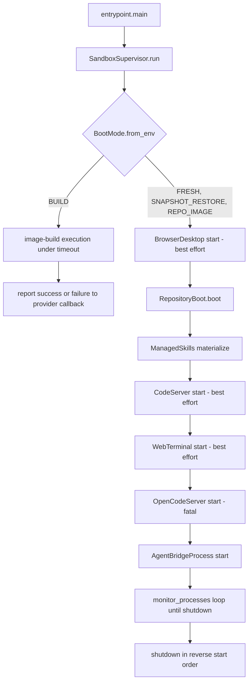
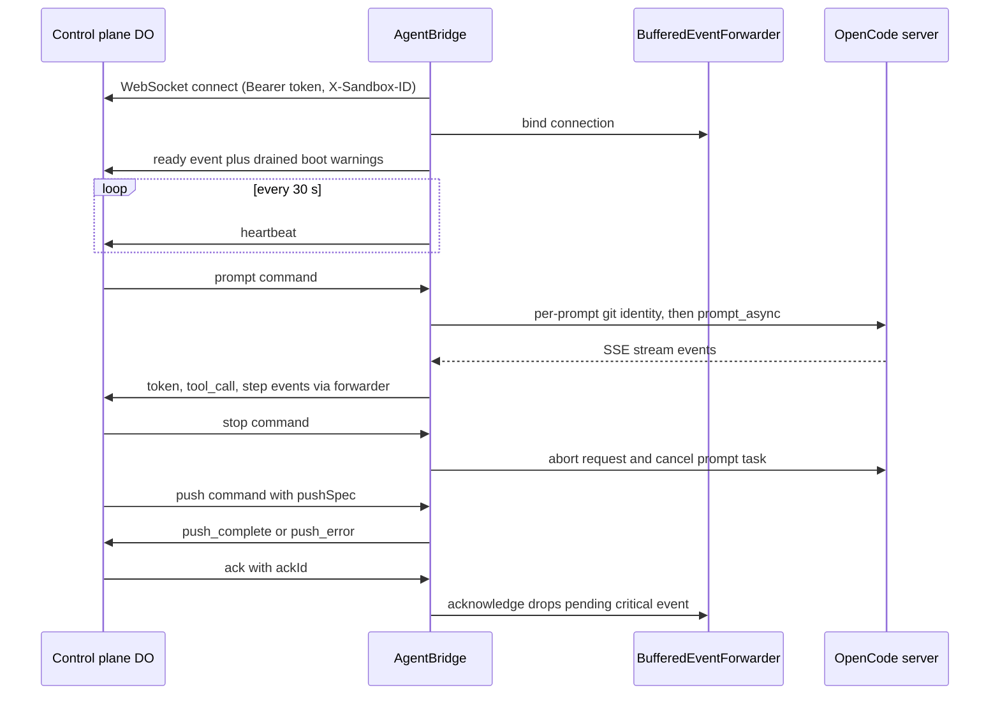

# Sandbox Runtime

Every Open-Inspect session executes its agent inside a sandbox whose internal behavior is owned by
`packages/sandbox-runtime`, a provider-agnostic Python 3.12 package (`open-inspect-sandbox-runtime`)
that runs identically on Modal, Daytona, Vercel, OpenComputer, and E2B. It composes a supervisor
process, boots and synchronizes the session's repositories, runs a local OpenCode server, and
connects a WebSocket bridge to the control plane's per-session Durable Object — turning queued
control-plane prompts into OpenCode SSE streams and OpenCode activity back into control-plane
events. The providers that create and stop these sandboxes are covered in
[Sandbox Providers & Infra](/openwiki/architecture/sandbox-providers.md); this page is what runs
inside.

Related pages: [Managed skills](/openwiki/concepts/managed-skills.md), [Sandbox
lifecycle](/openwiki/concepts/sandbox-lifecycle.md), [Git auth and pull
requests](/openwiki/workflows/git-auth-and-pull-requests.md), [Prompt
flow](/openwiki/workflows/prompt-flow.md).

## Composition root: `entrypoint.py` → `SandboxSupervisor`

`entrypoint.main` is the process the sandbox provider launches. It parses one optional flag —
`--await-modal-image-build-token-stdin-v1` — and either runs the normal supervisor or the Modal
image-build launch protocol (below). `build_supervisor` consumes process secrets from the
environment and wires the full runtime:

- `RuntimeConfig.from_env` reads `SANDBOX_ID`, `REPO_OWNER`/`REPO_NAME`, the `SESSION_CONFIG` JSON
  blob, `CONTROL_PLANE_URL` (HTTPS enforced except loopback), `SANDBOX_AUTH_TOKEN`, and `VCS_HOST`
  (default `github.com`). `repo_path` is `/workspace/<repo_name>` when a repo is configured,
  otherwise `/workspace`.
- `RepositoryBoot` composes `TunnelEnvironment`, `RepositoryHooks`, and `RepositorySynchronizer`
  around the parsed repository list.
- `ManagedSkillsMaterializer` is created only when both a control-plane URL and a session id exist,
  targeting the OpenCode global config dir's `skills/` directory.
- `OpenCodeServer`, `AgentBridgeProcess`, `CodeServer`, `WebTerminal`, and `BrowserDesktop` are
  plain service owners. A `VNC_PASSWORD` in the environment also sets `DISPLAY=:1` and is popped
  from the environment so children don't inherit it.
- SIGTERM/SIGINT are routed to `supervisor.request_shutdown`, which only sets the supervisor-owned
  `asyncio.Event`; all services observe that event rather than handling signals themselves.

`SandboxSupervisor` holds no service logic of its own — its docstring role is "apply lifecycle
policy to the composed runtime services": boot ordering, per-service restart policy, coordinated
shutdown, and fatal-error reporting.

*Boot ordering enforced by `SandboxSupervisor.run`: best-effort services first, the OpenCode server
and bridge last; shutdown reverses the order.*

## Boot modes and lifecycle ordering

`BootMode` (`runtime_config.py`) has four values chosen from the environment by
`BootMode.from_env`: `BUILD` when `IMAGE_BUILD_MODE=true`, `SNAPSHOT_RESTORE` when
`RESTORED_FROM_SNAPSHOT=true`, `REPO_IMAGE` when `FROM_REPO_IMAGE=true`, otherwise `FRESH`. The
supervisor re-exports the resolved mode as `OPENINSPECT_BOOT_MODE` in `os.environ` (and into hook
scripts' environments), so repository hooks can branch on it.

`SandboxSupervisor.run` executes, in order:

1. **Tunnel preparation.** `repository_boot.prepare_tunnel_environment(boot_mode)` reads
   `EXPECTED_TUNNEL_PORTS` and clears a stale `/workspace/.tunnels.env`; the boot-warnings file is
   deleted so warnings from a previous life are never replayed.
2. **BUILD short-circuit.** In build mode only repository boot runs, under
   `OI_IMAGE_BUILD_EXECUTION_TIMEOUT_SECONDS`; the provider callback reports success (with
   repository SHAs and `SANDBOX_VERSION`) or failure, then the supervisor waits for shutdown.
3. **Desktop first (best-effort).** `BrowserDesktop.start()` failure is logged and stopped, never
   fatal.
4. **Repository boot** (next section).
5. **Managed skills materialization** — deliberately after repository boot and before OpenCode
   starts, so OpenCode process restarts reuse the tree without depending on control-plane
   availability.
6. **code-server and web terminal** (each best-effort: start failure is logged and stopped).
7. **OpenCode server** (fatal on failure) and **agent bridge process**; `sandbox.startup` logs the
   boot mode, sync/setup/start outcomes, and duration.
8. **`monitor_processes`** polls exit codes every second until shutdown.

### Restart policy

Each process owner has an explicit policy, all bounded by `MAX_RESTARTS = 5` and exponential
backoff (`BACKOFF_BASE = 2.0`, capped at 60 seconds):

- **OpenCode** crash → restart, restarting from the recorded repository boot result; exceeding the
  limit reports a fatal error to the control plane and shuts the sandbox down.
- **Bridge** exit code 0 means a graceful exit (e.g. session terminated) and shuts everything down;
  a non-zero crash is restarted like OpenCode, with fatal reporting at the limit.
- **code-server**, **web terminal**, and **browser desktop** restarts are best-effort; giving up
  logs a warning but never kills the session.

Fatal errors are POSTed to `{control_plane}/sessions/{session_id}/sandbox-error` (`fatal: true`,
last 1000 characters, Bearer sandbox token, `X-Sandbox-ID` header) with 3 attempts and 2^n-second
backoff. Shutdown is strictly reverse-order: desktop restart task, bridge, web terminal, code
server, browser desktop, OpenCode.

## Repository boot: sync, hooks, and tunnel waiting

`RepositoryBoot.boot` is the strictness boundary between "fresh clone" boots and "restore" boots:

1. **Parse repositories once.** `parse_repositories` (`repo_config.py`) builds the ordered
   `RepoEntry` list from `SESSION_CONFIG.repositories` or the scalar `REPO_OWNER`/`REPO_NAME` env.
   Owners are validated by `is_safe_repo_owner` as *namespace paths* — slash-joined safe segments,
   so GitLab subgroups like `group/subgroup` work — while names must be single safe path segments
   (checkout directories are `/workspace/<name>`, so names are unique case-insensitively). A
   violation is a corrupt/tampered config and `boot` raises immediately. Only `repo_name` is ever a
   filesystem segment; the owner stays part of repository identity (clone URLs, manifests, push
   targeting).
2. **Write the repo manifest.** `dump_repo_manifest` writes `{repositories: [{owner, name, branch,
   path, baseSha?}]}` to `/tmp/oi-repo-manifest.json` before and after sync. This manifest is the
   single authority for the `/workspace` layout — the bridge's push targeting and the JS
   `create-pull-request` tool both read it instead of re-deriving paths.
3. **Credentials, then sync.** `ensure_credentials_configured` installs the
   `oi-git-credentials` shim into `/usr/local/bin`, sets `credential.useHttpPath=true` globally,
   and installs the authenticated `gh` wrapper. `RepositorySynchronizer.sync` then clones (depth
   100, 300-second clone timeout) or fetches (120-second timeout) each repository in parallel,
   returning per-repo `SUCCEEDED`/`FAILED`/`TIMED_OUT` outcomes. On existing checkouts it resets
   origin to a plain HTTPS URL, fetches the base branch, and — except on `SNAPSHOT_RESTORE`, where
   the restored working tree is preserved — checks out `origin/<branch>`. It also resolves session
   diff baselines.
4. **Strictness by boot mode.** Sync failures in `FRESH`/`BUILD` raise `RuntimeError` (fatal). In
   `SNAPSHOT_RESTORE`/`REPO_IMAGE` they become boot warnings ("the checkout may be stale") and the
   session continues.
5. **`setup.sh`** runs for `FRESH` and `BUILD` only — restored sessions trust the image's prepared
   state. A failure is fatal in `BUILD` (the image would bake a broken setup) and a warning
   otherwise. Missing scripts count as success.
6. **Tunnel wait, then `start.sh`** runs in every mode except `BUILD`. A `start.sh` failure in the
   first (primary) repository is fatal; later repositories only warn.
7. **Workspace manifest.** For multi-repo sessions a generated `/workspace/AGENTS.md` documents the
   checkouts, the working branch, member `AGENTS.md` files (not auto-loaded), and how to call
   `create-pull-request` per repository.

**Hook semantics** (`repository_hooks.py`): scripts live at `.openinspect/setup.sh` and
`.openinspect/start.sh` in each repository, run via `bash` with `cwd` set to the checkout and
stdout+stderr merged. Timeouts come from `SETUP_TIMEOUT_SECONDS` (default 300) and
`START_TIMEOUT_SECONDS` (default 120); an unparseable value silently falls back to the default.
On timeout the process group is terminated; in non-build modes the last 50 output lines are logged.
`OPENINSPECT_BOOT_MODE` is injected so scripts can detect image builds.

**Tunnel-env wait logic** (`tunnel_environment.py`): `expected_ports` parses the comma-separated
`EXPECTED_TUNNEL_PORTS` list. `clear_stale_file` deletes `/workspace/.tunnels.env` unless its first
line carries `TUNNEL_SANDBOX_ID=<this sandbox>` — the manager's write can land before the
entrypoint starts, so a matching file is fresh, anything else (snapshot/image leftovers) is stale.
`wait_until_ready` polls every 0.2 seconds for up to `TUNNEL_WAIT_TIMEOUT_SECONDS` (default 30)
until the file contains a `TUNNEL_<port>=` line for every expected port; on timeout it warns and
boot proceeds — a missing tunnel URL is never fatal to the session.

## OpenCode server

`OpenCodeServer.start` prepares the filesystem, then launches `opencode serve --port 4096
--hostname 0.0.0.0 --print-logs` with `cwd` set to the workdir (the single repo checkout when it
exists with a `.git`, otherwise `/workspace`) and polls `http://localhost:4096/global/health` for
up to 30 seconds. Config arrives via `OPENCODE_CONFIG_CONTENT`: `{provider}/{model}` from the
session config (defaults `anthropic` / `claude-sonnet-4-6`), blanket `permission: allow`, and the
session's MCP servers. `OPENCODE_CLIENT=serve` disables OpenCode's interactive question tool,
which would otherwise block headless sessions until the SSE inactivity timeout.

### Filesystem staging before launch

- **Workspace assembly (multi-repo).** Member repositories' `.opencode/` trees are merged into
  `/workspace/.opencode/` in position order, later repositories winning with a boot warning naming
  both sources; `node_modules` and `__pycache__` are skipped and the generated tree is rebuilt from
  scratch each boot (except `node_modules`, which is image-managed).
- **Agent tools.** `plugins/inspect-plugin.js` is installed as `.opencode/tool/create-pull-request.js`
  (repository sessions only), and every `.js` tool in `tools/` is copied to `.opencode/tool/`.
  `slack-notify.js` is gated on `AGENT_SLACK_NOTIFY_ENABLED=true`.
- **Plugin dependency seeding.** `package.json`, `package-lock.json`, and `node_modules` are copied
  from the image's `/app/opencode-deps` into `.opencode/` (and, as a fallback, the global config
  dir) so OpenCode's `npm install @opencode-ai/plugin` finds the tree in sync and doesn't block the
  first request on an arborist reify.
- **Bundled skills.** Skills under `/app/sandbox_runtime/skills` (agent-browser, record-video,
  upload-screenshot, visual-verification) are copied into `.opencode/skills/`.
- **Standalone CLIs.** `bin/` scripts (`oi-git-sign`, `upload-media.js`) are installed into
  `OPENINSPECT_BIN_INSTALL_DIR` (default `/usr/local/bin`) — deliberately *not* into
  `.opencode/tool/`, where OpenCode's tool discovery would import them and execute module-level
  code.
- **Managed OAuth sentinels.** `OPENAI_OAUTH_MANAGED` / `XAI_OAUTH_MANAGED` write
  `~/.local/share/opencode/auth.json` entries with `refresh: "managed-by-control-plane"` (0600,
  atomic rename) so OpenCode treats the provider as OAuth-managed; the corresponding plugins (below)
  then broker real tokens.
- **MCP servers.** `npx`-style local servers get their packages pre-installed globally with a
  180-second `npm install -g` budget; local and remote servers are mapped into OpenCode's `mcp`
  config.
- **Git excludes.** Every runtime-installed path is registered in the checkout's
  `.git/info/exclude` between `BEGIN/END Open-Inspect runtime assets` markers so generated assets
  never dirty the working tree.

## Agent bridge

`AgentBridge` (`bridge.py`, run as `python -m sandbox_runtime.bridge` by `AgentBridgeProcess`) is
the sandbox's single control-plane connection. `AgentBridgeProcess` skips launch when no
control-plane URL or session id is configured and otherwise spawns the bridge with
`--sandbox-id/--session-id/--control-plane/--token/--opencode-port`, forwarding its logs and
flagging a startup crash after 0.5 seconds.

### Connection lifecycle

The bridge connects to `{control_plane}/sessions/{session_id}/ws?type=sandbox` (https→wss) with
`Authorization: Bearer <sandbox token>` and `X-Sandbox-ID` headers, WebSocket ping every 20 s.
Immediately after connecting it binds the event forwarder, sends a `ready` event (sandbox id,
OpenCode session id, `runtimeVersion` from `SANDBOX_VERSION`, and each repository's position,
identity, and base SHA from the manifest), and drains the supervisor's boot-warnings file as
`warning` events — the file is consumed exactly once, so reconnects never replay it. A heartbeat
event flows every 30 seconds.

Reconnection distinguishes transient from terminal failure:

- `InvalidStatus` with HTTP 401/403/404/410 raises `SessionTerminatedError`: the session is gone,
  the bridge exits gracefully (exit code 0), and the control plane may later restore it from
  snapshot.
- Non-retryable `GitSigningError` or connection errors matching HTTP 401/403/404/410 exit the run
  loop; anything else reconnects with exponential backoff (base 2 s, max 60 s).

Connection metrics (connection count, reconnect attempts, total connected duration) are accumulated
per connection and logged on disconnect, at warn level when the close code isn't 1000/1001 or
shutdown-requested.

*Bridge command and event flow: every sandbox→control-plane event passes through the buffered,
ack-aware forwarder; commands run inline except prompts, which run as detached tasks.*

### Event forwarding, buffering, and acks

`BufferedEventForwarder` (`event_forwarder.py`) owns reconnect-safe delivery. Events are stamped
with `sandboxId` and `timestamp`. Five types are *critical* — `execution_complete`, `error`,
`snapshot_ready`, `push_complete`, `push_error` — and carry a deterministic `ackId`
(`"{type}:{messageId}"`, or `"{type}:{random}"` without a message id). When no connection is bound
or a send fails, events land in a 1000-event buffer that evicts oldest non-critical events first.
`bind` is the single reconnect operation: it flushes the buffer, then re-sends only the critical
events still pending acknowledgment, all under one recovery lock so a stale-send drain and a
concurrent bind can never both walk the buffer. The control plane's `ack` command removes pending
entries. Recovery-path sends are bounded by a 30-second timeout so a wedged socket can't wedge the
reconnect.

### Commands

`_handle_command` dispatches `prompt`, `stop`, `snapshot`, `shutdown`, `git_sync_complete`, `push`,
`refresh_diff`, and `ack`. Prompt commands are intentionally *not* returned as background tasks:
prompt tasks must survive WebSocket disconnects, and tasks returned to the listener would be
cancelled in its `finally` block. Other long-running tasks are cancelled on disconnect.

**Prompt.** `_handle_prompt` parses the prompt's explicit Git author (below), ensures an OpenCode
session exists (loading the persisted id from `/tmp/opencode-session-id` and validating it still
exists), hydrates image attachments (invalid ones are skipped with a user-facing `warning`), streams
the response through `OpenCodePromptStream`, and terminates with `execution_complete`. A prompt
that finishes without any emitted output is treated as an error rather than silent success. A done
callback releases the diff worker's idle gate, emits `execution_complete` on cancellation or
exception, and triggers a session diff refresh on success.

**Stop.** Cancels the current prompt task and asks OpenCode to abort the session (best-effort — it
saves LLM compute even when the local task is already gone). `shutdown` cancels the prompt and sets
the bridge's shutdown event; `snapshot` replies `snapshot_ready` with the OpenCode session id so
the control plane can snapshot mid-session.

**Timeouts.** `SANDBOX_TIMEOUT_SECONDS` (default 7200) splits into a prompt max duration and a
snapshot reserve (`min(900, 25% of the sandbox timeout)`): when a prompt exceeds its max duration,
the stream stops OpenCode, fetches final message state within the reserve window, and fails the
prompt. `BRIDGE_SSE_INACTIVITY_TIMEOUT` (default 120 s, clamped to 5–3600) covers dead SSE streams;
both invalid and out-of-range values are clamped with warnings, never crashes.

### Prompt streaming: OpenCode SSE → bridge events

`OpenCodePromptStream` (long-lived per bridge) translates one prompt:

1. **Attribution by construction.** It generates an OpenCode-compatible ascending user-message id
   (`OpenCodeIdentifier.ascending("msg")`) and sends it as the prompt's `messageID`; OpenCode
   stamps assistant messages with `parentID` pointing at it, so `MessageAttribution` can accept
   only this prompt's output. These ids encode a 48-bit truncated timestamp and wrap every ~795
   days, so they are never compared for ordering — the compaction fallback orders by
   `time.created` instead.
2. **SSE translation.** `session.created` events register child sessions (direct children of the
   parent session, or discovered later from `task` tool metadata, correlated by call id);
   `session.updated` forwards a session title once per changed value (default
   `new session - <ISO>` titles are suppressed); `message.updated` authorizes assistant messages
   and drains any parts buffered before authorization (cap 2000 pending parts); `message.part.updated`
   becomes `token` (cumulative text), `tool_call` (deduplicated per tool/session/call/status), or
   `step_start`/`step_finish` events. Child-session text is never forwarded; child tool and error
   events are tagged `isSubtask`, `childSessionId`, and `taskCallId`.
3. **Termination.** Only parent-session `session.idle`/`session.status=idle` ends the stream, after
   which `_fetch_final_message_state` re-fetches messages and emits any text longer than what was
   already streamed (guarding against SSE event loss). Parent `session.error` emits one deduplicated
   `error` event and fails the stream — except `ContextOverflowError`, which announces automatic
   compaction: it is swallowed, `session.compacted` emits `context_compacted` and clears the
   pending error, and if idle arrives with neither compaction nor an emitted error the original
   overflow is surfaced rather than reporting silent success. Child-session errors tag the event as
   a subtask error and never end the stream.
4. **Request shaping.** The prompt body maps `model` to `providerID/modelID` (bare model names
   default to `anthropic`) and `reasoningEffort` per provider: Anthropic adaptive-thinking models
   get `thinking: adaptive` plus `outputConfig.effort`, other Anthropic models get
   `budgetTokens` (high: 16 000, max: 31 999), OpenAI gets `reasoningEffort` +
   `reasoningSummary: auto`, and xAI passes the effort as a `variant`.
5. **Transport.** `OpenCodeClient` owns the wire: `POST /session/{id}/prompt_async`, the `/event`
   SSE stream with inactivity deadline, `POST /session/{id}/abort` for stops, and message fetches.
   Transport failures mid-stream preserve partial output by fetching final state before raising
   `SSEConnectionError`.

### Push-spec execution

The `push` command carries a provider-generated `pushSpec`, normalized into a `PushRequest`
(`targetBranch`, `repoOwner`, `repoName`, `refspec`, `remoteUrl`, `redactedRemoteUrl`, `force`;
absent fields normalize to empty rather than erroring). Validation rejects a missing spec, partial
repo identity, missing branch, or missing refspec/URL as `PushRejected` with a user-facing message.
Checkout resolution is manifest-based: with repo identity, the owner/name is matched
case-insensitively against the supervisor-written manifest and the matched entry's `path` is used
verbatim — spec-supplied strings never become filesystem paths, so a crafted name cannot select a
checkout outside the session; without identity, the sole checkout directly under `/workspace` is
used. `git push <url> <refspec> [-f]` runs with a 300-second timeout, terminate-then-kill after a
5-second grace, and stderr redaction (credential-bearing URLs replaced by their redacted
counterparts and `https://user@` rewritten to `https://***@`). The terminal events `push_complete`
and `push_error` always include `branchName` so the control plane can resolve its pending push, and
echo `repoOwner`/`repoName` when the spec carried them.

### Per-prompt Git identity and commit signing

Each prompt command carries `author.gitIdentity` selected by the control plane — `agent-only`
becomes `None`, `attributed-user` requires explicit non-empty name/email, anything else is a
`GitSigningError`. `_configure_git_identity` calls `GitSigningRuntime.refresh(user)`, which fetches
`/sessions/{id}/commit-signing` and applies per-repository *local* git config to every manifest
repository:

- **Signing disabled:** author/committer identity is the prompt author, or `OpenInspect
  <open-inspect@noreply.github.com>` when unspecified, and any prior signing config is removed.
- **Signing enabled (SSH):** `gpg.format=ssh`, `gpg.ssh.program` pointing at the installed
  `oi-git-sign` CLI, `user.signingkey=key::<ed25519 public key>`, `commit.gpgsign=true`; the
  committer comes from the control-plane configuration and the author from the prompt author (or
  the configured committer).

`oi-git-sign` (`git_signer.py`) is a stateless proxy: it reads git's SSH-signing invocation, posts
the bounded commit payload to `/sessions/{id}/commit-signing` with a key-fingerprint header, and
writes the returned armored signature atomically. A non-retryable signing failure during bridge
startup is fatal; retryable ones (408/429/5xx, network) ride the reconnect loop.

## Git credential helper

`credentials/git_credential_helper.py` implements git's credential protocol so *every* git
operation in the sandbox — fetch, push, ls-remote, submodule update — mints a fresh short-lived SCM
token on demand instead of relying on a token captured at creation. `RepositorySynchronizer`
installs it as `/usr/local/bin/oi-git-credentials` (a shim exec'ing the module) and points git's
global `credential.helper` at it.

Security-critical behaviors:

- **Host scoping.** Credentials are served only for `protocol=https` and `host == VCS_HOST`
  (default `github.com`). For anything else the helper exits 0 with no output — git treats that as
  "nothing", falling through to other helpers or failing cleanly, and the token is never emitted to
  a plaintext or foreign-host remote (e.g. a malicious submodule URL). Scoping is deliberately
  host-level, not repo-level, since installation-wide credentials legitimately serve sibling
  private clones in hooks.
- **Control-plane brokerage.** `POST {control_plane}/sessions/{session_id}/scm-credentials` with
  the sandbox token returns `username`/`password`/`expires_at_epoch_ms`; a response with missing or
  invalid fields fails loudly rather than caching something unusable.
- **Caching.** Successful responses persist to `/run/oi/scm-creds.json` (mode 0600) and are reused
  until within a 5-minute expiry buffer; concurrent invocations serialize on an advisory flock and
  re-check the cache after acquiring it. The cache is never a fallback for a failed refresh — a
  rejected refresh exits non-zero so stale tokens fail visibly.
- **Image-build fallback.** Sandboxes with no control-plane context use the injected
  `VCS_CLONE_TOKEN` (username `VCS_CLONE_USERNAME` or `x-access-token`), treated as valid for one
  hour. If control-plane env vars exist but are incomplete, the fallback is refused — partial
  context must not silently downgrade to a static token.
- **`gh` wrapper.** The installed `/usr/local/bin/gh` execs the real `gh` with `GH_TOKEN` minted
  via the helper's `gh-token` action, which prints a fresh token only when the environment has
  nothing usable: never when `GH_TOKEN` is user-provided, and only when `GITHUB_TOKEN`/
  `GITHUB_APP_TOKEN` are absent or just the expiring system fallback (`OI_GITHUB_TOKEN_IS_FALLBACK=1`).
  A failed mint prints nothing, and the wrapper falls back to the ambient environment.

## Managed skills

`managed_skills.py` fetches the control-plane-managed skill set and installs it into OpenCode's
global config dir before OpenCode starts. `ManagedSkillsClient` GETs
`/sessions/{session_id}/sandbox-skills` with the sandbox token, paging 50 skills per request
(cursor-based) and streaming responses under a 32 MiB cap, retrying retryable failures
(408/429/5xx, transport) three times with exponential backoff.

`validate_installation_page` treats the payload as untrusted bytes and enforces the materializer
limits locally, before anything reaches a discovery path: schema version 1; SHA-256-hex manifest
id (every page pinned to the first page's); skill names ≤ 64 chars matching
`^[a-z0-9]+(?:-[a-z0-9]+)*$` and globally unique; ≤ 100 files per skill; file content ≤ 256 KiB
with `sizeBytes` matching and SHA-256 verified; per-skill revisions ≤ 1 MiB; whole-install content
≤ 5 MiB; paths ≤ 240 UTF-8 bytes, depth ≤ 10, no absolutes, traversal, backslashes, control
characters, or file/directory conflicts; `executable` only under `scripts/`; a required `SKILL.md`
whose frontmatter `name` matches the managed name; non-final pages must be non-empty so paging
always terminates.

`ManagedSkillsMaterializer.materialize` installs through a crash-safe swap: stage into
`.managed-skills-staging` (files written `O_EXCL|O_NOFOLLOW`, mode 0500/0400, fsynced, hash
re-verified on disk), write the swap journal, rename the current tree to
`.managed-skills-backup`, rename staging into place, then clean up — and `_repair_interrupted_swap`
recovers the last complete tree if a previous run died mid-swap. Managed names that collide with an
already-discovered skill (bundled skills, workspace or member-repo `.opencode/skills`,
`.claude/skills`, `.agents/skills`, or the home directory's equivalents) are dropped from the
staged tree with a warning, so repo-local skills keep precedence.

## Installed agent tools and plugins

The image ships JavaScript tools and OpenCode plugins that the server stages into the workspace at
boot. All control-plane calls go through `_bridge-client.js`, which resolves the session id from
`SESSION_CONFIG` and authenticates with `SANDBOX_AUTH_TOKEN` against `CONTROL_PLANE_URL`.

**Child-session tools** (files named with a leading underscore are shared helpers, not tools):

- `spawn-child` — POST `/children` with `title`, `prompt`, optional `model` (`provider/model`) and
  `reasoningEffort`. Returns immediately with a child session id; the tool's description restricts
  it to explicit "child session" requests, distinguishing it from in-process Task delegation, and
  maps 403 to depth-limit/repo-restriction guidance and 429 to rate limiting.
- `send-child-prompt` — POST `/children/{id}/prompt` queues a follow-up that runs after current
  child work (409/429 handled); completed and failed children can resume, cancelled ones cannot.
- `get-child-status` — GET `/children` for a summary list or GET `/children/{id}` for details with
  `includeResponse` and paginated `includeTrajectory` options.
- `cancel-child` — POST `/children/{id}/cancel` with `cancelNested` defaulting to true (404 and 409
  mapped to guidance).

**`slack-notify`** POSTs `/slack-notify` (channel, mrkdwn text, optional thread and audit reason).
Failures return structured envelopes (`reason` plus agent-facing guidance) with a stable
reason→guidance map kept in sync by hand with the shared package, and status-code fallbacks;
`delivery_unknown` explicitly tells the agent not to retry automatically.

**Provider token plugins.** `provider-token-broker.js` exports a provider-neutral, single-flight
token broker: it POSTs `/sessions/{id}/provider-auth/{provider}/access-token`, caches the result
with a 5-minute refresh buffer, and validates the response shape. `codex-auth-plugin.js` overrides
OpenCode's built-in Codex auth (last plugin wins per provider id) so rotating OpenAI refresh tokens
persist in the control plane instead of dying with the sandbox — it filters to an allow-list of
Codex models, injects the GPT 5.3 Codex entries, zeroes costs, and rewrites OpenCode's local auth
state on refresh. `xai-auth-plugin.js` keeps SuperGrok refresh tokens control-plane-side, injects
the `grok-build-0.1` model into the catalog, and wraps fetch to attach the brokered short-lived
access token.

## Auxiliary services

- **`CodeServer`** starts only when `CODE_SERVER_PASSWORD` is set; it binds `code-server
  --auth password` on `0.0.0.0:{CODE_SERVER_PORT}` (default 8080, per-session override via env).
- **`WebTerminal`** starts only when `TERMINAL_ENABLED`: `ttyd` (writable bash) on localhost:7681
  with a 5-second port-readiness wait, then the Bun `ttyd_proxy` server on
  `TTYD_PROXY_PORT` (default 7680). ttyd itself is never exposed.
- **`BrowserDesktop`** starts only when `VNC_PASSWORD` is set: Xvfb on display `:1`
  (1280x720x24, no TCP listeners), fluxbox, `x11vnc` on localhost:5900 authenticated via a 3DES
  password file capped at 8 bytes, and websockify/noVNC on `0.0.0.0:{NOVNC_PORT}` (default 6080).
- **Log forwarding.** Every child process runs with merged stdout/stderr and a bounded stream;
  supervisor-side tasks forward lines into the structured log so one log stream covers the whole
  sandbox.

## Image-build mode and the Modal launch protocol

With `IMAGE_BUILD_MODE=true` the entrypoint takes the build path:
`run_modal_image_build` first waits (shutdown-aware) for the provider to deliver one 64-hex
callback token on stdin after sandbox binding — validating length, encoding, and format — and
builds a `RepoImageBuildCallback` from the build-id/callback env vars, which are then popped so the
build runtime can't reuse them. The supervisor then runs repository boot in `BUILD` mode under
`OI_IMAGE_BUILD_EXECUTION_TIMEOUT_SECONDS`, reports `report_success` (build duration, repository
SHAs, `SANDBOX_VERSION`) or `report_failure` through the callback, and idles until shutdown. Image
builds have no live session: the credential helper falls back to the injected clone token, sync
failures are fatal, `setup.sh` failures are fatal (the image would bake them), and `start.sh` does
not run.

## Focused tests

The package's pytest suite pins the behaviors above at their boundaries:
`test_setup_script.py`/`test_start_script.py` cover hook skip/run/timeout semantics and the strict
boot integration; `test_entrypoint_build_mode.py` and `test_entrypoint_tunnel_urls.py` cover build
mode, shutdown races, and the tunnel-env lifecycle; `test_bridge_event_buffer.py`,
`test_bridge_ack.py`, and `test_bridge_reconnection.py` pin buffering, ack, and fatal-error
classification; `test_bridge_push.py` covers push-spec validation and manifest-based targeting;
`test_bridge_git_identity.py` and `test_git_signing.py` cover per-prompt author and signing
config; `test_prompt_stream.py` exercises SSE translation, attribution, child sessions, and
overflow recovery; `test_git_credential_helper.py` covers scoping, caching, and the build-mode
fallback; `test_managed_skills.py` covers validation limits and collision handling; and
`test_tool_installation.py`/`test_codex_auth_plugin_setup.py` cover what actually gets installed
into the workspace.
