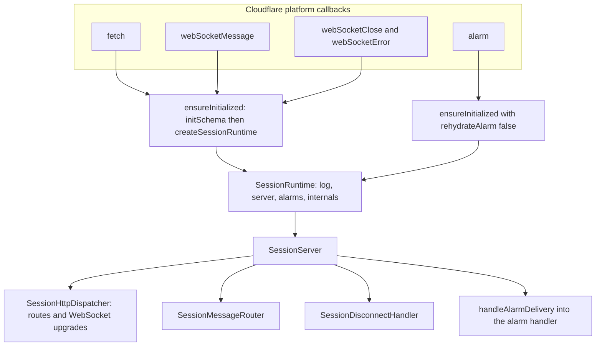
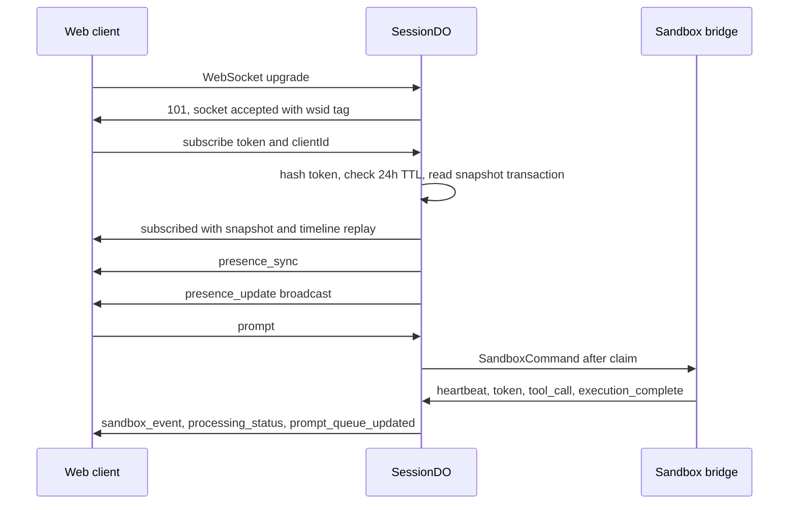
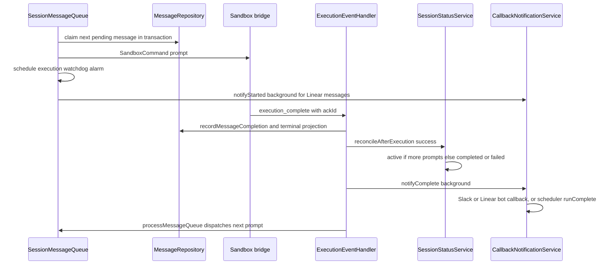

# Session Durable Object

Every session in Open-Inspect runs inside exactly one Cloudflare Durable Object: the `SessionDO` class (`packages/control-plane/src/session/durable-object.ts`), exported from the worker entry point and addressed by `env.SESSION.idFromName(sessionId)`. One DO owns one session's hot state in its own embedded SQLite database — participants, the prompt queue, the agent event log, artifacts, and sandbox credentials — so concurrent sessions never contend and per-session reads and writes are fast, synchronous, and transactional. The DO is also the session's real-time hub: browser clients and the sandbox bridge connect to it over hibernatable WebSockets, prompts are queued and dispatched here, and the session's single alarm slot multiplexes every deadline from execution watchdogs to inactivity shutdowns.

Two SQL stores meet in this class and are deliberately distinct: `this.sql` is the DO-embedded SQLite (`ctx.storage.sql`) that holds all session state, while `this.db` is the shared D1 binding (`env.DB`) used read-mostly for cross-session projections like the D1 session index. The DO itself is a *narrow adapter*: all application wiring lives in `createSessionRuntime` (`session/components.ts`), and the class only initializes the runtime per activation and forwards four platform callbacks.

## The platform adapter: a narrow surface

`SessionDO` extends `DurableObject<Env>` and exposes exactly the platform callbacks Cloudflare can invoke. Each one first touches the `runtime` getter, which lazily builds the graph, then delegates:

| Callback | Delegates to | Notes |
| --- | --- | --- |
| `fetch(request)` | `server.onRequest` | Internal HTTP routes and WebSocket upgrades |
| `webSocketMessage(ws, message)` | `server.onMessage` | Hibernation-aware message routing |
| `webSocketClose` / `webSocketError` | `server.onClose` / `server.onError` | Disconnect policy and error closes |
| `alarm()` | `server.onScheduledDeadline` | The DO's single alarm slot |

The four platform callbacks and how each reaches the platform-neutral `SessionServer` after lazy initialization.

Initialization is defensive by construction. `ensureInitialized` applies the schema (`initSchema`), builds the collaborator graph via `createSessionRuntime`, logs `do.init` with its duration, and only then publishes `this._runtime` — so if graph construction throws (a misconfigured deployment, a failed migration), the activation stays uninitialized and the next event retries initialization instead of dereferencing an undefined runtime. Because a Durable Object can be evicted and later re-created in a fresh isolate on a different host, the runtime is *rebuilt from persisted state on every activation*: nothing process-local is authoritative, and every activation re-reads the SQLite rows.

`alarm()` is the one entry point that initializes with `rehydrateAlarm = false` — "this delivery is the alarm," so re-arming during handling would be wrong. Every other activation rehydrates alarms: `runtime.alarms.rehydrate()` submits `alarmScheduler.rehydrate()` as a background task, which re-arms the runtime alarm from the persisted deadline state after a cold start.

## Composition root: `createSessionRuntime`

`createSessionRuntime(platform, env)` in `session/components.ts` builds the *entire* collaborator graph eagerly, in topological tiers, and returns only the narrow surface the platform adapter needs (`SessionRuntime`: `log`, `server`, `alarms`, and `internals`). Repositories, services, and handlers stay local to the factory; `SessionRuntime.internals` (the `SessionComponents` record) exists for live-DO integration tests to spy on or substitute collaborators, and nothing in production reads it.

The tiers, in construction order:

1. **Repositories over `SqlStorage`** — attachments, artifacts, events, messages, participants, ws-client mappings, session core, and the `PersistedAlarmDeadlineStore`. All DO-embedded SQLite; writes compose through `ctx.storage.transactionSync`.
2. **Sockets and alarm scheduling** — `SessionWebSocketManagerImpl` (built with the 30-second `WS_AUTH_TIMEOUT_MS`), the `createEarliestAlarmScheduler` over `ctx.storage` plus the persisted deadline store, and the hibernation-level `ctx.setWebSocketAutoResponse` pair that answers `{"type":"ping"}` with `{"type":"pong","timestamp":...}` without waking the DO.
3. **Outbound delivery** — `SessionMessengerImpl` over the socket registry: client fan-out (`authenticated_only`) and the sandbox send path. The two provider factories are also constructed eagerly here — `createSourceControlProviderFromEnv` and, inside `createLifecycleManager`, `createSandboxProviderFromEnv`.
4. **Session-scoped domain services** — `UserEnvResolver`, `SessionTerminalMessageProjection`, `ParticipantService`, the D1 `Scheduler`, `CallbackNotificationService`, `SessionStatusService`, `SessionTitleService`, `SessionDiffService`, `SessionEventStream`.
5. **The lifecycle manager** — `SandboxLifecycleManager` with adapters (`LifecycleSessionContext`, `LifecycleSocketAdapter`), the D1-backed MCP-server and Slack-notify lookups, and the inactivity timeout from `SANDBOX_INACTIVITY_TIMEOUT_MS` (default 600000 ms).
6. **The message queue** — `SessionMessageQueue`, wired with everything above plus `getExecutionTimeoutMs`, which is resolved *per use* so a deadline armed after `init` honors the session row's `sandbox_settings` override.
7. **Services over the queue and lifecycle** — presence, message service, the four sandbox event family handlers, `SandboxPushService`, and the alarm handler.
8. **Internal HTTP handlers** and the internal route table (`createSessionInternalRoutes`).
9. **Read models, connection admission, and the server stack** — `SessionSnapshotReader`, `SessionAccessReader`, `SessionConnectionAuthenticator`, and the `SessionServer` with its HTTP dispatcher, message router, disconnect handler, and alarm-delivery wrapper.

Two fail-fast rules shape this graph:

- **Misconfiguration throws at construction, deliberately.** Both provider factories throw on a misconfigured deployment (missing sandbox credentials, invalid `SCM_PROVIDER`, GitLab without a token). That throw fails every session request at initialization, before any session state is written, instead of running degraded and surfacing the error at the first spawn or PR operation. Deployment-time validation is the gate for configuration, not the runtime.
- **Secrets encryption is not optional.** `requireRepoSecretsEncryptionKey` and `requireTokenEncryptionKey` are consumed before anything that could persist a secret, so no fallback path can write plaintext tokens.

The one session-scoped logger is created *before* anything can capture a logger. Its `session_id` is injected per emit through a latched resolver (`createLatchedPublicSessionIdResolver`): before `/internal/init` writes the session row it resolves to the Durable Object id, and it upgrades to the public id (`session_name` or row id) the moment the row exists — for every component in the graph, however early it captured the logger.

The `BackgroundTasks` seam wraps `ctx.waitUntil` so fire-and-forget work (sandbox spawns, callbacks, index syncs) survives the request that started it, with failures logged as `background_task.failed`.

## DO-embedded SQLite schema

`initSchema(sql)` (`session/schema.ts`) runs three steps in order: `SCHEMA_SQL` (idempotent `CREATE TABLE IF NOT EXISTS` for fresh DOs), `applyMigrations` (numbered migrations tracked in `_schema_migrations` for existing DOs), and `INDEXES_SQL` (created after migrations so they can reference columns that may not exist in legacy tables). Shared table constants (e.g. `SESSION_REPOSITORIES_TABLE_SQL`) feed both `SCHEMA_SQL` and the corresponding migration so the fresh-DO and migrated-DO paths can never diverge. String migrations tolerate only "duplicate column"/"already exists" errors; function migrations must be idempotent because a crash between execution and recording can re-run them.

Each session DO holds exactly one `session` row. The tables:

| Table | Contents |
| --- | --- |
| `session` | The single session row: external `session_name`, title, scalar primary-repo mirror, model and reasoning-effort defaults, `status`, lineage (`parent_session_id`, `spawn_source`, `spawn_depth`), opt-in `code_server_enabled`/`vnc_enabled`, running `total_cost`, resolved `sandbox_settings` JSON, `environment_id` provenance, `opencode_session_id`. A CHECK requires `repo_owner`/`repo_name` to be null together and no-repo sessions to lack repo/branch context. |
| `participants` | Session members: SCM identity for git attribution, AES-GCM-encrypted `scm_access_token_encrypted`/`scm_refresh_token_encrypted`, and `ws_auth_token` stored only as a SHA-256 hash with its creation timestamp. |
| `messages` | Prompt queue and history: `status` (`pending`/`processing`/`completed`/`failed`), per-message model/reasoning overrides, attachments JSON, `callback_context` for Slack/Linear/automation follow-ups, web idempotency (`client_request_id` + `request_fingerprint`), Autofix dedup keys (`autofix_feedback_key`, `autofix_pr_key`, `origin_context`), `error_message`, and `stop_confirmation_deadline`. |
| `events` | Append-only agent event log (`tool_call`, `token`, `error`, `git_sync`, …) with a `UNIQUE timeline_sequence` for stable ordering and cursoring. |
| `artifacts` | PRs, screenshots, videos, preview URLs; `updated_at` tracks PR lifecycle content changes. |
| `attachments` | Chat-composer attachments with `message_id` set once referenced; unreferenced rows are TTL-pruned together with their R2 objects. |
| `sandbox` | The sandbox row: provider ids, snapshot ids and `snapshot_runtime_version` (restore compatibility floor), auth token (hash preferred), the status machine (`pending` → `spawning` → `connecting` → `warming` → `ready`, plus `stale`/`snapshotting`/`stopped`/`failed`), `git_sync_status`, `last_heartbeat`, `last_activity`, spawn-failure circuit-breaker counters, and rotating code-server/VNC/ttyd tunnel URLs and secrets. |
| `session_repositories` | Multi-repo members in position order with per-repo git state (`branch_name`, `base_sha`, `current_sha`); position 0 mirrors into the session scalar columns. |
| `session_diff` | Singleton holding the latest durable checkout diff bundle. |
| `session_alarm_state` | Singleton persisting alarm scheduling state (`pending_deadline`, `in_flight_deadline`, `cancelled`) so a DO adopted by another host can recover its alarms. |
| `ws_client_mapping` | `ws_id` → participant/client mapping so hibernation-recovered browser connections can be re-authenticated. |

The indexes encode the queue's core invariants: `idx_messages_one_processing` is a unique partial index on `messages(status) WHERE status = 'processing'`, so *at most one prompt per session can be processing at all*, and `idx_messages_client_request_id` is a unique partial index that makes web-prompt idempotency a database guarantee. Migration 42 backfilled this guarantee by requeueing duplicate processing rows (keeping the oldest claim) before creating the index. Events carry `idx_events_timeline_sequence` plus type/message-id/created-at indexes for page queries.

## WebSocket hub with hibernation

`SessionWebSocketManagerImpl` centralizes all Cloudflare WebSocket API usage. It is a *registry*, not a factory: it accepts sockets with hibernation tags (`ctx.acceptWebSocket(ws, ["wsid:<wsId>"])` for clients; `["sandbox", "sid:<sandboxId>"]` for the bridge), classifies any socket from its tags, and keeps `ClientInfo` per client socket plus the active sandbox socket reference.

### Client admission and subscription

A browser connection arrives as an upgrade forwarded from the worker (which has already checked the D1 index and returns 404 for unknown sessions). Inside the DO, `SessionConnectionAuthenticator.handleWebSocketUpgrade` mints a `wsId`, accepts the socket with its tag, and schedules `enforceAuthTimeout`: after 30 seconds (`WS_AUTH_TIMEOUT_MS`), an unauthenticated, non-synchronizing socket with no persisted mapping is closed with code 4008. This bounds resource abuse by connections that never complete the handshake.

The client then authenticates by sending a `subscribe` message carrying its WebSocket token and `clientId`:

1. The presented token is hashed and looked up against `participants.ws_auth_token` (a SHA-256 hash; the plaintext never persists).
2. Tokens older than 24 hours (`WS_TOKEN_TTL_MS`) are rejected with close code 4001, forcing the client to fetch a fresh token on reconnect.
3. On success the client is marked *synchronizing* (so a concurrent subscribe cannot double-run), the full session snapshot is read — session state, artifacts, timeline replay, and prompt queue — in one storage transaction, and the `subscribed` message (snapshot + participant identity) is sent.
4. Only after that send succeeds is the socket registered (`setClient`) and its `ws_client_mapping` row persisted. Keeping the final read, send, and registration in a synchronous method makes the no-await invariant structural: the snapshot-to-stream handoff cannot be interleaved with a state change.
5. Presence is sent to the new socket (`presence_sync`) and broadcast (`presence_update`), and a background PR refresh (`"open"` trigger) runs.

Close codes are meaningful: 4001 missing/expired token, 4003 already subscribed, 4009 snapshot-synchronization failure, 4002 no persisted mapping after hibernation ("Session expired, please reconnect"), 4008 auth timeout.

### Hibernation recovery

Hibernation tears down the isolate but keeps sockets, so identity must be recoverable. `getClientInfo` first checks the in-memory registry; on a miss it parses the socket's `wsid:` tag, reads the `ws_client_mapping` row (joined with `participants` in one query — the hibernation-recovery hot path), rebuilds `ClientInfo`, and re-caches it. The sandbox socket recovers the same way: `getSandboxSocket` scans all sockets, validates each candidate's `sid:` tag against the persisted `modal_sandbox_id` (closing mismatches with "Sandbox identity changed"), and re-adopts the match. Critically, if the persisted sandbox status is terminal (`stopped`, `failed`, `stale`), the manager closes lingering sandbox sockets and returns null — after inactivity or heartbeat-stale teardown the close handshake may not complete before hibernation, so a "zombie" socket that still appears OPEN must be skipped, not re-adopted.

### Client message protocol

`SessionMessageRouter` validates incoming frames against the shared `clientMessageSchema` and routes by connection kind — sandbox frames go to the event processor, client frames to the client-command facade. The client message set: `ping`, `subscribe`, `prompt` (with `clientRequestId`), `cancel_prompt`, `stop`, `typing`, `presence`, and `fetch_history`. `ping` and `subscribe` are the only messages valid before authentication; anything else from an unauthenticated socket is dropped. Invalid messages reply with an `error` message, preserving the `clientRequestId` of a failed `prompt`/`cancel_prompt` for client-side correlation. `fetch_history` is cursor-based and rate-limited to one request per 200 ms per connection (`RATE_LIMITED` otherwise).

### Presence

`PresenceService` projects one participant per identity from one or more client connections: any active socket marks the participant active, and the most recent `lastSeen` wins. Presence state lives entirely in the socket registry — the service is stateless. `typing` messages drive proactive sandbox warming: with no sandbox socket and no spawn in progress, the DO broadcasts `sandbox_warming` and spawns the sandbox before the user hits Enter.

### Disconnect policy

`SessionDisconnectHandler` applies close and error policy independently of the socket runtime:

- **Sandbox close** — the handler first checks `clearSandboxIfMatch`: a close for a *replaced* sandbox socket must not schedule the active one's termination. Then, if the persisted sandbox status does not block reconnection (not `stopped`/`stale`), it logs `sandbox.disconnected` and schedules a heartbeat check — **losing the sandbox WebSocket does not stop the sandbox**; the bridge is expected to reconnect while the DO waits.
- **Client close** — the client is removed from the registry; presence is participant-scoped, so another tab keeps the participant present (`broadcastPresence`) and only the last tab's departure broadcasts `presence_leave`.
- **Always** — the peer close is reciprocated, even when reconnect scheduling fails. WebSocket errors close the socket with 1011.

Client subscribe with snapshot handoff, and the prompt round-trip that follows.

## Event stream and cursors

Every sandbox event and every significant server-side occurrence lands in the `events` table through `EventRepository`. Inserts allocate `timeline_sequence` as `MAX(timeline_sequence) + 1` inside the same statement, giving the timeline a stable, gap-free ordering that survives clock skew between events with identical `created_at`. Cursoring uses `(created_at, timeline_sequence)` pairs — or `(created_at, id)` for pre-migration-38 rows — encoded as `createdAt:sequence:id` strings; a legacy numeric-only cursor is still accepted for old clients.

High-frequency events are *upserted*, not appended, so the timeline stays bounded per message: token events key on `token:<messageId>` (the last token state wins), tool calls key on `tool_call:<identityKey>` (running updates the same row as completion), and `execution_complete` keys on `execution_complete:<messageId>`. Context compaction rewrites the prior token row id first, then appends, in one transaction. Page queries order by `created_at DESC` with the tiebreaker DESC, fetch `limit + 1` rows to compute `hasMore`, and return the next cursor from the last returned row.

`SessionEventStream` is the read model over the repository:

- `getReplay(limit = 500)` builds the timeline embedded in the subscribe snapshot, excluding `heartbeat` events.
- `getHistoryPage` serves `fetch_history` with limits clamped to 1–500 (default 200), returning `history_page` items with a cursor for the next page.
- `listEvents` serves the HTTP `GET /internal/events` query surface with type/message-id filters.

Malformed persisted events are skipped during parse rather than poisoning the whole timeline.

### Event families

`SessionSandboxEventProcessor` routes validated events to four family handlers, resolving the per-event context once (a single `Date.now()` and a single message-attribution chain: the event's own `messageId`, falling back to the currently processing message — siblings must never disagree):

- **Streaming** (`token`, `step_start`/`step_finish`, `tool_call`, `context_compacted`): persisted and broadcast; steps renew activity and accumulate session cost; tool calls also fire background outbound callbacks.
- **Artifact** (`artifact`): materializes the artifact row and timeline event, broadcasting the *augmented* event (normalized type, guaranteed id, resolved attribution) rather than the raw wire form.
- **Runtime** (`heartbeat`, `ready`, `git_sync`, `session_title`): heartbeats update `last_heartbeat` and renew activity while a message is processing (a quiet tool call can outlast the inactivity timeout); `ready` pins diff baselines and records the reported runtime version; `git_sync` updates sync status and `current_sha`.
- **Execution** (`execution_complete`): the convergence point — see below.

Critical events (`execution_complete`, `error`, `snapshot_ready`, `push_complete`, `push_error`) carry an `ackId`; the processor sends the `ack` back to the sandbox only *after* the handler finishes, so the bridge can retry an unacknowledged critical event. Timeline-observer events (`tool_result`, `error`, `warning`, `user_message`, push terminals) persist and broadcast unchanged; push terminals additionally settle `SandboxPushService`.

## Message queue

`SessionMessageQueue` owns the prompt lifecycle: admission, ordering, dispatch, stop, and failure recovery. Admission enforces, in one synchronous turn so concurrent WebSocket requests cannot race:

- **Promptability** — `isSessionPromptable` allows `created`, `active`, `completed`, and `failed`; `archived` and `cancelled` reject with `SessionNotPromptableError`.
- **Capacity** — at most `MAX_UNFINISHED_PROMPTS` (10) pending-or-processing messages; over that is `PromptQueueFullError`.
- **Idempotency** — a web prompt's `clientRequestId` must map to the same participant *and* the same canonical request fingerprint (hash of participant, content, model, effort, attachment ids); a mismatch is `PromptRequestConflictError`, a match returns the existing message ("deduplicated").
- **Attachments** — attachment rows are claimed atomically with message creation; a partial claim aborts the whole message (`AttachmentClaimConflictError` → `INVALID_ATTACHMENTS`).

A successful enqueue transitions the session to `active`, broadcasts the prompt queue, and replies `prompt_queued` with the message id and position; the web path also touches the D1 index's `updated_at` in the background.

### Dispatch

`processMessageQueue` is the pump, and it is re-entrant from many places (enqueue, sandbox connect, execution completion, termination recovery). Its guard chain, in order: promptable session → any message awaiting stop confirmation (recover if past deadline, else schedule its alarm) → already processing → next pending message (oldest first) → provider authentication precheck (a model whose provider credentials are missing fails the message *before* claiming, keeping the queue moving) → sandbox socket.

Dispatch claims the message transactionally (`startMessageProcessing` guards on `status = 'pending'` **and** `NOT EXISTS` another processing row, so the one-processing invariant holds under concurrency), builds the `SandboxCommand` (resolved model, validated reasoning effort, author git identity from the participant's SCM profile, resolved attachments), and sends it. Broadcasts go out for the synthetic `user_message` event, `processing_status: true`, and the updated prompt queue. On success the DO also updates last activity, schedules the execution-watchdog alarm at `now + executionTimeoutMs`, and fires `notifyStarted` in the background (Linear-only).

Two dispatch edge cases matter:

- **No sandbox socket** — the DO broadcasts `sandbox_spawning` and spawns in the background rather than awaiting it (a snapshot restore can take tens of seconds and would hold bot callers' request timeouts open). The message stays `pending` and dispatches when the bridge connects — the connect handler itself re-runs the queue.
- **Send failure** — the message returns to `pending` (its `user_message` event deleted in the same transaction), the sandbox is terminated as unresponsive (`stale`), and the queue resumes.

### Stop, cancel, and failure

- **Stop** (`stopExecution`) marks the processing message failed with a synthetic `execution_complete`, sets its `stop_confirmation_deadline` to `now + 15 s` (`STOP_CONFIRMATION_TIMEOUT_MS`), schedules that deadline on the alarm, broadcasts, and sends `stop` to the sandbox. If the sandbox does not confirm by the deadline (or the send itself fails), `terminateUnresponsiveSandbox` closes it and the queue resumes. The `execution_complete` event *clears* the awaiting-stop marker, so a late confirmation is harmless.
- **Cancel** (`cancelExecution`, synchronous by contract) fails every pending message ("cancelled before it started") and the processing message ("cancelled") in the same turn the status flips to `cancelled` — no request may observe a cancelled session with unfinished messages — then broadcasts and sends `stop`.
- **Stuck processing** (`failStuckProcessingMessage`) only marks the message failed and reconciles status; it deliberately does *not* send a stop command or pump the queue, avoiding races where a new prompt dispatches to a sandbox being torn down.
- **Autofix** (`enqueueAutofix`) admits GitHub feedback prompts through `admitAutofixMessage`: feedback-key deduplication, a 24-hour rolling attempt window per pull request, and a closed-session check — admission is authoritative in the DO even though D1 keeps the receipt ledger.

`failMessage` is the shared completion path: `recordMessageCompletion` (guarded on expected status, so a retried stop cannot double-fail), a background terminal-message projection, broadcast of the synthetic `execution_complete`, and a background `notifyComplete`.

## Alarms: one slot, many deadlines

The Durable Object has exactly one alarm slot, and many features need deadlines. `createEarliestAlarmScheduler` coordinates all callers around a single persisted source of truth: the `session_alarm_state` singleton. The persisted pending deadline is authoritative — runtime (`ctx.storage`) mutations happen only after persistence, so a failed runtime update can be retried on rehydration. Operations are serialized through a promise chain, and `schedule` keeps the *earliest* deadline: a later request never pushes out an earlier one, and a `cancelled` flag is cleared (the alarm re-armed) on the first post-cancel schedule.

Delivery is tracked separately from scheduling (`beginDelivery` moves `pending_deadline` to `in_flight_deadline`; `completeDelivery` clears it) so a retry after a crash cannot acknowledge a *replacement* deadline scheduled during handling. `handleAlarmDelivery` skips a cancelled delivery, runs the handler, and — only when an in-flight deadline existed — re-arms any still-pending deadline and completes delivery.

The deadlines sharing the slot:

| Deadline | Trigger | Expiry behavior |
| --- | --- | --- |
| Execution watchdog | Prompt dispatch (`now + executionTimeoutMs`) | The processing message is failed as stuck (`Execution timed out (stuck processing)`). The timeout comes from the session's `sandbox_settings.sandboxTimeoutMs` when present, else `EXECUTION_TIMEOUT_MS`, else 7200 s (2 h). |
| Stop confirmation | `stopExecution` (`now + 15 s`) | The sandbox is terminated as unresponsive and the queue resumes. |
| Connecting timeout | Spawn/restore start (`created_at + 120 s`) | Sandbox marked `failed`, provider stopped, error broadcast; a slow boot that later connects can still self-heal because `failed` is reconnectable. |
| Heartbeat stale | Sandbox disconnect (`now + 90 s`, 3× the 30 s heartbeat interval) | Sandbox marked `stale`, snapshot triggered, provider stopped, sockets detached — returns `sandbox_terminated`. |
| Inactivity | Connect and every activity renewal (`now + timeoutMs`, default 10 min) | With clients connected: extended 5 min with a "Sandbox will stop in 5 minutes" warning; without: status `stopped` **first**, then snapshot, shutdown, and detach. |

`createAlarmHandler.handle()` runs on every delivery, in order: recover an expired stop confirmation; check the processing message against the execution watchdog (re-asserting its deadline if a lifecycle alarm consumed the slot first); delegate to `SandboxLifecycleManager.handleAlarm()` for connecting/heartbeat/inactivity evaluation; and if lifecycle action terminated the sandbox, fail any stuck message and resume the queue.

Draft expiry is *not* an alarm deadline. The web client warms a session on the first keystroke, so an unprompted `created` session would otherwise sit dead forever (its sandbox idles out on its own, but that writes only sandbox state). The worker's cron (`ABANDONED_DRAFT_SWEEP_CRON`, `23 * * * *`) runs `AbandonedDraftSweep`, which lists `created` index rows older than 8 hours (`ABANDONED_DRAFT_TTL_MS` — measured in hours because the composer holds no socket, so this clock must outlast a long pause at the keyboard) and POSTs each DO's `/internal/expire-draft`. The DO re-checks inside its own single-threaded state — the index may be stale — and answers `archived`, `not_draft` (repairing the drifted index row via `repairIndexStatus`), or `has_work` (settling status from message state; a queued prompt is left for the dispatch timeout rather than archived away).

## Session status and its projections

`SessionStatusService` owns the session `status` and is the single place every transition fans out: connected clients (broadcast `session_status`), the D1 session index (status + monotonic `updated_at`, and `finalizeChildAdmission` on `active`), and — for child sessions — the parent DO via a background `/internal/child-session-update` fetch, so the parent's UI refreshes in real time. When a turn settles (`completed`, `failed`, `cancelled` — deliberately excluding `archived`, which is filing, not finishing), terminal metrics (total cost, active duration, message count, PR count) also mirror to D1.

The reconcile rules keep status derivable from message state:

- `reconcileAfterExecution(success)` — back to `active` when more prompts are queued, otherwise `completed`/`failed` by outcome.
- `reconcileAfterQueueRemoval` and `settleFromMessageState` — same logic read off the queue and the latest terminal message.
- An idle session with *no messages at all* falls back to `created` — a deliberate backwards transition. It is reachable only when the sole pending prompt is cancelled (deleting its row), and returning the empty session to draft is exactly what lets the 8-hour abandoned-draft sweep reclaim it.

`cancel(terminalizeUnfinishedMessages)` atomically closes the local aggregate before publishing cancellation: status write, then the synchronous cancel callback (which fails unfinished messages), then projections. `repairIndexStatus` re-projects the current status onto D1 *without* claiming new activity, for callers that already know the two disagree — a swallowed projection failure must not leave a stale index row being re-selected forever.

## Outbound callbacks on completion

`CallbackNotificationService` is the session's outbound notification seam. Callbacks are HMAC-signed with the *destination* bot's own service secret (`SERVICE_AUTH_SECRET_SLACK_BOT` / `SERVICE_AUTH_SECRET_LINEAR_BOT`), so destination and signing key cannot diverge; non-linear sources default to the Slack bot for backward compatibility.

- **`notifyStarted`** — fired when a message dispatches, but only for `linear` sources with callback context; delivers to the Linear bot's `/callbacks/start` with retries.
- **`notifyComplete`** — fired on every terminal message (success or failure) as a background task. Messages carry `callback_context` JSON written at enqueue time (Slack follow-ups, Linear issues, automation runs). Automation-sourced completions route to the D1 scheduler's `runComplete` instead of a bot binding — delivered with retries but no timeout, because D1 operations cannot be aborted.
- **`notifyToolCall`** — throttled progress callbacks (max one per 3 s per session), deduplicated per tool `callId` with a 500-entry FIFO cap (Anthropic emits running+completed for one call; OpenAI may emit only completed). A callId is remembered only after a successful delivery, so the later event for the same call retries after a transient failure.

When the source is `automation`, `Scheduler.runComplete` (in D1) performs the SQL-guarded run transition — only an active run may go terminal, so a recovery sweep or a concurrent callback arriving first yields an acknowledged no-op — then applies invocation-level failure accounting and, for Slack-triggered runs, posts the result into the triggering thread and clears the `eyes` reaction via the Slack bot. In short: when a session's execution completes, the callbacks that fire outward are the Linear start/completion callbacks, Slack completion and throttled tool-call callbacks, and the automation scheduler's run completion.

## Lifecycle-state persistence rules

Two rules govern sandbox lifecycle state and are load-bearing across every path above:

1. **Explicit stop paths persist `stopped`/`stale` *before* closing connections.** Inactivity timeout, heartbeat-stale teardown, unresponsive-sandbox termination, and the cancel handler all write the terminal status first, then clear access state, then detach sockets. The persisted status is what blocks reconnection: admission rejects a bridge whose sandbox row is `stopped`/`stale` (410), and `failed` is deliberately *not* reconnect-blocked so a slow boot can self-heal. A persisted status change that lags the close would let the zombie socket reconnect.
2. **Losing the sandbox WebSocket does not stop the sandbox.** A bridge disconnect only schedules a heartbeat check; the reconnect-while-still-ready case resumes normally, and the stale decision is made by the alarm against persisted heartbeats, not by the socket event. (The summary invariant: control-plane lifecycle state is authoritative across WebSocket reconnects.)

Session status follows the same persistence-first discipline in reverse: `getSandboxSocket` trusts persisted terminal status over any socket that still looks open, and `SessionConnectionAuthenticator` re-reads the session row *after* its token-hash await because the input gate lets a cancel or archive land while the upgrade request is suspended.

## Internal HTTP surface

The DO serves an internal HTTP API (`http://internal/...`, path constants in `session/contracts.ts` shared with the router to prevent drift) dispatched by `SessionHttpDispatcher`, which times and logs each request as a `do.request` wide event and routes WebSocket upgrades to the connection authenticator. Route families:

- **Lifecycle** — `init` (writes the whole initial aggregate — session row, repository members, pending sandbox row, owner participant — in one transaction, then schedules the warm spawn; the D1 index is written *first* by the caller so a failed index write is caught before any sandbox spawns), `state`, `snapshot`, `update-title`, `archive`, `unarchive`, `expire-draft`, `cancel`, `child-session-update`, spawn/child-summary surfaces.
- **Prompts and events** — `prompt` (the API enqueue path used by the scheduler and bots), `autofix`, `stop`, `events`, `messages`, `artifacts`, `attachments`, `create-media-artifact`.
- **Sandbox-facing** — `sandbox-event` (HTTP fallback event ingestion), `sandbox-error`, `verify-sandbox-token` (the worker's router delegates sandbox-route authentication here), `scm-credentials`, `openai-token-refresh`, `xai-token-refresh`, `tunnel-urls`, participant registration.
- **Pull requests and diffs** — `create-pr`, `pull-request-artifact-snapshot`, `pull-requests-refresh`, and the diff store/resolve/retry family.

The token-minting counterpart to `subscribe` is `/internal/ws-token` (reached via the worker's authenticated `POST /sessions/:id/ws-token`): it upserts the participant — coalescing client-sent SCM tokens against newer server-side refreshes — and rotates a fresh WebSocket token, storing only its hash.

## Focused tests that matter

The runtime's invariants are pinned by unit tests that run the platform-neutral stack off-platform (plain values in place of sockets):

- `session/server.test.ts` exercises the full `SessionServer` stack — dispatcher, router, disconnect handler — over string connections.
- `session/alarm/scheduler.test.ts` pins the persisted-deadline-first ordering, earliest-wins semantics, rehydration, and delivery tracking against a real SQLite database.
- `session/websocket-manager.test.ts` covers accept/classify/hibernation-recovery mechanics against a fake `DurableObjectState`.
- `session/message-queue.test.ts` and `session/stop-execution.test.ts` cover enqueue idempotency, the one-processing claim, and stop-confirmation repository behavior.
- `session/schema.test.ts` verifies migration tracking and that fresh and migrated DOs converge on the same schema (including the partial indexes).
- `session/session-status-service.test.ts` pins the reconcile rules, the `created` fallback, and parent notification.
- `session/callback-notification-service.test.ts` covers routing, signing, throttling, and retry behavior.

## Related pages

- [Control Plane Worker](/openwiki/architecture/control-plane-worker.md) — the Worker shell that forwards WebSocket upgrades and proxies runtime routes into this DO
- [Data Model](/openwiki/architecture/data-model.md) — the shared D1 schema and how it mirrors the DO's projections
- [Sessions](/openwiki/concepts/sessions.md) — the user-facing concept of a session
- [Sandbox lifecycle](/openwiki/concepts/sandbox-lifecycle.md) — spawn, snapshot, restore, and the provider backends
- [Prompt flow](/openwiki/workflows/prompt-flow.md) — the end-to-end path of a prompt through this runtime
