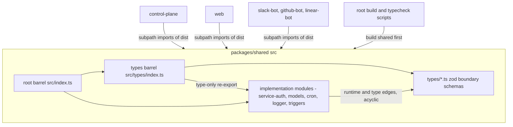
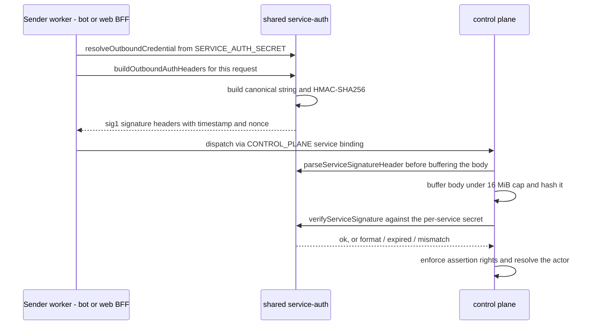
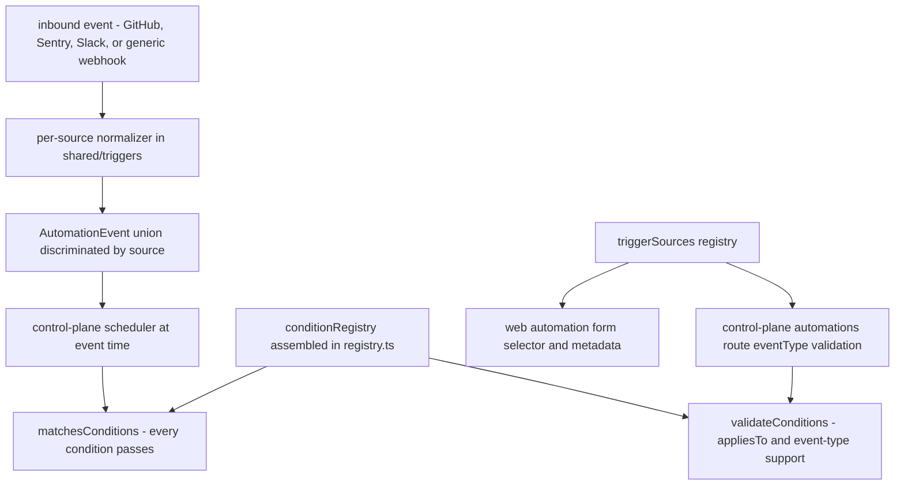

# Shared Contracts

`packages/shared` (npm name `@open-inspect/shared`) is the private, dependency-root package of the
TypeScript tier. Every other TS package — control-plane, web, slack-bot, github-bot, linear-bot —
depends on it, and nothing in it depends on any of them. It owns the seams that must not drift:
the `sig1` service-authentication format, the WebSocket and sandbox-event protocol contracts, the
trigger/automation type system, cron parsing, the model catalog, and the structured logger. Per
ADR 0002 (`docs/adr/0002-shared-session-contracts-and-correlation-boundary.md`) it is the
**protocol source of truth**: `ClientMessage`, `ServerMessage`, `SandboxEvent`, and
`SessionState` are defined here and re-exported by consumers, never duplicated. The package has
almost no runtime dependencies (zod, `cron-parser`, and the type-only `@octokit/webhooks-types`),
which is what keeps it importable from Cloudflare Workers, Next.js, and Node test runners alike.

## Role in the package graph and the build-order rule

The package's `package.json` declares `main`/`types` pointing at `dist/` and an exports map with 44
entries: the package root `"."` plus subpaths such as `./service-auth`, `./triggers`, `./cron`,
`./models`, `./logger`, and one `./types/*` subpath per boundary-schema module. Consumers depend on
the workspace via `"@open-inspect/shared": "file:../shared"` and import the **compiled build
output**, which is why the build order is a hard rule:

- The root scripts build and typecheck shared first:
  `npm run build -w @open-inspect/shared && npm run build --workspaces --if-present`.
- `AGENTS.md` lists it as a key gotcha: always build `@open-inspect/shared` before packages that
  depend on it; other packages import from it at build time.
- Practically: **changing shared types requires rebuilding control-plane, web, and the bots** —
  they compile against the emitted `dist/*.d.ts`. CI's Vercel trigger on `packages/shared/`
  rebuilds the web app for the same reason.

## The two barrels and the module-boundary test

Shared has exactly two barrels:

- **`src/index.ts`** — the root barrel, re-exporting every implementation module (`./types`,
  `./git`, `./auth`, `./service-auth`, `./models`, `./cron`, `./triggers`, `./logger`, `./slack`,
  and the rest) as one flat namespace.
- **`src/types/index.ts`** — the "type and protocol compatibility barrel". Its header states the
  rule: implementation modules import one another **directly**; only consumers import through the
  barrel, and internal schemas stay out of the export surface. It re-exports each `types/*`
  module's schemas and derived types, and pulls `AutomationTriggerType` from the triggers package
  via a type-only re-export.

`src/module-boundaries.test.ts` enforces this layout mechanically rather than by convention. It
walks every production `.ts` file (tests excluded), parses each with the TypeScript compiler API,
and collects dependency edges — relative imports resolved to real modules, plus any specifier
starting with `@open-inspect/shared` (self-package references are also tracked). Each edge is
classified as **runtime** or **compile-time**: `import type` / `export type` declarations carry no
runtime edge, and `import("./x")` type nodes are collected as compile-time-only dependencies. Three
assertions hold the line:

1. No implementation module may import the root barrel, the types barrel, or the package by name —
   the barrels are leaf aggregation points, reachable only from outside.
2. No **runtime** dependency cycles.
3. No **compile-time** dependency cycles (so even type-only back-references cannot loop).

Shared's tests are co-located `src/**/*.test.ts` run in the Node environment via Vitest, and its
`typecheck` script checks both the source and the test tsconfigs.

### Export style and compatibility surface

In practice consumers overwhelmingly import through typed subpaths —
`@open-inspect/shared/service-auth`, `@open-inspect/shared/triggers`,
`@open-inspect/shared/types/server-messages` — which keeps module graphs shallow and tree-shakable.
The root barrel remains the compatibility surface: `src/public-api.test.ts` pins cross-module
aliases so renames cannot silently break root-level imports (`automationRepositoryInputSchema`
**is** `repositoryInputSchema`, `MAX_AUTOMATION_REPOSITORIES`/`MAX_SESSION_REPOSITORIES` are
`MAX_TARGET_REPOSITORIES`, provider-account and GitHub-autofix contracts export from the root).

## Service auth: the `sig1` format

`src/service-auth.ts` implements per-service request authentication for service-to-service traffic,
replacing the old shared claimless bearer: each sender signs with its own secret, and the signature
binds the **full request** — method, path, canonicalized query, body SHA-256, asserted actor,
timestamp, and nonce — so a captured credential cannot be replayed against a different request.

### Canonical string and header grammar

The signed canonical request string is newline-delimited:
`sig1\n<service>\n<timestampMs>\n<nonce>\n<METHOD>\n<pathname>\n<canonicalQuery>\n<bodySha256Hex>\n<actor>`,
with the actor field empty when no actor is asserted. The canonical query sorts the **decoded**
`key=value` entries bytewise by `key\0value` and re-encodes them with `encodeURIComponent`, so
`?b=2&a=1` and `?a=1&b=2` sign identically while a no-query request's empty string cannot collide
with a real one. Unicode path/query forms are normalized the same way.

On the wire the signature rides in `X-OpenInspect-Service-Signature` as
`sig1.<timestampMs>.<nonce>.<64-hex>`, alongside `X-OpenInspect-Service` (one of the fixed
`SERVICE_NAMES`: `web`, `slack-bot`, `github-bot`, `linear-bot`), the optional
`X-OpenInspect-Actor`, and the optional `x-trace-id` correlation header. The header grammar is
deliberately stricter than JS coercion: the timestamp must be 1–16 ASCII decimal digits (no `1e3`,
`0x10`, padding, or Unicode digits), the nonce 1–64 lowercase hex chars, the signature exactly 64
lowercase hex chars, and the freshness check uses `Math.abs(now − timestamp)` against the 5-minute
`TOKEN_VALIDITY_MS` shared with `auth.ts` — so skew in either direction expires.

### Verification ordering and failures

Verification has three ordered failure reasons — `format`, `expired`, `mismatch`, cheapest to most
specific — and this ordering is load-bearing: `parseServiceSignatureHeader` checks grammar and
freshness **before** the caller reads the body, so a malformed or stale header never costs a body
buffering; only the final HMAC comparison needs the body hash. The comparison itself is
`timingSafeEqual`. The golden-vector test pins each failure class, including every malformed header
fixture and expiry in both directions.

### Golden vectors pin the format

`test-fixtures/service-auth-vectors.json` is immutable and load-bearing: it pins, per vector, the
expected pathname, canonical query, body hash, full canonical string, HMAC hex, and assembled
signature header (plus a `malformedHeaders` list with pinned rejection reasons). The vectors were
originally generated by an independent, now-retired Python implementation and are retained as fixed
fixtures. The header at the top of both the fixture and the module states the governance rule:
**any change to the canonicalization layout requires a new format tag (`sig2`), not an edit to the
vectors or this module.** The test suite verifies every vector end-to-end (canonical string,
signature, round-trip through `verifyServiceSignature` with mocked time) and asserts that reordered
queries and raw/pre-encoded unicode paths sign identically.

### Outbound: signing and sending

On the sending side, `resolveOutboundCredential(service, env)` requires `SERVICE_AUTH_SECRET` and
throws otherwise; `buildOutboundAuthHeaders` builds headers **per request** (signatures are
request-bound and never shared across calls), adding `Content-Type` only when a body is present —
`application/json` for string bodies, the body's own content type for pre-serialized
`OutboundBinaryBody` bytes. Binary bodies must be serialized **before** signing, because sig1
hashes the exact bytes sent. `signedControlPlaneFetch` closes the loop: it signs and sends through
the env's `CONTROL_PLANE` service binding using the same method/URL/body values, so the bytes sent
are exactly the bytes signed by construction.

Adoption is thin by design. Each bot wraps the shared `signedControlPlaneFetch` in its own
`src/internal-auth.ts`, which binds only the service name and forwards everything else. The web
BFF's `dispatchWebServiceRequest` does the equivalent for `service:web`: it strips
`Authorization` and all three identity headers from anything the caller forwarded (only
credentials minted at this boundary may identify a request), then signs the dispatched bytes.

### Inbound: control-plane verification

The control plane's `authenticateServiceRequest` is the production verifier. It resolves the service
name, then its **per-service verification key** (`SERVICE_AUTH_SECRET_WEB`,
`SERVICE_AUTH_SECRET_SLACK_BOT`, `SERVICE_AUTH_SECRET_GITHUB_BOT`, `SERVICE_AUTH_SECRET_LINEAR_BOT`
— an absent key is a 500 "misconfigured" rejection, not a 401). Then, in order: parse/freshness
check *before* body buffering; buffer the body via `readBodyCapped` with a 16 MiB hard cap
(the signature covers the body hash, so the body must be read exactly once — over-cap is 413);
verify the signature; and only then handle the actor. Nonce-reuse detection is best-effort and
log-only — an in-isolate map capped at 5,000 entries whose entries expire with the validity
window — because Worker isolates have no shared memory. A non-empty actor must parse as
`<namespace>:<id>` and the namespace must match the service's `ASSERTION_RIGHTS` (`slack-bot`
asserts `slack:*`, `github-bot` `github:*`, `linear-bot` `linear:*`, `web` asserts nothing — its
identity arrives by session exchange, never assertion); the asserted actor is resolved to a
canonical user through the user store, or carried with `canonicalUserId: null` when unseen.
Finally the consumed body is rebuilt into a fresh `Request` before the handler sees it.

Two related credential flows complete the picture:

- **Browser sessions ride sig1.** `authenticate` verifies the `service:web` signature channel
  first; only then, on routes requiring `webService: "user"`, does it validate the Better Auth
  session cookie. A verified browser request is therefore always a sig1-verified service request
  plus a session.
- **Secrets are Terraform-generated.** The four per-service secrets are `random_password`
  resources in Terraform state — no operator-supplied variables. The control plane binds all four
  as `SERVICE_AUTH_SECRET_<SERVICE>`; each sender binds exactly its own as plain
  `SERVICE_AUTH_SECRET` (a sender signs as itself, so naming its own service adds nothing).

### HMAC primitives and the other credential flows

`src/auth.ts` is the crypto toolbox the rest of the package builds on:

- `computeHmacHex` (HMAC-SHA256 as lowercase hex) and `timingSafeEqual` are the shared primitives
  reused by sig1, Sentry webhook signature verification, callback signing, and webhook-key
  comparison. `TOKEN_VALIDITY_MS` (5 minutes) is defined here and shared with sig1.
- `generateInternalToken` mints the *separate* CP→Modal internal token —
  `Authorization: Bearer timestamp.signature` under `MODAL_API_SECRET` — used by the Modal client's
  request headers. It is deliberately distinct from sig1 (the data plane is not one of the
  `SERVICE_NAMES`).
- Completion and tool-call callbacks flowing **from the control plane to bots** are HMAC-signed
  over the JSON payload with the *destination* bot's own per-service secret. Bots verify with
  `verifyCallbackFromControlPlane`, which fails closed (false) when `SERVICE_AUTH_SECRET` is
  unbound and maps an invalid signature to a 401.

## Boundary schemas and the protocol contracts

The `src/types/*` modules define zod schemas exactly at transport boundaries — WebSocket client
messages, server messages, sandbox events, session API requests/responses, repository inputs,
provider accounts, skills, environments, diffs — with TS types derived (`z.infer`) and both layers
exported through the types barrel. Two test suites keep the surface honest:

- `types/type-contracts.test.ts` pins the `z.input`/`z.output` relationships (e.g. `ServerMessage`
  **is** `z.output<typeof serverMessageSchema>`; `RepositoryInput` differs from its transformed
  output, whose `baseBranch` is always present), so a refactor cannot silently change a transform
  boundary.
- `types/boundary-schemas.test.ts` exercises the cross-module request schemas (session creation
  with and without repositories, whitespace rejection, attachment caps, and so on).

### Server messages

`types/server-messages.ts` defines `ServerMessage`, the discriminated union (`type` literal) the
session Durable Object broadcasts over the session WebSocket: `pong`, `subscribed` (with the
authoritative snapshot), prompt-queue events, `sandbox_event`, presence sync/updates, sandbox
lifecycle and status, `history_page`, `session_status`/`session_title`, `diff_state_changed`,
`tunnel_urls`, structured `error`, and more. Two compatibility rules are baked into the schema:

- The client-visible snapshot (`sessionSnapshotStateSchema`) **omits the credential fields** —
  `codeServerPassword`, `vncPassword`, `ttydToken` — so secrets are structurally absent from
  anything broadcast or replayed.
- Rolling-deploy tolerance: newer fields are optional with documented consumer defaults (e.g.
  `SessionState.repositories` is optional so pre-multi-repo producers stay valid; consumers
  synthesize from `repoOwner`/`repoName`).

History parsing is deliberately two-tier: the timeline *envelope* (`eventId`,
`timelineSequence`, `event`) always parses, while unknown inner sandbox events are **dropped** by
`tolerantSessionTimelineEventsSchema` — a `history_page` from a newer server simply omits event
types an older client cannot render. A malformed event inside a live `sandbox_event` message,
by contrast, is rejected outright.

### Sandbox events

`types/sandbox-events.ts` defines `SandboxEvent`, the discriminated union of events coming from
Modal or synthesized by the control plane: `heartbeat`, `ready` (which stamps
`runtimeVersion`/`SANDBOX_VERSION` for snapshot restore gating), `token`, `tool_call`,
`step_start`/`step_finish` (with cost and token usage), `tool_result`, `git_sync`, `error`,
`execution_complete`, `context_compacted`, `artifact`, `push_complete`/`push_error` (with optional
repo identity for multi-repo sessions), `warning`, `session_title`, and `user_message` (attachment
metadata only, never inline content). Three derived guarantees matter:

- `eventTypeSchema` is generated from the union's discriminators, so the query/filter enum cannot
  drift from the event union that owns the contract.
- `toolCallIdentityKey`/`toolCallIdentityTuple` give tool calls a stable identity of
  messageId + subtask scope (`childSessionId`/`taskCallId`, or `unassociated-subtask`/`parent`) +
  `callId`, which is how upserts and dedupe work across the DO and UI.
- `listEventsResponseSchema` enforces the pagination invariant: `hasMore: true` **requires** a
  cursor, because consumers stop paginating when the cursor is absent and a cursor-less
  `hasMore` page would silently truncate history (a false completion from partial events).

## Triggers registry

The `src/triggers/` subtree is the type system and evaluation engine for automation triggers (the
runtime engine lives in the control plane scheduler; see
[Automations](/openwiki/workflows/automations.md)).

- **Trigger types and events.** `automationTriggerTypeSchema` enumerates `schedule`,
  `github_event`, `linear_event`, `sentry`, `webhook`, `slack_event` (the value stored in D1), and
  `TRIGGER_TYPE_TO_SOURCE` maps the event-backed ones to `AutomationEventSource`. The
  `AutomationEvent` union is discriminated by `source` (github/linear/sentry/webhook/slack); the
  shared base carries `eventType` (dot-delimited, e.g. `pull_request.opened`), `triggerKey` (dedup,
  e.g. `pr:42`), `concurrencyKey`, `contextBlock` (human-readable text prepended to agent
  instructions), and raw `meta` for debugging. Source-specific payloads add branch/label/actor
  facts (GitHub), Linear status, Sentry project/level, raw webhook `body`, or Slack channel/thread
  metadata.
- **Condition system.** `TriggerCondition` is a 15-member discriminated union (`branch`,
  `target_branch`, `label`, `path_glob`, `actor`, `conclusion`, `check_conclusion`,
  `workflow_name`, `linear_status`, `sentry_project`, `sentry_level`, `jsonpath`, `text_match`,
  `slack_channel`, `slack_actor`), and `triggerConfigSchema` wraps an array of them as the JSON
  persisted in D1. Each condition type has a typed `ConditionHandler` with `validate` (creation
  time, returns error strings), `evaluate` (event time, boolean), and `appliesTo` (which event
  sources may use it). `registry.ts` assembles the full `conditionRegistry` — cross-source
  handlers (`label`, `actor`, `linear_status`) plus each source module's handler set — with the
  invariant that **every** `ConditionType` key has a handler. `matchesConditions` requires every
  condition to pass (the scheduler gates event firings with it against each automation's persisted
  `TriggerConfig`); `validateConditions` additionally checks source applicability and, for GitHub,
  per-event-type support. `check_conclusion` and `conclusion` share a semantic key via
  `getConditionSemanticKey` so the two deployment-compatibility spellings dedupe.
- **Source registry.** `triggerSources` lists four `TriggerSourceDefinition`s — sentry, webhook,
  github, slack (Linear has an event schema and a `linear_event` trigger type but no source module;
  its events arrive via the linear-bot). Each definition carries display metadata, its event types,
  and `supportedConditions`; the web automation form reads it to render the trigger-type selector
  and event-type dropdown, while the control-plane automations route uses it to require/validate
  `eventType` for sources that support event types.
- **GitHub specifics.** `GITHUB_WEBHOOK_EVENT_CATALOG` pins the supported webhook event/action
  pairs and the condition types each supports; conclusion options are event-specific (check suites
  additionally accept `skipped`/`startup_failure`). The `path_glob` handler is schema-reserved but
  declares an empty `appliesTo` — no webhook payload carries a file list, so no source can answer
  it — yet persisted configs still parse. The Slack source's `text_match` handler bounds
  user-supplied regexes (200-char pattern cap, flags allowlisted to `i`/`m`) and validates the
  runtime shape of untrusted condition JSON before persistence. Branch/path matching uses the
  minimal `matchGlob` utility (`*` within a segment, `**` across segments).

## Cron utilities

`src/cron.ts` wraps `cron-parser` for the automation engine with three deliberate constraints:

- `isValidCron` accepts **5-field expressions only** (6-field seconds-forms are explicitly
  rejected).
- `nextCronOccurrence` is timezone-aware (IANA names via `Intl`/cron-parser); the scheduler uses it
  to advance `next_run_at`.
- `cronIntervalMinutes` parses against a fixed reference point (a UTC Wednesday), samples six
  consecutive occurrences, and returns the **minimum** observed interval in minutes — which is what
  catches multi-value expressions like `0,1 * * * *` whose shortest gap is one minute. It returns
  `null` only when the expression fails to parse. The automations route uses this to enforce the
  15-minute minimum schedule interval (`MIN_CRON_INTERVAL_MINUTES`), together with IANA timezone
  validation. (`describeCron` renders preset expressions — every N minutes, hourly, daily,
  weekdays — into UI text, falling back to the raw expression, with a compact mode that uses
  `Intl` timezone abbreviations.)

## Models catalog

`src/models.ts` is the single source of model metadata for control plane, web UI, and bots. The
authoritative `MODEL_CATALOG` is grouped by provider in UI display order; each group is
`enabledByDefault` or opt-in, and each entry may carry a reasoning config (effort levels from
`none`/`low`/`medium`/`high`/`xhigh`/`max` plus a default). Every derived view — `VALID_MODELS`,
`MODEL_OPTIONS` (for dropdowns), `MODEL_REASONING_CONFIG`, `DEFAULT_ENABLED_MODELS` (non-opt-in
groups only), and `DEFAULT_MODEL` — is computed from the catalog, and a module-load invariant
throws unless **exactly one** catalog entry has `default: true`, so a catalog edit cannot leave the
default ambiguous.

Backward compatibility is handled at the edges: `normalizeModelId` prefixes bare legacy ids
(`claude-*` → `anthropic/…`, `gpt-*` → `openai/…`) because D1, SQLite, and Slack KV still hold bare
values, and `isValidModel` accepts both forms. `resolveEnabledModel` implements the canonical
fallback policy: desired model if valid, else the fallback, else the first enabled model.
`getSubscriptionProviderForModel` is the strict counterpart — it requires an already-canonical
catalog id (throws otherwise) and returns the provider only if it participates in subscription
billing (`openai`, `xai`), `null` otherwise.

## Logger

`src/logger.ts` is a zero-dependency structured JSON logger for Workers and Node. It emits flat
JSON lines that Cloudflare Workers Logs indexes, with logger-owned keys — `level`, `component`,
`msg`, `ts`, `service` — that context and per-call data can never overwrite (they are stripped
before merge; later values still override earlier ones for non-owned fields). Severity maps onto
`console.warn`/`console.error` so tooling and alerting see the right level while the JSON `level`
field drives programmatic filtering. `JSON.stringify` is wrapped: a serialization failure (bigint,
circular refs) emits a guaranteed-serializable `LOG_SERIALIZE_FAILURE` line instead of crashing the
request or Durable Object event. `Error` values in `data` are flattened into
`error_message`/`error_stack`/`error_type`/`error_code`. `child(context)` returns a logger with the
context merged, and `parseLogLevel` uses an explicit allowlist (defaulting to `info`) so prototype
keys cannot masquerade as levels.

## Smaller shared seams

| Module | Contract it pins |
| --- | --- |
| `http-body.ts` | `readBodyCapped`: buffer a stream under a hard byte cap — concatenated bytes, empty for a missing body, `null` (with the stream cancelled) when the cap is exceeded. Used by sig1 verification (16 MiB) and the web's body proxies. |
| `browser-auth-routes.ts` | The exact browser-reachable Better Auth surface (six method+path entries and the client-IP header) shared by the web BFF and control plane, so neither side can silently widen or narrow the signed proxy contract. |
| `session-list-query.ts` | Parse/serialize for session-list query params (`status`, `limit` clamped 1–100, `offset`, `excludeStatus`, `excludeAutomationLineage`, `createdBy` with the `me` alias and canonical-user validation), exhaustive over the `SessionListQuery` type; shared by the web BFF and the control-plane session index. |
| `cache-store.ts` | A minimal `CacheStore` port (`get`/`put`/`delete`, optional JSON typing and TTL) with an adapter from Workers KV, so source-control code does not bind to the KV type. |
| `user-id.ts` | The canonical user-id shape (32 lowercase hex chars) used wherever a D1 `users.id` crosses a boundary. |
| `git.ts` | Session branch naming (`open-inspect/{sessionId}`) plus `extractSessionIdFromBranch` for the PR-lifecycle tracker. |
| `classification.ts` | Shared provider-selection/transport plumbing for the Slack and Linear bot target classifiers: the model id alone selects the provider, and an unrecognized id **throws** rather than silently billing the wrong provider. |
| `completion/extractor.ts` | Turns control-plane session events into a structured `AgentResponse` for the bots, with signing done per-URL via the shared outbound-credential helpers. |
| `sign-in-provider.ts`, `app-name.ts`, `regex.ts`, `pull-request-tool.ts` | Small enums and helpers (sign-in providers and their issuers, the deployment's display name, `escapeRegExp`, and the PR-creation tool envelope the sandbox sends back). |

## Failure and change semantics worth knowing

- **The sig1 format is frozen by fixtures.** Golden vectors, not tests-alone, are the compatibility
  mechanism: any canonicalization change means `sig2` and a dual-read plan, never editing the
  vectors.
- **Barrels are leaves.** The module-boundary test makes it impossible to create an
  implementation→barrel edge or a cycle, so the layering survives refactors without review
  vigilance.
- **Schema tolerance is explicit and asymmetric.** History replays drop unknown sandbox events;
  live messages reject them; credential fields are absent by construction from snapshots. Each
  tolerance is a schema-level decision with a test, not an accident.
- **Shared is compiled, not transpiled per-consumer.** Any type- or schema-affecting change implies
  a rebuild of every dependent package — the build-order rule exists because the contracts, once
  emitted to `dist`, are what the rest of the system actually compiles against.
