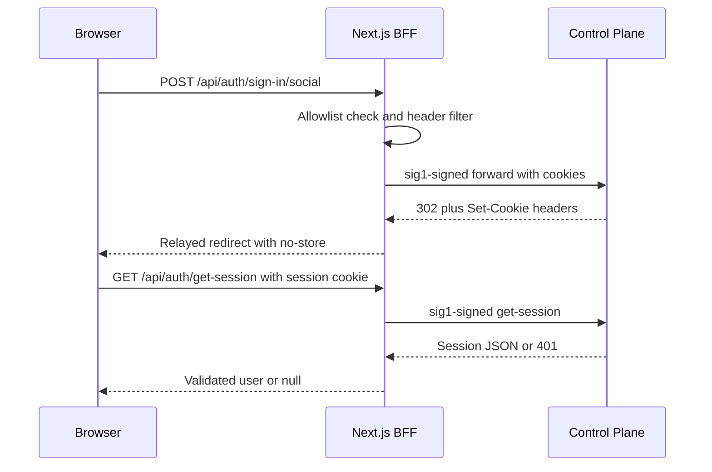
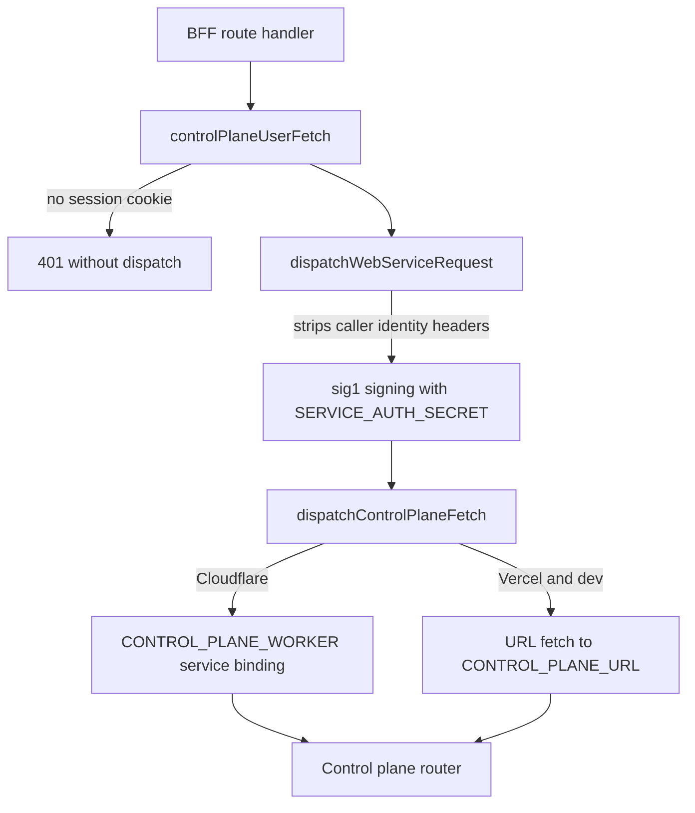
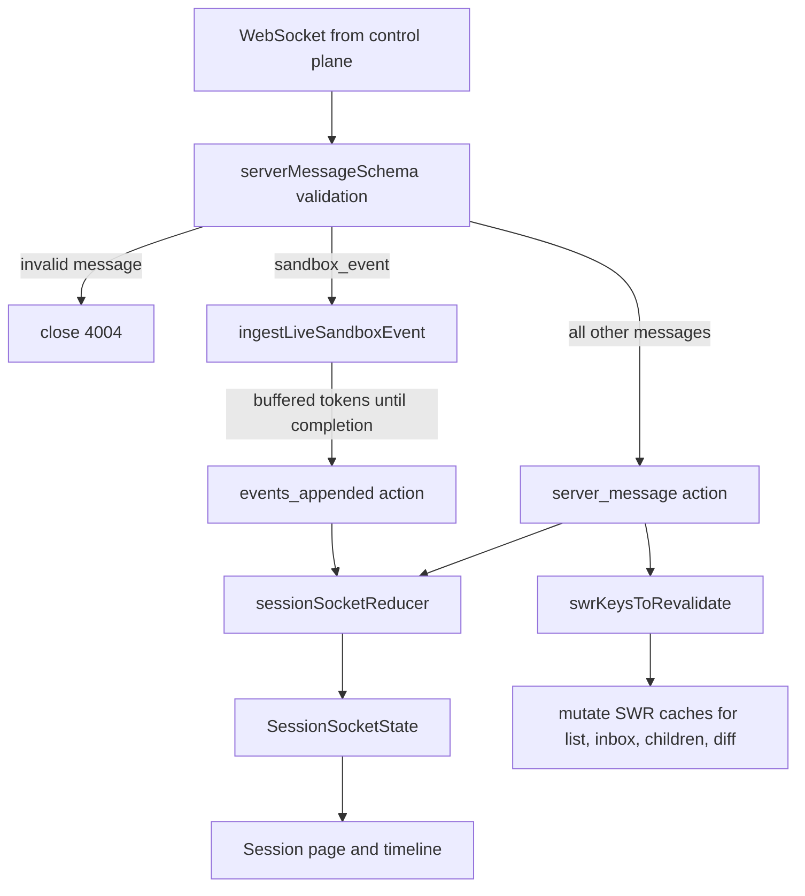

# Web Client

`packages/web` (`@open-inspect/web`) is a Next.js 16 + React 19 application and a **framework-free
BFF**: it renders the UI and proxies authenticated requests to the control plane, but it owns
neither credentials nor session truth. It signs every server-to-control-plane request with its own
`SERVICE_AUTH_SECRET` (the `service:web` sig1 channel), forwards only Better Auth's opaque session
cookie, and holds no OAuth provider credentials and no admission policy — those live on the
control plane, and `/login` resolves the enabled provider set from that authority at request time
(see [Control Plane Worker](/openwiki/architecture/control-plane-worker.md)).

The package has four load-bearing areas:

1. **App Router pages** — the `(app)` shell with the dashboard, `session/[id]`, `settings`, `login`.
2. **The auth boundary** — `browser-auth-proxy` / `server-auth-session` plus ESLint-enforced import
   and `fetch` bans that pin the split.
3. **API routes under `src/app/api`** — thin, allowlisting proxies that relay signed requests to
   the control plane (secrets, environments, image-builds, automations, provider accounts, skills,
   sessions, analytics, and more).
4. **The session-socket stack** — transport hook, pure reducer, event log, artifact metadata, and
   SWR revalidation: the real-time state core that the session page and its timeline consume.

## App Router map

```text
src/app/
├── layout.tsx / providers.tsx      # fonts, metadata; ThemeProvider + global SWRConfig
├── login/                          # server component; resolves enabled sign-in providers
├── access-denied/                  # OAuth admission-failure landing page
├── (app)/layout.tsx                # wraps children in <AppAuthBoundary>
│   ├── (sidebar)/layout.tsx        # wraps children in <SidebarLayout>
│   │   ├── page.tsx                # "/" dashboard: new-session composer
│   │   ├── analytics/              # usage dashboards (SWR over /api/analytics/*)
│   │   ├── automations/            # list, editor, run history, template gallery
│   │   └── session/[id]/           # layout SSR-fetches the snapshot; page hosts the socket
│   └── settings/                   # SettingsShell + the settings category panels
└── api/                            # BFF proxy routes (next section)
```

`providers.tsx` installs the global SWR config used everywhere: a fetcher built on
`browserApiFetch`, `revalidateOnFocus`, and a 2-second deduping interval. The sidebar group adds
the session sidebar and the global command menu (which reads a 100-item window of the unarchived
session list).

### Dashboard (`/`)

The dashboard page is the new-session composer, not a list. Its target picker produces one of the
three mutually exclusive launch modes the control plane's `createSessionRequestSchema` accepts: a
single repository (with branch picker), a named environment, or an ad-hoc ordered repository list.
It also selects model + reasoning effort (persisted to `localStorage` with a legacy-key migration),
managed-skill selection (with a resolution preview), model provider selections (persisted and
reconciled against the user's connected accounts), and image attachments.

Two behaviors matter:

- **Warm draft sessions.** As soon as the user starts typing or attaches a file, the page creates
  the session (`useWarmDraftSession`) so sandbox warming starts before submission. If the
  selection changes, the superseded warm session is archived in the background
  (`retireWarmDraftSession`). Submission reuses the warm session id, uploads attachments, and only
  then sends the prompt.
- **First prompt over HTTP, not the socket.** The dashboard has no WebSocket; submit POSTs
  `/api/sessions/{id}/prompt`, mutates the session-list and inbox SWR caches, and routes to
  `/session/{id}`. Live updates begin once the session page's socket subscribes.

### Session view (`/session/[id]`)

The route's **layout** is a server component that fetches the session snapshot via
`getSessionSnapshot` (a `controlPlaneUserFetch` with `cache: "no-store"`), maps a 401 to
`redirect("/login")` and a 404 to `notFound()`, and publishes the validated snapshot through
`SessionSnapshotProvider`. The client page seeds `useSessionSocket` with that snapshot, so the
timeline paints from server data before the socket is even open, and reconnects have a
known-good baseline.

### Settings

`/settings` renders a category panel registry — appearance, keyboard shortcuts, models, provider
accounts, skills, environments, secrets (the default category), source control, sandbox, images,
integrations, MCP servers, and data controls — driven by the `?tab=` query parameter, with a
mobile list/detail pattern backed by `history.pushState`. The **Images** category only exists when
`supportsRepoImages()` is true: the web app derives the deployment's sandbox provider from
`NEXT_PUBLIC_SANDBOX_PROVIDER` (defaulting to `modal`, throwing on an unknown value) and mirrors
the control plane's list of image-capable providers. Every panel reads and writes through the BFF
proxy routes below.

## The auth boundary

The web owns a three-part seam so that no component, route, or library ever talks to an auth
framework or raw `fetch` directly.

### Browser-side Better Auth proxy

`src/app/api/auth/[...auth]/route.ts` aliases both `GET` and `POST` to `proxyBrowserAuthRequest`.
The proxy is not a blanket forward: `BROWSER_AUTH_PROXY_ROUTES` (declared once in
`@open-inspect/shared/browser-auth-routes` so neither side can silently widen the contract)
allowlists exactly six method+path pairs — `POST /api/auth/sign-in/social`, the GitHub and Google
`callback` routes, `GET /api/auth/get-session`, `POST /api/auth/sign-out`, and `GET
/api/auth/error`. Anything else is answered `404` before any dispatch. The typed variant
`dispatchBrowserAuthRequest` lets server code (below) make the same checked calls without a
synthetic incoming request.

Forwarding hygiene is deliberate:

- Only `Accept`, `Accept-Language`, `Content-Type`, `Cookie`, `Origin`, and `User-Agent` are copied;
  caller-supplied identity headers are dropped by the signing layer.
- The client IP is taken only from the platform-trusted header (`X-Vercel-Forwarded-For` when
  `VERCEL=1`, `CF-Connecting-IP` on Cloudflare) and forwarded as `X-OpenInspect-Client-IP` — never
  from client-controlled `X-Forwarded-For`.
- Responses strip hop-by-hop headers and `content-encoding`/`content-length` (the body was
  decoded), preserve every `Set-Cookie` via `getSetCookie()`, and force `Cache-Control: no-store`.
- Dispatch uses `redirect: "manual"` and `cache: "no-store"` so sign-in redirects and cookie
  writes pass through intact.



Sign-in and session lookups as seen by the browser: the BFF allowlists and re-signs each hop, and
the control plane remains the only owner of OAuth state.

### Server-side session seam

`getServerAuthSession` (`server-auth-session.ts`, marked `server-only`) is the seam every BFF
route uses for authorization. It serializes **only** the opaque Better Auth session cookie —
`serializeBrowserSessionCookies` filters names matching `(__Secure-)openinspect.session_token(.N)`,
rejects duplicate or malformed values, and returns `null` when none is present, so OAuth
transaction cookies and unrelated browser state never become credentials on resource requests.
It then calls `dispatchBrowserAuthRequest` for `GET /api/auth/get-session`, maps a 401 to `null`,
and validates the payload against `browserAuthSessionResponseSchema` (canonical user id and
`session.userId === user.id`). Transport failures throw `AuthenticationUnavailableError`, which
callers like `/login` render as a "temporarily unavailable" state rather than an auth failure.

### Client-side session seam

`useAuthSession` (`auth-session.tsx`) is the browser counterpart: an SWR subscription to
`/api/auth/get-session` through `browserApiFetch`, exposing four statuses — `loading`,
`authenticated`, `unauthenticated`, `unavailable`. `signIn(provider)` posts to the proxied
sign-in route and refuses to navigate to a non-HTTPS redirect URL; `signOut` posts and clears the
session cache. `<AppAuthBoundary>` wraps the whole `(app)` group and turns those statuses into a
spinner, an out-of-order page, a sign-in pitch, or the children.

### The ESLint-pinned split

The seam exists in config, not just convention. The root `eslint.config.js` bans `next-auth`
imports and any `lib/auth` path across `packages/web/src`, and bans the global `fetch` everywhere
in the web package except two explicit seams: `lib/browser-api-fetch.ts` (browser → BFF, with a
`` `/api/${string}` `` path type and `mode`/`credentials: "same-origin"`) and
`lib/control-plane-transport.ts` (the BFF → control-plane dispatch). Two tests execute the real
ESLint against representative sources to keep the pins honest: `client-auth-boundary-eslint.test.ts`
(rejects `next-auth/react` and raw `fetch` in components/hooks/libraries; allows the app-owned
boundaries) and `server-auth-boundary-eslint.test.ts` (resource routes may import
`getServerAuthSession` but not the auth framework, including via aliased or relative paths).

## Control-plane request path

All server-side traffic to the control plane flows through three layers:

1. **`controlPlaneUserFetch`** (`control-plane.ts`) — the user-authenticated entrypoint. It reads
   cookies via `next/headers`, serializes only the session cookie (missing → `401` response
   without dispatching), sets a default JSON `Content-Type`, attaches trace/request correlation
   from the middleware-injected headers, and delegates.
2. **`dispatchWebServiceRequest`** (`control-plane-service.ts`) — the signing boundary. It strips
   any caller-supplied `Authorization` / actor / service / signature headers ("only credentials
   minted at this boundary may identify a web-service request"), requires `SERVICE_AUTH_SECRET`,
   and signs the exact request with sig1 headers binding method, URL, and body hash. Callers build
   the URL once — the signed URL is always the dispatched URL.
3. **`dispatchControlPlaneFetch`** (`control-plane-transport.ts`) — the platform boundary. On
   Cloudflare Workers it routes through the `CONTROL_PLANE_WORKER` **service binding** to avoid
   same-account worker-to-worker fetch restrictions (error 1042); on Vercel and in `next dev` it
   falls back to a URL-based fetch (in development this is unconditional, because the OpenNext
   package can expose a stub binding that fails). Every dispatch is bounded by a 15-second
   `AbortSignal.timeout` merged with any caller signal.



The signed request path: every hop either fails closed (no cookie, no secret) or re-mints the
`service:web` signature over the exact bytes it dispatches.

### BFF proxy routes and their factories

`src/app/api` holds one thin route per control-plane resource. Three factories keep them uniform:

- **`settingsProxy`** — generic `GET/POST/PATCH/PUT/DELETE` handlers for authenticated resources.
  Mutations require a serialized session cookie (checked *before* the body is read), cap the body
  at 4 MiB (`413` beyond), and forward the client's `If-Match` header unchanged — the revision id
  is an opaque CAS token, and forwarding it is what keeps a stale web editor from overwriting
  newer content. Responses are relayed as JSON with `Cache-Control: private, no-store` plus
  `etag`, `retry-after`, and `x-request-id`.
- **`controlPlaneJsonGetProxy`** — the GET-only variant used by the four analytics routes
  (`summary`, `timeseries`, `breakdown`, `pull-requests`).
- **`buildControlPlanePath`** — allowlist-based query forwarding: only declared parameter names
  reach the control plane, everything else is dropped.
- **`providerAccountSettingsProxy`** — wraps `settingsProxy` with pattern validation of the
  `{id}` / `{provider}` path params before any request is built.

On top of these, the route surface covers:

| Area | Routes |
| --- | --- |
| Sessions | list/create, `inbox`, `title`, `read-state`, `children`, `archive`/`unarchive`, `prompt`, `ws-token`, `attachments`, `diff` (+ per-file, `retry`), `media/:artifactId`, `participant-profiles`, `sandbox-access`, `skills` |
| Repos & secrets | `repos`, repo `branches`, repo `secrets` (+ per-key), global `secrets` (+ per-key) |
| Environments | CRUD, environment `secrets` (+ per-key, `import`), `images/trigger` |
| Image builds | unified `/api/image-builds` feed, repo `toggle`/`trigger` |
| Automations | CRUD, `pause`/`resume`, `trigger`, `regenerate-key`, `invocations`, `runs` |
| Provider accounts | CRUD, `enable`/`disable`/`reconnect`/`verify`, device `authorizations` (+ poll), `legacy-credentials`, account defaults |
| Other settings | `model-preferences`, `skills` (import/preview/resolve/reimport), `skill-profiles`, `mcp-servers`, `scm-settings`, `commit-signing`, `keyboard-shortcuts`, `integration-settings`, Slack channel listing |
| Analytics | `summary`, `timeseries`, `breakdown`, `pull-requests` |

Two security postures are worth knowing:

- **Authorization placement varies deliberately.** List routes such as `GET /api/sessions` and the
  inbox forward without a local session check — the control plane authenticates the forwarded
  cookie and answers 401. Mutation routes typically pre-check `getServerAuthSession` (or, in
  `settingsProxy`, the cookie) so a request body is never even read unauthenticated.
- **Request bodies are field-allowlisted.** The sessions and automations POST handlers pick
  exactly the fields they forward; creator identity and SCM provenance are derived by the control
  plane from authenticated state. The co-located route tests include a `hostile-identity.test-fixture`
  full of forged identity/token fields and assert none survive into the control-plane body.

Notable special cases: `POST /api/sessions/[id]/prompt` re-validates the prompt with the shared
zod schema (blank prompts rejected, attachments shape-checked) and stamps `source: "web"`;
`POST /api/sessions/[id]/ws-token` verifies the Better Auth session and then proxies to the
control plane to mint the one-time WebSocket token; `GET /api/sessions/[id]/media/:artifactId`
validates both path ids against strict patterns and streams the control-plane response with
`Range` forwarding, `private, no-store`, and `Vary: Cookie`; image-build routes answer `501` with
a shared message when the deployment's sandbox provider has no image support. A Next.js
**middleware** matches `/api/:path*` to stamp correlation headers (`x-trace-id` passed through
when valid, otherwise a fresh UUID; an 8-character `x-request-id` always fresh) onto both the
downstream request and the response.

## The session-socket stack

The session page's real-time state is built from four small modules plus the hook that composes
them. The split is deliberate: protocol semantics (what messages mean), transport mechanics
(reconnect, ping, auth), and cache effects (SWR) each live in one place.



Every server message is schema-validated once at the transport edge, then fanned out to the
reducer and to SWR invalidation.

### Transport: `useSessionTransport`

The transport hook owns the socket lifecycle and nothing else — it exposes `send`, `isOpen`,
`reconnect`, and `markHealthy`, and hands schema-validated messages to `onMessage`:

1. **Token and handshake.** It POSTs `/api/sessions/{id}/ws-token` through `browserApiFetch`
   (a 401 surfaces as "please sign in"), opens `${NEXT_PUBLIC_WS_URL}/sessions/{id}/ws`, and
   immediately sends `{ type: "subscribe", token, clientId }`. The token is held in a ref and
   cleared whenever auth fails or the connection is deliberately reset.
2. **Keepalive.** A `{ type: "ping" }` frame every 30 seconds while the socket is open.
3. **Close-code policy** (decided as a pure `closeDirective` function):
   `4001` auth-required → set `authError`, clear the token, no auto-retry;
   `4002` session-expired (e.g. after DO hibernation) → set `connectionError`, clear the token;
   unclean close or `4004` invalid-message → retry with exponential backoff (1 s base, 30 s cap)
   up to 5 attempts, then give up with a surfaced `connectionError`;
   clean close → no retry.
4. **Race safety.** A monotonic connect epoch invalidates any `connect()` that is still awaiting
   its token when `reconnect()` or unmount supersedes it, so an abandoned attempt can never open a
   socket next to the replacement. `markHealthy()` (called when the reducer reports `ready`)
   resets the backoff counter, and `reconnect()` drops the token, socket, and timers and starts
   fresh.

### Projection: `sessionSocketReducer`

The reducer is a pure function from already-normalized inputs to the next view state
(`SessionSocketState`: session fields, timeline events, participants, artifacts, prompt queue,
history cursor, `sandboxError`, readiness flags). Its actions are `server_message`,
`events_appended`, `history_requested`, and `socket_closed`; the WebSocket client, token
buffering, and cache effects all live outside it. Key semantics:

- **`subscribed` is an authoritative resync.** It replaces local artifacts and events with the
  snapshot instead of merging — reconnects must clear stale client data — and resets
  `loadingHistory` (a `fetch_history` dropped by a disconnect would otherwise block
  `loadOlderEvents` forever). `socket_closed` clears `ready`, presence sync, and the participant
  list.
- **Sandbox lifecycle.** `sandbox_error` records the provider's own failure message in
  `sandboxError` (not a status label) and clears runtime access URLs; `sandbox_warming`,
  `sandbox_spawning`, and `sandbox_ready` clear `sandboxError` because a new attempt supersedes
  the last failure; `sandbox_status` values `spawning`/`stale`/`stopped`/`failed` clear the
  code-server/VNC/ttyd/tunnel access state, and a replacement spawn also clears the dashboard URL.
- **Artifacts upsert by id**: creates prepend, updates replace in place so ordering stays stable.
- **Multi-repo branch attribution.** A `session_branch` update syncs `repositories` and the scalar
  `branchName` with an explicit rule: with no hydrated member list it updates the scalar only;
  with exactly one member it updates that member and mirrors the scalar; with multiple members an
  unscoped or unknown-member update is *ignored* rather than attributed to the primary, and the
  scalar mirrors only when the named member is the primary.
- **Cost accrual.** `events_appended` adds any positive, finite `step_finish` cost to
  `totalCost`.
- **History.** `history_page` prepends the fetched page and carries the new cursor and
  `hasMore`; a rejected `fetch_history` (`error` message) resets `loadingHistory`.

The hook seeds the reducer from the server-fetched snapshot via `createSessionSocketState`, which
normalizes optional snapshot fields (`isProcessing`, `totalCost`) and maps `spawnError` into
`sandboxError`.

### Event log: token buffering and replay collapse

Token events carry the **full accumulated text** for an assistant segment, not deltas, so the
log keeps one final token per segment. `ingestLiveSandboxEvent` buffers the pending assistant
text outside React state (a ref — tokens arrive at high frequency and must not re-render per
keystroke) and emits it exactly once, with the token's original timestamp, when the matching
`execution_complete` or `context_compacted` arrives. `stopExecution` flushes any pending partial
text before sending `stop`, so stopping preserves what was streamed. For replayed history,
`collapseReplayTokenEvents` compacts the stored stream to one token per compaction-delimited
segment, independent of storage ordering between token and completion events.

### Artifacts: `artifact-metadata.ts`

`toUiArtifact` maps the wire `SessionArtifact` (loosely-typed metadata) to the UI `Artifact`,
narrowing every metadata field to its expected type and deriving the PR display status — preferring
the tracked `lifecycleState`/`isDraft` pair (via the shared `toDisplayStatus`) and falling back to
the legacy `state` key for artifacts that predate PR lifecycle tracking.

### SWR revalidation

Session-socket messages change data that *other* views render, so `swrKeysToRevalidate` decides,
per message, which caches must refetch: PR artifacts, session titles, and status changes
revalidate the unarchived session list and the inbox; `child_session_update` additionally
revalidates the session's children list; a terminal `execution_complete` sandbox event
revalidates the inbox; `diff_state_changed` revalidates the diff; and `subscribed` refreshes
diff, children, participant profiles, and the inbox. Only PR artifacts revalidate the session
list — media artifacts (screenshots, video) arrive at high frequency during a run and cannot
change it. `useSessionSocket` maps each returned key through `mutate` and is the **only** place
the hook touches the SWR cache.

### The composing hook: `useSessionSocket`

`useSessionSocket(sessionId, initialSnapshot)` wires transport + event log + reducer + SWR
revalidation and exposes the session view plus actions. Prompt sending is a **correlated
request**: at most one prompt may await acknowledgement at a time; each request carries a
`clientRequestId` and settles on the matching `prompt_queued` / `prompt_cancelled` message, on a
matching `error`, on disconnect (all pending requests fail with `disconnected`), or on a 15-second
ack timeout (with a 5-second cap on waiting for subscription). No optimistic user message is
inserted — the server persists the `user_message` event and broadcasts it to every client
including the sender, which keeps multiplayer views consistent. `loadOlderEvents` guards on
`hasMoreHistory && !loadingHistory && cursor` and requests pages of 200 events. Sandbox access
(code-server/VNC/ttyd URLs) is fetched through a separate SWR hook keyed only while
`sandboxStatus === "ready"`, cleared on spawning/error/status transitions, and merged into the
returned `sessionState`.

## Timeline components

The reducer's `events` array is presentation-shaped by the timeline layer:

- **`timeline-items.ts`** filters to renderable events (user messages, tokens, failed tool
  results, git syncs, screenshot/video artifacts, errors, warnings, completions, compactions —
  and *hides* a user message while it is still pending in the prompt queue), dedupes (tool calls
  by identity key, executions per message, tokens superseded by later ones), groups consecutive
  same-tool `tool_call`s, nests subtask activity under its `Task` call, and — in
  `buildSessionTimelineItems` — collapses each *completed* user turn into a `work_group`
  (user message → activity → final output → completion, with duration) while leaving in-flight
  and partial-history turns flat.
- **`timeline-virtual-rows.ts`** turns items into virtual rows (`item`, a merged `terminal`
  block for the finished message, `loading`, `thinking`) with per-kind size estimates.
- **`session-timeline.tsx`** renders the rows through `@tanstack/react-virtual`, wires the
  top-sentinel / near-bottom heuristics for `onLoadOlder`, and supports terminal-message read
  observation for unread tracking. Row content is drawn by `ToolCallGroup`/`ToolCallItem`,
  `SessionWorkGroup`, `TaskActivityItem`, `TimelineRowContent`, sanitized markdown
  (`SafeMarkdown`), and media cards/lightbox.

Around the timeline, the session page composes the header (rename, archive), the prompt composer
(model/reasoning/skill/attachment support, typing indicators), the queued-prompt stack, the
changes/diff panel, the terminal panel, and the right sidebar (participants, artifacts, PRs,
media, tasks, tunnel URLs, VNC/code-server access).

## Platform: Vercel vs Cloudflare via OpenNext

The `web_platform` Terraform variable chooses the runtime — `"vercel"` (the default) or
`"cloudflare"`:

- **Vercel**: the `vercel-project` module sets `CONTROL_PLANE_URL`,
  `NEXT_PUBLIC_WS_URL`, `NEXT_PUBLIC_SANDBOX_PROVIDER`, `NEXT_PUBLIC_APP_NAME`,
  `NEXT_PUBLIC_APP_ICON_URL`, and the sensitive `SERVICE_AUTH_SECRET` as project environment
  variables; deploys build with plain `next build` and the transport uses URL-based fetch.
- **Cloudflare Workers via OpenNext**: Terraform runs `build:cloudflare`
  (`opennextjs-cloudflare build`) with the `NEXT_PUBLIC_*` variables **set at build time**, then
  generates a `wrangler.production.toml` (the checked-in `wrangler.toml` is the local-dev variant)
  declaring the `CONTROL_PLANE_WORKER` service binding, `nodejs_compat` +
  `global_fetch_strictly_public`, and the asset directory, and deploys with `wrangler deploy`.
  `SERVICE_AUTH_SECRET` is uploaded as a Worker secret *after* the deploy, and an optional custom
  domain is attached as a Cloudflare-managed hostname.

**Build-time implications.** Next.js inlines `NEXT_PUBLIC_*` variables into the client bundle at
build time, so `NEXT_PUBLIC_WS_URL` — the address `useSessionTransport` dials — plus the public
sandbox provider and app name/icon are baked into every bundle; changing any of them requires a
rebuild/redeploy, not just an environment update (server-only secrets like `SERVICE_AUTH_SECRET`
and `CONTROL_PLANE_URL` are read at runtime and do not have this constraint). `next.config.ts`
uses `output: "standalone"` with the monorepo root pinned for Turbopack and output-file tracing.

## Tests that pin the behavior

Co-located Vitest tests (node environment by default; React hook tests opt into jsdom per file)
carry most of the guarantees above:

- `reducer.test.ts` and `use-session-socket.test.tsx` — projection semantics (reconnect resync,
  sandbox lifecycle, branch attribution, artifact upserts) and the composed hook against a
  `FakeWebSocket`, including which SWR keys `mutate` touched.
- `event-log.test.ts`, `artifact-metadata.test.ts`, `swr-revalidation.test.ts` — token
  buffering/replay collapse, artifact narrowing, and invalidation mapping.
- `control-plane.test.ts` — verifies the sig1 signature over the dispatched request, the
  session-cookie-only serialization, and preservation of caller redirect/cache/signal options.
- `browser-auth-proxy.test.ts` — transparent forwarding with a fresh verifiable signature, header
  stripping, allowlist rejection, platform-specific client IP, and multi-`Set-Cookie` relay.
- `settings-proxy.test.ts` — auth-before-body-read, the 4 MiB cap, `If-Match` forwarding, and
  bodyless `DELETE`.
- Route tests (`sessions`, `automations`, image-builds, provider accounts, middleware, …) — query
  allowlists, field allowlists (with the hostile-identity fixture), status propagation, and
  correlation headers.
- The two ESLint boundary tests, which execute the real flat config to enforce the auth seams.

## Related pages

- [Architecture Overview](/openwiki/architecture/overview.md) — where the web client sits in the
  three-tier shape
- [Control Plane Worker](/openwiki/architecture/control-plane-worker.md) — the router, auth edges,
  and the `service:web` channel these proxies talk to
- [Session Durable Object](/openwiki/architecture/session-durable-object.md) — the server side of
  the subscribe/event protocol the socket stack consumes
- [Concepts: Security & Tokens](/openwiki/concepts/security-and-tokens.md) — sig1 and session
  cookie semantics in depth
- [Concepts: Environments & Repositories](/openwiki/concepts/environments-and-repositories.md) —
  the targets behind the session picker and secrets scopes
