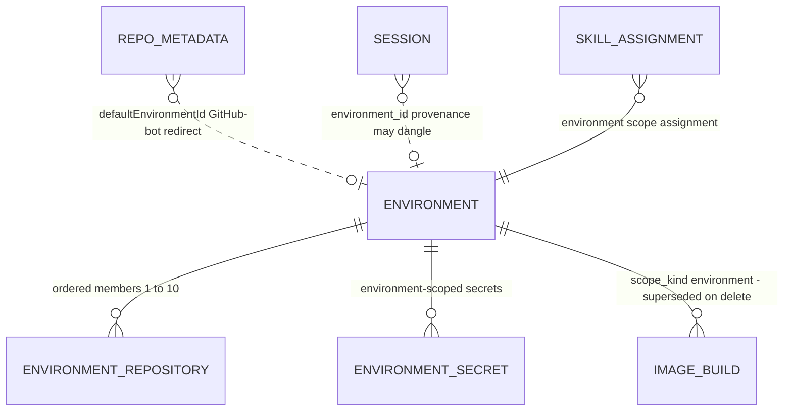
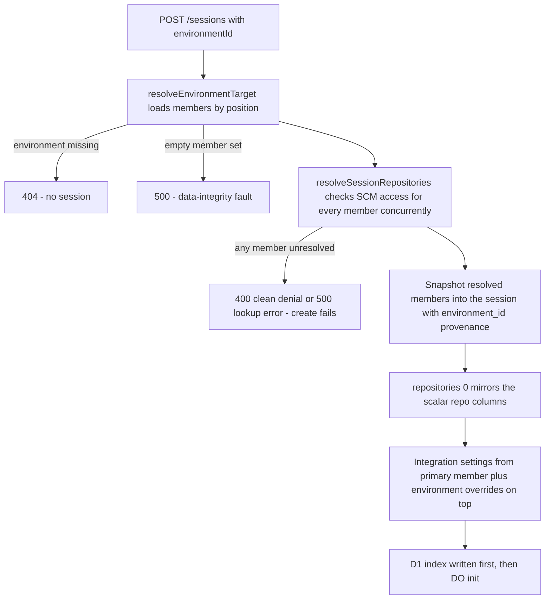
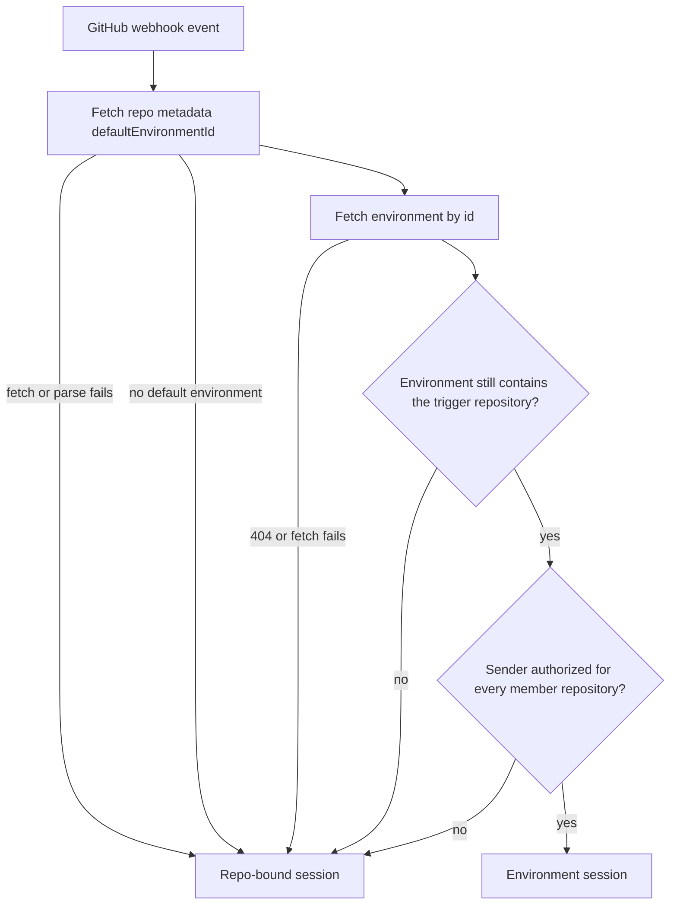
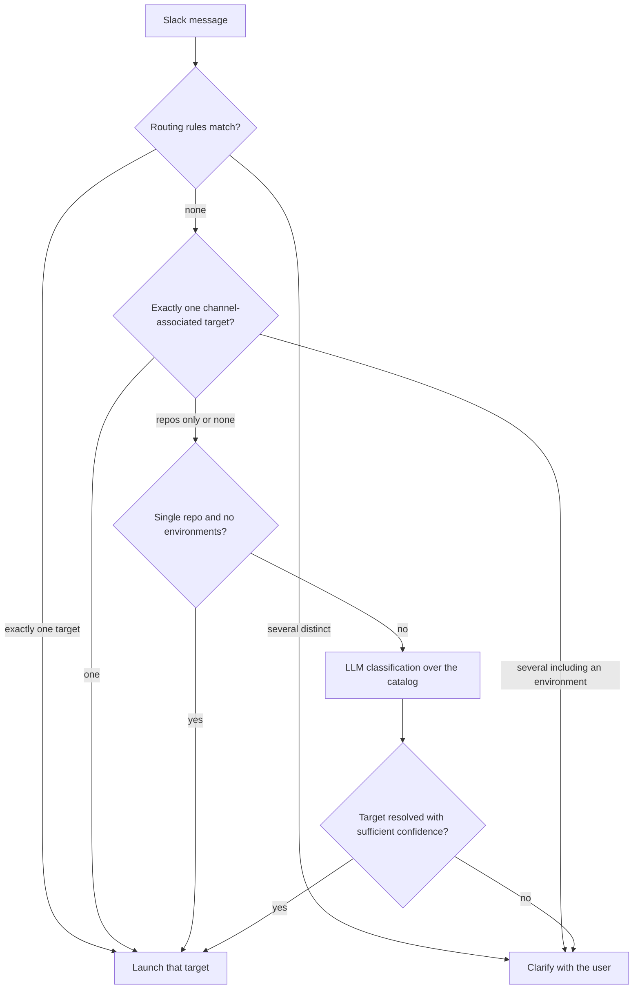

# Environments and Repositories

A **repository** is the classic session target: one clone, one branch. An **environment** is a
saved, named, *ordered* set of repositories (1–10 members, first = primary) with its own secrets
and optional prebuilt images. Sessions launched from an environment clone every member into one
workspace; sessions launched from a repository or an ad-hoc list are the same mechanism with fewer
members. Both kinds of target resolve through the same code paths — `resolveEnvironmentTarget` and
`resolveSessionRepositories` in `packages/control-plane/src/repos/resolve.ts` — and every client
(web picker, Slack bot, GitHub bot, Linear bot, automations) funnels into one control-plane
create-session API that accepts exactly one target mode.

This page covers the data model (`environments`, `environment_repositories`, `repo_metadata`),
secret scoping, prebuild toggles, the three client routing paths onto environments, and the
lifecycle invariants that make environment edits safe after sessions exist.

Related pages: [Security and Tokens](/openwiki/concepts/security-and-tokens.md),
[Sessions](/openwiki/concepts/sessions.md), [GitHub Bot](/openwiki/integrations/github-bot.md),
[Slack Bot](/openwiki/integrations/slack-bot.md), [Image Builds](/openwiki/workflows/image-builds.md).

## Environments as named, ordered repository sets

An environment bundles three things (design: a "named, prebuildable repository set"):

- **An ordered member list** (`environment_repositories`): 1–10 repositories, each with its own
  base branch. Position 0 is the **primary** — it is mirrored onto the session's scalar
  `repo_owner`/`repo_name` columns and drives sandbox/integration settings resolution.
- **Environment secrets** (`environment_secrets`): encrypted key/value pairs scoped to the
  environment, mirroring `repo_secrets` with the same encryption key and caps.
- **A prebuild flag** (`environments.prebuild_enabled`): opts the environment's whole workspace
  into image builds. Repositories have the analogous `repo_metadata.image_build_enabled` toggle
  for single-repo prebuilds.

The member list shares the session repository-list contract (`environmentRepositoriesInputSchema`
is literally `sessionRepositoriesInputSchema`): non-empty, capped at `MAX_TARGET_REPOSITORIES`
(10), deduplicated by `owner/name` **and** by `repoName` — checkout paths are
`/workspace/{repoName}`, so two members with the same repo name could never coexist — and
identifiers are normalized (trim + lowercase) at the schema boundary. `baseBranch` may be omitted
on input; environment creation resolves it from the SCM provider's default branch, and the stored
column is `NOT NULL`.

Stable identity is the generated `env_<id>`; `isEnvironmentId` (`/^env_[A-Za-z0-9_-]+$/`) is the
single gate every consumer uses to test "is this an environment id" (Slack routing-rule targets,
automation environment ids). Names are user-editable display labels, unique **case-insensitively**
(enforced by a unique index on `lower(name)` and a `getByName` pre-check that answers with a 409
before the insert would trip the index).

### Owner is not a single path segment

Repository identity is `(repo_owner, repo_name)`, but `repo_owner` is **not** one path segment:
GitLab projects live in nested groups (`group/subgroup/project`), so everything before the *last*
slash is the owner namespace. `parseRepositoryFullName` splits on the last slash, and
`decodeRepositoryPathSegments`/`encodeRepositoryPathSegments` treat the owner as a single (percent-
encoded) route segment — the GitHub bot encodes owners this way when fetching metadata, and the
Linear bot's `splitRepoFullName` does the same last-slash split for suggestions. Only `repo_name`
is guaranteed to be a single, slash-free segment, which is exactly why the checkout-path uniqueness
rule is keyed on `repoName` alone. A corollary: GitHub forbids `:` in owner segments, so a
repository full name can never collide with the bots' `env:<id>` value encoding for environments.

### Repository metadata (`repo_metadata`)

`repo_metadata` is the per-repository catalog keyed by lowercased `(repo_owner, repo_name)`. One
row carries:

- `description`, `aliases`, `channel_associations`, `keywords` — display and classification
  signals (aliases/keywords feed the Slack and Linear LLM classifiers; `channel_associations`
  feeds the Slack channel-association stage).
- `default_environment_id` — the GitHub-bot environment redirect (below).
- `image_build_enabled` — the per-repo prebuild toggle.

The store is document-shaped: `upsert` **replaces the whole metadata document** (`ON CONFLICT DO
UPDATE` sets every column from `excluded`), so a `PUT /repos/:owner/:name/metadata` that omits
`defaultEnvironmentId` clears it. Routes are `PUT`/`GET /repos/:owner/:name/metadata`; `GET /repos`
enriches the installation repository list with each repo's metadata in one batched read (chunked
under the D1 batch limit) before caching.

## Data model

Environments and their owned children live in shared D1. The cascade model is deliberate:

- `environment_repositories` and `environment_secrets` are owned children with
  `ON DELETE CASCADE` — deleting an environment reclaims them.
- `image_builds` rows for the scope are **superseded, not cascaded** (the table is FK-less on
  purpose) so the cleanup reaper can still find and delete provider-side artifacts after the
  entity is gone.
- `sessions.environment_id` is FK-less too: a session keeps a benignly dangling provenance id
  after its source environment is deleted.

The D1 entities around environments: members and secrets cascade with the environment; image
builds and session provenance are deliberately FK-less so deletes stay reaper-friendly and
sessions stay immutable.

`EnvironmentStore` composes its writes into single `db.batch` calls: `create` inserts the
environment row and all member rows atomically; `update` writes changed scalar fields and/or
replaces the member set wholesale (delete-all + re-insert; `undefined` leaves members untouched,
and a repositories-only edit still bumps `updated_at`); `delete` runs repository rows, secret rows,
superseding live (`building`|`ready`) image builds, and the environment row in one batch, returning
whether the row existed (idempotent on repeat). The `environment_repositories → environments` `ON
DELETE CASCADE` FK means a replace against a concurrently-deleted environment is rejected rather
than leaving orphan rows.

## Environment CRUD

Routes (`packages/control-plane/src/routes/environments.ts`) are internal-HMAC authenticated; the
web BFF proxies them with browser auth (`/api/environments`):

- `GET /environments` — list with repositories hydrated in one batched query; `GET
  /environments/:id`.
- `POST /environments` — validate, 409 on a case-insensitive name clash, resolve every requested
  repository through the SCM provider **concurrently** (`Promise.allSettled`; the first failure in
  input order wins), assign `position` from list order, fill `base_branch` from the request branch
  or the resolved default, then insert atomically. If `prebuildEnabled`, kick an immediate build
  via the save-hook.
- `PUT /environments/:id` — partial scalar update; `repositories` present replaces the member set
  (re-resolving each member); name changes re-check uniqueness against other environments; a saved
  prebuild-enabled environment triggers a rebuild.
- `DELETE /environments/:id` — the batched cascade above.

The repository resolution used here (`resolveRepoOrError`) maps "not installed for the SCM
provider" to 404 and transient provider failures to 500; the create/update handlers surface the
first failure in input order so errors are deterministic.

## Secret scoping

There are three secret scopes — global, repository, and environment — sharing one store plumbing
(`scoped-secrets.ts`), one encryption key (`REPO_SECRETS_ENCRYPTION_KEY`), and one set of caps
(50 keys per scope, 16 KB per value, 64 KB per scope, 128 KB combined per session). The session
fold (`buildSessionTargetSecretSources`) orders sources lowest-precedence-first:

- **Repository-launched / ad-hoc multi-repo session**: global + each member repository's secrets,
  merged in reverse position order so the **primary** repository wins key collisions.
- **Environment-launched session**: global + **that environment's secrets only**. Member
  repositories never contribute their repository secrets — environments are curated, so a key added
  to a repository must not silently land in every environment containing it. To reuse a
  repository secret, import it (below) or move it to global scope.
- Ad-hoc multi-repository sessions fold every selected repository (primary wins collisions), with
  per-scope byte attribution logged when the merged payload approaches the cap.

**Imports are copies, not references**: `POST /environments/:id/secrets/import` copies selected
keys from a member repository into the environment **ciphertext-verbatim** (both scopes share one
encryption key, so there is no decrypt/re-encrypt round trip and plaintext never transits the
control plane). The source repo must be a current member — non-members get 403. Rotating the
repository value later does **not** update the environment's copy; re-import or edit the
environment secret directly.

### Secret changes invalidate environment prebuilds

Environment image builds run `.openinspect/setup.sh` with the same secrets a session would get, so
anything the script writes to disk is baked into the image. Saving or deleting an environment
secret therefore **supersedes every live (building|ready) image** synchronously before the
response (fail-visible: a failed supersede returns 500 and asks the caller to retry the mutation)
and then, for prebuild-enabled environments, schedules a detached best-effort rebuild. Rotating
repository or global secrets does *not* invalidate images — stale on-disk material persists until
the next commit-triggered rebuild, which is why long-lived secrets should not be written to disk
in setup scripts.

## Prebuilds

One image-build subsystem serves two **scope kinds**: `repo` (`scope_id` = lowercase
`owner/name`) and `environment` (`scope_id` = the environment id). Enablement comes from the
owning entity — `environments.prebuild_enabled` or `repo_metadata.image_build_enabled` — and a
deleted scope's lingering row is never served. The rebuild scheduler scans enabled scopes every
30 minutes and rebuilds on fingerprint mismatch, new commits, or a runtime below the
compatibility floor; CRUD save-hooks trigger immediate builds when an entity is saved with
prebuilds on.

Scope resolution is the only place that switches on scope kind. For an environment scope it loads
the member rows in position order and computes a **fingerprint** over the ordered
`(owner, name, base_branch)` triples; for a repo scope it is a one-element set on the default
branch. Build-time secrets are exactly what the scope's sessions get (global + environment for
environment scopes, global + repo for repo scopes), loaded *after* the build row is registered so
a concurrent secret change always sees a row to supersede.

At spawn time an environment session matches its environment's latest ready image against **the
session's own repository snapshot** (fingerprint equality, plus runtime floor). Three rules matter:

- Environment sessions never fall back to a *repo* image — a repo image bakes that repository's
  setup and secrets, not the environment's.
- Ad-hoc multi-repo sessions never use prebuilt images at all (a repo image bakes a single
  checkout); they miss straight to the base image.
- A single-repo ad-hoc session matches its repo scope's image the same way, where the one-element
  fingerprint reproduces the old default-branch filter.

A provider restore failure is treated as "no image": the row is marked restore-failed (the cron
rebuilds it) and the session retries from base rather than failing the spawn.

## Creating sessions from environments (the resolution path)

The create-session schema enforces that the three target modes are **mutually exclusive** — at
most one of `environmentId`, a `repositories` list, or the scalar `repoOwner`/`repoName`/`branch`
form may be present (presence-based, so `[]` can never smuggle a second mode through; omitting all
three is the repo-less session). `hasExclusiveSessionTarget` is the single definition of that
rule.

The environment-to-session path: members are loaded positionally, resolved like any ad-hoc list,
then frozen onto the session; a stale member fails the create cleanly instead of booting a partial
workspace.

Key mechanics:

- `resolveEnvironmentTarget` loads the environment (404 when missing) and its members (500 when
  empty — the schema guarantees at least one member, so an empty set is a data-integrity fault),
  returning member inputs in position order.
- `resolveSessionRepositories` then checks SCM access for every member concurrently and is
  **all-or-nothing**: a session boots one sandbox for the whole set, so a single unresolvable
  member fails the create — 400 when the provider cleanly denied access, 500 when a lookup threw.
  Because providers may canonicalize identities (GitLab follows project redirects after renames),
  the input schema's uniqueness invariants are re-checked on the *resolved* identities: distinct
  full names and distinct repo names (checkout paths).
- The resolved member list is **snapshotted** onto the session (`session_repositories` /
  `SessionInitInput.repositories`) together with `environment_id` as provenance.
  `sessions.environment_id` is FK-less; editing or deleting the environment later never changes
  what a running session works on. The session page resolves the environment's name live and
  shows nothing (treated as "Environment deleted") once the source is gone.
- The **row-0-mirrors-scalars** invariant: `repositories[0]` must equal the scalar
  `repo_owner`/`repo_name`/`repo_id`/base-branch mirror, asserted at both the router and the DO
  init boundary. The primary drives session-scoped integration settings.
- Integration settings resolve from the **primary member** with the environment's overrides as the
  **top layer**: only `sandbox`, `code-server`, and `vnc` accept environment-level settings
  (`ENVIRONMENT_SETTINGS_INTEGRATION_IDS`); `enabledRepos` allowlists stay evaluated against the
  repo. Unset keys keep inheriting from the primary/global layers.
- **Child sessions inherit** the parent's `environmentId` and resolve their settings the same way,
  so a spawned subtask runs in the same effective environment.
- **Automations** may select environments (`environmentIds` — validated `env_` ids, unique,
  combined cap of 10 targets with repositories, every id must exist). Each firing fans out one run
  per target; an environment run resolves the environment's workspace at firing time through the
  same `resolveEnvironmentTarget` + `resolveSessionRepositories` path (a failure throws into the
  launch-failure path), while repository runs use the firing-time snapshot recorded on the run.

## How clients resolve targets

"Targets unify instead of migrate": every client surface that picks what to work on can name a
repository or an environment, and repository behavior never changed when environments joined.

### GitHub bot: the repository's default environment

`repo_metadata.default_environment_id` is an opt-in redirect: when set, sessions triggered from
that repository (PR review requested, PR opened, `@mention` in a PR comment, review comment) open
the environment's full workspace instead of a single-repo checkout. Resolution **fails open** to a
repo-bound session at every step — the session must always be able to check out the PR under
review:

Sender authorization extends caller gating to the whole set: an explicit `allowedTriggerUsers`
allowlist vouches for the sender without further checks (as it already does for the trigger repo);
otherwise the sender needs write permission on **every** environment repository other than the
trigger repo — an environment launch must not widen what the sender can reach beyond what GitHub
already grants them.

### Slack: routing rules, channel associations, and the LLM classifier

Slack messages target environments through three ordered mechanisms, all working over one
**target catalog** (repositories + environments, each cached in-memory → control plane → KV, with
environments failing open to an empty list so an outage degrades classification to repository-only
instead of breaking messages):

1. **Routing rules** (workspace-wide, Settings › Integrations › Slack): a case-insensitive keyword
   maps to a target — a repository `owner/name` or, with `targetType: "environment"`, the stable
   `env_…` id (never the rename-able display name; the control-plane validator enforces
   `isEnvironmentId` for environment targets). Rules whose target is no longer in the catalog are
   skipped at match time. Exactly one match → high-confidence launch; several distinct targets →
   deterministic clarification rather than a guess.
2. **Channel associations**: both `environments.channel_associations` and
   `repo_metadata.channel_associations` are JSON arrays of Slack channel ids; the classifier
   resolves a channel's associated targets (environments first, matching the web picker's
   grouping). One target → high-confidence launch; several targets *including an environment* →
   clarification (a multi-target set that includes an environment asks the user deterministically
   instead of letting the model drop the association); several repositories only → fall through.
3. **LLM classifier**: the prompt lists environments alongside repositories (id, name,
   description, member repos) and tells the model to prefer an environment when the message names
   it or the work spans several of its repositories. Returned ids resolve through a deterministic
   ladder: an `env_…` id can only be an environment; otherwise repositories match first on
   id/fullName, then environments by their unique case-insensitive name (so a model echoing the
   display name still resolves). Unmatched, low-confidence, or medium-confidence-with-alternatives
   results elicit clarification.

Stage order is load-bearing: routing rules and channel associations run **before** the
single-repository shortcut, which only fires when there is exactly one repository and no
environments — otherwise environment-targeted rules would be unreachable in one-repo workspaces.

Slack option/button values encode environments as `env:<id>` and repositories as their bare id;
the two namespaces cannot collide because repository full names can never contain `:`. Environment
launches send `environmentId` only (the environment defines its own branches; per-user branch
preferences do not apply), mirroring the web picker's `env:<id>` select-value convention.

### Linear: team and project mappings

The Linear bot resolves an issue's target through a five-stage ladder: project mapping → team
mapping → explicit `owner/repo` in the trigger or clarification-reply comment → Linear's
repo-suggestions API (confidence ≥ 0.7) → LLM classification. The **mappings** (KV-backed,
key-by-key validated) may name environments: an entry is either `{ environmentId }` (the stable
id, optionally with a label filter for team mappings) or `{ owner, name }`, and the environment
variant is listed first in the union so a stored ambiguous entry keeps resolving to its
environment. Environment entries are validated against the live environment list — a deleted or
unfetchable environment returns null so resolution falls through to the next stage, like a rule
targeting an inaccessible repository. The suggestion and classification stages remain
repository-only.

Integration settings for an environment target resolve from the **environment's primary
repository** (the first member's `owner/name`) — environment-level integration settings are a
control-plane concern, and every consumer of the primary-repo rule goes through one function so a
future change lands in exactly one place. The issue→session mapping stores `environmentId` for
environment sessions (repo fields absent) so follow-ups rehydrate the target from the live
environment list.

## Lifecycle and failure semantics

- **Snapshots, not references.** A session's member list and branches are resolved and frozen at
  creation. Later environment edits (members, order, branches) and deletion never change running
  sessions; only prebuild matching can be affected, and a fingerprint mismatch just means a
  base-image boot.
- **Fail open at the edges, fail closed at the core.** Client-side environment *fetches* degrade
  gracefully (empty catalog → repository-only classification; missing default environment →
  repo-bound session; deleted mapped environment → next resolution stage), but the
  *session-creation path* fails hard and cleanly (404/400/500) rather than booting a partial
  workspace.
- **Deletion is reaper-safe.** Deleting an environment reclaims members and secrets in one batch,
  supersedes live image builds so the reaper can reclaim provider artifacts, and leaves session
  provenance dangling harmlessly.
- **Secrets are scoped, encrypted, and audit-logged.** Environment secrets share the repo-secret
  crypto and caps; the merged fold reports per-source byte attribution and collisions, and the
  128 KB combined cap failure attributes bytes per contributing scope.
- **Skills ride the same scoping.** Skill assignments can be global, repository, or environment
  scoped; environment assignments reference the stable `env_` id and are validated to exist at
  write time, and an environment assignment matches only sessions launched through that exact
  environment (a member repository's assignment also matches environment sessions containing it).
