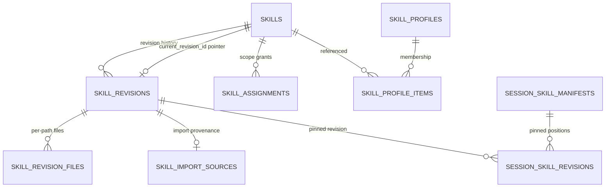
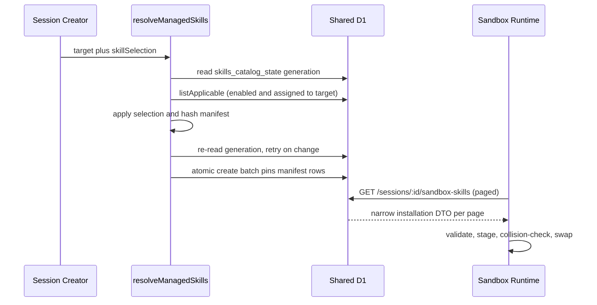

# Managed Skills

Managed skills are installation-wide, reusable agent instructions plus supporting files: deployment
runbooks, review checklists, project conventions. A shared catalog stores each skill as immutable,
content-addressed revisions; assignments decide which session targets a skill applies to; personal
profiles save a preferred subset; and the session-creation path resolves the mutable catalog into a
deterministic snapshot pinned to the session, which the sandbox materializes into OpenCode's global
config dir before the agent starts.

> Managed skills are trusted content, not a permission boundary. A skill can direct the agent to use
> tools, credentials, and network access already available in the session. Review instructions and
> scripts — especially anything under `scripts/` — before enabling or importing them.

The subsystem spans three runtimes that must stay aligned: the control plane
(`packages/control-plane/src/db/skills.ts`, `src/session/skill-resolution.ts`,
`src/skills/content-addressing.ts`, `src/skills/git-import.ts`), the shared contracts
(`packages/shared/src/types/skills.ts`), and the Python sandbox runtime
(`packages/sandbox-runtime/src/sandbox_runtime/managed_skills.py`). MCP servers
(`src/routes/mcp-servers.ts`, `src/db/mcp-servers.ts`) are the sibling mechanism for injecting extra
configuration into sessions.

## Content model

### Canonical names

A skill's canonical name is its stable identity: 1–64 characters matching
`^[a-z0-9]+(?:-[a-z0-9]+)*$` (lowercase letters, numbers, single hyphens — enforced by
`skillNameSchema`). Names are unique case-insensitively across the catalog (unique index on
`lower(name)`), immutable after creation, and remain taken even after the skill is soft-deleted.
`SkillStore.create` and `SkillStore.nameAvailable` additionally reject the sandbox-runtime-reserved
names `agent-browser`, `record-video`, `upload-screenshot`, `visual-verification`, and
`customize-opencode`.

### Generated SKILL.md and supporting files

A skill's `SKILL.md` is **generated, never user-supplied**. `renderSkillMarkdown` in
`packages/control-plane/src/skills/content-addressing.ts` builds the frontmatter from the structured
fields — `name`, `description`, optional `license` and `compatibility`, and a `metadata` map whose
keys are sorted by UTF-8 byte order for deterministic output — followed by the Markdown body.
`skillFileInputSchema` refuses a supporting file at path `SKILL.md` (or any descendant of it), and
the sandbox validator independently requires every installed skill to contain a `SKILL.md` whose
frontmatter `name` matches the managed name.

Supporting files are UTF-8 text only (binary content and archives are rejected):

- At most 99 per revision (`MAX_SKILL_FILES = 100` counts the generated `SKILL.md`).
- At most 256 KiB each (`MAX_SKILL_FILE_BYTES`); the whole rendered revision at most 1 MiB
  (`MAX_SKILL_REVISION_BYTES`).
- Paths are relative POSIX paths: no leading `/`, no backslashes, no control characters, no empty
  `.`/`..` segments, at most 10 segments and 240 UTF-8 bytes, unique, and never conflicting with a
  directory path or vice versa.
- Only files under `scripts/` may be marked executable.

These limits are enforced twice: at write time by `skillContentInputSchema` +
`buildValidatedSkillRevision`, and again inside the sandbox on the fetched bytes (below). A shared
golden fixture (`packages/shared/test-fixtures/managed-skills-golden.json`) pins the cross-runtime
limit values and the canonical hashes.

### Content-addressed revisions

The D1 schema (migration `terraform/d1/migrations/0061_managed_skills.sql`) separates the mutable
catalog from immutable content:

The D1 entities behind managed skills: one mutable `skills` row per catalog entry; immutable
`skill_revisions` (`UNIQUE (skill_id, revision_number)`) with files in `skill_revision_files`;
assignments, import provenance, profile membership, and per-session pinned manifest rows.

- `skills` holds the mutable state: `current_revision_id`, `enabled`, `deleted_at`, audit columns.
  Database triggers abort any insert or pointer update whose `current_revision_id` does not belong
  to the same skill, so the circular skill↔revision relationship can never dangle.
- `skill_revisions` stores content immutably: `revision_number`, `revision_sha256`, the structured
  fields, and `total_bytes`; `skill_revision_files` stores each file's path, content, per-file
  `content_sha256`, `size_bytes`, and `executable` flag, keyed `(revision_id, path)`.
- The revision digest is computed by `buildSkillRevision`: the file list (generated `SKILL.md`
  first-class among them) is sorted by UTF-8 path, and a SHA-256 is taken over the domain-separated
  encoding `OPEN_INSPECT_SKILL_REVISION_V1\0` + file count + per file (length-prefixed path,
  executable byte, u64 content length, content bytes). `total_bytes` is the sum of file sizes. The
  golden-fixture test pins the digest, so input ordering can never change a stored revision's
  identity.
- Domain strings, field ordering, and `SKILL_RESOLVER_VERSION` (currently `1`) together define every
  persisted identifier; incompatible serialization changes require new domains and a new resolver
  version.

Imported skills carry provenance in `skill_import_sources` (migration `0069`), one row per revision
produced by an import: provider, repository, requested vs resolved ref, pinned commit SHA,
subdirectory, and a `source_sha256` digest of the bytes read upstream. That source digest is
deliberately distinct from `revision_sha256`, which covers the regenerated `SKILL.md` and therefore
differs from what was read upstream.

### Assignments and applicability

`skill_assignments` grants applicability with exactly one of three CHECK-enforced scope shapes,
each backed by a partial unique index (one global assignment per skill; one per lowercased
`(repo_owner, repo_name)`; one per environment id):

| Assignment | Applies to |
| --- | --- |
| `global` | Every session, including repo-less sessions |
| `repository` | Sessions containing that repository (matched case-insensitively) |
| `environment` | Sessions launched from that environment id |

A skill applies to a target when **any** of its assignments matches. `SkillStore.listApplicable`
returns enabled, non-deleted skills with only the assignments that match the session's repository
set and environment id; an environment session can match a global assignment, the environment
assignment, and assignments for repositories contained in that environment simultaneously. Removing
all assignments leaves the skill in the catalog but applicable to nothing, and assignments never
override the enabled/disabled state.

### Importing from a repository

`fetchSkillImport` in `packages/control-plane/src/skills/git-import.ts` reads a portable skill
directory — a `SKILL.md` plus supporting files — from a connected source-control repository at a
resolved commit. It is strictly read-only: it produces a reviewable result plus provenance, and the
caller decides whether to store it.

- The requested ref (or the repository's default branch when empty) is resolved to a commit before
  anything is read, so a moving ref is always pinned to the commit that produced the bytes.
  Provenance records the provider's own view of the repository identity, not the request's spelling,
  so a re-import replays exactly what was stored.
- Frontmatter keys `name`, `description`, `license`, `compatibility`, and `metadata` map onto
  managed fields; the body becomes the instructions; every other frontmatter key (for example
  `allowed-tools` or `version`) is reported as an `unmapped-frontmatter` warning in the preview
  rather than dropped silently. The stored `SKILL.md` is regenerated from the mapped fields alone,
  so it is neither byte-identical to the upstream file nor a superset of it.
- The canonical name prefers an explicit override (warned as `name-overridden`), then the
  `SKILL.md` frontmatter `name`, then the last subdirectory segment or repository name (warned as
  `name-derived`).
- Mapping is all-or-nothing: a missing or unreachable repository/ref, absent `SKILL.md` (the error
  lists up to 20 subdirectories that do contain one), unreadable frontmatter, non-UTF-8 or oversized
  files, an executable outside `scripts/`, a symlink or submodule, a truncated tree, or a taken name
  fails the whole import with a named `SkillImportError` — nothing is stored partially. Provider
  failures surface as import failures (413→400, transient→503, otherwise 502) without leaking retry
  semantics. Blobs are read with bounded concurrency (6), capped at `MAX_SKILL_FILE_BYTES` each.
- The interactive flow is preview → confirm. `POST /skills/import/preview` returns the resolved
  commit, files, sizes, digest, generated `SKILL.md`, warnings, and `nameAvailable`. Confirming
  (`POST /skills/import`, or `POST /skills/:id/reimport` for an existing skill) re-reads the source
  and refuses to store anything the importer has not seen: the request must echo
  `expectedCommitSha`, `expectedSourceSha256`, and `expectedRevisionSha256`, and a mismatch answers
  409. Re-import resolves its source from the recorded provenance — the repository and subdirectory
  are fixed, only the ref may move — and byte-identical content is a no-op (`revisionCreated:
  false`, no new revision or provenance row, the recorded commit still points at the commit that
  produced the stored bytes). Hand edits after an import do not erase the recorded source; a later
  re-import replaces those edits with upstream content. Nothing syncs automatically: upstream
  changes reach the catalog only via re-import, and existing sessions are never affected.

### Personal profiles

`SkillProfileStore` (`packages/control-plane/src/db/skill-profiles.ts`) persists user-owned named
filters over the catalog in `skill_profiles` / `skill_profile_items` (names unique per user,
membership atomically replaced). Every lookup and mutation is owner-scoped, writes validate that
referenced skills exist and are not soft-deleted, and — importantly — **profiles never grant
applicability**: they are intersected with the enabled, assigned set at resolution time. Profile
writes also bump the shared catalog generation so a concurrent resolution retries rather than
snapshotting mid-change.

### Catalog API surface and concurrency

`packages/control-plane/src/routes/skills.ts` exposes the catalog over HTTP with an audit log
(`managed_skills.audit` events for created/edited/imported/reimported/enabled/deleted skills and
profile changes):

- Read routes (`GET /skills` with name-cursor pagination at `SKILL_LIST_PAGE_SIZE = 100`,
  `GET /skills/:id`, `POST /skills/preview` for the Validate button, `POST /skills/resolve-preview`)
  accept user or service principals.
- Administration routes (create, edit, enable/disable, delete, import/reimport, profiles) require a
  human user principal.
- Edits use optimistic concurrency: `PUT /skills/:id` requires an `If-Match` header carrying the
  current revision id. `replaceContentAndAssignments` builds a single batch in which **every**
  statement — revision insert, pointer update, assignment delete/re-insert, generation bump —
  re-checks `current_revision_id`, so a stale editor cannot partially mutate scope; identical
  content updates only metadata and creates no revision. `DELETE` is a soft delete that also
  disables the skill.

## Session resolution and pinning

At session creation the mutable catalog is resolved into an immutable, deterministic snapshot
(`resolveManagedSkills` in `packages/control-plane/src/session/skill-resolution.ts`):

Resolution reads the enabled, applicable set for the target, applies the selection, and verifies the
catalog generation did not change mid-read — up to `MAX_CATALOG_READ_ATTEMPTS = 3` attempts, then a
409 `SkillResolutionError` — so a manifest never mixes rows from different catalog states. The three
selection modes:

- **`all`** (the default): every enabled skill whose assignment matches the target.
- **`none`**: no managed skills.
- **`profile`**: intersect the applicable set with an owned profile's skill ids. Requires a
  canonical user (403 otherwise; 404 for a foreign or missing profile). Membership never bypasses
  disabled state or assignment scope, and unmet profile entries are reported as sorted
  `ignoredProfileSkillIds` (surfaced in the UI as "N ignored").

The result carries the selection (with profile id/name for provenance), `resolverVersion`, a
`resolvedAt` timestamp, the resolved skills (each with its pinned `revisionId`, `revisionNumber`,
`revisionSha256`, `totalBytes`, and the assignment sources that caused the match), and a
`manifestSha256` computed by `hashSessionSkillManifest` — a domain-separated
(`OPEN_INSPECT_SKILL_MANIFEST_V1`) hash of the selection byte, profile identity, resolver version,
and the skills sorted by name/skill id with their pinned revisions and sorted assignment
provenance. The manifest size bound is **aggregate content bytes, not skill count**
(`MAX_MANAGED_SKILL_MANIFEST_BYTES`, 5 MiB): assignments are additive and a global one applies
everywhere, so a count cap would fail every session create and automation run at once. The
documented product guidance caps a profile or session at 20 skills, but the enforced invariant at
resolution is the byte aggregate.

Pinpoints in the lifecycle:

- `POST /sessions` (`routes/session-create.ts`) resolves the manifest from `body.skillSelection`
  (default `{ mode: "all" }`) before initializing anything.
- Automation runs (`scheduler/scheduler.ts`) always use `{ mode: "all" }` — personal profiles are
  interactive-user choices, not automation policy.
- `SessionIndexStore.create` writes `session_skill_manifests` and `session_skill_revisions`
  (position-ordered, with full provenance) **inside the same atomic batch** as the session row, so a
  session can never exist without a consistent pinned manifest.
- Agent-spawned children (`routes/session-child-spawn.ts` →
  `managedSkillsSourceSessionId`) copy the parent's pinned manifest verbatim (`bindManifestCopy`)
  instead of re-resolving, so a child inherits exactly its parent's skill revisions.

Edits, assignment changes, disabling, and deletion affect future sessions only; restarting or
restoring a session keeps its pinned revisions.

### Sandbox delivery endpoints

Two read-only endpoints project the pinned snapshot (`routes/session-skills.ts`,
`db/session-skills.ts`):

- `GET /sessions/:id/skills` — the user-facing provenance view (selection mode, per-skill revision
  and digest, assignment sources), served only to users who can see the session, `no-store`.
- `GET /sessions/:id/sandbox-skills` — the narrow installation DTO for the sandbox
  (`schemaVersion`, `manifestSha256`, skills with files only; provenance stays on the user view).
  This route requires the **bound sandbox token** (sandbox-scoped auth). Requests may page by
  manifest position (`limit` ≤ `MAX_SANDBOX_SKILL_PAGE_SIZE` = 200, `cursor` = last position);
  omitting `limit` returns the whole installation, which keeps pre-paging runtimes working. The
  `ETag` is attached only to whole-installation responses because the manifest digest spans all
  pages. Sessions created before managed skills shipped get an empty legacy manifest so snapshot
  restores remain bootable.

## Sandbox materialization

`packages/sandbox-runtime/src/sandbox_runtime/managed_skills.py` turns the pinned manifest into
installed files before OpenCode starts.

### Fetch and retry limits

`ManagedSkillsClient` GETs `{control_plane_url}/sessions/{session_id}/sandbox-skills` with the
sandbox bearer token (session id percent-encoded), requesting `MANAGED_SKILLS_PAGE_SIZE = 50` skills
per page. Each response streams under a 32 MiB cap (`MAX_MANAGED_SKILL_RESPONSE_BYTES`) with a 15 s
timeout, and retryable failures — HTTP 408, 429, or 5xx, and transport/OSError errors — are retried
up to 3 attempts with 0.25 s exponential backoff. Per-file JSON framing does not count against the
manifest's content aggregate, so a wide manifest can exceed a single response's ceiling while
passing resolution; the fixed page window keeps every response far below the cap regardless of
width.

### Validation of untrusted bytes

`validate_installation_page` treats each response as untrusted and re-enforces the materializer
limits locally, before anything reaches an OpenCode discovery path: schema version 1; a SHA-256-hex
manifest id with every page pinned to the first page's; skill names ≤ 64 chars matching the
canonical pattern and globally unique across pages; ≤ 100 files per skill; file content ≤ 256 KiB
with `sizeBytes` matching and SHA-256 verified; per-skill revisions ≤ 1 MiB; whole-install content
≤ 5 MiB; safe paths (the same rules as the control plane, re-checked); `executable` only under
`scripts/`; a required `SKILL.md` whose frontmatter `name` matches the managed name. A non-final
page must deliver at least one skill — combined with the 5 MiB aggregate check and the
duplicate-name check, cursor traversal always terminates, which is why the fetch loop deliberately
has no page-count cap. Whole-installation reads reject paged payloads.

### Crash-safe installation and collisions

`ManagedSkillsMaterializer.materialize` installs into the OpenCode global config dir's `skills/`
directory (resolved by `resolve_opencode_global_config_dir()`: `OPENCODE_CONFIG_DIR`, else
`XDG_CONFIG_HOME/opencode`, else `~/.config/opencode`) through a recoverable swap:

1. Recover any interrupted prior swap, then stage into `.managed-skills-staging` — one page at a
   time, so peak memory is a page rather than the installation. Files are created exclusively
   (`O_EXCL | O_NOFOLLOW`), written with mode `0500` (executable) or `0400`, fsynced, and their
   SHA-256 re-verified from disk.
2. Fetch/validate every page into staging; drop colliding names (below).
3. Write the swap journal `.managed-skills-swap` **before** moving the live tree, rename the current
   destination to `.managed-skills-backup`, rename staging into place, then clean up.
   `_repair_interrupted_swap` restores the last complete tree (or finishes cleanup) if a previous
   run died mid-swap.

Any failure during a paged fetch aborts staging and leaves the previous installation untouched — a
partial fetch is never swapped in. Error codes are stable: `fetch_failed`,
`installation_too_large`, `installation_invalid`, `path_invalid`, `hash_mismatch`, `install_failed`.

Managed names that collide with an already-discovered skill are dropped from the staged tree with a
`managed_skills.collisions_dropped` warning rather than failing the boot: collision roots are the
bundled skills (`/app/sandbox_runtime/skills`) plus `.opencode/skills`, `.claude/skills`, and
`.agents/skills` under the workspace, each member repository, and the home directory. Discovered
skills keep precedence, other managed skills still install, and the session starts.

### Boot ordering and failure semantics

The entrypoint builds the materializer only when `CONTROL_PLANE_URL` and a session id are
configured. The supervisor calls `materialize` after repository boot and **before** OpenCode (and
code-server/web terminal) start; the installed tree is sandbox-boot work, so OpenCode process
restarts reuse it without depending on control-plane availability. If selected content cannot be
fetched, validated, or installed, the error propagates as a fatal boot error — the session fails to
start and the reason is reported to the control plane. There is no separate installation step and
no runtime refresh: new catalog content reaches a sandbox only by starting a new session.

## MCP servers: the sibling session extension

MCP servers are the other configuration injected into sessions, but through a different lifecycle
than skills: they are resolved from the live catalog **at spawn time** and delivered via the
sandbox's `SESSION_CONFIG`, not pinned in the session manifest.

- `McpServerStore` (`packages/control-plane/src/db/mcp-servers.ts`) and
  `routes/mcp-servers.ts` (CRUD at `/mcp-servers`) manage servers of type `local` (a command array)
  or `remote` (a URL plus headers). Credential maps (`env` for local, `headers` for remote) are
  encrypted at rest with the repo-secrets key; an empty map is stored as plaintext `"{}"` so
  metadata can report "no credentials", and decryption falls back to plaintext for pre-encryption
  rows. Updates use a `revision` counter for optimistic concurrency (`McpServerConflictError` →
  409); names are unique; `repoScopes` optionally narrows a server to specific repositories.
- At sandbox spawn (and snapshot restore) the lifecycle manager calls
  `McpServerStore.getDecryptedForSession`: enabled servers where unscoped servers always apply,
  scoped servers apply when **any** member repository matches a scope, and an empty repository list
  yields unscoped servers only. Failures to load degrade to "no MCP servers" with a warning rather
  than failing the spawn.
- The configs travel in `SESSION_CONFIG.mcp_servers` (`packages/control-plane/src/sandbox/sandbox-env.ts`)
  into `OpenCodeServer`, which pre-installs npm packages referenced by `npx`-based local servers
  (`npm install -g`, deduplicated, best-effort with a 180 s timeout) and writes them into OpenCode's
  `mcp` config: local servers as `{type: "local", command, environment}`, remote servers as
  `{type: "remote", url, headers}`. Like skills, MCP servers are trusted configuration that extends
  what the agent can reach — they are not a permission boundary either (the sandbox's OpenCode
  process runs with permissions allowed).

## Limits

Code-enforced limits (shared constants in `packages/shared/src/types/skills.ts`, mirrored in
`managed_skills.py` and pinned by the golden fixture):

| Constraint | Limit |
| --- | ---: |
| Canonical name | 64 characters, `^[a-z0-9]+(?:-[a-z0-9]+)*$` |
| Description | 1,024 characters |
| License / compatibility | 200 / 500 characters |
| Metadata key / value | 100 / 500 characters |
| Files per skill revision | 100 total (99 supporting + generated `SKILL.md`) |
| Individual file | 256 KiB |
| Complete skill revision | 1 MiB |
| Skill file path | ≤ 10 segments, ≤ 240 UTF-8 bytes |
| Session manifest content | 5 MiB aggregate |
| Sandbox page size | 50 requested, ≤ 200 accepted |
| Sandbox response | 32 MiB |
| Catalog list page | 100 |

Product documentation additionally caps a profile or session at 20 skills; the code-enforced ceiling
at resolution is the 5 MiB content aggregate, deliberately not a count cap.

## Focused tests

- `packages/sandbox-runtime/tests/test_managed_skills.py` pins traversal/hash/frontmatter/path
  rejection, paged installs (cursor chaining, empty-page termination, cross-page duplicate names,
  mismatched manifest digests), previous-install retention on page failure, collision dropping
  against discovered skills, interrupted-swap repair, and destination derivation from the global
  config dir.
- `packages/control-plane/src/skills/content-addressing.test.ts` pins the golden `SKILL.md`,
  revision and manifest digests, ordering independence, and the cross-runtime limit values against
  the shared fixture.
- `packages/shared/src/types/skills.test.ts` pins contract behavior: name/path/executable rules,
  import-provenance invariants, confirmation requirements, and pagination/selection schemas.
- `packages/control-plane/src/router.policy.test.ts` pins the auth policy: the sandbox-skills route
  requires the bound sandbox, skill administration is human-user-only, and skill reads are
  user-or-service.
