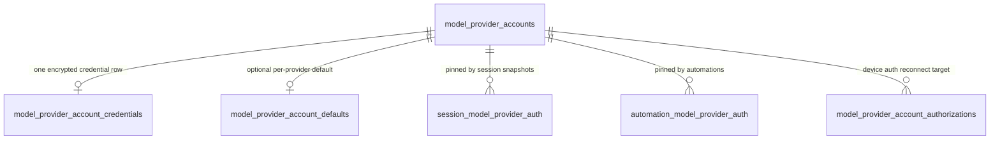
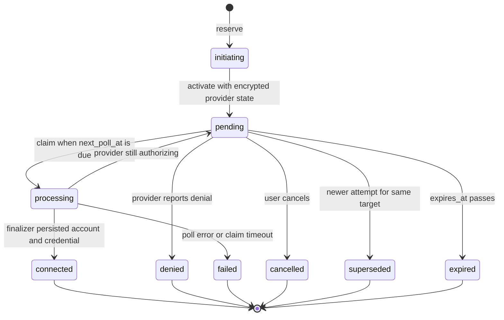
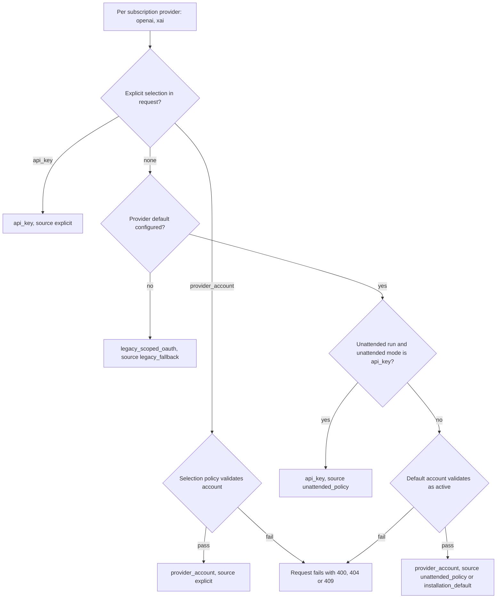
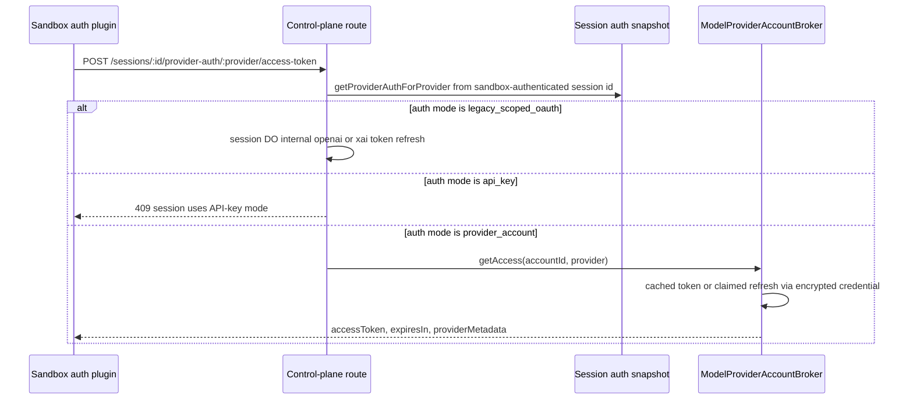

# Models and Provider Accounts

Open-Inspect separates **which models exist** from **how subscription providers get paid**. The
model side is a static, shared catalog (`packages/shared/src/models.ts`) that every package imports,
with per-session model and reasoning-effort choices persisted on the session row. The credential
side is the provider-account subsystem: installation-wide OpenAI (ChatGPT) and xAI (SuperGrok)
accounts whose rotating refresh tokens are encrypted in D1 and never leave the control plane, with
device authorization to connect them, a claimed-exchange broker to refresh them, an immutable
per-session auth snapshot to route them, and sandbox plugins that exchange a managed marker for
short-lived access tokens.

Related pages: [Security and Tokens](/openwiki/concepts/security-and-tokens.md),
[Configuration](/openwiki/operations/configuration.md),
[Automations](/openwiki/workflows/automations.md),
[Session Creation](/openwiki/workflows/session-creation.md).

## The model catalog

`MODEL_CATALOG` in `packages/shared/src/models.ts` is the authoritative model metadata, grouped by
provider in UI display order: Anthropic and OpenAI are `enabledByDefault: true`; OpenCode Zen,
xAI / SuperGrok, Z.AI Coding Plan, and DeepSeek are opt-in groups that only appear when enabled
under Settings > Models. Model IDs are `provider/model` strings typed as `ValidModel`; the module
throws at load time unless exactly one catalog entry carries `default: true`, and that entry
(currently `anthropic/claude-sonnet-4-6`) defines `DEFAULT_MODEL`. Everything else derives from the
catalog: `VALID_MODELS` (flat list), `MODEL_OPTIONS` (provider-grouped UI dropdowns), and
`DEFAULT_ENABLED_MODELS` (models of `enabledByDefault` groups only).

Two helpers keep legacy data flowing through the closed catalog:

- `normalizeModelId` prefixes bare `claude-*` and `gpt-*` IDs with `anthropic/` and `openai/` for
  backward compatibility with existing rows in D1, SQLite, and Slack KV.
- `resolveEnabledModel` implements the fallback policy when stored model preferences are involved:
  use the desired model if valid, else the fallback model, else the first enabled model, else the
  fallback. Enabled models come from `getEffectiveEnabledModels`
  (`packages/control-plane/src/db/model-preferences.ts`), which falls back to
  `DEFAULT_ENABLED_MODELS` when no usable preferences row exists.

### Reasoning effort

`ReasoningEffort` is the closed union `"none" | "low" | "medium" | "high" | "xhigh" | "max"`. Each
catalog entry may carry a `reasoning` block (`efforts` plus `default`); models without one do not
support reasoning controls. `MODEL_REASONING_CONFIG` flattens those blocks, and the helpers
`supportsReasoning`, `getReasoningConfig`, `getDefaultReasoningEffort`, and `isValidReasoningEffort`
answer per-model questions. OpenAI GPT-5.6 variants default to `medium`; Codex variants and most
Anthropic models default to `high` or `max`; OpenAI chat models expose `none`.

### Where selection is persisted

A session's model and reasoning effort live on the D1 `sessions` row (`model`,
`reasoning_effort` columns). Validation happens once at the boundaries:

- Session create and child spawn call `getValidModelOrDefault` and `isValidReasoningEffort`, the
  latter rejecting an invalid effort with the model's allowed list in the error message.
- The session DO's message queue resolves the effective effort per prompt as
  `message.reasoning_effort ?? session.reasoning_effort ?? getDefaultReasoningEffort(model)` via
  `validateReasoningEffort` (`packages/control-plane/src/session/reasoning-effort.ts`), which
  downgrades an invalid effort to `null` with a warning instead of failing the prompt.

## Provider accounts

### Data model

Account identity/display/status and secret material live in **separate tables** — a credential row
is joined 1:1 to its account and holds only ciphertext plus versioning metadata:

*Provider-account tables in D1 (migrations `0064_provider_accounts.sql` and
`0065_provider_account_authorizations.sql`).*

- `model_provider_accounts` carries `provider` (`openai` or `xai` only), `display_name`,
  optional `external_account_id`, `status` (`active` | `disabled` | `reconnect_required`),
  audit columns, `last_verified_at`/`last_used_at`, `archived_at`, and `lifecycle_version`
  (added by migration 0065) for optimistic target checks. A **unique partial index** on
  `(provider, external_account_id)` among non-archived rows makes one live account per external
  identity a database invariant. Account IDs are 32-hex (`MODEL_PROVIDER_ACCOUNT_ID_PATTERN`).
- `model_provider_account_credentials` holds `encrypted_payload`, `credential_schema_version`,
  `credential_version`, and the exchange lease columns `exchange_state` (`idle` | `in_flight`),
  `exchange_generation`, `exchange_owner`, `exchange_started_at`; CHECK constraints force the
  owner/started-at columns to be set exactly when the lease is `in_flight`.
- `model_provider_account_defaults` has one row per provider with the default account and
  `unattended_mode` (`provider_account` | `api_key`).
- `session_model_provider_auth` (per session+provider) and `automation_model_provider_auth`
  (per automation+provider) are the immutable routing snapshots described below.

### Credential encryption

Credentials and device-authorization provider state are encrypted with **AES-256-GCM** under
`PROVIDER_ACCOUNTS_ENCRYPTION_KEY` (a base64 32-byte key), producing `v1.<iv>.<ciphertext>`
strings. The AAD binds the ciphertext to its context — `[v1, providerAccountId, provider,
credentialSchemaVersion]` for credentials and `[v1, "device-authorization", transactionId,
provider, stateSchemaVersion]` for authorization state — so a payload cannot be replayed against
another account, provider, or schema version (`packages/control-plane/src/auth/provider-account-crypto.ts`).
The key stays control-plane-only: it is never returned to the browser and never injected into a
sandbox.

### The atomic writer

`D1ModelProviderAccountAtomicWriter`
(`packages/control-plane/src/db/model-provider-account-atomic-writer.ts`) is the only component
that mutates accounts, credentials, defaults, and authorizations **together**, always as one
`db.batch` of conditional SQL statements:

- `createAccountWithCredential` inserts the account and its credential and, in the same batch,
  `bindSetForFirstActiveAccount` — the **first** active account for a provider automatically
  becomes its default (with `unattended_mode: 'provider_account'`) only when no default and no
  other active account exists.
- `reconnectCredentialAndAccount` and `completeVerificationCredentialAndAccount` replace the
  credential under an `expectedCredentialVersion` CAS and bump the account's
  `lifecycle_version`, so a stale writer can never clobber a newer credential.
- Device-authorization finalization statements are guarded by the processing claim
  (`state = 'processing' AND processing_owner = ? AND expires_at > ?`) and return typed outcomes
  (`created` / `identity_conflict` / `claim_lost`, `connected` / `target_changed` / `claim_lost`)
  instead of throwing on races.
- `fenceExchangeAndRequireReconnect` atomically flips an active account to
  `reconnect_required` **and** releases its `in_flight` exchange lease (generation++), and is the
  terminal fence for refresh failures and stale leases.

### Account lifecycle and service operations

`providerAccountIneligibility`
(`packages/control-plane/src/model-provider-accounts/account-lifecycle-policy.ts`) is the canonical
gate: `archived` blocks everything; the `reconnect` operation accepts any non-archived account
(because it installs a fresh credential and returns the account to active); every other operation
(`active_use`) requires `status === "active"`.

`ModelProviderAccountService`
(`packages/control-plane/src/model-provider-accounts/service.ts`) implements the management
operations behind the `/model-provider-accounts` routes:

- **create/connect**: runs the adapter's `connect` (which refreshes the submitted refresh token and
  verifies the external identity), dedupes on `(provider, externalAccountId)` — an existing
  non-archived account is reconnected rather than duplicated — and converges on the winner if a
  concurrent create hits the unique index. A credential that cannot be saved safely surfaces as a
  409 "may have been consumed" so the caller obtains a fresh credential.
- **verify**: runs a `ClaimedProviderCredentialExchange` (409 if a verification is already in
  flight), validates the refreshed identity, and commits the refreshed credential plus
  `status: "active"` and `last_verified_at` atomically.
- **reconnect**: requires the same provider, validates the submitted identity against the stored
  `external_account_id`, and reactivates via `persistConnectedCredential`.
- **rename / setStatus / archive**: `setStatus` only allows `disabled → active` directly; any other
  reactivation requires reconnection (409). A D1 trigger
  (`model_provider_accounts_protect_default`) aborts disabling or archiving an account that is a
  provider default, and the service maps that to a 409.

### Device authorization

Device authorization is the first-party connect path for both providers (legacy refresh-token
connect remains for xAI accounts with no bound identity — see below). The
`ProviderDeviceAuthorizationService`
(`packages/control-plane/src/model-provider-accounts/device-authorization-service.ts`) drives a
durable transaction in `model_provider_account_authorizations`:

*Device-authorization transaction lifecycle (`PROVIDER_AUTHORIZATION_LIVE_STATES` = initiating,
pending, processing; terminal states are denied, expired, failed, cancelled, superseded).*

Key mechanics:

- **start** validates the capability via `requireDeviceAuthorization`, snapshots the target account
  (status + `lifecycle_version`) for reconnects, enforces per-user rate limits (5 attempts per
  minute → 429), allows at most 5 live transactions per user excluding the same target, and
  **supersedes** any live transaction for the same target. The transaction lives at most 10 minutes,
  capped by the provider's own expiry; the poll interval is clamped to 1–60 seconds. The provider
  state (device code / user code) is encrypted before activation.
- **poll** resolves the durable row first (expiring it if past `expires_at`), serves `connected` and
  terminal states idempotently, fails a `processing` claim that exceeded its 30-second timeout, and
  otherwise claims the row (pending → processing), decrypts the provider state, and polls the
  provider. Pending re-arms `next_poll_at` via `returnPending`; terminal outcomes and errors finish
  the transaction; a connection is handed to the finalizer. Responses carry `retryable: false` only
  for `denied`.
- **finalize** (`ProviderDeviceAuthorizationFinalizer`) persists the outcome atomically: for
  `create`, an existing active account with the same identity is reconnected, a disabled one is
  rejected, and an `identity_conflict` from the writer converges on the winning account; for
  `reconnect`, the target's provider, identity, status, and `lifecycle_version` must match the
  snapshot taken at start, otherwise the outcome is `target_changed` (or `claim_lost` when the
  processing claim was lost).

OpenAI's capability exchanges the device code for tokens and requires a verifiable ChatGPT account
id from the token response; xAI's fetches the account id with the new access token, so xAI accounts
created through device authorization are identity-bound from day one.

## Token brokering: the claimed credential exchange

Every refresh of a stored credential goes through `ClaimedProviderCredentialExchange`
(`packages/control-plane/src/auth/claimed-provider-credential-exchange.ts`), which turns
"call the provider OAuth endpoint" into a durable, single-writer operation:

1. `tryBeginExchange` acquires the lease (`idle → in_flight`, `exchange_generation++`, owner
   recorded) only if the credential version, account status, and idle state all match — this is the
   cross-isolate single-flight primitive in D1.
2. The adapter parses (`parse` phase) and refreshes (`refresh` phase) the credential. Refresh
   failures are classified by the adapter: `retry_safe` failures release the lease via
   `clearSafeFailure` and surface as retryable; everything else runs the **terminal fence**
   (`fenceExchangeAndRequireReconnect`), which marks the account `reconnect_required`.
3. Completion validates the external identity and writes the rotated credential with
   version/generation/owner guards; a failed completion also fails terminally.
4. When the terminal fence cannot be observed (`terminalFence: "lost"`), the exchange never guesses:
   callers reconcile by re-reading the authoritative account and credential state — reconnect if the
   account was fenced, use the concurrent update if the credential version moved, otherwise report
   `exchange_busy`.

On top of this, `ModelProviderAccountBroker`
(`packages/control-plane/src/auth/model-provider-account-broker.ts`) answers
`getAccess(accountId, expectedProvider)`:

- Verifies the account is usable (`provider_mismatch`, `account_archived`, `account_inactive`,
  `credential_not_found` error codes) and the adapter exists.
- Returns the adapter's **cached access token** while it outlives `refreshBufferMs`
  (5 minutes default), attributing usage via `touchLastUsed` — throttled to at most one write per
  15 minutes and deliberately best-effort so usage attribution can never invalidate persisted auth
  state.
- Deduplicates concurrent refreshes in-process under the key `${accountId}:${credentialVersion}`,
  polls `in_flight` leases until the 15-second exchange timeout expires them (then fences), rereads
  state after concurrent updates, and throws typed `ModelProviderAccountBrokerError`s
  (`credential_invalid`, `exchange_busy`, `reconnect_required`, `upstream_retry_safe`, ...).

## Session auth selection

At session creation, **every** subscription provider resolves exactly one auth mode. The resolver
(`resolveSessionProviderAuth` in
`packages/control-plane/src/session/provider-account-resolution.ts`) applies, per provider:

*Resolution order per provider. The wire schema (`sessionModelProviderAuthSchema`) allows exactly
`provider_account`, `api_key`, or `legacy_scoped_oauth` per provider, and
`SUBSCRIPTION_PROVIDER_IDS` fixes the provider set to openai and xai.*

The `ProviderAccountSelectionPolicy`
(`packages/control-plane/src/model-provider-accounts/selection-policy.ts`) backs both explicit
selections and defaults: it validates the account-ID pattern (400), adapter availability (409),
existence (404), provider match (400), and active-use eligibility (409). The same policy validates
the default account when `PUT /model-provider-account-defaults/:provider` is called and when
automation editors save pins.

### Defaults, unattended mode, and legacy coexistence

- A provider **default** is optional; the first connected account becomes it automatically. Setting
  a default affects **only future sessions** — existing sessions keep their persisted snapshot.
- **Unattended mode** (`unattendedMode: provider_account | api_key`) decides what Slack, GitHub,
  Linear, and automation runs use when they follow the default: use the subscription account, or
  stay on the API-key path. Session create marks a run unattended when its `spawnSource` is
  anything other than `"user"`; the scheduler always resolves automation runs with
  `unattended: true`.
- **Legacy scoped OAuth coexists.** A provider with no explicit selection and no default resolves to
  `legacy_scoped_oauth`, keeping existing integrations (OPENAI_OAUTH_*/XAI_OAUTH_* secret keys)
  working. `GET /model-provider-accounts/legacy-credentials` inventories the remaining legacy OAuth
  key locations across global, repository, and environment scopes so operators can clean them up
  once no legacy-bound sessions remain. Operators must not copy one rotating refresh token into both
  credential systems.

### Automation pins

Automations may pin the same choices as interactive sessions. Pins are stored in
`automation_model_provider_auth` (validated at save time by
`parseAndValidateAutomationProviderSelections`). At run time the scheduler reads the pins, converts
them to selections, and re-resolves through `resolveSessionProviderAuth` with `unattended: true`,
tagging explicitly pinned providers with `selectionSource: "automation_pin"`; unpinned providers
follow the current defaults each run.

## The D1 snapshot is the sole authority

Session creation persists the resolved auth as an **immutable snapshot** in
`session_model_provider_auth`:

- `SessionIndexStore.create` validates every row (`assertProviderAuthSelection`), rejects duplicate
  providers, refuses incomplete snapshots, and writes the session, repository, manifest, and
  provider-auth rows in **one D1 batch**. D1 is written **before** the session Durable Object is
  initialized, so an auth-snapshot failure is caught before any sandbox spawns; a DO-init failure
  marks the session `failed`.
- The snapshot is immutable: changing defaults or reconnecting accounts later never rewrites it. An
  integration test pins this — after a session is created with account A as the OpenAI default,
  changing the default to account B leaves the session's snapshot pointing at A.
- Consumers re-read D1 as the trusted source: the access-token endpoint uses
  `getProviderAuthForProvider`, and anything needing the whole picture uses
  `getCompleteProviderAuth`, which **throws** (`Session provider auth snapshot is incomplete`) when
  a session lacks a row for every subscription provider.
- **Child sessions copy the parent's rows** rather than re-resolving: the spawn route loads
  `getCompleteProviderAuth(parentId)` (failing closed with 503 if it cannot), stamps
  `inheritedFromSessionId: parentId` on each row, and inserts them with the child.

## The sandbox path: marker in, token out

In **account mode the sandbox receives no credential material** — only a managed marker.
`prepareManagedProviderEnv` (`packages/control-plane/src/sandbox/managed-provider-env.ts`) strips
the control-plane OAuth keys from user secrets, deletes the provider's API key (`OPENAI_API_KEY` /
`XAI_API_KEY`) so the runtime cannot bypass the subscription, and sets
`OPENAI_OAUTH_MANAGED=1` / `XAI_OAUTH_MANAGED=1` when the session's auth mode is `provider_account`
(or legacy mode whose refresh token is present). The session DO's environment resolver loads the
complete D1 snapshot first and **fails closed** if it is unavailable or incomplete, and
`getProviderAuthenticationError` answers whether a chosen model's provider actually has usable
authentication in the assembled environment.

*The sandbox-authenticated access-token endpoint (`POST /sessions/:id/provider-auth/:provider/access-token`,
`SCM_AGNOSTIC_SANDBOX_ROUTE`, `Cache-Control: no-store`) never trusts the sandbox for routing — the
session id is authenticated and the auth mode is read from D1. Error mapping: `account_not_found` →
404, `upstream_retry_safe` → 502, other broker errors → 409.*

### In-sandbox runtime plugins

Inside the sandbox, `opencode_server.py` reacts to the markers: it writes OpenCode `auth.json`
sentinels (`type: "oauth"`, `refresh: "managed-by-control-plane"`, empty access) for each managed
provider with 0600 permissions via atomic rename, and deploys
`.opencode/plugins/provider-token-broker.js` plus the provider plugin (`codex-auth-plugin.js` for
OpenAI, `xai-auth-plugin.js` for xAI), git-excluding them from commits.

- `provider-token-broker.js` is a provider-neutral, **single-flight** client: it caches the access
  token until fewer than 5 minutes remain, otherwise POSTs
  `${CONTROL_PLANE_URL}/sessions/${sessionId}/provider-auth/${provider}/access-token` with
  `Authorization: Bearer ${SANDBOX_AUTH_TOKEN}` and a 30-second timeout, validates the response
  shape (non-empty `accessToken`, finite positive `expiresIn`), and requires the environment
  (`CONTROL_PLANE_URL`, `SANDBOX_AUTH_TOKEN`, session id from `SESSION_CONFIG`) before operating.
  Each auth plugin owns one broker instance so cached credentials never cross providers.
- `codex-auth-plugin.js` replaces OpenCode's built-in Codex plugin (OpenCode deduplicates plugins by
  provider ID, last wins), filters the model list to Codex-allowed models, injects the GPT 5.3 Codex
  entries if missing, zeroes token costs (subscription-based), strips the dummy API-key
  authorization header, sets the real `Authorization: Bearer` plus `ChatGPT-Account-Id` from
  `providerMetadata`, and rewrites `/v1/responses` and `/chat/completions` requests to the Codex
  backend endpoint.
- `xai-auth-plugin.js` adds the `grok-build-0.1` model entry when the catalog lacks it and sets the
  broker's access token on every request.

### Legacy scoped-OAuth refresh services

For sessions pinned to `legacy_scoped_oauth`, the same endpoint proxies the session DO's internal
`/internal/openai-token-refresh` and `/internal/xai-token-refresh` paths. Those are served by the
per-request refresh services:

- `OpenAITokenRefreshService` resolves the session's secret scope (environment → repository via
  `resolveSessionOAuthSecretScope`, plus a global fallback) and delegates to `OpenAITokenBroker`,
  which single-flights refreshes per Worker isolate, serves cached access within a 5-minute buffer,
  rotates the refresh token, and persists rotated tokens back into the original secret scope via
  `ScopedOAuthSecretsStore`; a 401 triggers a concurrent-rotation re-read before failing.
- `XaiTokenRefreshService` reads `XAI_OAUTH_*` keys (session scope, then global), serves cached
  access within a 5-minute buffer, refreshes via `refreshXaiToken`, persists the rotation (logging
  but not failing if persistence loses a race), and treats `invalid_grant`/`unauthorized` as a
  possible concurrent rotation — wait 500 ms, re-read, retry once — before returning 401.

## Operations

- **Encryption key**: Terraform generates and persists `PROVIDER_ACCOUNTS_ENCRYPTION_KEY` by
  default; existing installations may override it. Never change the key after storing credentials
  unless every credential has been re-encrypted and verified through the documented
  old-key-to-new-key migration before the Worker binding updates, and back up the Terraform state
  that holds generated keys.
- **Cache policy**: management routes use `Cache-Control: private, no-store`; the access-token
  endpoint uses `no-store`. Both are asserted in `router.policy.test.ts`, along with the fact that
  the access-token route requires the bound sandbox token.
- **Reconnect guidance**: a revoked or rotated grant surfaces as `reconnect_required`; reconnecting
  preserves the display name and must authenticate the same external identity — a changed identity
  means connecting a new account instead.

## Tests that matter

- `packages/control-plane/test/integration/session-provider-auth.test.ts` — snapshot immutability
  against later default changes.
- `packages/control-plane/src/model-provider-accounts/service.test.ts`,
  `selection-policy.test.ts`, `device-authorization-service.test.ts`,
  `device-authorization-finalizer.test.ts`, `account-lifecycle-policy.test.ts`,
  `automation-provider-selection.test.ts` — management, gating, and device-flow semantics.
- `packages/control-plane/src/auth/model-provider-account-broker.test.ts` and
  `claimed-provider-credential-exchange.test.ts` — caching, lease, fencing, and reconciliation.
- `packages/control-plane/src/session/openai-token-refresh-service.test.ts` and
  `xai-token-refresh-service.test.ts` — legacy rotation and concurrent-rotation handling.
- `packages/sandbox-runtime/tests/test_openai_oauth_setup.py`, `test_xai_oauth_setup.py`,
  `test_codex_auth_plugin_setup.py` — marker-driven plugin deployment and sentinel auth files.
