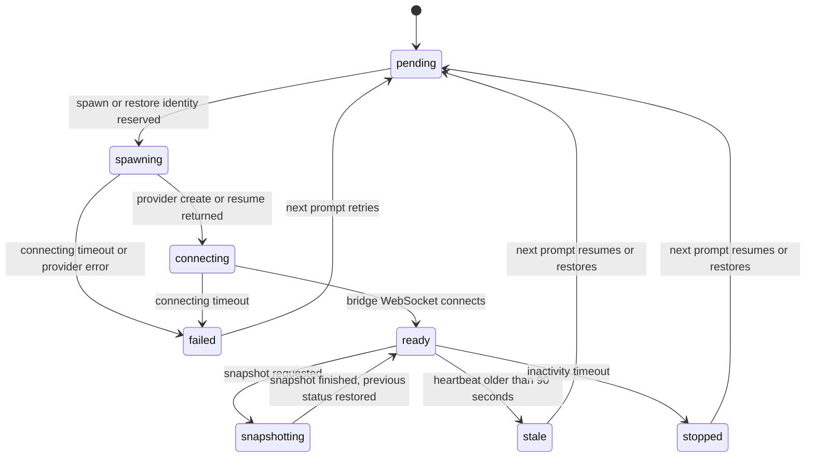
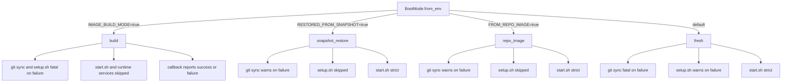

# Sandbox Lifecycle

Every Open-Inspect session runs its agent inside a sandbox whose life is managed from two sides.
The **control plane** (a per-session Durable Object hosting `SandboxLifecycleManager`) owns the
sandbox's status row, decides when to spawn, restore, resume, snapshot, or stop, and schedules the
alarms that enforce inactivity and health policy. The **in-sandbox runtime**
(`SandboxSupervisor` in `packages/sandbox-runtime`) owns what happens after launch: which boot mode
it detected, whether repositories are cloned or refreshed, whether `.openinspect/setup.sh` and
`.openinspect/start.sh` run, and in which order services start.

The two halves meet at the sandbox WebSocket bridge: when the bridge connects, the control plane
marks the sandbox `ready`; when the bridge stops beating, alarms move the sandbox through `stale`,
`stopped`, or `failed` — which in turn determine whether the *next* prompt resumes, restores, or
spawns fresh.

Related pages: [Sandbox Providers & Infra](/openwiki/architecture/sandbox-providers.md) (the
`SandboxProvider` abstraction and per-provider behavior), [Sandbox Runtime](/openwiki/architecture/sandbox-runtime.md)
(the in-sandbox data plane), [Image builds](/openwiki/workflows/image-builds.md) (the build
workflow), [Prompt flow](/openwiki/workflows/prompt-flow.md) (how prompts trigger the lifecycle).

## The status machine

A session has many sandbox *incarnations* over its life; the `sandbox` row describes only the
current one. The status enum is `pending | spawning | connecting | warming | ready | stale |
snapshotting | stopped | failed`. `warming` is never persisted — the web client sets it
optimistically when it receives `sandbox_warming` — and the pre-spawn status is `pending`.

*The sandbox status machine. Terminal statuses are `stopped`, `stale`, and `failed`; a follow-up
prompt starts a new incarnation from any of them. `warming` is client-side only.*

## Boot modes

The runtime resolves its boot mode from environment markers via `BootMode.from_env`
(`runtime_config.py`), and re-exports it as `OPENINSPECT_BOOT_MODE` so hook scripts can branch on
it:

| Mode | Marker env var | Meaning |
| --- | --- | --- |
| `fresh` | *(none of the below)* | Blank base image; full clone + setup |
| `snapshot_restore` | `RESTORED_FROM_SNAPSHOT=true` | Filesystem restored from a snapshot |
| `repo_image` | `FROM_REPO_IMAGE=true` (+ `REPO_IMAGE_SHA`) | Started from a prebuilt image |
| `build` | `IMAGE_BUILD_MODE=true` | Image-build sandbox, not a session |

The boot mode is the **control plane's** decision. `BOOT_MODE_ENV_KEYS` in `sandbox-env.ts` lists
the four markers, and `buildSandboxEnvVars` strips them from the user env layer before overlaying
system vars — otherwise a repo secret named `RESTORED_FROM_SNAPSHOT` could make a session claim it
booted from a snapshot or image when it did not. Providers then set the real markers themselves:
Vercel sets `RESTORED_FROM_SNAPSHOT` on restores and `FROM_REPO_IMAGE`/`REPO_IMAGE_SHA` for
prebuilt images, and Modal's Python manager does the same when it selects the image source for
`_launch_sandbox`. The same reserved keys are scrubbed from user env server-side
(`_RESERVED_LAUNCH_ENV_VARS`) and from image-build sandboxes (`RESERVED_REPO_IMAGE_CALLBACK_ENV_KEYS`).

## What each boot mode runs

`RepositoryBoot.boot` is the strictness boundary between "fresh clone" boots and "restore" boots.
For multi-repo sessions every step runs per repository in position order; the first repository is
the primary.

| Step | `fresh` | `snapshot_restore` | `repo_image` | `build` |
| --- | --- | --- | --- | --- |
| Git sync (clone or fetch) | run; failure **fatal** | run (fetch + preserve checkout); failure **warns** | run (fetch + checkout); failure **warns** | run; failure **fatal** |
| `.openinspect/setup.sh` | run; failure **warns** | **skipped** | **skipped** | run; failure **fatal** |
| Tunnel env wait | run | run | run | **skipped** |
| `.openinspect/start.sh` | run; primary-repo failure **fatal** | run; primary-repo failure **fatal** | run; primary-repo failure **fatal** | **skipped** |
| OpenCode + bridge | start | start | start | **skipped** |

*Per-mode strictness. Restores and prebuilt images trust the prepared filesystem, so `setup.sh`
never reruns — its effects (dependencies, builds) are already baked into the snapshot or image.*

The asymmetry is deliberate:

- **`setup.sh` skipped for prebuilt/snapshot starts.** A snapshot or repo image already contains
  the installed dependencies and built artifacts that `setup.sh` produces. Rerunning it would waste
  the seconds that the restore just saved, and on a restore it could even corrupt the working tree
  the snapshot carried.
- **`setup.sh` failure is non-fatal except in build mode.** A session continues without setup
  (recorded as a boot warning the bridge later drains to clients). In `build` mode a failing setup
  would bake a broken image, so `boot` raises `RuntimeError` and the build is reported as failed.
- **`start.sh` runs for every non-build start, and its failure is strict.** Per-session runtime
  startup (dev servers, watchers) cannot be baked into an image, so it runs on fresh, restore, and
  prebuilt boots alike. A failure in the **primary** repository raises `RuntimeError` — failing
  fast instead of continuing with a broken runtime; failures in later repositories only record
  warnings and the session continues.
- **Snapshot restores preserve the checkout.** On `SNAPSHOT_RESTORE`, the synchronizer fetches the
  branch but does not check out `origin/<branch>`, so HEAD, the index, staged changes, and untracked
  files from the previous incarnation survive (pinned by `test_restore_integrity.py`).

## Repository hooks: `setup.sh` and `start.sh`

`RepositoryHooks` runs each hook with these semantics:

- Paths are `.openinspect/setup.sh` and `.openinspect/start.sh` inside each checkout; a missing
  script counts as success (`hook.skip`), and a missing repository path skips `start.sh`.
- Scripts execute via `bash` with `cwd` set to the checkout, stdout+stderr merged, and the
  inherited environment plus `OPENINSPECT_BOOT_MODE`.
- **Hook timeouts.** `setup.sh` gets `SETUP_TIMEOUT_SECONDS` (default **300**) and `start.sh` gets
  `START_TIMEOUT_SECONDS` (default **120**). An unparseable value silently falls back to the
  default. On timeout the process group is terminated and the hook returns failure.
- In non-build modes the last 50 output lines are logged on failure or timeout (`output_tail`);
  in build mode the tail is omitted so repository hook output (potentially secret-bearing) never
  reaches build logs.

## Tunnel URLs: `/workspace/.tunnels.env`

When a session uses the `tunnelPorts` sandbox setting, resolved tunnel URLs reach the sandbox
through **two independent delivery paths**:

1. **Control plane → clients.** The provider returns `tunnelUrls` in its create/restore result;
   the lifecycle manager persists them on the sandbox row and broadcasts a `tunnel_urls` message.
   This path works regardless of what happens inside the sandbox.
2. **Provider → local env file.** The provider also writes `/workspace/.tunnels.env` so processes
   started by `.openinspect/start.sh` (or by the agent later) can read the URLs locally. The file
   is plain dotenv — `TUNNEL_<port>=<url>` per line — consumable by `node --env-file=...`,
   `bun --env-file=...`, `docker compose --env-file=...`, or any other dotenv reader. Today Modal
   (`SandboxManager._write_tunnel_env_file`) and Vercel (`writeTunnelEnvFile`, via a
   `sudo -E python -c` command inside the sandbox) write the file; the file is **not** written when
   `tunnelPorts` is empty or in build mode.

The first line is always `TUNNEL_SANDBOX_ID=<sandbox id>` — the tag the supervisor uses to tell a
fresh write from a snapshot leftover (the key is mirrored as a literal in the Vercel provider and
as `TUNNEL_ENV_SANDBOX_ID_KEY` in the runtime's `constants.py`). Providers that write the file also
set `EXPECTED_TUNNEL_PORTS` to the comma-separated port list, which gates the runtime's cleanup and
wait logic.

**Boot ordering on every non-build boot.** Before `start.sh` runs, the runtime:

1. **Clears a stale file.** `prepare_tunnel_environment` deletes `/workspace/.tunnels.env` when the
   boot is a snapshot restore or tunnels are expected — unless the file's `TUNNEL_SANDBOX_ID` line
   matches *this* sandbox. The manager's write can land before the supervisor starts, so a
   matching file is fresh and kept (`tunnel.fresh_file_kept`); anything else (a leftover inherited
   through a snapshot or image, or an untagged file) has dead URLs and is removed. Without a
   known `SANDBOX_ID` no pre-existing file is trusted.
2. **Waits for fresh URLs.** `wait_until_ready` polls every 0.2 seconds for up to
   `TUNNEL_WAIT_TIMEOUT_SECONDS` (default **30**) until the file contains a `TUNNEL_<port>=` line
   for every expected port.
3. **Runs `.openinspect/start.sh`.**

If the wait times out — the backend has not resolved tunnel URLs yet — the supervisor logs
`tunnel.env_file_wait_timeout` and `start.sh` proceeds **without** fresh local URLs. A missing
tunnel file is never fatal to the session; the control plane still receives and broadcasts the URLs
on the separate path described above.

## Supervisor ordering, restarts, and the build short-circuit

`SandboxSupervisor.run` resolves the boot mode, prepares the tunnel environment, clears the
boot-warnings file, then:

- **Build mode short-circuits everything.** Only repository boot runs, bounded by
  `OI_IMAGE_BUILD_EXECUTION_TIMEOUT_SECONDS`; the provider callback reports success (repository
  SHAs + `SANDBOX_VERSION`) or failure, and the supervisor waits for shutdown. Browser desktop,
  managed skills, code-server, web terminal, OpenCode, and the bridge are all skipped — a build
  sandbox bakes a filesystem, it does not serve a session.
- **All other modes boot services in a fixed order:** browser desktop (best effort) → repository
  boot (sync, hooks, tunnel wait) → managed-skills materialization → code-server and web terminal
  (each best effort) → OpenCode server (fatal on failure) → agent bridge → `monitor_processes`.
- **`monitor_processes` applies an explicit restart policy per owner**, bounded by
  `MAX_RESTARTS = 5` with exponential backoff (base 2, capped at 60 s). OpenCode and bridge
  crashes restart from the recorded repository boot result; exceeding the limit reports a fatal
  error to the control plane and shuts down. A bridge exit code of 0 is a graceful exit (session
  terminated) and shuts everything down without restarting. code-server, web terminal, and desktop
  restarts are best effort — giving up only logs.
- **Fatal errors** are POSTed to `{control_plane}/sessions/{session_id}/sandbox-error` with
  `fatal: true` (last 1000 characters, Bearer sandbox token, 3 attempts, 2^n-second backoff), which
  is how `supervisor.error` reaches the session UI even when the bridge never connected.

In build mode the sandbox carries the image-build callback contract as env vars
(`OI_REPO_IMAGE_BUILD_ID`, `OI_REPO_IMAGE_CALLBACK_URL`, `OI_REPO_IMAGE_FAILURE_CALLBACK_URL`,
`OI_REPO_IMAGE_CALLBACK_TOKEN`, `OI_REPO_IMAGE_PROVIDER_SESSION_ID`), mirrored between the
TypeScript `REPO_IMAGE_CALLBACK_ENV` and the Python constants; a partially configured callback
context aborts the build at boot rather than leaving the control-plane row wedged in `building`.

## Control-plane decisions: spawn and the circuit breaker

`SandboxLifecycleManager` makes every decision by calling **pure functions** in
`lifecycle/decisions.ts` (no side effects, exhaustively unit-tested) and then executing effects
through injected ports (`SandboxStorage`, `SessionContextReader`, `SandboxBroadcaster`,
`WebSocketManager`, `AlarmScheduler`, `IdGenerator`, optional `ImageBuildLookup`). The manager owns
two in-memory flags — `isSpawningSandbox`/`isTerminatingSandbox` and `providerStartupPending` —
that guard concurrent spawns within one request; the persisted `spawning`/`connecting` statuses
provide cross-request protection.

The Durable-Object decision configs and their defaults:

| Config | Default | Governs |
| --- | --- | --- |
| `circuitBreaker` | threshold **3** failures in a **5-minute** window | whether spawning is allowed at all |
| `spawn` | `cooldownMs` **30 s**, `readyWaitMs` **60 s**, `spawningTimeoutMs` **120 s** | `evaluateSpawnDecision` |
| `inactivity` | `timeoutMs` **10 min**, `extensionMs` **5 min**, `minCheckIntervalMs` **30 s** | when an idle sandbox stops |
| `heartbeat` | `timeoutMs` **90 s** (3× the 30 s heartbeat interval) | when a sandbox is `stale` |
| `connectingTimeout` | `timeoutMs` **120 s** | when a boot that never connects fails |

`spawnSandbox` evaluates the circuit breaker first (resetting it when the window has passed;
reporting a `sandbox_error` without a status change when open), then `evaluateSpawnDecision` in a
strict, load-bearing order:

1. **In-memory flag set** → skip (concurrent prompts must not launch duplicate sandboxes).
2. **Persistent resume applies** — `supportsPersistentResume` + a stored `providerObjectId` +
   status `stopped`/`stale` → resume that same sandbox in place.
3. **Dead status (`stopped`/`stale`/`failed`) with a snapshot** → restore, but only if
   `isSnapshotRuntimeCompatible` passes; a below-floor snapshot falls through to a **fresh spawn**
   rather than resurrecting a retired runtime.
4. **`spawning`/`connecting` within 120 s** → skip (a spawn is genuinely in flight; past the
   timeout the status is treated as dead so an interrupted spawn can recover).
5. **`ready` with an active WebSocket** → skip; **`ready` without one but recently spawned** → wait
   for reconnect (up to `readyWaitMs`).
6. **Cooldown** (30 s since last spawn) → wait — bypassed for `failed`/`stopped` so the user's next
   message recovers immediately.
7. Otherwise → **spawn fresh**.

On the fresh-spawn path, `doSpawn` performs the two-phase spawn write: phase 1
(`reserveSpawnIdentity`) persists the replacement identity — new sandbox id, `spawning` status —
and invalidates the stored credentials before the first non-storage await, so a stale bridge
authenticating mid-spawn cannot match the old row; phase 2 publishes the new token's hash scoped to
the reserved identity. A spawn superseded by a newer reservation raises `SpawnSupersededError` and
abandons **without** failure writes, because the row now describes the newer attempt. Failures mark
the sandbox `failed` and report the reason; only `permanent` `SandboxProviderError`s (HTTP 4xx,
quota, config) increment the circuit breaker — transient ones (502/503/504, network errors) do not,
and a successful spawn initiation resets it.

When a prompt arrives and no sandbox socket exists, the message queue defers dispatch, broadcasts
`sandbox_spawning`, and spawns in the background — a snapshot restore can take tens of seconds and
must not hold the prompt HTTP response open past bot callers' timeouts.

## Alarms: inactivity, heartbeat, and connecting

The Durable Object's single alarm slot is shared. `handleAlarm` first checks the execution timeout
(a message stuck in `processing` past its configured limit is failed — defense in depth), then
delegates to `SandboxLifecycleManager.handleAlarm`, which evaluates in order: connecting timeout →
heartbeat health → inactivity. Explicit lifecycle paths persist `stopped` or `stale` **before**
closing the connection, which is what prevents the bridge from reconnecting.

- **Connecting timeout (120 s).** A sandbox stuck in `connecting` *or* `spawning` for two minutes
  is failed — both statuses are covered because a spawn interrupted before the provider call
  returns never transitions to `connecting`. The alarm is scheduled at identity reservation and the
  bridge replaces it with its inactivity alarm when it connects. On timeout the sandbox is marked
  `failed`, access state is cleared, the provider sandbox is stopped where supported, and the user
  is told the next message will retry.
- **Heartbeat stale (90 s).** The bridge sends a `heartbeat` event every 30 seconds
  (`HEARTBEAT_INTERVAL = 30.0`). If none arrives for 90 s — 3× the interval — the sandbox is
  `stale`: the row is updated, access URLs are cleared, the provider sandbox is stopped or sent a
  `shutdown` message, a snapshot is taken first on snapshot-capable providers (fire-and-forget, so
  the status broadcast is not delayed), and the sandbox WebSocket is detached. A never-beating
  sandbox is *not* stale — it may still be starting.
- **Inactivity (10 min).** For a `ready` sandbox whose `last_activity` has aged past the timeout:
  if clients are still connected (they may be reviewing), the alarm **extends** by 5 minutes and
  warns ("Sandbox will stop in 5 minutes due to inactivity. Send a message to keep it alive.");
  otherwise it **stops** the sandbox — status `stopped` persisted first, then snapshot (unless the
  provider manages its own stop state), `shutdown` message where the API cannot stop, provider
  stop, WebSocket detach. Heartbeats count as activity only while a message is processing, so a
  long tool call cannot be starved by a quiet sandbox, and idle heartbeats cannot keep a dead
  session alive.
- **Disconnect safety net.** When a sandbox WebSocket disconnects and the status does not block
  reconnection, a disconnect check is scheduled one heartbeat timeout out — so a bridge that never
  comes back is detected promptly even without its own alarms.

Reconnection policy is narrower than the dead-status set: `isSandboxReconnectBlockedStatus` blocks
bridge reconnects only for `stopped` and `stale` (the connection authenticator answers those with
410). A `failed` sandbox may still connect — a slow boot can outlive the connecting watchdog and
self-heal when its bridge arrives. `getSandboxSocket` likewise drops zombie WebSockets when the row
is in a terminal state, because the close handshake may not have completed before hibernation.

## The provider split: snapshots vs persistent resume

Providers divide into two session-continuity families, and the spawn decision consults
`supportsPersistentResume` **before** `snapshotImageId`:

| Provider | Snapshots / restore | Persistent resume | Continuity mechanism |
| --- | --- | --- | --- |
| Modal | yes / yes | no | `snapshot_filesystem`; restore boots a new sandbox from the image |
| Vercel | yes / yes | no | `snapshotSession` (expiring by default) with `sourceSnapshotId` |
| OpenComputer | yes / yes (checkpoints) | **yes** | `forkFromCheckpoint` or wake |
| Daytona | no / no | **yes** | stop/start the same sandbox via REST |
| E2B | no / no | **yes** | stop is a resumable pause; resume reconnects |

- **Snapshot-capable providers** (Modal, Vercel, OpenComputer) preserve state by restoring saved
  filesystem state into a new sandbox instance. On inactivity or stale heartbeat the manager
  snapshots first, then stops — the snapshot is the state.
- **Persistent-resume providers** (Daytona, E2B, and OpenComputer) stop or pause the *same*
  sandbox and resume it later; nothing is lost, so the manager's `usesProviderManagedStop` path
  (explicit stop + persistent resume) skips the snapshot entirely and preserves the stored
  code-server/VNC passwords when clearing access URLs. E2B kills instead of pausing only for
  terminal stop reasons (`connecting_timeout`, `respawn`) — a sandbox that never connected will
  never be resumed.

When the decision does resume, `resumeSandbox` reuses the stored auth identity via
`updateSandboxForResume` (no credential rotation, no logical id change), sets `connecting`, and
calls the provider; `shouldSpawnFresh` in the result falls back to a fresh spawn.

## Snapshot timing and the runtime-version floor

`triggerSnapshot(reason)` is the single control-plane entry point. It flips the status to
`snapshotting` (unless already terminal), calls the provider's snapshot with the stored
`providerObjectId`, and on success stamps the returned image id **together with the sandbox's
current `runtime_version`** — that pairing is what a later restore is gated on. The previous status
is restored afterwards unless the reason was `heartbeat_timeout`. In current code the triggers are:

- **After successful prompt completion** — `execution_complete` handling submits a background
  snapshot (`snapshot.trigger`) so the workspace state survives before the sandbox ever idles.
- **Before a timeout-driven stop** — `inactivity_timeout` and `heartbeat_timeout` snapshot on
  snapshot-capable providers before stopping, per the table above.
- **Explicit control-plane save** — any control-plane path can call `triggerSnapshot` with a
  reason; image-build adapters call the provider's `takeSnapshot` directly to bake prebuilt images.

The floor gate exists because a snapshot carries the whole sandbox filesystem *including the
pinned agent binary* — restoring one silently resurrects the runtime that took it, so a runtime fix
would never reach a session that keeps restoring. `isSnapshotRuntimeCompatible` therefore **fails
closed**: a snapshot whose runtime version was never recorded or does not parse is treated as below
`MIN_COMPATIBLE_RUNTIME_VERSION`, and the spawn decision falls through to a fresh spawn (costing
one re-setup, after which the next snapshot records its version). Restores also seed the row's
runtime version from the snapshot *before* the provider call — the restored sandbox runs the
snapshot's binaries whatever the provider exports now — so the bridge's own `ready` report cannot
overwrite it.

## Warming: spawning while the user types

To hide latency, the control plane warms a sandbox **proactively, while the user is still typing**:

1. The web client debounces prompt-input changes (`TYPING_DEBOUNCE_MS = 300`) and sends a `typing`
   WebSocket message.
2. The session message router routes `typing` to `PresenceService.handleTyping`, which — when no
   sandbox socket exists and no spawn is in flight — broadcasts `sandbox_warming` and calls
   `spawnSandbox`.
3. `SandboxLifecycleManager.warmSandbox` re-checks with the pure `evaluateWarmDecision` (skip when
   a WebSocket is active, a spawn is in flight, or the status is already `spawning`/`connecting`)
   before spawning; note the status is deliberately *not* coerced, because "no sandbox row yet" is
   the ordinary case on this path.
4. Session init schedules the same `warmSandbox` as a background task, so a brand-new session's
   sandbox starts booting before any prompt is submitted.

By the time the user hits enter, the sandbox may already be `ready`; if the restore is fast enough
there is no perceptible delay, and the prompt's own dispatch finds a live socket instead of paying
the spawn.

## Why the lifecycle is fast

The design goal, per `docs/HOW_IT_WORKS.md`, is that background agents must not feel slower than
local tools. Without caching, a first session pays container start (~5–10 s) + clone (~10–30 s) +
dependency install (~30 s–5 min) + agent start before it can work — minutes. The lifecycle attacks
each stage:

- **Snapshots** capture the workspace after setup, so follow-up prompts and later sessions restore
  in seconds: dependencies, built artifacts, and workspace state are all in the image; only a
  quick `git fetch` sync runs.
- **Prebuilt images** give even cold sessions a recent baseline: the whole environment (all clones
  plus all setup scripts) is built ahead of time, so boot runs an incremental sync and skips setup.
- **Warming** moves whatever boot cost remains off the critical path of the first keystroke.
- **Persistent resume** on Daytona/E2B keeps the sandbox's memory of its own state without any
  restore at all — inactivity "stops" are resumable pauses.

## Configuration reference

| Env var | Side | Default | Purpose |
| --- | --- | --- | --- |
| `IMAGE_BUILD_MODE` | control plane → runtime | — | `build` boot mode marker (`= "true"`) |
| `RESTORED_FROM_SNAPSHOT` | control plane → runtime | — | `snapshot_restore` marker |
| `FROM_REPO_IMAGE` / `REPO_IMAGE_SHA` | control plane → runtime | — | `repo_image` marker + provenance SHA |
| `OPENINSPECT_BOOT_MODE` | runtime → hooks | resolved mode | lets hook scripts branch on boot mode |
| `EXPECTED_TUNNEL_PORTS` | provider → runtime | — | comma-separated ports; gates tunnel cleanup + wait |
| `TUNNEL_WAIT_TIMEOUT_SECONDS` | provider → runtime | `30` | max wait for fresh `/workspace/.tunnels.env` |
| `SETUP_TIMEOUT_SECONDS` | provider → runtime | `300` | `setup.sh` timeout |
| `START_TIMEOUT_SECONDS` | provider → runtime | `120` | `start.sh` timeout |
| `SANDBOX_TIMEOUT_SECONDS` | control plane → runtime | `7200` | provider sandbox lifetime; the bridge reserves a slice (max 900 s) so a final snapshot fits before TTL |
| `OI_IMAGE_BUILD_EXECUTION_TIMEOUT_SECONDS` | control plane → runtime | — | overall clone+setup budget in build mode |

Providers that cannot enforce configurable sandbox timeouts reject a configured
`sandboxTimeoutMs` with a permanent error instead of silently ignoring it.

## Focused tests

- `packages/sandbox-runtime/tests/test_supervisor_lifecycle.py` pins the boot-phase order, the
  build-mode exclusion of runtime services, graceful bridge exit, and restart exhaustion.
- `test_setup_script.py` / `test_start_script.py` pin hook skip/success/failure/timeout semantics,
  the 300 s and 120 s defaults, env override parsing, the build-mode output-tail suppression, and
  the fatal `start hook failed` RuntimeError for the primary repository.
- `test_entrypoint_tunnel_urls.py` pins tunnel env handling: stale-file clearing (untagged,
  other-sandbox, and own-sandbox cases), `EXPECTED_TUNNEL_PORTS` parsing, and the wait timeout.
- `test_restore_integrity.py` pins that a snapshot-restore sync preserves HEAD, branch, index, and
  untracked files.
- `packages/control-plane/src/sandbox/lifecycle/decisions.test.ts` exhaustively covers the pure
  decisions (breaker windows, spawn precedence, reconnect blocking, runtime floor, warm skips).
- `packages/control-plane/src/sandbox/lifecycle/manager.test.ts` covers spawn orchestration end to
  end against fake ports: two-phase identity reservation, alarm outcomes per provider capability,
  warm behavior, and image-selection fallbacks.
- `packages/control-plane/test/integration/sandbox-events.test.ts` pins that heartbeats refresh
  `last_heartbeat` and renew activity only while a message is processing.

## Related pages

- [Sandbox Providers & Infra](/openwiki/architecture/sandbox-providers.md) — the `SandboxProvider`
  contract, per-provider capability matrices, and the image-build trigger path.
- [Sandbox Runtime](/openwiki/architecture/sandbox-runtime.md) — the in-sandbox services the
  supervisor composes and the bridge protocol.
- [Image builds](/openwiki/workflows/image-builds.md) — the prebuild workflow whose artifacts the
  `repo_image` boot mode consumes.
- [Prompt flow](/openwiki/workflows/prompt-flow.md) — how queued prompts find the sandbox this page
  describes.
