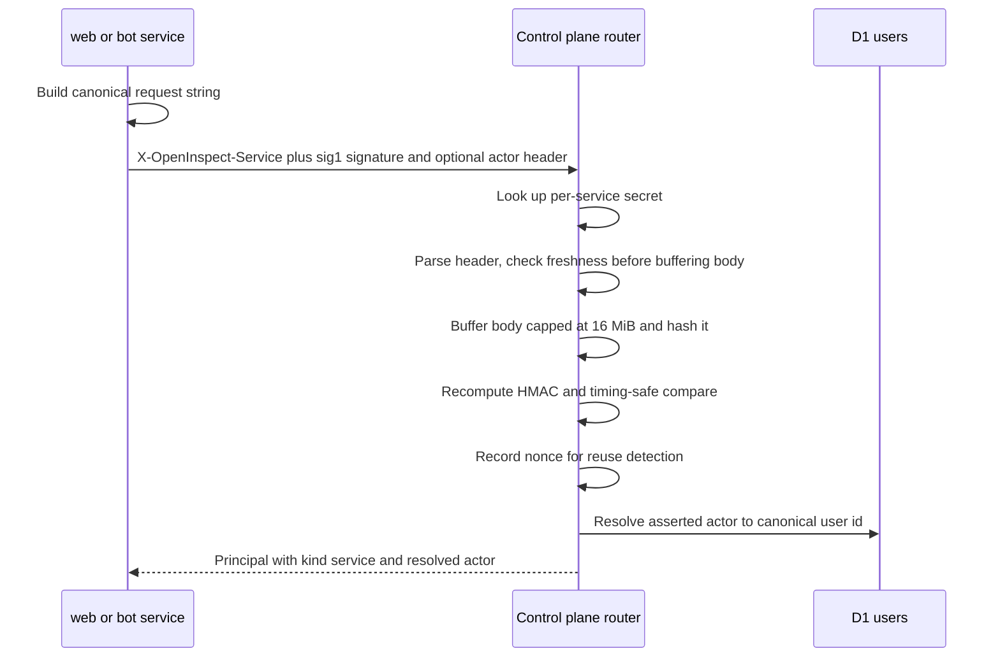
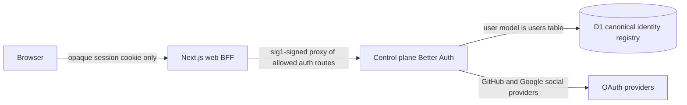
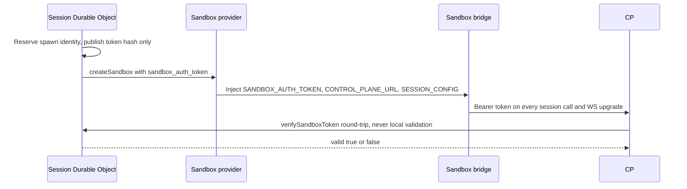
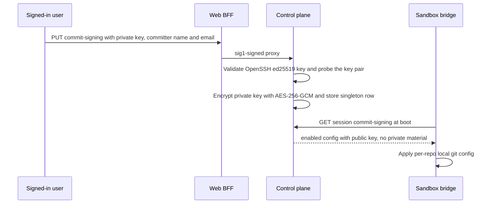

# Security and Tokens

Open-Inspect concentrates every security-critical decision in the **control plane**: it is the
GitHub App credential broker, the user-authentication authority (Better Auth), the owner of all
secret encryption keys, and the broker that signs commits on behalf of sandboxes that never see a
private key. This page explains the trust model, every token type in the system, and the
mechanisms that keep credentials out of the places they must not reach.

Related pages: [Control Plane Worker](/openwiki/architecture/control-plane-worker.md) (the router
and auth pipeline), [Web Client](/openwiki/architecture/web-client.md) (the sig1-signing BFF),
[Environments & Repositories](/openwiki/concepts/environments-and-repositories.md) (secret scope
data model), [Models & Provider Accounts](/openwiki/concepts/models-and-provider-accounts.md)
(managed LLM account credentials), [Sandbox Lifecycle](/openwiki/concepts/sandbox-lifecycle.md)
(spawn, which is where tokens are minted and secrets injected).

## The single-tenant trust model

The system is designed for **single-tenant deployment only**, where all users are trusted members
of the same organization with access to the same repositories. Three properties define the model:

- **A shared GitHub App installation defines the access boundary.** Git operations (clone, fetch,
  push) authenticate with short-lived installation tokens minted server-side from one App
  installation. Any user of the system can access any repository the App can access.
- **There is no per-user repository validation at session creation.** The control plane does not
  check that the user creating a session has permission on the target repository. (Attribution —
  *who* is acting — is enforced strictly; *what repositories* they may touch is not.)
- **User OAuth tokens are scoped to PR creation.** For GitHub sign-ins, pull requests are created
  with the user's own OAuth token — proper attribution, and GitHub itself enforces that they can
  only open PRs on repos they can write. Users who sign in another way (e.g. Google) carry no SCM
  token, so their PRs fall back to the shared GitHub App bot.

Because of this model, deployment recommendations are operational, not code changes:

1. **Deploy behind the organization's SSO/VPN** so only authorized employees reach the web
   interface.
2. **Install the GitHub App only on intended repositories** — the installation scope *is* the
   system's access scope (select specific repositories, not "All repositories").
3. **Restrict sign-in** — configure allowed GitHub users, emails, email domains, or active
   GitHub organization membership (`ALLOWED_USERS`, `ALLOWED_EMAILS`, `ALLOWED_EMAIL_DOMAINS`,
   `ALLOWED_GITHUB_ORGS`; `UNSAFE_ALLOW_ALL_USERS` exists but should stay unset).

Multi-tenancy would require per-tenant App installations, access validation at session creation,
and tenant isolation in the data model — none of which exist today.

## The token architecture

Six kinds of credentials circulate between the components:

| Token | Purpose | Scope |
| --- | --- | --- |
| GitHub App token | Brokered git clone/fetch/push auth (credential helper) | All repos where the App is installed |
| User OAuth token | PR creation, attribution, user info | Repos the user has access to |
| Sandbox auth token | Sandbox→control-plane session calls | Single session |
| WebSocket token | Real-time session auth (browser clients) | Single session |
| Managed LLM tokens | OpenAI (ChatGPT) / xAI (SuperGrok) subscription OAuth | Single provider account or scope |
| Service sig1 signature | web/bot → control-plane request authentication | Per service, per request |

The invariants that hold across all of them:

- **Secrets at rest are always encrypted** — an unencrypted deployment fails loudly at the first
  touch rather than silently storing plaintext.
- **Sandboxes never hold long-lived or installation-wide secrets** — they ask the control plane
  for short-lived credentials on demand.
- **Identity flows from verified principals, never caller-asserted body fields.**

## Service-to-service authentication (`sig1`)

The four first-party services — `web`, `slack-bot`, `github-bot`, `linear-bot` — authenticate to
the control plane by signing each request with the service's own secret. The `sig1` format
replaced a shared claimless bearer: the signature binds the full request, so a captured credential
cannot be replayed against a different request.



*Service request authentication: the signature binds method, URL, body hash, and asserted actor;
the actor is resolved against D1 identities before any handler runs.*

### The `sig1` wire format

A request carries `X-OpenInspect-Service` (the service name), `X-OpenInspect-Service-Signature`
(`sig1.<timestampMs>.<nonce>.<64-hex>`), and, when the sender acts for an external user,
`X-OpenInspect-Actor` (e.g. `slack:U0123456`). The signed canonical string is
newline-delimited: `sig1`, service, timestamp, nonce, upper-cased method, pathname, canonical
query, SHA-256 hex of the exact body bytes (empty string when bodyless), and the actor header
value. The query canonicalization sorts `key=value` entries bytewise by `key\0value`, so param
order does not change a signature. `buildServiceAuthHeaders` is the only outbound signer and
`verifyServiceSignature` the only verifier; both live in `@open-inspect/shared/service-auth`.

**The format is frozen by immutable golden vectors** (`test-fixtures/service-auth-vectors.json`).
Any change to the canonicalization or grammar requires a new format tag (`sig2`), never an edit to
the vectors or the string layout.

Verification is ordered cheapest-first: the signature header's grammar and timestamp freshness
(±`TOKEN_VALIDITY_MS`, 5 minutes) are checked *before* the body is buffered — a malformed or
stale header never costs a body read. Senders must serialize binary bodies before signing,
because sig1 hashes the exact bytes sent.

### Verification at the edge

`authenticate()` resolves every non-public, non-sandbox request to a typed `Principal` before a
handler runs. A `sig1` signature is verified against that service's own secret; sandbox tokens
stay router-verified (they need the session id from the path and a Durable Object round-trip) and
are never dispatched through this path. Anything presenting no recognized credential is
unauthorized with `failedScheme: "none"` — which matters for sandbox-fallback routes (below).

The control plane holds one verification key per service (`SERVICE_AUTH_SECRET_WEB`,
`SERVICE_AUTH_SECRET_SLACK_BOT`, `SERVICE_AUTH_SECRET_GITHUB_BOT`,
`SERVICE_AUTH_SECRET_LINEAR_BOT`). An absent key is a **500 misconfiguration, not a 401** — that
service cannot authenticate at all. A missing sender secret is a hard error at call construction.

Body handling has a hard cap: `SERVICE_REQUEST_MAX_BODY_BYTES` (16 MiB) bounds the buffering the
signature requires; larger bodies are rejected with 413. The consumed body is rebuilt into a new
`Request` before the handler sees it, leaving the body readable.

### Actor assertions

Each bot may assert actors only in its own namespace (`slack-bot` → `slack:…`, `github-bot` →
`github:…`, `linear-bot` → `linear:…`); `web` asserts none because its identity arrives by token
exchange. A mismatched namespace is a 401 (`auth.assertion_denied`). A valid assertion is
resolved against the D1 `user_identities` table to a canonical user id (`null` when the control
plane has never seen that provider identity), producing the `ResolvedIdentity` carried by the
service principal. Nonce-reuse detection is best-effort and log-only — an in-isolate map bounded
to 5,000 entries whose entries expire with the signature validity window.

## User authentication: Better Auth in the control plane

The control plane runs **Better Auth** as the user-authentication authority, configured with the
canonical SQL adapter so its data model *is* the canonical identity registry: Better Auth's user
model maps directly onto `users` and its account model onto `user_identities`. There is nothing
to synchronize — a bot-created GitHub identity is already an account, so the account-first lookup
at web sign-in signs bot-first users into their canonical row natively. Sessions and OAuth state
stay in Better Auth-owned tables (`auth_sessions`, `auth_verifications`), with implicit account
linking deliberately enabled and `users.email_verified` as the linking gate (written by completed
OAuth proof, by attesting bot providers — Slack and Linear write `email_verified = 1` — or the
backlog verification migration). `encryptOAuthTokens` is on, and the browser-visible web origin
serves as `baseURL` because of how the web proxies auth (next section). The runtime requires at
least one configured sign-in provider and enforces the admission policy per provider at startup.



*The browser only ever holds Better Auth's opaque session cookie; the web BFF forwards it through
a signed, allowlisted proxy to the control plane, which owns the providers and the identity
registry.*

### Session validation for protected resources

`authenticate()` verifies the `service:web` sig1 channel first; only when the route requires
`webService: "user"` does it validate the opaque session cookie via `authenticateSession`. That
adapter performs a **non-refreshing session read** (`disableRefresh: true`) so protected-resource
requests never extend session expiry or write D1 as a side effect. A malformed response or a
session/user id mismatch raises `SessionIntegrityError` and maps to **500, not a fallback** —
there is no degraded path around a corrupt session.

### The web auth proxy

The Next.js app is a framework-free BFF: it holds no OAuth provider credentials and no admission
policy — those live only on the control plane. Its `/api/auth/[...auth]` route proxies an exact
allowlist shared by both sides (`BROWSER_AUTH_PROXY_ROUTES`: `POST /api/auth/sign-in/social`,
`GET /api/auth/callback/github`, `GET /api/auth/callback/google`, `GET /api/auth/get-session`,
`POST /api/auth/sign-out`, `GET /api/auth/error`), signing each forward with the web service's
sig1 credential and copying only a fixed header set (including the cookie and a trusted client IP
via `X-Open-Inspect-Client-IP`). Because the control plane sees requests through the web origin,
all redirects and host-only cookies stay scoped to the web application — the browser never talks
to the control plane origin directly for auth.

### Canonical user resolution and user merge

All identity-consuming routes resolve who is acting through one sequence —
`applyIdentityEnforcement` owns **reject → derive → requires-user** so no handler can run the
steps out of order:

1. **Forbidden-field rejection.** Identity fields callers may not send (`userId`, `spawnSource`,
   `authProvider`, `authUserId`, `actorUserId`, `scmToken`, `scmRefreshToken`, `scmUserId` for
   spawning routes; `authorId` for prompts; per-route subsets for ws-token and lifecycle) are
   checked against the **raw pre-Zod JSON** — every schema is strip-mode, so Zod alone would
   silently drop them. A forbidden field is a 400 and a permanent invariant guard against
   body-identity reintroduction. Display-only fields (`authEmail`, `actorDisplayName`, `scmLogin`
   …) stay body-carried by design: they are cosmetic, never identity.
2. **Derivation.** `deriveIdentity` maps the principal: a user principal is its own canonical
   user with `spawnSource: "user"`; the userless `web` service credential derives no participant;
   bot services derive the verified actor's participant id (`ns:id`), canonical id (possibly
   null), and their own service as spawn source; sandbox principals derive null (the router's
   allowlist keeps them off identity routes anyway — fail closed with 403 if that ever changes).
3. **Requires-user gate.** `session-create`, `ws-token`, and `automation-create` must mint
   identity, so a principal that derives no participant is a 403. Other routes proceed
   anonymously.

For spawning routes, `resolveCanonicalUserId` creates the canonical user **from the verified
actor** on first sight (display fields from the body only decorate), failing closed with 500
rather than writing anonymous attribution. `UserStore.resolveOrCreateUser` is the core primitive:
look up by provider identity, refresh metadata, backfill a missing email, **link across
providers by verified email** (an identity discovering an email another identity already
registered re-links to that user, preventing permanent splits), or create a new user + identity
batch with retry on the UNIQUE race. `email_verified` is only written for attesting providers
(Slack, Linear) — every other attribution stays unproven until sign-in proof mints it.

When two canonical rows turn out to be the same person (e.g. a Slack-attributed email beside a
GitHub-subject row), `mergeUsers` converges the loser's entire graph onto the survivor. It is
deliberately a **library + operator CLI, not an HTTP endpoint** — a merge primitive on an
authenticated surface would add authz/abuse surface for no safety gain. It is dry-run by default,
executes as a single atomic batch ordered to satisfy every foreign key (with explicit dedup rules
for read states and identities), re-points browser sessions rather than deleting them (the merged
person stays signed in), backfills the survivor's email only when the survivor has none, and is
idempotent except for one documented non-re-derivable window the CLI prints a recovery record
for.

## GitHub App brokering

The control plane is the sole holder of GitHub App credentials (`GITHUB_APP_ID`,
`GITHUB_APP_PRIVATE_KEY`, `GITHUB_APP_INSTALLATION_ID`). Token flow:

1. Generate a JWT signed with the App's RSA private key (RSASSA-PKCS1-v1_5/SHA-256; `iat`
   back-dated 60 s for clock skew, `exp` +10 minutes), imported from PKCS#8 with the parsed key
   cached.
2. Exchange it at `POST https://api.github.com/app/installations/:id/access_tokens` for an
   installation token valid ~1 hour, validated against a zod schema (failures carry the HTTP
   status so callers can classify transient 5xx/429 vs permanent).
3. Cache and reuse: per-isolate memory cache plus the KV cache store (`github:installation-token:v1`
   keys), usable only while younger than 50 minutes *and* holding ≥5 minutes of remaining
   lifetime; refreshes are single-flight via an in-flight promise map, and KV write failures are
   non-fatal.

The PKCS#8 requirement is a real operational gotcha: `importPrivateKey` tries PKCS#8
(`BEGIN PRIVATE KEY`) and, on failure, raises an error telling the operator to convert:

```
openssl pkcs8 -topk8 -inform PEM -outform PEM -nocrypt -in key.pem -out key-pkcs8.pem
```

Git auth is served on demand: `generateCredentialHelperAuth` returns
`{ username: "x-access-token", password: <installation token>, expiresAtEpochMs }` from the
cached-token-with-expiry path, so the sandbox-side credential helper can cache its copy until
shortly before expiry. Listing repositories and branches for the session pickers uses the same
cached token.

## User OAuth tokens (PR creation and attribution)

User OAuth tokens (GitHub today) live in the `user_scm_tokens` D1 table, keyed by
`provider_user_id`, with access token, refresh token, and expiry **encrypted at rest** with
`TOKEN_ENCRYPTION_KEY`. Store semantics worth knowing:

- **Monotonic upsert**: `upsertTokens` overwrites only when the incoming expiry is newer
  (`WHERE excluded.token_expires_at > user_scm_tokens.token_expires_at`) and `user_id` is
  COALESCEd — a stale token from an old session cookie can never clobber a server-side refresh.
- **CAS refresh rotation**: `casUpdateTokens` updates only if the stored refresh-token ciphertext
  still equals the expected raw ciphertext, returning `cas_conflict` otherwise. Concurrent
  refreshers cannot lose a rotation.
- GitHub's missing `expires_in` falls back to an 8-hour default lifetime; freshness checks apply a
  60-second buffer.

### Server-side SCM enrichment

SCM credentials **never arrive in request bodies** — the identity-enforcement forbidden-field list
rejects them — and flow only through server-side enrichment at spawn/token time. On
`session-create`, after identity enforcement, the route resolves the credential *authority* and
fills `scmUserId`/`scmLogin`/`scmTokenEncrypted`/`scmRefreshTokenEncrypted` server-side:

- **Browser sessions** use the `browser_session` authority: linked GitHub accounts are enumerated
  through the Better Auth account API, and the access token is fetched from Better Auth, then
  re-encrypted with the control-plane key before entering session state. Better Auth owns
  refresh-token storage and rotation; session state receives only a re-encrypted, currently valid
  access token and never copies the long-lived refresh credential into a second store.
- **Bot/service callers** retain the `legacy` authority: the D1 identity lookup via
  `UserScmTokenStore` keyed by the verified actor's GitHub provider user id.
- A user with no linked GitHub account (e.g. Google sign-in) enriches nothing and falls back to
  the GitHub App bot for PR creation; account linking is intentionally deferred.

The authority split is a hard invariant: a user principal missing browser-session provenance is
an error, never a silent fallback to the legacy store, and a non-user principal may not carry
browser-session provenance at all.

At PR time, `SessionPullRequestService` re-resolves the repository target defensively (the
sandbox is untrusted), pushes with a fresh App push-auth token, then creates the pull request
with `prAuth = input.promptingAuth ?? appAuth` — the prompting user's OAuth token when available
(attribution + GitHub-enforced write access), otherwise the shared App token.

## Sandbox auth token

Every sandbox incarnation gets a **single-session bearer token** used by the bridge for its
WebSocket, control-plane calls, the git credential helper, and the commit-signing broker.

Minting happens inside `reserveSpawnIdentity` with a deliberate two-phase write: phase 1 persists
the new sandbox id with credentials invalidated; phase 2 publishes the SHA-256 token hash scoped
to the reserved identity. The token itself (`generateId()` — 16 random bytes, hex-encoded) exists
only in memory and in the provider launch payload; the DO stores only the hash. Rotating the hash and
sandbox id on every respawn locks a stale bridge out exactly like a fresh spawn would, and the
prebuilt-image restore retry mints a fresh identity too, since a failed provider create may still
have produced a live orphan sandbox.



*The router never trusts the sandbox token locally: it asks the owning session Durable Object to
verify it against the stored hash.*

Verification (`isValidSandboxToken`) prefers the stored `auth_token_hash` with a timing-safe
compare, falling back to the plaintext column only for legacy rows. On the router, a failed
verification is a 401 and an **unreachable DO is a 503** — the request could not be
authenticated, which is different from being rejected. The DO-side verifier rejects dead sandbox
statuses (410) but allows boot-time states, because the git credential broker is already called
during the initial clone before the WebSocket flips the row to `ready`. Both the WS upgrade path
and internal sandbox-event handlers re-check the sandbox id and credential hash **after** the
non-storage token-hash await, so a mid-flight respawn cannot authenticate against replaced
credentials.

The token rides to the sandbox in the provider payload (`sandbox_auth_token`), and the Modal
manager injects it as the `SANDBOX_AUTH_TOKEN` env var alongside `CONTROL_PLANE_URL` and
`SESSION_CONFIG`. System env vars are applied **after** user secrets and therefore override them
— a user-controlled secret cannot spoof the control-plane URL or token — and a set of reserved
launch env vars is stripped from user input entirely (tested explicitly in
`test_sandbox_env_vars.py`).

## WebSocket tokens

Browser clients do not connect to the session WebSocket with their cookies; they exchange a
short-lived **WebSocket token** first:

1. `POST /sessions/:id/ws-token` (user-or-service routes, identity-enforced as a requires-user
   route) forwards the verified participant and display-only SCM fields to the DO.
2. `WsTokenHandler` upserts the participant (coalescing client-sent encrypted SCM tokens against
   server-side refreshes — only newer expiries win), generates a 32-byte hex token via
   `generateId(32)`, stores **only its SHA-256 hash** plus `ws_token_created_at` on the
   participant row, and returns the plaintext once.
3. On subscribe, the DO hashes the presented token, looks the participant up by hash, and enforces
   a **24-hour TTL** (`WS_TOKEN_TTL_MS`). Missing/invalid/expired tokens close with 4001 (the
   client fetches a fresh token and reconnects); a duplicate subscribe closes with 4003.

Like the sandbox token, the plaintext exists only in the minting response and the client.

## Secrets: scopes, encryption, and injection

### Scopes and precedence

Secrets live in three scopes — **global**, **repository**, and **environment** — sharing one
store plumbing layer (`scoped-secrets.ts`), one encryption key
(`REPO_SECRETS_ENCRYPTION_KEY`), and one set of caps. The session fold
(`buildSessionTargetSecretSources`) orders sources **lowest-precedence-first**:

- **Repo-launched / ad-hoc multi-repo session**: global, then each member repository's secrets in
  reverse position order, so the **primary repository (position 0) wins key collisions**.
- **Environment-launched session**: global + **that environment's secrets only**. Member
  repositories never contribute their repo secrets — environments are curated, and a key added to
  a repository must not silently land in every environment containing it. Reuse a repository
  secret in an environment by importing it (a ciphertext-verbatim copy, since both scopes share
  one key) or by moving it to global.

`mergeSecretSources` folds the ordered list case-insensitively (keys normalize to uppercase),
reports per-source byte attribution and cross-source collisions, and computes the total against
the combined cap.

### Caps and validation

Per scope: 50 keys, 16 KB per value, 64 KB of total values; 128 KiB for a session's combined
merged payload. Keys must match `[A-Za-z_][A-Za-z0-9_]*` (≤256 chars), and a **reserved-key
list** blocks shadowing system vars — including `SANDBOX_AUTH_TOKEN`, `CONTROL_PLANE_URL`,
`GITHUB_APP_TOKEN`, `SESSION_CONFIG`, `SANDBOX_ID`, `PATH`, `HOME`. Duplicate keys after
normalization (`foo` vs `FOO`) are rejected rather than letting the last one silently win. The
combined cap has two enforcement modes, `warn` (log and proceed) and `enforce` (reject the
spawn/build with `SecretsCapExceededError` carrying per-source attribution — never values);
**`enforce` is the default and the parser fails closed** — only the literal `warn` opts out.

### Encryption at rest

`encryptToken`/`decryptToken` implement AES-256-GCM over the Web Crypto API: a 96-bit random IV,
base64-encoded IV‖ciphertext output, keys imported from base64 secrets. Every sensitive store
uses this pair: scoped secrets (`repo_secrets`, `environment_secrets`, `global_secrets`),
`user_scm_tokens`, the commit-signing private key, and sandbox access values (code-server/VNC
passwords, ttyd tokens). Decryption failures raise `SecretDecryptionError` carrying the failing
key (never plaintext or ciphertext); the sandbox-access reader degrades per-value instead of
failing the whole access response.

Key management is fail-loud by design: `env-validation.ts` eagerly validates that
`REPO_SECRETS_ENCRYPTION_KEY` and `TOKEN_ENCRYPTION_KEY` are present, strict base64, and decode
to exactly 32 bytes (a malformed key would otherwise survive graph construction and explode
mid-spawn; a short one would silently downgrade to AES-128/192). An unconfigured key means
**refusing to operate**, never plaintext fallback — Terraform requires the keys
(`openssl rand -base64 32`), so their absence always means a broken deployment.

### Env-var injection at spawn

The `UserEnvResolver` in the session DO decrypts all contributing scopes, folds them, audits the
merge against the cap, and derives the managed-provider environment:

- `CONTROL_PLANE_OAUTH_KEYS` (`OPENAI_OAUTH_*`, `XAI_OAUTH_*` refresh/access variables) are
  **stripped** from the exposed payload — the sandbox must never receive raw OAuth refresh
  material for managed providers.
- In managed mode (`provider_account` auth), the provider's API-key variable is deleted and a
  marker (`OPENAI_OAUTH_MANAGED` / `XAI_OAUTH_MANAGED`) is set, so the in-sandbox CLI goes through
  the control-plane broker instead of using an API key.

The resulting payload is passed as `userEnvVars` in the `CreateSandboxConfig`; the provider's
launcher filters its own reserved launch vars and overlays system vars (sandbox id, control-plane
URL, auth token) after user values. Secrets are therefore **injected as environment variables at
spawn** and refreshed only by a new spawn — rotating a secret does not affect a running sandbox.

### Managed LLM tokens

OpenAI (ChatGPT) and xAI (SuperGrok) subscription OAuth credentials are stored in the scoped
OAuth secret stores (`ScopedOAuthSecretsStore` — same global/repo/environment scopes) and
refreshed by control-plane brokers, not by sandboxes:

- The **OpenAI token broker** reads token state from the session's scope (falling back to
  global), returns cached tokens until within a 5-minute refresh buffer, and refreshes
  single-flight per isolate with D1 re-reads covering cross-isolate rotation; rotation failures
  after tokens were minted surface a specific "rotated but could not be saved" error so the user
  reconnects the account.
- The **xAI refresh service** follows the same scoped-read pattern with its own
  unauthorized-grant handling.
- Sandboxes call `POST /sessions/:id/openai-token-refresh` (or xai) with the sandbox token to
  obtain fresh access tokens. The route **409s unless the session's auth mode for that provider
  is `legacy_scoped_oauth`** — provider-account sessions have nothing to refresh through this
  path.

Provider-account credentials themselves (connected ChatGPT/SuperGrok accounts) are encrypted with
`PROVIDER_ACCOUNTS_ENCRYPTION_KEY` using AES-256-GCM with **additional authenticated data**
binding the ciphertext to the account id, provider, and schema version — ciphertexts cannot be
transplanted between rows.

## Commit signing

Commit signing is **brokered**: the control plane holds one OpenSSH Ed25519 private key
(a singleton deployment-level setting); sandboxes hold only the public key and request
signatures per commit. Signing is GitHub-only — on other SCM providers the sandbox receives an
explicit `enabled: false` and commits unsigned, rather than failing the session at the provider
gate.

### Configuration lifecycle



*The private key is validated and encrypted at write time and never leaves the control plane;
sandboxes fetch only the public configuration.*

- `GET/PUT/DELETE /commit-signing` are user-or-service GitHub routes. The PUT validates the
  request with `commitSigningWriteRequestSchema` (strict object, private key ≤ 16,384 chars,
  trimmed committer name/email), then `validateOpenSshEd25519PrivateKey` fully parses the
  OpenSSH container: unencrypted only (the `none`/`none` cipher/kdf check rejects encrypted
  keys), Ed25519 only, inner public key consistent with the outer blob, padding verified, and a
  **sign/verify probe** proving the key pair works. The store keeps the singleton row
  (`commit_signing_configuration`) with the private key AES-256-GCM encrypted plus committer
  name/email, public key, and `SHA256:` fingerprint.
- The signing store is unavailable (503) without `REPO_SECRETS_ENCRYPTION_KEY` — signing shares
  the scoped-secrets key, and there is no unencrypted fallback.

### Sandbox-side runtime

`GitSigningRuntime` (in the bridge) fetches `GET /sessions/:id/commit-signing` (30-second
timeout; failures classified retryable on 408/429/5xx) and applies **per-repository** `git
config --local` values: `gpg.format=ssh`, `gpg.ssh.program=<path to oi-git-sign>`,
`user.signingkey=key::<publicKey>`, `commit.gpgsign=true`, plus author/committer identity. The
payload is a strict pydantic discriminated union (`extra="forbid"`); the public key must match
the `ssh-ed25519 <base64>` shape. A disabled configuration instead runs `--unset-all` over the
signing keys (tolerating missing keys) and sets a plain identity — the prompt author, or
`OpenInspect <open-inspect@noreply.github.com>`. A repository missing its `.git` directory is a
hard error.

The bridge wires the runtime to two points in its lifecycle: `initialize` once before the first
WebSocket connect (a non-retryable `GitSigningError` is **fatal** to the run loop — bad config
should not loop), and `refresh` before every prompt via `_configure_git_identity`, passing the
prompt's author as the effective author. Note the scope split: the **credential helper** is
installed once with `git config --global` (a shim at `/usr/local/bin/oi-git-credentials` plus
`credential.useHttpPath`), while **signing** config is per-repo `--local` so it can be reset
per prompt without touching credential routing.

### The signing request

`oi-git-sign` is a stateless `ssh-keygen` shim installed in the runtime bin dir
(`OPENINSPECT_BIN_INSTALL_DIR`, default `/usr/local/bin`). For non-sign invocations it `exec`s
the stock `ssh-keygen`. For `-Y sign`, it:

1. Reads the bounded commit payload (≤1 MiB) and the `key::<publicKey>` reference — the key never
   exists as a file, so `test_initialize_fetches_public_configuration_without_creating_key_files`
   pins that no key material is ever written.
2. Computes the public key fingerprint (`SHA256:<base64, unpadded>`) and POSTs the payload with
   `X-Open-Inspect-Signing-Fingerprint` to `POST /sessions/:id/commit-signing` using the sandbox
   auth token.
3. The control plane decrypts the stored key, **rejects a fingerprint mismatch with 409**
   ("Commit signing key changed" — a stale-configured repo cannot get signatures from a rotated
   key), signs the payload with `createGitSshSigSignedData` (SSHSIG v1, `git` namespace,
   SHA-512 digest, Ed25519), and returns the armored signature (`no-store`).
4. The signer validates the response against a strict armor regex plus the `SSHSIG` magic
   (≤16 KiB), writes it atomically to `<buffer>.sig`, and emits only a bounded error type
   containing no request, response, or credential bytes.

The payload endpoint caps request bodies at 1 MiB (413) and requires both a fingerprint header
and non-empty payload. Interoperability is pinned by a test that verifies control-plane armor
with stock `ssh-keygen -Y verify` (`Good "git" signature`).

### Key format details (the PKCS#8 gotcha)

Two distinct key-import paths exist, each with its own constraint:

- **GitHub App RSA key** must be PKCS#8 PEM (`BEGIN PRIVATE KEY`); PKCS#1 (`BEGIN RSA PRIVATE
  KEY`) fails at import with the `openssl pkcs8 -topk8` conversion hint (above).
- **Commit-signing Ed25519 key** arrives as an OpenSSH private key file; WebCrypto cannot import
  that container, so the parser extracts the 32-byte seed and wraps it in a hand-built minimal
  PKCS#8 structure (`ED25519_PKCS8_PREFIX` + seed) before `crypto.subtle.importKey("pkcs8", …)`.
  Encrypted OpenSSH keys are rejected outright, and the fingerprint is `SHA256:` over the public
  key blob, matching what `ssh-keygen -lf` prints.

## Failure semantics worth remembering

- **sig1**: malformed/stale header rejected before body buffering (401); body > 16 MiB → 413;
  missing per-service secret → 500 misconfiguration; unknown service → 401; denied actor
  namespace → 401.
- **Sandbox auth**: invalid token → 401; unreachable session DO → 503; replaced credentials
  mid-request → 403.
- **SCM credential minting**: permanent provider errors → 500, transient → 502 (the helper exits
  non-zero and the next git op retries); the helper **never** falls back to a stale cache.
- **Commit signing**: non-retryable signing errors kill the bridge; key rotation between config
  fetch and sign → 409, surfaced as a commit failure rather than a mis-signed commit.
- **Secrets**: undecryptable values raise with the key name only; oversized merged payloads fail
  the spawn in `enforce` mode (default); missing encryption keys refuse to start rather than
  storing plaintext.
