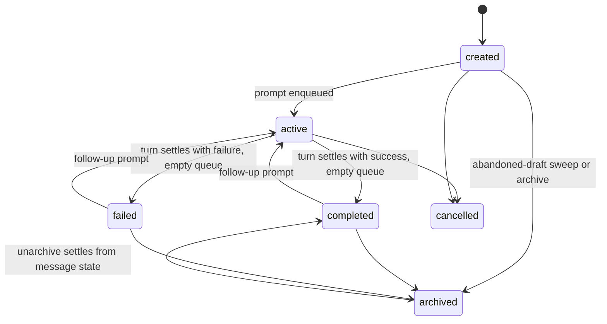
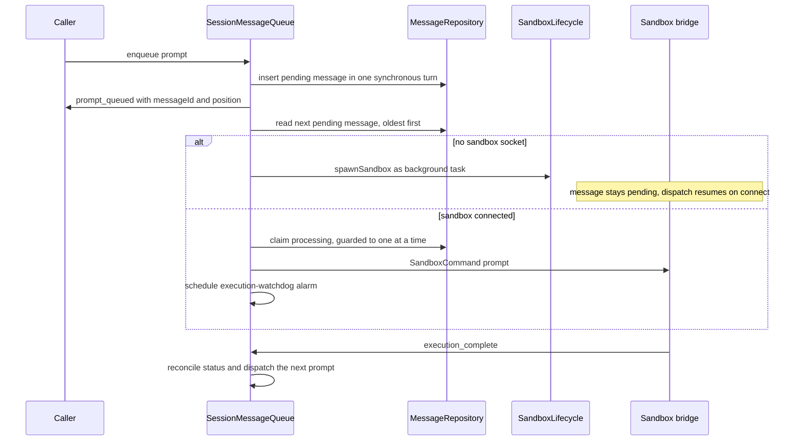
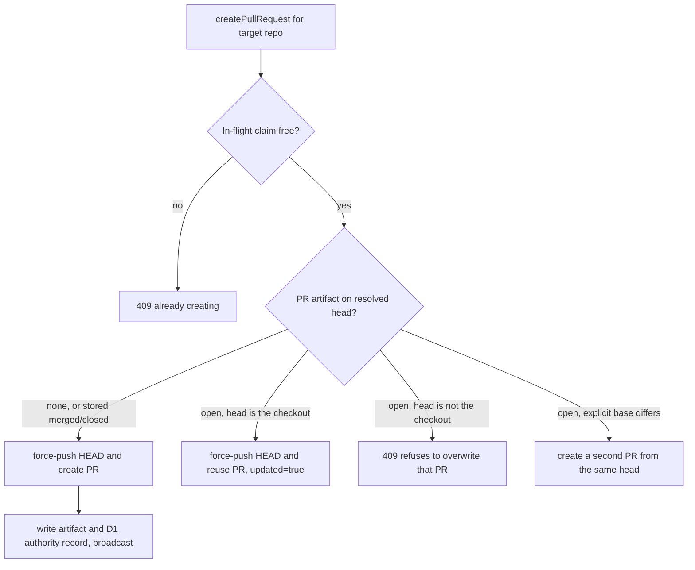

# Sessions

A **session** is the core unit of work in Open-Inspect: one conversation with one agent, a target
set of repositories, a prompt queue, an event timeline, and whatever artifacts the agent produced.
Every session lives in exactly one Cloudflare Durable Object whose embedded SQLite database holds
the session's hot state (`packages/control-plane/src/session/schema.ts`); the shared D1 database
keeps a list-index projection of it. This page is the domain model — what a session *is*, how it
moves through its lifecycle, how prompts queue, and how PRs, diffs, and child sessions behave.

Related pages: [Session Durable Object](/openwiki/architecture/session-durable-object.md) (the
runtime that implements all of this), [Environments and
Repositories](/openwiki/concepts/environments-and-repositories.md) (target resolution at creation
time), [Sandbox lifecycle](/openwiki/concepts/sandbox-lifecycle.md) (the compute side),
[Git auth and pull requests](/openwiki/workflows/git-auth-and-pull-requests.md), [Prompt
flow](/openwiki/workflows/prompt-flow.md), [Session
creation](/openwiki/workflows/session-creation.md).

## The unit of work, and what is stored

The conversation and the compute are deliberately separate vocabularies. `SessionStatus`
(`created`, `active`, `completed`, `failed`, `archived`, `cancelled`) describes the *conversation*;
`SandboxStatus` (`pending`, `spawning`, `connecting`, `warming`, `ready`, `stale`, `snapshotting`,
`stopped`, `failed`) describes the *current sandbox incarnation*. A session may be `completed` with
a live sandbox attached, or `active` with none at all — rendering one as the other is the bug the
split exists to prevent (`packages/shared/src/types/sessions.ts`).

One session DO holds exactly one `session` row plus its dependents:

| Table | Contents |
| --- | --- |
| `session` | Title, model/reasoning-effort defaults, `status`, scalar primary-repo mirror, lineage (`parent_session_id`, `spawn_source`, `spawn_depth`), opt-in `code_server_enabled`/`vnc_enabled`, running `total_cost`, resolved `sandbox_settings` JSON, `environment_id` provenance. A CHECK requires `repo_owner`/`repo_name` to be null together and forbids repo/branch context on repo-less sessions. |
| `messages` | The prompt queue and history: `status` (`pending`/`processing`/`completed`/`failed`), per-message model/effort overrides, attachments, `callback_context` for bot follow-ups, web idempotency (`client_request_id` + `request_fingerprint`), Autofix dedup keys, `stop_confirmation_deadline`. |
| `events` | Append-only agent event log with a `UNIQUE timeline_sequence` for stable ordering and cursoring. |
| `artifacts` | PRs, screenshots, videos, preview URLs; `updated_at` tracks PR lifecycle content changes. |
| `participants` | Session members: SCM identity for git attribution, AES-GCM-encrypted SCM tokens, `ws_auth_token` stored only as a SHA-256 hash. |
| `sandbox` | The compute incarnation: provider ids, snapshot ids, auth token (hash preferred), status machine, heartbeats, rotating code-server/VNC/ttyd access. |
| `session_repositories` | Multi-repo members in position order with per-repo git state. |
| `session_diff` | Singleton holding the latest durable checkout diff bundle. |

A `DurableObject`-evicted and re-created session is rebuilt entirely from these rows; nothing
process-local is authoritative.

The conversation lifecycle. `archived` and `cancelled` are not promptable; `completed` and `failed`
sessions accept follow-up work, which returns them to `active`.

### Lifecycle statuses and their predicates

Three shared predicates in `packages/shared/src/types/session-activity.ts` answer the different
questions callers ask, and their divergence is deliberate:

- **`isSessionPromptable`** — `created`, `active`, `completed`, `failed` accept follow-up work and
  the sandbox needed to run it; `archived` and `cancelled` do not. Prompt admission, sandbox
  WebSocket admission, and child prompts all gate on this.
- **`isSessionInactive`** — `completed`, `failed`, `archived`, `cancelled` are "no longer live
  work": used by child-session accounting, the cancel guard, and the sidebar indicator.
- **`isTurnSettled`** — `completed`, `failed`, `cancelled` end a turn and settle its metrics.
  `archived` is deliberately excluded: archiving is filing on an already-idle session, so there is
  no execution and no new metric to sync. A test asserts this divergence so it cannot quietly
  widen.

`SessionStatusService` (`packages/control-plane/src/session/session-status-service.ts`) owns the
status and is the single place every transition fans out: connected clients (`session_status`
broadcast), the D1 session index (status + monotonic `updated_at`, plus
`finalizeChildAdmission` when a child projects `active`), and — for child sessions — the parent DO
via a background `/internal/child-session-update` fetch. When a turn settles, terminal metrics
(total cost, active duration, message count, PR count) also mirror to D1.

The reconcile rules keep status derivable from message state:

- `reconcileAfterExecution(success)` — back to `active` when prompts remain queued, otherwise
  `completed`/`failed` by outcome.
- `reconcileAfterQueueRemoval` / `settleFromMessageState` — the same logic read off the queue and
  the latest terminal message.
- An idle session with *no messages at all* falls back to `created` — a deliberate backwards
  transition (reachable when the sole pending prompt is cancelled, deleting its row) that lets the
  abandoned-draft sweep reclaim empty drafts.

Unarchive never asserts a status of its own: it returns the session to whatever its messages imply
via `settleFromMessageState`, because asserting `active` claimed work that did not exist and no
settle path would correct it.

### Archive, cancel, and draft expiry

Archiving requires a participant, refuses `cancelled` sessions (409), and refuses sessions with
queued or processing work (409) — `archived` is not promptable, so archiving away queued work would
discard it. Cancellation is guarded by `isCancellable` (the negation of `isSessionInactive`) and
closes the aggregate atomically: status write, then a synchronous callback that fails every
unfinished message, then projections — no request may observe a cancelled session with unfinished
messages.

Drafts that were never prompted are retired by the worker cron through
`AbandonedDraftSweep` (`packages/control-plane/src/session/abandoned-draft-sweep.ts`): the web
client warms a session on the first keystroke, so navigating away leaves a `created` row whose
sandbox idles out but whose status would never advance. The sweep lists index rows `created` for
longer than `ABANDONED_DRAFT_TTL_MS` (8 hours — hours, not the sandbox's minutes, because the
composer holds no socket and the clock must outlast a long pause at the keyboard) and asks each DO's
`/internal/expire-draft`. The DO re-checks inside its own single-threaded state and answers
`archived`, `not_draft` (repairing a drifted index row via `repairIndexStatus`), or `has_work`
(settling status from message state; queued work is left for the dispatch timeout rather than
archived away).

## Session targets

At the request boundary exactly one target mode may be selected
(`createSessionRequestSchema`, `packages/shared/src/types/session-api.ts`): `environmentId`,
an ad-hoc `repositories` list, or the scalar `repoOwner`/`repoName`/`branch` form are mutually
exclusive; omitting all three creates a **repo-less session** (the CHECK above forbids branch or
repo-id context there). Every mode resolves to the same on-disk shape:

- **Ad-hoc lists are bounded and deduplicated**: at most `MAX_TARGET_REPOSITORIES` (10) entries,
  no duplicate `owner/name` and no duplicate `repoName` across owners (checkout paths are
  `/workspace/{repoName}`, so two members could never coexist).
- **Position 0 is the primary.** Member rows live in `session_repositories` in position order, and
  the primary is *mirrored* into the scalar `repo_owner`/`repo_name` columns — the mirror is what
  legacy consumers read. `initializeSession` rejects a `repositories[0]` that does not match the
  scalar mirror.
- **Pre-member-table sessions have no rows.** `buildSessionRepositories`
  (`packages/control-plane/src/session/repository-target.ts`) synthesizes a one-entry list from the
  scalar mirror for them; `isPrimary` means identity-equal to that mirror, which coincides with
  position 0 by the row-0-mirrors-scalars invariant.

### Resolving a PR/push target within a session

`resolveSessionRepositoryTarget` is the single model for PR and push target resolution, and its
errors are a security boundary, not input validation (the PR route is reachable with sandbox
auth):

- Matching is case-insensitive; the returned member carries the list's canonical casing.
- No repo requested + several members → `AmbiguousRepositoryTargetError` (400).
- Requested repo not a member → `RepositoryNotMemberError` (**403**).
- Half-specified `repoOwner`/`repoName` → `RepositoryPairValidationError` (400).

`mapRepositoryTargetError` maps these to status codes so the HTTP handler and the PR service cannot
drift, and the PR service re-resolves the target itself even though the handler already validated
it — defense in depth against a trusted-caller bypass.

## Prompt queueing

`SessionMessageQueue` (`packages/control-plane/src/session/message-queue.ts`) owns the prompt
lifecycle: admission, ordering, dispatch, stop, and failure recovery.

### Admission

Enqueue checks run in one synchronous turn so concurrent WebSocket requests cannot race between
idempotency lookup, capacity check, and insert:

- **Promptability** — a non-promptable session rejects with `SessionNotPromptableError`
  (`SESSION_NOT_PROMPTABLE`).
- **Capacity** — at most `MAX_UNFINISHED_PROMPTS` (**10**) pending-or-processing messages per
  session; over that is `PromptQueueFullError` (`PROMPT_QUEUE_FULL`). A prompt counts as unfinished
  from insertion until it reaches `completed`/`failed`.
- **Idempotency** — a web prompt's `clientRequestId` must map to the same participant *and* the
  same canonical request fingerprint (hash of participant, content, model, effort, attachment ids).
  A match deduplicates; a mismatch is `PromptRequestConflictError` (`PROMPT_REQUEST_CONFLICT`). A
  unique partial index on `client_request_id` makes the guarantee database-level.
- **Attachments** — attachment rows are claimed atomically with message creation; a partial claim
  aborts the whole message (`INVALID_ATTACHMENTS`).

A successful enqueue transitions the session to `active`, broadcasts the prompt queue
(`prompt_queue_updated`), and replies `prompt_queued` with the message id and 1-based position.

Admission, ordered dispatch, and the two dispatch edge cases for a missing bridge.

### Ordered processing

`processMessageQueue` is the pump, re-entrant from many places (enqueue, sandbox connect, execution
completion, termination recovery). Its guard chain, in order: promptable session → any message
awaiting stop confirmation (recover if past deadline, else schedule its alarm) → already processing
→ next pending message → provider authentication precheck (a model whose provider credentials are
missing fails the message *before* claiming, keeping the queue moving) → sandbox socket. Ordering
is `created_at ASC, rowid ASC` — strictly FIFO, with the processing message (if any) always ahead
of pending ones in the projected queue.

One prompt per session runs at a time, enforced twice: a unique partial index on
`messages(status) WHERE status = 'processing'`, and the transactional claim
(`startMessageProcessing` guards on `status = 'pending'` **and** `NOT EXISTS` another processing
row), so the invariant holds under concurrency.

### Dispatch edge cases

- **No sandbox socket** — the DO broadcasts `sandbox_spawning` and spawns *in the background*
  rather than awaiting it: a snapshot restore can take tens of seconds and would hold bot callers'
  request timeouts open. The message stays `pending` and dispatches when the bridge connects — the
  connect handler itself re-runs the queue.
- **Send failure** — the message returns to `pending` (its synthetic `user_message` event deleted
  in the same transaction), the unresponsive sandbox is terminated, and the queue resumes.
- **Execution timeout** — the shared DO alarm fails a stuck processing message with
  `Execution timed out (stuck processing)`; `failStuckProcessingMessage` deliberately does *not*
  send a stop command or pump the queue, avoiding races where a new prompt dispatches to a sandbox
  being torn down.

### Stop execution

`stopExecution` marks the processing message failed with a synthetic `execution_complete`, sets its
`stop_confirmation_deadline` to `now + 15s` (`STOP_CONFIRMATION_TIMEOUT_MS`), schedules that
deadline on the alarm, broadcasts, and sends `stop` to the sandbox. If the sandbox does not confirm
by the deadline (or the send itself failed), the sandbox is terminated as unresponsive and the
queue resumes. The `execution_complete` event handler *clears* the awaiting-stop marker, so a late
confirmation is harmless. `cancelExecution` (used by session cancellation) synchronously fails every
pending message ("cancelled before it started") and the processing message ("cancelled") in the same
turn the status flips.

A client can also **cancel a queued prompt** before it starts (`cancelQueuedPrompt`): only pending,
web-sourced messages without callback context are removable (`PROMPT_NOT_CANCELLABLE` otherwise);
the row is deleted, its attachments released, and status reconciled after the queue removal.

The same admission machinery serves other sources: `enqueuePromptFromApi` is the API path used by
bots, automations, and the child-prompt handler; `enqueueAutofix` admits GitHub feedback prompts
through `admitAutofixMessage` with feedback-key deduplication, a 24-hour rolling attempt window per
pull request, and a closed-session check.

## Participants, attribution, and presence

Anyone who sends a prompt becomes a **participant** (`ParticipantRow`): a per-session identity with
a role (`owner` or `member`), SCM profile (`scm_user_id`, `scm_login`, `scm_name`, `scm_email`),
AES-GCM-encrypted SCM tokens, and a WebSocket auth token stored only as a SHA-256 hash. Prompts
arrive from many surfaces — `MessageSource` is `web`, `slack`, `linear`, `extension`, `github`,
`automation`, or `agent` — and the source is persisted on every message for routing and metrics.

**Prompt attribution** resolves at enqueue and again at dispatch: the author's SCM profile is
turned into a `PromptGitIdentity` — `attributed-user` (name + email, e.g. GitHub's
`{id}+{login}@users.noreply.github.com` form) when the profile is complete enough, or `agent-only`
as the fallback — and carried on the `SandboxCommand` so the sandbox's git commits credit the human
who prompted, not the agent (`packages/control-plane/src/session/identity.ts`). The synthetic
`user_message` event broadcast to clients carries the participant's display name and avatar.
PR creation attributes to the *currently processing* message's author
(`getPromptingParticipantForPR`), which is why PR routes must run inside an active turn.

**Presence** is projection, not storage: `PresenceService` derives the participant list from the
WebSocket manager's connected clients, deduplicating by participant (two browser tabs are one
participant — any active socket marks it active, `lastSeen` takes the newest). A `typing` indicator
with no sandbox connected proactively warms one (`sandbox_warming` broadcast + spawn).

## Artifacts and the per-branch PR model

Artifacts are typed rows (`pr`, `screenshot`, `video`, `preview`, `branch`) with a nullable URL and
a JSON metadata blob. PR artifacts carry typed metadata: `number`, `lifecycleState`
(`open`/`closed`/`merged`), `isDraft` (only valid while open), `head` and `base` branch names,
`repoOwner`/`repoName`, `repositoryExternalId`, and `providerUpdatedAt` — the monotonic write-guard
source. Metadata is decorative: a corrupt blob degrades to null (or `{}`) rather than failing the
read that surfaced it.

### One open PR per head branch

`SessionPullRequestService.createPullRequest`
(`packages/control-plane/src/session/pull-request-service.ts`) implements the per-branch policy:
**a PR's identity is (repo, head, base), and each head branch carries one open PR.** Creation:

1. Resolve the target member repository (the security-boundary resolution above) and acquire an
   in-flight creation claim per repo — PR creation spans several awaits during which the DO serves
   other requests, so the persisted-artifact scan alone cannot serialize two concurrent creations
   (a second caller gets 409).
2. Resolve the head branch: the request's explicit `headBranch`, else the target repository's
   stored working branch (the session branch for the primary), else a generated session branch.
   Resolve the base: the request's `baseBranch`, else the member's base branch, else the repo
   default.
3. Scan the session's PR artifacts for ones whose head branch matches the resolved head
   (`listPrArtifactsForHead`; metadata without a `head` — written before per-branch PRs — belongs
   to the generated session branch by construction).
4. Walk the candidates, resolving each against the provider's *live* state (artifact metadata only
   hears about merges from webhooks or refresh), then force-push the sandbox checkout (`HEAD`,
   force) onto the resolved head and either reuse the open PR or create a new one.

The per-branch decision. Reuse is a force-push, not a no-op; refusal protects a PR whose branch
holds content this request never saw.

The reuse rule has a safety rider: reusing (force-pushing over) an open PR is only safe when the
head **is the checkout** — an explicitly requested branch, or the generated session branch whose
content is by construction whatever `HEAD` pushes onto it. A stored custom branch reached via
fallback (e.g. the top of a stack recorded as the last-pushed branch) holds content this request
never saw, so the service refuses with 409 instead of destroying that PR. Stored-merged/closed
artifacts *release* their head: the walk skips them (without even a provider read when the stored
state already shows merged) and a follow-up after a merge creates a fresh PR from the same branch.
A stale-open artifact is healed against the live provider read before the walk continues.

On success the service writes one `pr` artifact, updates the session's stored branch, broadcasts
`session_branch` (even when already current, so missed-update clients converge) and
`artifact_created`, and returns the resolved head/base plus `updated: false` (created) or
`true` (reused). Draft mode comes from the request or the SCM policy's `alwaysUseDraftMode`; PR
auth prefers the prompting user's OAuth and falls back to the app token for sessions without it.

### Snapshot authority and mirror

Every writer maps a provider snapshot through one module,
`packages/control-plane/src/session/pull-request-snapshot.ts` — creation, the webhook snapshot-push
endpoint, and read-through refresh all derive both the D1 authority record and the DO artifact
metadata from the same mapping, so the field mapping cannot drift per writer. Application follows
the authority-then-mirror rule (`pull-request-snapshot-apply.ts`): upsert the D1
`session_pull_requests` record first — a snapshot its monotonic `providerUpdatedAt` guard rejects
as stale never reaches the mirror, while a *thrown* upsert stays best-effort (the first webhook or
read-through repairs a missing record) — then re-read the artifact at apply time, then perform the
guarded mirror write and return the `artifact_updated` payload for the caller to broadcast.

Freshness has two paths: the **webhook** pushes snapshots into the DO as they arrive, and the
**read-through refresh** (`pull-request-refresh.ts`) runs on session open and on the manual sync
action — it is the only freshness path that reads the provider directly and the only one required
when the bot is off. The manual trigger answers 202 immediately and refreshes in the background;
a failed provider read is recorded per artifact rather than failing the pass.

## Diff artifacts

Separate from PRs, each session carries one *durable checkout diff bundle* — the working-tree
change set relative to the session's baselines — stored as a **singleton row** in the DO's
`session_diff` table (`packages/control-plane/src/session/diffs/`):

- The sandbox computes the bundle and POSTs it; `SessionDiffService.publishBundle` validates it and
  atomically **replaces** the current bundle with a new revision id (clearing any prior refresh
  error). Only the latest revision is kept — patches are bounded (≤ 1,000 files, ≤ 512 KiB per
  patch, ≤ 1 MiB total patches, ≤ 1.5 MiB encoded bundle) and live only in this row.
- **Baselines** are pinned from the sandbox's `ready` event (`pinBaselines`): the advertised
  repository set must match the session's configured repositories in order and identity, and each
  bundle's `baseSha` must equal the pinned baseline — a bundle computed against the wrong base is
  rejected (`DiffBaselineMismatchError`).
- Clients fetch a patch-free **manifest** of the current revision (`diff-state`) and resolve
  individual file patches by `(revisionId, fileId)`. Resolution is revision-pinned: a stale
  revision answers `409 diff_revision_stale` with the current revision id, an unknown or
  non-renderable file answers `404 diff_file_not_found` — the client can never render a patch that
  no longer matches the manifest it holds.
- A failed refresh is recorded **alongside** the bundle (`recordRefreshFailure`), never discarding
  the last good revision; `refresh_diff` requests a non-blocking recompute from the connected
  sandbox (409 when none is connected).

## Child sessions

A session can spawn child sessions — independent conversations in their own sandboxes, each with
its own queue, artifacts, and PR flow. The parent agent uses installed runtime tools
(`packages/sandbox-runtime/src/sandbox_runtime/tools/`) that call the control plane with the
sandbox's own auth token (`SANDBOX_AUTH_TOKEN` via `_bridge-client.js`):

- **`spawn-child`** — `POST /sessions/:parentId/children` with `title`, `prompt`, optional
  `model`/`reasoningEffort`. Returns immediately with the child id; the tool description restricts
  it to explicit "child session" requests (in-process delegation uses the Task tool instead), and
  maps 403 to depth/repo guidance and 429 to rate limiting.
- **`send-child-prompt`** — `POST /sessions/:parentId/children/:childId/prompt` queues a follow-up
  in the child's normal durable queue (it does not interrupt active work; completed and failed
  children can resume, cancelled and archived ones cannot).
- **`get-child-status`** — list children or fetch one child's detail, optionally with the final
  assistant response and a paginated trajectory.
- **`cancel-child`** — `POST .../cancel` with `cancelNested` defaulting to true.

### Spawn flow and guardrails

`POST /sessions/:parentId/children` (`packages/control-plane/src/routes/session-child-spawn.ts`)
composes the child from the parent's state:

- **Depth limit**: `MAX_SPAWN_DEPTH = 2` — a parent at depth 2 cannot spawn (403).
- **Repository guardrail**: the child pins to the parent's primary repository. `spawn-context.ts`
  is deliberately scalar in v1 — children inherit the parent's primary repo *even for multi-repo
  parents*, and a requested `repoOwner`/`repoName` that differs from the parent's is a 403; a
  repo-less parent cannot gain repository context. Children are single-repo by design.
- **Config inheritance**: the child inherits the parent's model and reasoning effort (validated
  against the model and the deployment's enabled models), its sandbox settings scope (primary repo
  plus environment overrides), code-server/VNC flags, and — loaded from D1 — the parent's complete,
  immutable provider-auth snapshot (`inheritedFromSessionId: parentId`); a snapshot that fails to
  load fails the spawn (503) rather than creating a half-authenticated child.
- **Per-repo admission limits**: `maxTotalChildSessions` (default 15) caps children ever spawned;
  `maxConcurrentChildSessions` (default 5) caps *active* ones.
- **Initialization order**: `initializeSession` writes the D1 index first — failures are caught
  before any sandbox can spawn — then initializes the child DO; a DO-init failure marks the D1 row
  `failed` so no phantom `created` session lingers.
- The initial prompt is enqueued with source `agent` attributed to the parent's active prompt
  author, and the parent DO is notified (`child_session_update`) so its UI refreshes.

### D1 admission leases

Concurrency is enforced by an **atomic D1 lease** (`SessionIndexStore.acquireChildAdmissionLease`,
`packages/control-plane/src/db/session-index.ts`): one conditional insert counts the parent's
non-terminal descendants *plus* unexpired leases (`child_admission_leases` rows with a 5-minute
TTL) against the limit, expiring stale leases before counting. The lease is released on spawn
failure, finalized when the child's `active` status projects to the index, and — on an ambiguous
transport error, where the child may have accepted the prompt before the response was lost — kept
until active-state finalization or expiry rather than undercounting. Resuming a `completed`/`failed`
child acquires the same lease and answers 429 when the parent is at capacity.

### The parent-token boundary

The parent's sandbox token is **never exchanged for the child's sandbox token**. For both spawning
and follow-up prompts, the control plane authenticates the parent, verifies the direct
parent-child relationship in D1 (`isChildOf` / `parentSessionId` equality), forwards into the child
DO's internal `parent-prompt` endpoint, and the child DO verifies the relationship a second time
against its own authoritative row. The queued prompt is attributed to the propagated prompt author
(resolved from the parent's *currently processing* message — child operations require an active
parent turn) with source `agent`, and no SCM credential is copied into the child beyond what the
parent's spawn context already carried. Child status changes fan back to the parent DO
(`notifyParentOfChildUpdate`) for real-time UI rollup, and cancellation cascades bottom-up through
a bounded recursive descendant query (`MAX_DESCENDANT_DEPTH = 10` as cycle insurance), reporting
per-descendant 409s as already-terminal rather than failures.

Parents read children through `/internal/child-summary`
(`packages/control-plane/src/session/http/handlers/child-summary.handler.ts`): status, sandbox
status, artifacts, recent events, `hasUnfinishedPrompt`, and on request the final assistant
response (with event-count bounds) and a cursor-paginated trajectory.

## Focused tests that matter

- `session/message-queue.test.ts` and `session/stop-execution.test.ts` pin admission (capacity,
  idempotency conflict vs. dedupe, non-promptable rejection), the one-processing claim, background
  spawn deferral, and stop-confirmation behavior.
- `session/session-status-service.test.ts` pins the reconcile rules, the `created` fallback, and
  parent notification.
- `session/pull-request-service.per-branch.test.ts` pins the per-branch policy: force-push reuse,
  follow-up-after-merge, the force-push-safety 409, base-pair stacking, and live-vs-stored state
  resolution.
- `session/diffs/service.test.ts` and `store.test.ts` pin baseline pinning/mismatch, atomic bundle
  replacement, and revision-stale file resolution.
- `routes/session-children.test.ts` and `router.spawn-child.test.ts` pin lease acquisition/release,
  depth and repository guardrails, and provider-auth inheritance.
- `session/abandoned-draft-sweep.test.ts` pins draft expiry outcomes (`archived`/`not_draft`/
  `has_work`) and orphan cleanup.

## Related pages

- [Session Durable Object](/openwiki/architecture/session-durable-object.md) — the runtime,
  SQLite schema, WebSocket hub, and alarm scheduler behind everything above
- [Environments and Repositories](/openwiki/concepts/environments-and-repositories.md) — how
  targets are resolved and snapshotted at creation time
- [Sandbox lifecycle](/openwiki/concepts/sandbox-lifecycle.md) — spawn, snapshot, restore, and the
  sandbox status machine
- [Git auth and pull requests](/openwiki/workflows/git-auth-and-pull-requests.md) — credentials and
  the SCM provider layer under the PR flow
- [Prompt flow](/openwiki/workflows/prompt-flow.md) — the end-to-end path of a prompt
- [Session creation](/openwiki/workflows/session-creation.md) — the creation entrypoints and their
  validation
