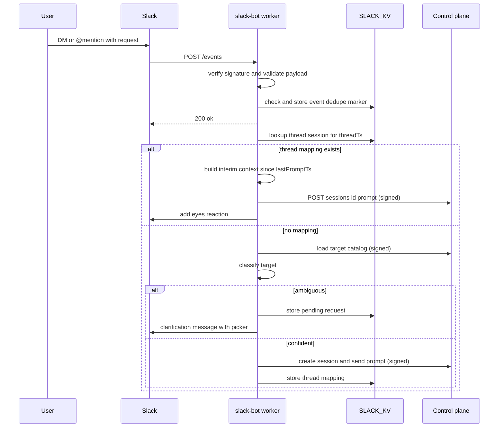
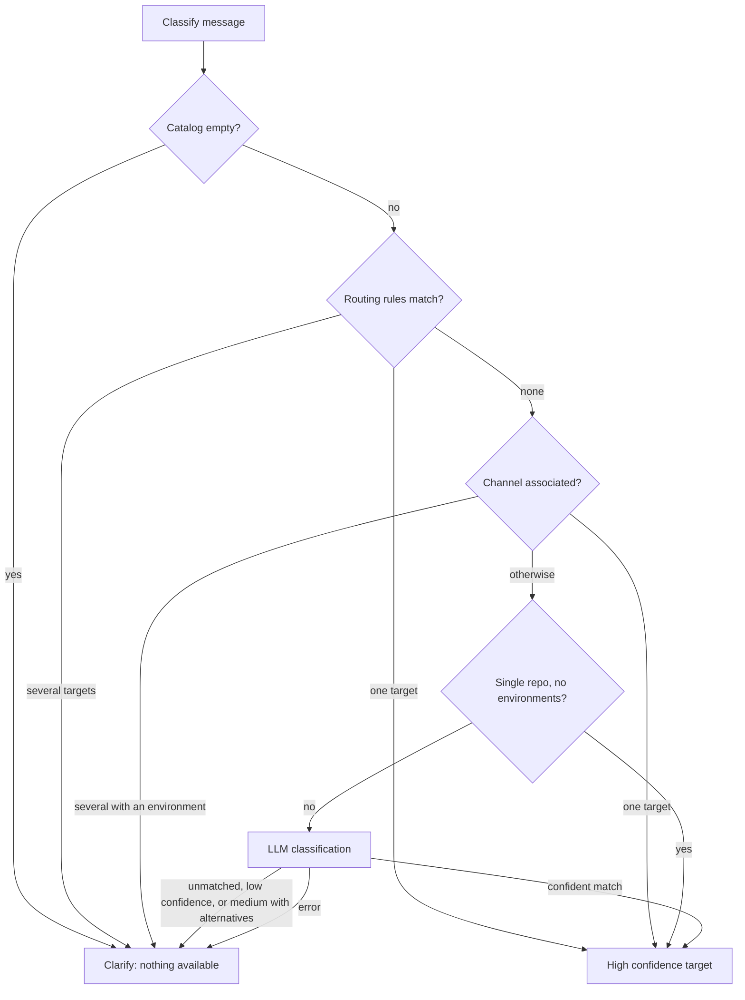
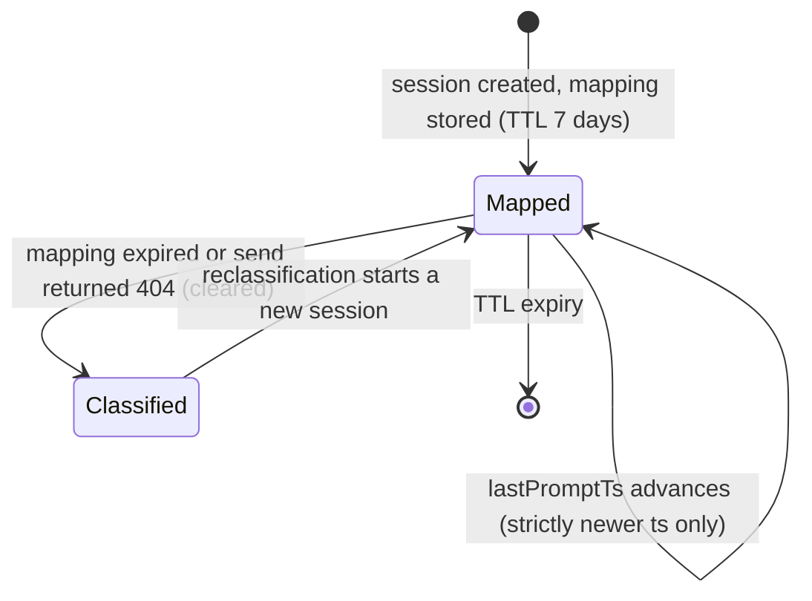
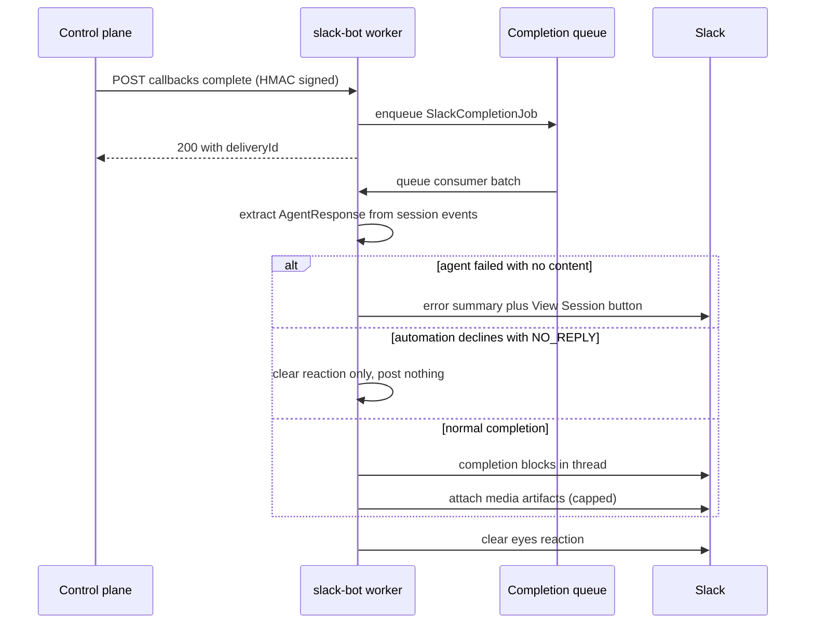

# Slack Bot Integration

The Slack bot (`packages/slack-bot`) is a Cloudflare Worker that turns Slack messages — DMs, `@mentions`,
and ambient channel messages — into Open-Inspect coding sessions, and posts the agent's results back
into the same Slack thread. It owns the entire Slack-facing surface: event verification and
dispatch, target classification (which repository or environment a message refers to), the
clarification picker shown when the classifier cannot decide, per-user preferences in the App Home,
thread-to-session continuity, and asynchronous completion delivery.

Related pages: [Security & Tokens](/openwiki/concepts/security-and-tokens.md) (the `sig1`
service-auth format reused for every control-plane call), [Environments & Repositories]
(/openwiki/concepts/environments-and-repositories.md) (environment session targets and channel
associations), [Models & Provider Accounts](/openwiki/concepts/models-and-provider-accounts.md)
(model catalog and reasoning-effort rules), [Automations](/openwiki/workflows/automations.md)
(channel-trigger scheduling), [GitHub Bot](/openwiki/integrations/github-bot.md) and
[Linear Bot](/openwiki/integrations/linear-bot.md) (sibling integrations sharing the same
control-plane contract).

## Worker shape and bindings

The worker is a Hono app (`src/app.ts`) whose entry exports both a `fetch` handler and a `queue`
consumer (`src/index.ts`). Routes: `GET /health`, `POST /events` (Slack Events API),
`POST /interactions` (Slack interactivity), the callbacks router (`POST /callbacks/complete`,
`/callbacks/tool_call`, `/callbacks/automation-complete`, `/callbacks/automation-skip`), and
`POST /internal/thread-context` (called by the control plane's scheduler). There are no slash
commands; in channels, an interactive request requires an `@mention`.

| Binding / var | Kind | Purpose |
| --- | --- | --- |
| `SLACK_KV` | KV namespace | Thread→session mappings, pending clarification requests, user preferences, repo branch overrides, event dedupe, cached control-plane reads, bot identity |
| `CONTROL_PLANE` | Service binding | All internal calls (session create/prompt, repos, environments, integration settings, media), signed `sig1` as `slack-bot` |
| `SLACK_COMPLETION_QUEUE` | Queue (+ DLQ) | Durable handoff for every completion callback before delivery to Slack |
| `WEB_APP_URL`, `DEFAULT_MODEL`, `CLASSIFICATION_MODEL`, `DEPLOYMENT_NAME`, `APP_NAME`, `CONTROL_PLANE_URL` | Plain text | Deep links, fallback model, classifier model override, logging |
| `SLACK_BOT_TOKEN`, `SLACK_SIGNING_SECRET`, `SERVICE_AUTH_SECRET` | Secrets | Slack API access, request verification, per-service `sig1` secret (also verifies control-plane callbacks) |
| `ANTHROPIC_API_KEY` or `OPENAI_API_KEY` | Secret | Exactly the one `CLASSIFICATION_MODEL` selects |

Terraform deploys the worker with the completion queue (`batch_size 1`, `max_retries 1`,
`max_concurrency 5`) and its dead-letter queue
(`terraform/environments/production/workers-slack.tf`).

## Inbound message path

Every Slack delivery runs this pipeline:

*Interactive message ingest: verification and dedupe are on the request path; classification,
session launch, and Slack posting run under `waitUntil` after the 200.*

1. **Signature verification.** `/events` and `/interactions` both verify Slack's `v0` HMAC
   signature over the raw body with `SLACK_SIGNING_SECRET`, rejecting stale timestamps outside a
   5-minute replay window with **401**. Open-Inspect acts on verified requests only.
2. **Envelope validation and handshake.** The payload must parse against
   `slackEventPayloadSchema` (Zod, shared file/attachment shapes with the shared Slack client);
   `url_verification` challenges are answered with the challenge echo.
3. **Event dedupe.** The `event:{event_id}` marker (TTL 1 hour) suppresses Slack redeliveries.
   The dedupe cache is best-effort: if KV is unavailable the request logs
   `slack.event.dedupe_unavailable` and proceeds without deduplication rather than returning 500,
   which would drop the original work and guarantee retries.
4. **Immediate 200, async handling.** The route returns `{ ok: true }` and hands
   `handleSlackEvent` to `executionCtx.waitUntil`.

### Event dispatch

`handleSlackEvent` (`src/events/dispatcher.ts`) routes on the event shape:

- Events carrying `bot_id` are dropped outright — the bot never responds to itself.
- `app_home_opened` on the `home` tab publishes the App Home view.
- `message` events with `channel_type: "im"` that pass `isDmDispatchable` (no subtype except
  `file_share`; text, files, or attachments present) go to `handleDirectMessage` — no `@mention`
  needed, and one typed anyway is stripped.
- `app_mention` events go to `handleAppMention`.
- Every other `message` event goes to `handleChannelTrigger` (ambient channel-message automation
  ingress, below).

### Mention and DM content recovery

`handleAppMention` must reconstruct content Slack omits: `app_mention` events never carry the
message's `files` array and may arrive without the `attachments` holding forwarded-message bodies.
When either is missing, the handler re-reads the message from conversation history
(`getMessageDetails`) overlapped with the channel-info fetch — whatever the event did carry wins;
a failed lookup is logged (`slack.attachment.file_lookup_failed`) rather than treated as "no
files". Channel name plus topic/purpose are fetched unconditionally because image-only mentions
rely on channel context as their main classification signal. Text has mention tokens stripped by
the `strip` mentions policy before further handling.

**Forwarded messages.** A shared (forwarded) Slack message arrives as a `message` attachment
flagged `is_share`; the body is recovered from the attachment's `text` (or Slack's `fallback`
plain-text rendering), truncated at 4,000 characters, capped at 10 forwarded messages per
request, and joined with its author, source channel, permalink, channel id, and message ts so an
agent with Slack tooling can read the original thread. The forwarded messages' own Slack-hosted
files merge into the same image path as directly attached files. Link-preview unfurls in the same
array are skipped — they restate a link the text already carries. The forwarded quote is placed
*before* the user's own text: "deal with this" reads as the instruction only when it comes last.
A message that only forwards (no comment) gets the stand-in prompt `FORWARD_ONLY_PROMPT_TEXT`.

**Image attachments.** Raw Slack file payloads are normalized once at ingress by
`toImageAttachments`: only `image/png`, `image/jpeg`, `image/webp`, and `image/gif` are accepted,
the download URL must be https on `slack.com` or `*.slack.com`, and remote (`mode: "external"`)
files are rejected — following a registrant-supplied `url_private` would hand the
`Authorization: Bearer` header to an arbitrary host. Downloads use `redirect: "manual"` so a
redirect off Slack never carries the bot token, re-check the trusted-host policy, and enforce the
10 MiB per-image cap both by declared size and by capped body read. At most six images per
message flow onward (matching `MAX_SESSION_ATTACHMENTS_PER_MESSAGE`); everything beyond the cap
is recorded as dropped, never silently lost. A message that carries only images gets the stand-in
prompt `IMAGE_ONLY_PROMPT_TEXT`, and an image-only request whose images all fail produces **no**
session and **no** prompt — only a thread warning with reason-specific guidance (e.g. the missing
`files:read` scope).

**Prompt-side attachment delivery** lives in one place (`deliverPrompt`): upload the prepared
images (multipart body serialized exactly once so the `sig1` body hash matches the bytes sent),
then send the prompt carrying only `{ attachmentId, name }` references, then — and only then —
post the dropped-image notice, so uploads that failed merely because the session vanished are
retried against the replacement session instead of alarming the user.

## Target classification

When no thread mapping applies, the message handler classifies which **target** — a repository or
a saved environment — the message refers to. Targets unify both kinds
(`SlackSessionTarget`): option values are the repo id (`owner/name`) or `env:<environmentId>`.

*The classifier's staged ladder: deterministic stages run before the LLM so explicit
configuration always wins and environment-targeted rules stay reachable in one-repo workspaces.*

**Target catalog.** `loadTargetCatalog` fetches repositories and environments concurrently.
Repositories come from the control plane's `GET /repos` (the GitHub App installation's accessible
repositories, with aliases, keywords, descriptions, default branches, and channel associations),
bounded by a 5-second timeout — the catalog sits on the critical path of every mention inside
`waitUntil`, and a cold fetch consuming the whole background budget would drop the request after
the ack had posted. Both sides cache in memory (60s) and KV (300s) with last-known-good
fallbacks; environments **fail open to an empty list**, so an environments outage degrades
classification to repository-only without blocking anything, while a fully empty catalog
short-circuits to clarification ("no repositories or environments are currently available").

**Stage 1 — routing rules.** Workspace keyword→target rules (configured in the web app under
Settings → Integrations → Slack) are fetched from `GET /integration-settings/slack` through a
cached resource that fails open to an empty list. `matchRoutingRules` matches keywords as whole,
case-insensitive tokens (word-boundary regex with `escapeRegExp` literal keywords, so `api`
matches "the api is down" but not "rapidly"; multi-word keywords match as a phrase) and applies
in DMs too. Rules are normalized on every path (trim/lowercase, dedupe, cap at 100) and resolve
against the live catalog, so a rule whose repository lost access or whose environment was deleted
becomes inert instead of routing somewhere unexpected. Exactly one accessible match yields a
high-confidence result; several distinct matches yield clarification seeded with those candidates
rather than a guess. Routing rules never override an active thread — thread replies are handled
before classification runs.

**Stage 2 — channel associations.** Environments and repositories whose `channelAssociations`
name the current channel are considered (environments first). Exactly one associated target wins
with high confidence; several associated targets that include an environment ask the user
deterministically instead of trusting the LLM to weigh an association it is not explicitly told
about.

**Stage 3 — single-repo shortcut.** With one repository and no environments there is nothing to
choose.

**Stage 4 — LLM classification.** The prompt lists every repository (id, fullName, description,
aliases, keywords, default branch, privacy) and environment (id, name, description, member
repositories — "prefer an environment when the message names it or work spans several"), plus the
channel name/description, thread flag, and recent thread messages. The model is selected from
`CLASSIFICATION_MODEL` (default `claude-haiku-4-5`): ids prefixed `anthropic/` or `claude-` use
the Anthropic Messages API with a forced `classify_target` tool choice (temperature 0, 500
tokens, 10s timeout); `openai/` or `gpt-` ids use OpenAI's strict structured-output mode driven
from the same JSON schema declaration. Both paths funnel through the same Zod validation
(`targetId`, `confidence`, `reasoning`, deduplicated `alternatives`). The returned id resolves
against the catalog deterministically (`env_…` → environment; else repo id/fullName; else
environment name). Clarification is required when nothing matched, confidence is `low`, or
confidence is `medium` with alternatives; an LLM error produces clarification with no suggested
alternatives (the picker still lists everything). The reasoning text is escaped as mrkdwn since
it renders in the thread.

## Target clarification and pending requests

When classification cannot decide, the original request is parked and the user chooses:

- **Pending request store.** `storePendingRequest` writes `pending:{channel}:{threadTs}` with a
  1-hour TTL: the message text, requester, unattributed forwarded-message text, thread context,
  channel name/description, `imageOnly`, and — for images — only the *locator* of the source
  message (`ts` + `threadTs`), never the file objects, so no URL-bearing Slack payloads sit in KV
  across the clarification round-trip.
- **Clarification message.** The classifier's reasoning renders as italic text, its ranked
  alternatives become up to 5 quick-pick buttons (unique `action_id`s; display names that collide
  fall back to `owner/name` or `name (environment)`), and a searchable picker covers the rest:
  a `static_select` when the catalog fits Slack's option budget, otherwise an `external_select`
  with `min_query_length: 0` whose `block_suggestion` responses filter environments by name and
  repositories by full name, grouped Environments-then-Repositories (flat options while the
  workspace is repository-only). Action-id wire values predate environments and are kept stable
  so pickers on already-posted messages keep working.
- **Selection handling.** `/interactions` (signature-verified) routes `select_repo` and
  `select_repo_quick_pick` actions to `handleTargetSelection`: load the pending request (missing →
  "couldn't find your original request"), resolve the chosen value against the live lists
  (`env:` prefix → environment; gone → "no longer available"), re-fetch the source message's
  files from Slack and refuse an image-only request whose images are lost, post the "Working
  on *target*..." ack, launch the session with the original request plus stored context, delete
  the pending request, and update the ack with a **View Session** button.

## Session launch and prompt construction

`startSessionAndSendPrompt` is the single launch path for the direct flow and the clarification
flow:

1. **Prepare images first** — an image-only request whose images all fail never creates a
   session it would not prompt.
2. **Resolve per-user preferences.** `getAvailableModels` reads the workspace's enabled models
   from the control plane (`GET /model-preferences`, signed) and falls back to the default
   enabled set; `getSlackSettings` reads the workspace default model and session instructions
   (`GET /integration-settings/slack`); `getResolvedUserPreferences` reads `user_prefs:{userId}`
   from KV and validates the stored model against the enabled list, the reasoning effort against
   the chosen model, and normalizes the branch.
3. **Branch preference.** For a repository target: repo-specific override
   (`user_repo_branch:{userId}:{repoId}`) → global override → repository default branch. An
   environment target defines its own branches, so no branch is sent.
4. **Create the session** via signed `POST /sessions` with `repoOwner`/`repoName` + optional
   `branch` **or** `environmentId` only (mutually exclusive per the create schema), the resolved
   model and reasoning effort, and the Slack actor's display name and email for identity linking.
   The sig1 `actor` header asserts `slack:{userId}` so the control plane can attribute the
   session to an external identity.
5. **Build the prompt.** Channel context (name + description), thread context ("Context from the
   Slack thread"), the attributed request (`[Name (U…)]: text`, sender label from `users:read`
   with email via `users:read.email`), and — for new sessions only — the workspace's Slack
   **session instructions** appended as an `## Additional Instructions` section (bounded at
   10,000 characters, mirroring the Linear integration).
6. **Deliver and remember.** `deliverPrompt` uploads attachments and sends the prompt
   (`POST /sessions/{id}/prompt` with `source: "slack"` and a `callbackContext` carrying channel,
   threadTs, target label, model, and reasoning effort). Only after acceptance is the
   thread→session mapping stored — and `lastPromptTs` seeded with the triggering message ts so
   later follow-ups scope interim context correctly.

Preferences apply to *new* sessions; a thread follow-up continues the existing session regardless
of any preference changed in between.

## Thread continuity

*Thread-to-session lifecycle: the KV mapping is the continuity contract, and staleness degrades
to a fresh classification rather than a dead thread.*

The mapping (`thread:{channel}:{threadTs}`, zod-validated on read) records `sessionId`, target
id/label, model, reasoning effort, `createdAt`, and `lastPromptTs`. A thread reply delivers the
prompt to the same session with **interim thread context** — the human messages posted since
`lastPromptTs` (bot messages excluded, newest-first window of 10) — so the agent sees discussion
that happened between invocations. The checkpoint advances only when the new ts is strictly
newer: KV has no compare-and-swap, so concurrent follow-ups could race, and the re-read guard
ensures a slow older reply never moves the watermark backwards (a lost race at worst
re-includes a few already-forwarded messages). If the interim fetch failed the checkpoint is
left alone so the next follow-up retries the window. A `404` from the prompt send means the
session is gone: the mapping is cleared and the message falls through to full reclassification,
possibly starting a new session. Each accepted follow-up also adds an 👀 reaction to the reply,
cleared when the completion posts.

## App Home preferences

`app_home_opened` publishes a per-user **Home** tab: a model selector (enabled models from the
control plane, falling back to the default enabled set when the fetch fails), a reasoning-effort
selector shown only for models with a reasoning config, a global branch override, and
per-repository branch overrides via an `external_select` repo search. Interactions route through
an App Home block-action table on `/interactions`: the branch-modal open and repo-branch selector
respond inline (they need `trigger_id`/suggestion responses), while model and effort selections
run in the background. Branch modals carry `private_metadata` encoding the user (and repo) id,
submitted values are validated as git branch names (leading `-`, `@`, `..`, `//`, `.lock`
segments, and control characters are rejected), and every successful change republishes the view
(capped at 50 rendered override rows to stay inside Slack's 100-block view limit).

All preferences are **per Slack user** and stored in KV (`user_prefs:{userId}`,
`user_repo_branch:{userId}:{repoId}`), affecting new Slack sessions only, with the priority
repo-specific override → global override → repository default branch.

## In-flight feedback

Between acceptance and completion the bot keeps the thread informed: a "Working on *target*..."
message (with the classifier's reasoning) is updated with a **View Session** button once the
session exists; the Slack assistant thread status is set to "Starting..." at launch and to
"Working..." on each `tool_call` callback (with a formatted summary like "Editing src/x.ts" or
"Running npm test" in the loading message); and follow-up messages get the 👀 reaction described
above. Everything here is best-effort and logged on Slack errors, including rate-limit
`retry_after` values.

## Completion delivery

All completion replies are delivered asynchronously through the Cloudflare Queue — no completion
is posted synchronously from the agent loop:

*Completion delivery: the callback only enqueues; the queue consumer owns extraction, block
building, media upload, and reaction cleanup.*

**Callback ingress.** The control plane calls `POST /callbacks/complete` for interactive sessions
(and for steered automation follow-up turns) and `POST /callbacks/automation-complete` for
channel-trigger runs; both verify the control plane's in-body HMAC signature — signed with this
bot's own `SERVICE_AUTH_SECRET` — and reject unauthorized or malformed payloads. Each accepted
callback enqueues a versioned `SlackCompletionJob` (uuid `deliveryId`, `source` of `session` or
`automation` derived from the callback context's `automationId`, session/message ids, success and
error, Slack coordinates, and a `{repoFullName, model, reasoningEffort}` context) and returns
**200 with the deliveryId**. The queue consumer parses each message (invalid → ack and drop) and
always acks after processing, even on error: a retry could duplicate Slack posts whose side
effects already happened.

**Response extraction.** `extractAgentResponse` (a thin wrapper over the shared extractor) pulls
the session's events filtered by `message_id` (paginated, signed), keeps the last cumulative
`token` event as the final text, summarizes `tool_call` events, and merges artifacts from the
dedicated artifacts endpoint. A response with no text, no tool calls, and a failure posts a
short "The agent failed: …" message (error truncated, whitespace-collapsed) with a **View
Session** button.

**Declining to reply.** `shouldDeclineReply` posts nothing when the run was **automation-sourced**,
succeeded, produced no artifacts and no media, and its entire final text is empty or the
`NO_REPLY` sentinel (a trailing period is tolerated). This lets an automation watching a busy
channel stay silent on messages that turn out to need nothing — interactive sessions always post
(a person is waiting), falling back to "_Agent completed._", and any run that produced artifacts
always posts so the work gets a pointer.

**Block building.** `buildCompletionBlocks` renders: the response text split across section
blocks (3,000-character sections, at most 20, with code fences kept balanced across the seam); a
"Created:" section listing PR/branch artifacts as links; up to five key tool actions
(`Edit`/`Write`/`Bash` summaries); a status footer (✅/⚠️, Done / Failed: … / Completed with
issues, plus model, reasoning effort, and the escaped target label); a **View Session** button;
and a **Create PR** button when the agent created a manual-PR branch artifact (metadata
`mode: "manual_pr"`, or the legacy `createPrUrl`) and no PR artifact already exists.

**Media upload.** `deliverMediaArtifacts` dedupes the session's media artifacts and enforces the
delivery bounds: five files per completion, 10 MiB per file, 25 MiB total. Each artifact is
streamed from the signed internal `GET /sessions/{id}/media/{artifactId}` endpoint, validated on
mime type (png/jpg/webp/mp4 extension mapping) and `Content-Length`, and published through
Slack's external-upload three-step (`files.getUploadURLExternal` → `files.uploadToExternal` →
`files.completeUploadExternal`) into the completion thread with the caption (or artifact id) as
title and alt text. Anything omitted or failed produces a short notice pointing at **View
Session**; files merely written into the repository are never uploaded automatically. The
completion flow's `finally` block clears the 👀 reaction whatever happened.

## Channel message triggers (automations)

Ambient (non-mention) messages can start an **automation** — a control-plane-owned `slack_event`
trigger with keyword/substring/regex conditions. The bot's role is deliberately thin ingress:

1. **Candidacy.** `handleChannelTrigger` requires the bot's own user id (resolved once via
   `auth.test`, cached in memory 1 hour with a KV last-known-good copy; unresolvable → skip,
   fail closed, because mention suppression needs it). `isChannelTriggerCandidate` drops
   non-`message` events, subtypes other than `file_share`, bot posts, DM/group-DM channels, and
   messages that mention the bot (those belong to the interactive path).
2. **Watched-channel pre-filter.** The control plane serves the distinct channel ids watched by
   enabled automations (`GET /integration-settings/slack/watched-channels`); the bot caches it in
   KV and **fails closed** to an empty set — an outage pauses triggers rather than forwarding
   every channel message. Automation messages ingest text only: attachments and forwarded-message
   bodies are not forwarded, so an image-only message with no text starts nothing.
3. **Normalize and forward.** The shared normalizer strips the bot's mention token, caps text at
   8 KiB, and composes the context block (channel label, actor, permalink). The event goes as a
   signed `POST /internal/slack-event`; the control plane owns condition evaluation
   (`text_match` contains/exact/regex with a 200-character pattern cap, `slack_channel`, and the
   slack-only `slack_actor` allowlist), dedup, and concurrency. The bot reacts 👀 only when the
   response reports a run triggered or a reply steered, so unmatched chatter stays unmarked.
4. **Thread context on demand.** Only once a run is admitted does the scheduler call the bot's
   `POST /internal/thread-context` (HMAC-verified, 10-second bound on the scheduler side) to
   render the thread: up to 20 earlier messages (the root preserved on long threads, 1,024
   characters each) serialized as **JSON records** with discriminated speaker identities and
   every `<` escaped — Slack text is attacker-controlled, and a line-oriented layout would let a
   participant forge speaker lines or close the block. The payload is explicitly labelled
   untrusted data, never instructions. Any Slack failure returns 200 with empty context so the
   run still starts.
5. **Thread continuity.** Every reply in an automation thread continues the same session for
   7 days after the thread's first trigger (the scheduler's window matches the interactive KV
   TTL): the reply is steered into the run's session as the next turn — re-spawned from snapshot
   if idle — gets its own 👀 reaction, does not need to match the trigger's text condition
   (conditions gate new runs, not replies), and its completion posts back in-thread through the
   interactive callback with an `automationId`-marked context, which is also what permits the
   `NO_REPLY` decline.

## Optional agent notifications

Agent-initiated Slack posts are a separate, explicitly-gated workflow: the agent calls the
control plane's `POST /sessions/{id}/slack-notify` tool, which resolves `agentNotificationsEnabled`
from the workspace's global/per-repo Slack settings, sanitizes the text (broadcast mentions like
`<!channel>` are always stripped; direct user mentions follow the workspace policy — allow,
escape, or strip), rejects oversized inputs, splits the remainder into section blocks, and posts
with channel membership as the access boundary (the bot must be invited to the target channel).
The Slack bot worker itself is not on this path; it is documented here because it shapes what the
bot's workspace settings mean.

## Security posture

- **Verification at the boundary.** Both Slack-facing routes verify signatures (401 on failure);
  both control-plane-facing surfaces (callbacks, thread-context) verify the in-body HMAC signed
  with the bot's own service secret.
- **sig1 service auth.** Every outbound control-plane call goes through
  `signedControlPlaneFetch` bound to service name `slack-bot` and the worker's own
  `SERVICE_AUTH_SECRET` via the `CONTROL_PLANE` service binding; the signature binds method,
  path, canonical query, body hash, and the asserted `slack:{userId}` actor, so a captured
  header cannot be replayed against a different request.
- **Bot tokens stay server-side.** The `SLACK_BOT_TOKEN` is never sent to sandboxes. Inbound
  image downloads enforce trusted Slack hosts, manual redirects, and size caps so the bearer
  header cannot leak; pending requests persist locators, never file URLs.
- **Deployment-level repository access.** The repositories offered in Slack are those accessible
  to the deployment's SCM installation, not a per-Slack-user permission list; Slack identity
  linking is best-effort and never used to approve repository access.

## State in KV

| Key pattern | TTL | Contents |
| --- | --- | --- |
| `thread:{channel}:{threadTs}` | 7 days | Thread→session mapping incl. `lastPromptTs` checkpoint |
| `pending:{channel}:{threadTs}` | 1 hour | Parked request awaiting clarification |
| `user_prefs:{userId}` | none | Model, reasoning effort, global branch |
| `user_repo_branch:{userId}:{repoId}` | none | Per-repo branch override |
| `event:{event_id}` | 1 hour | Slack event dedupe |
| `repos:cache`, `slack:routing-rules`, `slack:environments`, `slack:watched-channels` | 300 s | Cached control-plane reads (last-known-good fallbacks) |
| `slack:bot-user-id` | none | Last-known-good bot identity from `auth.test` |

## Slack app configuration

The app manifest (`slack-app-manifest.yaml`) pins the contract the worker is built against: bot
scopes `assistant:write` (thread status), `app_mentions:read`, `channels:history`/`groups:history`
/`im:history` (recovering files and forwarded bodies Slack omits from events, plus watched-channel
messages), `chat:write`, `files:read` (inbound images), `files:write` (posted media),
`reactions:write`, `users:read`(+`email`); event subscriptions `app_home_opened`, `app_mention`,
`message.channels`, `message.groups`, `message.im`; and separate events and interactivity request
URLs. Adding either `files:` scope to an existing app requires a workspace reinstall.

## Tests that matter

Focused Vitest suites pin the highest-risk behaviors: the classifier's stage precedence and
provider selection (`src/classifier/index.test.ts`), repository/rule caching and the watched-channel
fail-closed path (`src/classifier/repos.test.ts`), the trusted-URL/size/cap handling of attachments
(`src/attachments.test.ts`), forwarded-message recovery (`src/forwarded-messages.ts` +
`forwarded-messages.test.ts`), the monotonic `lastPromptTs` checkpoint (`src/sessions/
thread-session-store.test.ts`), prompt-delivery sequencing including image-only bail-outs
(`src/sessions/prompt-delivery.test.ts`), the `NO_REPLY` decline semantics
(`src/completion/delivery.test.ts`), media bounds (`src/completion/media-upload.test.ts`),
callback signature rejection and automation-source tagging (`src/callbacks.test.ts`), event
dedupe (`src/routes/events.test.ts`), and the thread-context renderer's JSON-escaping guarantees
(`src/thread-context.test.ts`).
