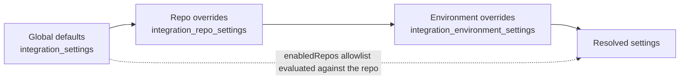
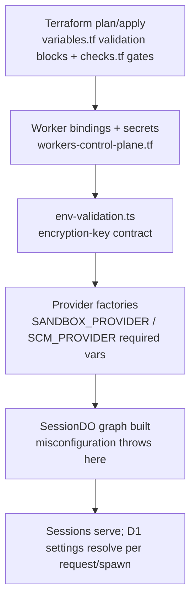

# Configuration

Open-Inspect separates configuration into two tiers. **Deployment configuration** arrives as
Cloudflare Worker bindings — a typed `Env` object assembled by Terraform — plus per-package `.env`
files for local development; it is operator-owned and immutable for the life of a deployment.
**Product configuration** is user-editable state persisted in the D1 database: model preferences,
integration settings (GitHub bot, Linear, Slack, sandbox, code-server, VNC), SCM (source-control)
settings, commit-signing keys, and secrets. The runtime validates the deployment tier eagerly and
fails loudly — a misconfigured deployment refuses to operate rather than running degraded.

Related pages: [Sandbox Providers & Infra](/openwiki/architecture/sandbox-providers.md) (what each
`SANDBOX_PROVIDER` backend requires), [Models and Provider Accounts](/openwiki/concepts/models-and-provider-accounts.md)
(the model catalog behind preferences), [Security and Tokens](/openwiki/concepts/security-and-tokens.md)
(key domains and sig1), [Control Plane Worker](/openwiki/architecture/control-plane-worker.md)
(router and bindings in context).

## Control-plane Env bindings

The control plane (a single Cloudflare Worker) receives its whole configuration through the `Env`
interface in `packages/control-plane/src/types.ts`. Terraform assembles it
(`terraform/environments/production/workers-control-plane.tf`); `wrangler.jsonc` mirrors only the
minimum bindings for local tests. The binding groups:

| Binding | Kind | Purpose |
| --- | --- | --- |
| `DB` | D1 database | Shared state: sessions index, secrets, settings tables, environments, automations, image builds |
| `SESSION` | Durable Object namespace | The `SessionDO` class, resolved via `idFromName(sessionId)` |
| `REPOS_CACHE` | KV namespace | Short-lived `/repos` listing cache (5 min fresh window, 1 h KV TTL) |
| `MEDIA_BUCKET` | R2 bucket | Session media and attachment object storage |
| `IMAGE_BUILD_FINALIZATION_QUEUE` | Queue | Durable callback→finalizer handoff for image builds (with its DLQ) |
| `AUTOFIX_QUEUE` / `AUTOFIX_DLQ` | Queues (optional) | Bound only when the GitHub bot is enabled; read-only metrics for the health check |
| `SLACK_BOT` / `LINEAR_BOT` | Service bindings (optional) | Present only when those bot workers are deployed |
| Secrets | Worker secrets | Encryption keys, OAuth credentials, provider API keys, per-service sig1 keys |
| Plain-text vars | Worker variables | Provider switches, URLs, allowlists, timeouts, `LOG_LEVEL` |

Production wiring note: Terraform binds the queues/secrets conditionally (`enable_github_bot`,
`enable_slack_bot`, the resolved backend), and the control-plane worker `depends_on` the
provider-infra modules so bindings and base images exist before first boot.

### Secrets: three independent encryption domains

Credential encryption is split into three key domains whose rotation guidance deliberately differs
(security-and-tokens covers the lifecycle):

- **`TOKEN_ENCRYPTION_KEY`** — AES-256-GCM for SCM enrichment tokens in `user_scm_tokens`.
  Required (non-optional in `Env`).
- **`REPO_SECRETS_ENCRYPTION_KEY`** — AES-256-GCM for repo secrets, environment secrets, global
  secrets, MCP server credentials, and the commit-signing private key. Optional at the type level
  (legacy deployments) but required in practice: every secrets route returns an explicit
  error when it is absent, and the session graph refuses to build without it.
- **`PROVIDER_ACCOUNTS_ENCRYPTION_KEY`** — subscription-provider account credentials. Terraform
  generates and persists a dedicated 32-byte key when the operator does not supply one.

Other secrets follow the same Terraform-managed pattern: `BROWSER_AUTH_SECRET` (Better Auth; the
legacy variable name `nextauth_secret` still feeds it, and it must be ≥ 32 non-whitespace
characters), `IMAGE_CALLBACK_TOKEN_PEPPER` (HMAC pepper for image-build callback tokens), the four
`SERVICE_AUTH_SECRET_<SERVICE>` sig1 verification keys (`web`, `slack_bot`, `github_bot`,
`linear_bot`) — each a 64-char `random_password` generated in Terraform state — plus OAuth pairs
(`GITHUB_CLIENT_ID`/`SECRET`, `GOOGLE_CLIENT_ID`/`SECRET`), GitHub App credentials
(`GITHUB_APP_ID`, `GITHUB_APP_PRIVATE_KEY`, `GITHUB_APP_INSTALLATION_ID`), GitLab
(`GITLAB_ACCESS_TOKEN`, `GITLAB_NAMESPACE`), and provider keys (`ANTHROPIC_API_KEY`,
`MODAL_API_SECRET`, `DAYTONA_API_KEY`, `E2B_API_KEY`, `VERCEL_TOKEN`,
`OPENCOMPUTER_API_KEY`, `SLACK_BOT_TOKEN`).

### env-validation.ts: the full key contract, checked eagerly

`packages/control-plane/src/env-validation.ts` implements the "#1602 posture": misconfigured
deployments fail loudly at the first touch instead of running degraded. `requireEncryptionKey`
does not merely check presence — it validates the *contract*:

1. **Absent** → throw `<NAME> is not configured; refusing to operate on <protects> without
   encryption at rest`.
2. **Malformed base64** → strict pattern rejecting whitespace and characters `atob` may accept;
   throws with the generation hint `openssl rand -base64 32`.
3. **Wrong length** → the base64-decoded bytes must be exactly 32 bytes (AES-256). A short key
   would silently downgrade to AES-128/192; a long key would throw only at the first secret
   write — mid-spawn.

Two named wrappers share the validator: `requireRepoSecretsEncryptionKey` (protects "secrets") and
`requireTokenEncryptionKey` (protects "OAuth tokens"). The session Durable Object's graph
construction (`createSessionRuntime`) calls both before any component is built, so a broken key
fails every session request at initialization. The same requirement guards the secrets routes
(400/500 responses when absent) and MCP server stores (via `requireRepoSecretsEncryptionKey`).
Focused tests in `env-validation.test.ts` pin all three failure classes, including the two
historical fixture keys that decoded to 24 and 34 bytes.

## Provider switches

### SANDBOX_PROVIDER

`SANDBOX_PROVIDER` selects the session sandbox backend: `modal` (default), `daytona`, `vercel`,
`opencomputer`, or `e2b`. `resolveSandboxBackendName` (`sandbox/provider-name.ts`) normalizes the
value (trim + lowercase, empty → `modal` to preserve existing deployments) and throws
`Unsupported SANDBOX_PROVIDER: <value>` for anything else. `createSandboxProviderFromEnv`
(`sandbox/provider-factory.ts`) then constructs the backend, throwing on missing credentials with
per-backend messages:

| Backend | Required vars | Optional vars |
| --- | --- | --- |
| `modal` | `MODAL_API_SECRET`, `MODAL_WORKSPACE` | `MODAL_ENVIRONMENT`, `MODAL_ENVIRONMENT_WEB_SUFFIX` |
| `daytona` | `DAYTONA_API_URL`, `DAYTONA_API_KEY`, `DAYTONA_BASE_SNAPSHOT` | `DAYTONA_TARGET`, `DAYTONA_AUTO_STOP_INTERVAL_MINUTES`, `DAYTONA_AUTO_ARCHIVE_INTERVAL_MINUTES` |
| `vercel` | `VERCEL_TOKEN`, `VERCEL_PROJECT_ID` (and a base snapshot via `VERCEL_BASE_SNAPSHOT_ID` or managed `VERCEL_BASE_SNAPSHOT_NAME`) | `VERCEL_TEAM_ID`, `VERCEL_RUNTIME`, `VERCEL_SANDBOX_API_BASE_URL`, `VERCEL_SNAPSHOT_EXPIRATION_MS` |
| `opencomputer` | `OPENCOMPUTER_API_URL`, `OPENCOMPUTER_API_KEY`, `OPENCOMPUTER_TEMPLATE` | — |
| `e2b` | `E2B_API_KEY`, `E2B_TEMPLATE_ID` | `E2B_API_URL`, `E2B_SANDBOX_TIMEOUT_SECONDS`, `E2B_AUTO_PAUSE` |

Numeric/boolean settings (`DAYTONA_AUTO_*`, `VERCEL_SNAPSHOT_EXPIRATION_MS`, `E2B_SANDBOX_TIMEOUT_SECONDS`,
`E2B_AUTO_PAUSE`) are parsed at construction; a non-numeric or non-boolean value throws immediately
rather than being ignored. Construction happens during SessionDO graph assembly, deliberately: a
misconfigured backend fails every session request at initialization, not at first spawn. Terraform
enforces the same contract at plan time (`variables.tf` validation blocks, e.g. "modal_token_id
must be set when sandbox_provider = 'modal'") and binds only the selected backend's vars.

Image-build capability is a separate policy: `image-builds/provider-policy.ts` accepts `modal`,
`vercel`, `opencomputer`, `e2b` and rejects Daytona with an explicit
`501`-style message — "Image builds are only available when SANDBOX_PROVIDER=modal, vercel,
opencomputer, or e2b". The web app mirrors the same list in
`packages/web/src/lib/sandbox-provider.ts` so UI copy cannot drift.

### SCM_PROVIDER

`SCM_PROVIDER` selects the source-control provider: `github` (default), `gitlab`, or `bitbucket`.
`resolveScmProviderFromEnv` (`source-control/config.ts`) trims and lowercases the value, returns
`DEFAULT_SCM_PROVIDER` when unset or empty, and throws a permanent `SourceControlProviderError`
for unknown values. Per ADR-0001 a deployment is single-provider: the choice is deployment-wide,
no per-session provider state is persisted, and routes carry a `supportedScmProviders` policy —
`enforceImplementedScmProvider` in the router answers `501 Not Implemented` when a route's policy
excludes the deployment's provider (currently `bitbucket`), and `500` when the configuration
itself is invalid. The router caches the resolution keyed by the raw env value.

When `SCM_PROVIDER=gitlab`, `GITLAB_ACCESS_TOKEN` is required for API access (and is threaded into
the sandbox provider config for git auth); `GITLAB_NAMESPACE` scopes repository listing to a group.
Commit signing is GitHub-only: the sandbox commit-signing route short-circuits non-GitHub
deployments to an explicit `enabled: false` state rather than failing sessions at the provider
gate.

### Other deployment variables

- **Sandbox lifecycle:** `SANDBOX_INACTIVITY_TIMEOUT_MS` (default 600000 = 10 min, feeding the
  lifecycle manager's inactivity config), `EXECUTION_TIMEOUT_MS` (default 5400000 = 90 min, used
  by the session watchdog and the automation recovery sweep), and
  `SECRETS_CAP_ENFORCEMENT` (`enforce` default; the literal `warn` opts out of the 128 KiB
  combined-secrets cap — anything else, including unset or garbled, still enforces).
- **Identity/URLs:** `DEPLOYMENT_NAME` (required), `APP_NAME`, `WORKER_URL` (base URL for
  callbacks; image-build workflows refuse to run without it), `WEB_APP_URL` (browser-visible
  origin, validated for Better Auth), `CF_ACCOUNT_ID`.
- **Admission:** `ALLOWED_USERS`, `ALLOWED_EMAILS`, `ALLOWED_EMAIL_DOMAINS`,
  `ALLOWED_GITHUB_ORGS`, and `UNSAFE_ALLOW_ALL_USERS`. Terraform's `checks.tf` hard-fails the plan
  when no allowlist is configured and the unsafe flag is not set.
- **Logging:** `LOG_LEVEL` (`debug` | `info` | `warn` | `error`, default `info`), parsed by the
  router, scheduler, GitHub webhook, and session DO.

## Integration settings: the D1-backed settings framework

Integration settings are user-editable configuration stored in D1 across three tables
(`terraform/d1/migrations/0007` and `0038`):

- `integration_settings` — global defaults per integration (`integration_id` primary key).
- `integration_repo_settings` — per-repo overrides (`integration_id`, lowercase `repo` key).
- `integration_environment_settings` — per-environment overrides, an owned child of `environments`
  (cascade delete), keyed by (`integration_id`, `environment_id`).

`IntegrationSettingsStore` (`db/integration-settings.ts`) owns all three. Every write is validated
against the runtime Zod schemas in `packages/shared/src/types/integrations.ts`
(`integrationSettingsSchemas` — the source of truth for every persisted settings type); every read
re-validates stored JSON, so corrupt rows surface as `IntegrationSettingsValidationError` instead
of silently propagating. Repo keys and `enabledRepos` entries are lowercased on write. The six
integrations (`github`, `linear`, `code-server`, `vnc`, `sandbox`, `slack`) are declared by
`INTEGRATION_DEFINITIONS`; the `scm` key below reuses the same tables but deliberately stays out of
that framework.

### The resolution chain

`getResolvedConfig(integrationId, repo, environmentId?)` resolves settings with a generic
later-layer-wins merge where `undefined` keys never clobber:

*Resolution is per-integration: global defaults first, then repo overrides, then — for
session-scoped integrations launched from an environment — that environment's overrides on top.*

- The `enabledRepos` allowlist comes only from the global layer: `undefined` normalizes to `null`
  (all repos), `[]` is the explicit disabled state, and a non-empty list is a case-insensitive
  allowlist evaluated against the repo — never against the environment.
- Environment-level overrides are restricted to the session-scoped integrations
  `sandbox`, `code-server`, and `vnc` (`ENVIRONMENT_SETTINGS_INTEGRATION_IDS`, design §13.5).
  `supportsEnvironmentSettings` gates the store methods, and the environment-settings routes
  reject other integrations with 400, also verifying the environment exists (the table is an owned
  child of `environments`). Bot-scoped integrations (`github`, `linear`) resolve from the trigger
  repo before a session exists, and Slack is global/per-repo only — neither accepts an
  environment layer.
- The single exception to the flat merge: GitHub `autofix` objects deep-merge instead of
  replacing, so a repo can set `maxAttemptsPerPrPer24Hours` without clobbering the global
  `enabled`/`allowedReviewBots` policy.
- Sandbox settings are re-normalized on read and write (`normalizeSandboxSettings`, `invalid:
  "throw"` on writes, `"omit"` on stored blobs) so stale rows drop invalid keys instead of
  poisoning spawns.

Per-integration validation on write: model IDs and reasoning-effort pairs are checked against the
shared catalog (`isValidModel` / `isValidReasoningEffort`) for `github`, `linear`, and `slack`;
Slack splits allowed keys by level (workspace-wide `model`, `mentionsPolicy`, `routingRules`,
`sessionInstructions` are global-only; only `agentNotificationsEnabled` is repo-overridable) and
validates routing rules (≤ 100 rules, keywords ≤ 100 chars, repository `owner/name` targets or
stable `env_…` environment ids); session-instruction fields are capped at
`MAX_SESSION_INSTRUCTIONS_LENGTH` (10 000 chars).

### Who consumes the chain

- **Session-scoped settings** (`resolveSessionScopedSettings`,
  `session/integration-settings-resolution.ts`) resolve `code-server` enablement, `vnc`
  enablement, and `sandbox` settings from the session's **primary member** (position 0 of the
  repository list), layering the environment id on top when the session launches from a saved
  environment. An empty member list (repo-less session) falls back to global sandbox defaults with
  code-server/VNC disabled. Resolution failures degrade safely: code-server/VNC resolve to
  disabled, sandbox settings to `{}`. This is the primary-repo rule of design §6.2 — these
  configure sandbox-wide singletons or are gating booleans, so an any-member-wins union would let
  one member silently override another owner's explicit opt-out. MCP servers are the deliberate
  contrast: they resolve as a **union across members** in `McpServerStore.getDecryptedForSession`.
- **Callers:** `handleCreateSession` and the automation scheduler's `launchChild` both call
  `resolveSessionScopedSettings` (same §6.2/§13.5 rules); child-spawn inherits the parent's
  primary repo + environment for sandbox settings; image-build scope resolution layers the
  environment's sandbox overrides for environment scopes. The lifecycle manager resolves the Slack
  agent-notify gate live from the scalar mirror (`resolveAgentSlackNotifyEnabled`) — the same
  primary-repo rule on a different call path, short-circuited to disabled when
  `SLACK_BOT_TOKEN` is absent.
- **Bots** read the resolved config via `GET /integration-settings/:id/resolved/:owner/:name`,
  which projects each integration into a stable response shape with runtime defaults (e.g.
  `autoReviewOnOpen ?? true`, sandbox child-session defaults).

The HTTP surface (`routes/integration-settings.ts`, github-only user-or-service policy) exposes
CRUD at `/integration-settings/:id`, `/integration-settings/:id/repos/:owner/:name`, and
`/integration-settings/:id/environments/:environmentId`. The web app proxies these through signed
`/api/integration-settings/*` routes.

## Model preferences

Model enablement is deployment-wide user configuration, stored as a single global row in the
`model_preferences` D1 table (`enabled_models` JSON array). The routes
(`routes/model-preferences.ts`):

- `GET /model-preferences` returns the stored list reconciled against the shared catalog:
  unknown model ids are dropped (`normalizeValidModels`), an emptied list or a storage error falls
  back to `DEFAULT_ENABLED_MODELS`, and a reconciliation event is logged when the stored value had
  to be repaired. With no D1 the handler returns defaults directly.
- `PUT /model-preferences` validates every id against `VALID_MODELS` (400 on any invalid id or an
  empty array — at least one model must stay enabled), normalizes to canonical
  `provider/model` form, and upserts the row.

The enforcement point is session creation: child spawn loads
`getEffectiveEnabledModels` (stored list, falling back to `DEFAULT_ENABLED_MODELS` when absent or
unusable) and rejects requests for models outside the enabled list with
`Model "…" is not enabled` (503 when preferences are unavailable). `resolveEnabledModel` applies
the fallback policy — desired model if enabled, else fallback, else first enabled. Per-session
model/reasoning-effort choices are separate persisted state (see models-and-provider-accounts);
integration-level `model` fields inside GitHub/Linear/Slack settings are validated by the same
shared catalog helpers but stored as part of those integration rows.

## SCM settings

SCM settings control how sessions open pull/merge requests — `alwaysUseDraftMode` (always open as
draft) and `pullRequestLabel` (label applied to created PRs, no commas) — and are
provider-agnostic (GitHub and GitLab). They are deliberately a **top-level setting, not an
integration**: `ScmSettingsStore` (`db/scm-settings.ts`) reuses the generic
`IntegrationSettingsStore` and its two tables under the fixed storage key `scm`, so no schema
migration was needed, while staying outside `INTEGRATION_DEFINITIONS` and `isValidIntegrationId`.
SCM has no `enabledRepos` allowlist; repo settings are field-level overrides of the global
defaults.

Routes (`routes/scm-settings.ts`, SCM-agnostic user-or-service policy — reachable on both GitHub
and GitLab deployments):

- `GET/PUT/DELETE /scm-settings` — global config.
- `GET /scm-settings/repos`, `PUT/DELETE /scm-settings/repos/:owner/:name` — per-repo overrides.

The session runtime resolves the effective settings at PR time via `resolveScmSettings`
(global defaults merged with the per-repo override; a deployment without D1 keeps built-in
defaults). Malformed settings are rejected with 400 before storage; storage failures map to 503
("SCM settings storage unavailable") — pinned by `scm-settings.test.ts`.

## Commit signing

Commit signing is deployment-wide user configuration kept in the singleton
`commit_signing_configuration` D1 row (`singleton_id = 1`, migration 0043). The private key never
reaches a sandbox: it is stored **encrypted with `REPO_SECRETS_ENCRYPTION_KEY`** and used only
inside the control plane as a signing broker. The public key, fingerprint, and committer name/email
are stored in plaintext.

Routes (`routes/commit-signing.ts`):

- **Configuration (github-only, user-or-service auth):** `GET /commit-signing` returns metadata
  or `{ enabled: false }`; `PUT /commit-signing` validates the body against
  `commitSigningWriteRequestSchema` (private key ≤ 16 384 chars, committer name/email, strict
  shape), parses the OpenSSH Ed25519 private key (`validateOpenSshEd25519PrivateKey` derives the
  public key and `SHA256:` fingerprint, rejecting anything other than unencrypted `ssh-ed25519`),
  and saves; `DELETE` removes it. Every response sets `Cache-Control: no-store`.
- **Sandbox runtime bridge (sandbox-authenticated):** `GET /sessions/:id/commit-signing` returns
  the runtime configuration (committer identity + public key — never the private key), or the
  explicit disabled state on non-GitHub deployments. `POST /sessions/:id/commit-signing` is the
  signing endpoint: the in-sandbox git signer (`packages/sandbox-runtime/src/sandbox_runtime/git_signer.py`,
  invoked by git as `gpg.ssh.program`) POSTs the bounded commit payload (≤ 1 MiB, enforced by both
  sides) with an `X-Open-Inspect-Signing-Fingerprint` header; the control plane verifies the
  fingerprint matches the configured key (409 "Commit signing key changed" on rotation), signs the
  payload with the decrypted private key, and returns the armored `SSHSIG` signature.
- Missing `REPO_SECRETS_ENCRYPTION_KEY` returns 503 "Commit signing encryption is not configured"
  rather than ever writing or reading plaintext keys.

## Secrets routes

Secrets are user-editable, key/value configuration encrypted at rest with
`REPO_SECRETS_ENCRYPTION_KEY` and stored in D1 (`repo_secrets`, `global_secrets`,
`environment_secrets`). `routes/secrets.ts` exposes global and repo scopes;
`routes/environment-secrets.ts` the environment scope. All are github-only user-or-service
routes:

- `PUT /repos/:owner/:name/secrets` (upsert), `GET` (lists repo **and** global keys — metadata
  only, never values), `DELETE /repos/:owner/:name/secrets/:key` (404 when absent).
- `PUT /secrets`, `GET /secrets`, `DELETE /secrets/:key` — global scope.
- `GET/PUT/DELETE /environments/:id/secrets(:key)` plus `POST /environments/:id/secrets/import`
  for member-scoped, value-free import.

Shared validation (`db/secrets-validation.ts`): keys must match `[A-Za-z_][A-Za-z0-9_]*` (≤ 256
chars, uppercased), values ≤ 16 384 bytes, ≤ 50 secrets per scope, and a reserved-key list
(`PYTHONUNBUFFERED`, `SANDBOX_ID`, `CONTROL_PLANE_URL`, `SANDBOX_AUTH_TOKEN`, `PATH`, …) prevents a
secret from clobbering the sandbox boot environment. Validation failures map to 400
(`SecretsValidationError`); missing key or DB to 500/503. Merged payloads (global → environment →
repo, or global → repo) are capped at 128 KiB with per-source attribution, and
`SECRETS_CAP_ENFORCEMENT` controls whether an oversized payload fails the spawn/build or only logs.

## Web package env

`packages/web/.env.example` is small, and the split matters:

- **`NEXT_PUBLIC_*` variables are inlined into the client bundle at build time.** Terraform sets
  them as build environment (`web-cloudflare.tf`) or Vercel project env vars (`web-vercel.tf`):
  `NEXT_PUBLIC_WS_URL` (the control-plane WebSocket endpoint), `NEXT_PUBLIC_SANDBOX_PROVIDER` (UI
  mirroring of the backend switch), `NEXT_PUBLIC_APP_NAME`, `NEXT_PUBLIC_APP_ICON_URL`, and — for
  provider-URL generation (`lib/scm.ts`) — `NEXT_PUBLIC_SCM_PROVIDER`. Changing one of these means
  rebuilding the web app, not just redeploying it; on the Cloudflare/OpenNext path they are also
  written into the generated `wrangler.production.toml` vars.
- **Server-only secrets:** `SERVICE_AUTH_SECRET` is web's per-service **sig1 signing** secret. It
  must match the control plane's `SERVICE_AUTH_SECRET_WEB` binding, which Terraform generates in
  state — the `.env.example` warns operators to read the generated value rather than inventing
  their own against an existing backend. `dispatchWebServiceRequest`
  (`lib/control-plane-service.ts`) throws "SERVICE_AUTH_SECRET not configured" when it is absent,
  and signs every outbound request as `service: web` after stripping any caller-supplied identity
  headers.
- `CONTROL_PLANE_URL` is the server-side base URL (used via URL fetch on Vercel/local dev and as
  the fallback when the Cloudflare `CONTROL_PLANE_WORKER` service binding is unavailable).

## Per-package env files

- `packages/web/.env.example` — the web app contract described above (control-plane URL, WS URL,
  `SERVICE_AUTH_SECRET`).
- `packages/modal-infra/.env.example` — local-test values for the Modal data plane. In a real
  deployment these become **Modal secrets** (`modal secret create`): `llm-api-keys`
  (`ANTHROPIC_API_KEY`), `github-app` (`GITHUB_APP_ID`, `GITHUB_APP_PRIVATE_KEY` — PKCS#8,
  `GITHUB_APP_INSTALLATION_ID`), and `internal-api` (`MODAL_API_SECRET`, which must match the
  control plane's binding, plus `ALLOWED_CONTROL_PLANE_HOSTS` — the SSRF allowlist restricting
  which hosts sandboxes may call back into). Terraform creates these secrets from the same
  tfvars that configure the control plane, so the shared secrets stay in sync by construction.

Everything else is deployed via Terraform; `wrangler.jsonc` in the control-plane package is
test-only, and the source of truth for every variable is
`terraform/environments/production/variables.tf` (with `terraform.tfvars.example` as the operator
checklist).

## Configuration lifecycle and failure semantics

*Deployment configuration fails fast left-to-right; user-editable D1 configuration (settings,
secrets, preferences, signing keys) is validated on write and resolved per request.*

The invariants worth operating by:

- **Fail loud, not degraded:** encryption keys, provider credentials, and SCM configuration are
  validated eagerly; the first failure point is graph construction or the router, never a
  mid-session secret write or a silently plaintext store.
- **Validate on write, re-validate on read:** every D1 settings blob passes its Zod schema on the
  way in and on the way out, so corrupt or legacy rows fail bounded instead of poisoning spawns.
- **Later layers win, unset keys inherit:** the resolution chain never lets a partial override
  clobber unspecified keys; allowlists always evaluate against the primary repo.
- **Single source of truth per switch:** `SANDBOX_PROVIDER`/`SCM_PROVIDER` capability lists are
  mirrored between control plane and web on purpose, with the shared catalog (`MODEL_CATALOG`,
  `integrationSettingsSchemas`, `INTEGRATION_DEFINITIONS`) anchoring everything else — adding a
  provider or model means touching the shared definitions, not scattering literals.
