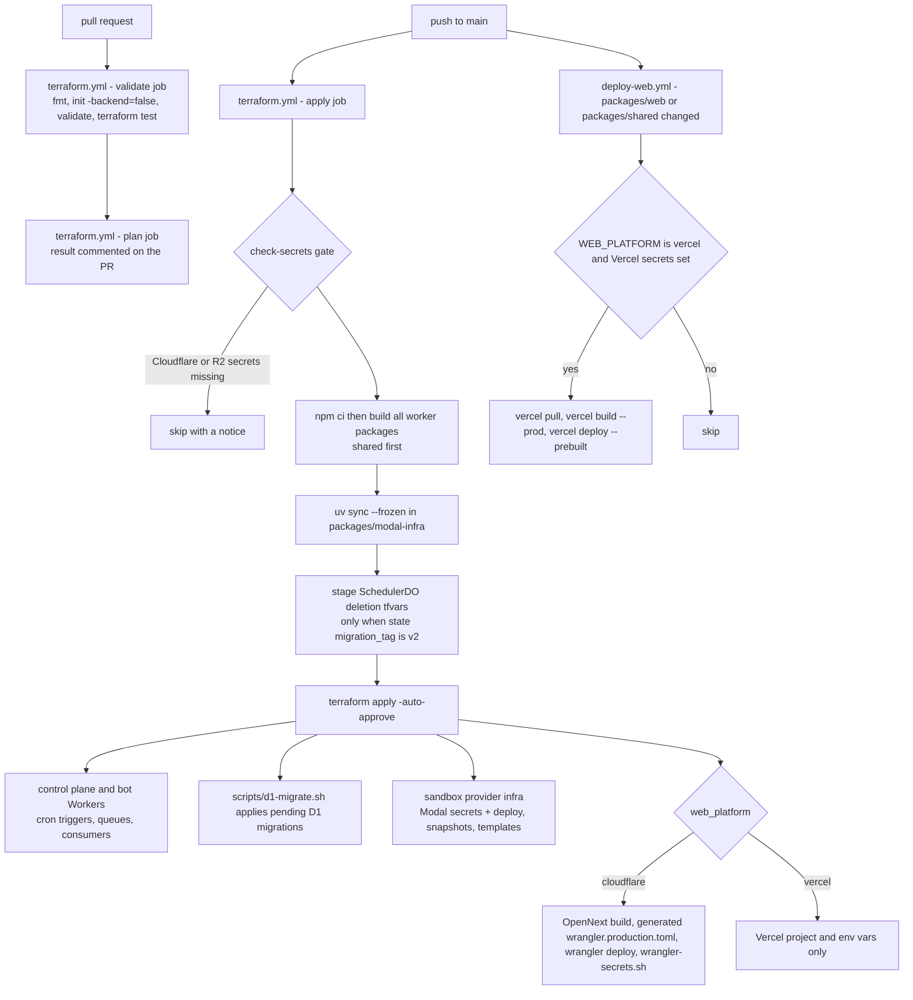

# Deployment and Infrastructure

Open-Inspect is deployed with Terraform from a single production root module. One `terraform apply`
creates and configures everything: the Cloudflare control-plane and bot Workers (with their KV
namespaces, D1 database, R2 bucket, queues, and Durable Object migrations), the web app (Vercel
*or* a Cloudflare Worker via OpenNext), and the selected sandbox backend (Modal, Daytona, Vercel
Sandboxes, OpenComputer, or E2B). GitHub Actions runs Terraform plan on pull requests and applies
on every push to `main`.

Related pages: [Control Plane Worker](/openwiki/architecture/control-plane-worker.md) (what the
deployed Worker does with these bindings), [Sandbox Providers & Infra](/openwiki/architecture/sandbox-providers.md)
(what each backend requires at runtime), [Configuration](/openwiki/operations/configuration.md)
(the binding surface Terraform assembles), [Data Model](/openwiki/architecture/data-model.md)
(the D1 schema these migrations create).

## Deployment topology

| Provider | Role | Terraform mechanism |
| --- | --- | --- |
| Cloudflare | Control plane, bot Workers, KV, D1, R2, queues | Native provider (`cloudflare/cloudflare`) |
| Vercel | Web app project + env vars (when `web_platform = "vercel"`); optional sandbox backend | Native provider (`vercel/vercel`) |
| Cloudflare Workers | Web app via OpenNext (when `web_platform = "cloudflare"`) | Native provider + `wrangler deploy` local-exec |
| Modal | Sandbox infrastructure (default backend) | CLI wrapper — no provider exists, so `null_resource` + `local-exec` |
| Daytona / OpenComputer | Sandbox snapshots/templates | REST API wrapper scripts in `null_resource` |
| E2B | Sandbox template build | Template SDK script in `null_resource` |

Terraform state itself lives in Cloudflare R2 via the S3-compatible backend (bucket
`open-inspect-terraform-state`, key `production/terraform.tfstate`), initialized with
`terraform init -backend-config=backend.tfvars` supplying R2 access keys and the account-specific
S3 endpoint.

## Production root module layout

`terraform/environments/production/` is deliberately split by concern while keeping Terraform
addresses stable — `main.tf` documents the file map, and `moved.tf` records state moves from
earlier unsplit layouts (e.g. `module.slack_kv` → `module.slack_kv[0]`, `module.web_app` →
`module.web_app[0]`) so refactors do not force resource recreation.

| File | Contents |
| --- | --- |
| `main.tf` / `locals.tf` | Entrypoint and file map; shared naming, backend selectors, URLs, script paths |
| `kv.tf` / `r2.tf` | KV namespaces (`session_index_kv`, conditional bot KVs) and the R2 media bucket |
| `d1.tf` | D1 database + the migration-applying `null_resource` |
| `workers-control-plane.tf` | Control-plane build, Worker module, image-build queues and consumer |
| `workers-slack.tf` / `workers-github.tf` / `workers-linear.tf` | Bot Workers, their queues/consumers, and service bindings |
| `web-vercel.tf` / `web-cloudflare.tf` | Web app resources for each `web_platform` value |
| `vercel.tf` / `daytona.tf` / `opencomputer.tf` / `e2b.tf` / `modal.tf` | Sandbox backend infrastructure, one per `sandbox_provider` |
| `service-auth.tf` | Terraform-generated per-service signing secrets and encryption keys |
| `checks.tf` / `moved.tf` | Plan-time gates and state moves |
| `variables.tf` / `outputs.tf` | Input contract (with validation blocks) and verification outputs |
| `backend.tf` / `versions.tf` | R2 state backend and provider pins |
| `terraform.tfvars.example` / `backend.tfvars.example` | Templates for the gitignored value files |

`locals.tf` computes everything the files share: `name_suffix` (the operator-unique
`deployment_name` appended to every resource name), the `use_*_backend` selectors that enable
exactly one sandbox-provider module, the control-plane host/URL and `wss://` WebSocket URL, the
web Worker name, custom-domain normalization, and the classifier credential rule (an OpenAI
`classification_model` binds `OPENAI_API_KEY` to the bots, anything else binds
`ANTHROPIC_API_KEY`).

Plan-time gates in `checks.tf` refuse invalid deployments before any resource changes: the
`access_control_gate` hard-fails when no admission allowlist is set (and `unsafe_allow_all_users`
is false), the `sign_in_provider_gate` requires at least one complete OAuth credential pair plus a
compatible admission rule (Google sign-in cannot be admitted by GitHub-specific rules), the
`cloudflare_custom_domain_gate` fails when a custom domain is set without
`web_platform = "cloudflare"` and a zone ID, and a `check` block warns when Vercel assigns a
production URL different from the hardcoded `open-inspect-{deployment_name}.vercel.app` pattern —
a silent breakage for browser-auth redirects and bot links.

## The cloudflare-worker module

`terraform/modules/cloudflare-worker` deploys each Worker using Cloudflare's native three-resource
pattern: `cloudflare_worker` (with observability enabled), `cloudflare_worker_version` (modules +
bindings + DO migrations), and `cloudflare_workers_deployment` (100% traffic to the new version).
All binding kinds — KV namespaces, service bindings, D1 databases, R2 buckets, queue producers,
plain-text vars, secret-text bindings, and Durable Object namespaces — are concatenated into one
`bindings` list on the version. Optional custom domains, routes, and cron triggers are separate
resources created after the deployment.

Service bindings and DO bindings are gated behind `enable_service_bindings` and
`enable_durable_object_bindings` flags, which is what makes the two-phase initial deploy work (see
below). The `migrations` block on the version is emitted only when bindings are disabled (initial
class creation via `new_sqlite_classes`) or when `deleted_classes` is non-empty; a lifecycle
precondition fails the plan if a class deletion is attempted while
`enable_durable_object_bindings = false`, because that combination would retire the class and
simultaneously drop every surviving DO binding.

The control-plane Worker is the largest instantiation: a per-minute cron (`* * * * *`), the
image-build scheduler cron (`7,37 * * * *`), the abandoned-draft sweep cron (`23 * * * *`), the
`SESSION` DO binding for `SessionDO`, the `DB` D1 binding, `REPOS_CACHE` KV, the R2
`MEDIA_BUCKET`, the unconditional image-build finalization queue + dead-letter queue, optional
autofix queue bindings (only when the GitHub bot is enabled), optional service bindings to the
Slack and Linear bots, and a long list of plain-text and secret bindings assembled from
`terraform.tfvars`. Its `depends_on` spans the D1 migration resource, the bot Workers, and the
Modal/Daytona/Vercel/OpenComputer infra modules, so provider infrastructure exists before the
control plane boots.

The bot Workers follow the same pattern: each has its own KV namespace, a `CONTROL_PLANE` service
binding, and its own per-service `SERVICE_AUTH_SECRET`. The Slack bot additionally owns a
completion-delivery queue with a consumer and DLQ; the GitHub bot owns the autofix queue whose
consumer is the *control plane* Worker (batch size 1, max 4 retries, DLQ), with the bot producing
envelopes and the control plane's `queue()` handler processing them.

## D1 migrations: `scripts/d1-migrate.sh`

`d1.tf` creates `cloudflare_d1_database.main` and a `null_resource.d1_migrations` whose trigger is
the SHA-256 of the sorted migration file hashes — editing any file under
`terraform/d1/migrations/` re-runs the provisioner on the next apply. The provisioner invokes
`bash scripts/d1-migrate.sh <database-name> terraform/d1/migrations` with
`CLOUDFLARE_ACCOUNT_ID` and `CLOUDFLARE_API_TOKEN` in the environment; the control-plane Worker
`depends_on` this resource, so migrations always land before a Worker that expects the new schema.

The script is the operational migration helper and is deliberately defensive:

1. **Filename validation.** Every migration must have a leading numeric prefix
   (`NNNN_description.sql`); a prefix-less file cannot be tracked at all and aborts the run.
   Duplicate prefixes abort too — two PRs that each grab the next number would otherwise cause one
   migration to be silently skipped forever, because the ledger is keyed by the numeric prefix.
2. **Tracking table.** It creates `_schema_migrations (version TEXT PRIMARY KEY, name, applied_at)`
   and reads the applied versions *and their exact filenames*. The filename matters: a numeric
   prefix is only unique within this repository, and a downstream installation may have used the
   same version for a different migration. Applying a version already recorded under a different
   filename is an error instructing the author to renumber.
3. **Atomic application.** Each pending migration is copied to a temp file with its ledger
   `INSERT` appended, then submitted as one `wrangler d1 execute --file` call. D1 executes the file
   atomically, so a failed migration rolls back and a lost response is safe to retry — a committed
   migration always has its ledger row.

The same migration directory is the source of truth for tests: control-plane integration tests
apply `terraform/d1/migrations/` automatically via `test/integration/apply-migrations.ts` before
running against a real D1 binding.

## Service auth secrets: `service-auth.tf` and `scripts/wrangler-secrets.sh`

`service-auth.tf` generates, in Terraform state, one 64-character `random_password` per first-party
service (`web`, `slack_bot`, `github_bot`, `linear_bot`) plus a dedicated
`IMAGE_CALLBACK_TOKEN_PEPPER` and a 32-byte `provider_accounts_encryption_key` (overridable by the
operator for upgrades; generated and persisted otherwise, so the remote state is its recovery
source). No operator-supplied variables are needed for these — rotation survives because the
values live in state.

The signing model is asymmetric by design: the control plane binds all four keys as
`SERVICE_AUTH_SECRET_<SERVICE>` (it must verify every caller), while each sender binds only its own
as `SERVICE_AUTH_SECRET` — a sender signs as itself, so naming its own service in its env var adds
nothing. The web app's copy reaches it either through the Vercel environment variable
(`web-vercel.tf`, marked sensitive) or through `scripts/wrangler-secrets.sh` in the Cloudflare
path.

`scripts/wrangler-secrets.sh` is the second operational helper. It takes `WORKER_NAME` and
`SERVICE_AUTH_SECRET` from the environment, pipes the secret to
`npx wrangler secret put SERVICE_AUTH_SECRET`, then lists existing secrets and deletes the retired
web-auth secrets (`GITHUB_CLIENT_SECRET`, `GOOGLE_CLIENT_SECRET`, `NEXTAUTH_SECRET`) if present.
`web-cloudflare.tf` runs it from a `null_resource` triggered by a hash of the secret value, with
`depends_on` the deploy resource — `wrangler secret put` requires the Worker to exist, so secrets
upload only after `wrangler deploy` succeeds.

## Web platform choice: Vercel vs Cloudflare/OpenNext

The `web_platform` variable (validated to `vercel` or `cloudflare`) selects between two mutually
exclusive resource sets.

**`web_platform = "vercel"` (default).** Terraform creates the Vercel project and its environment
variables but does *not* deploy code — the project has no `git_repository`, and installs/builds are
configured for the monorepo (`cd ../.. && npm install && npm run build -w @open-inspect/shared`,
then `next build`). Code deploys happen through `.github/workflows/deploy-web.yml` or a manual
`vercel --prod`. Environment variables must be appended at the end of the list to keep count
indices stable and avoid Vercel `ENV_CONFLICT` replacement races.

**`web_platform = "cloudflare"`.** Terraform owns the whole lifecycle inside `apply`: a
`null_resource` builds the shared package then `npm run build:cloudflare -w @open-inspect/web`
(OpenNext) with `NEXT_PUBLIC_WS_URL`, `NEXT_PUBLIC_SANDBOX_PROVIDER`, `NEXT_PUBLIC_APP_NAME`, and
`NEXT_PUBLIC_APP_ICON_URL` exported — Next.js inlines `NEXT_PUBLIC_*` values into the client
bundle, so they must exist at build time. A `local_file` resource generates
`packages/web/wrangler.production.toml` (worker name `open-inspect-web-<deployment_name>`, the
`.open-next/worker.js` entrypoint, an `ASSETS` binding, vars, and the `CONTROL_PLANE_WORKER`
service binding), and a second `null_resource` runs
`npx wrangler deploy --config wrangler.production.toml`. The generated config sets
`workers_dev = false` when a custom domain is configured, keeping a single canonical browser
origin; `cloudflare_workers_custom_domain` provisions DNS + edge cert (requires zone-level
Workers Routes: Edit permission). When using Cloudflare, Vercel credentials are not needed — the
provider still validates a token on init, so the variables carry dummy defaults (`000000000000000000000000`/`unused`); never set them to empty strings.

The `web_app_url` local switches accordingly, and `WEB_APP_URL` is propagated to the control plane
and bots so auth redirects and bot links stay consistent.

## Sandbox provider modules

Exactly one provider module is enabled by `sandbox_provider`. Each module (except Modal's) is a
`null_resource` whose trigger includes a source hash computed by an `external` data source over the
relevant package trees — so changing sandbox runtime or builder source invalidates and rebuilds
the snapshot/template on the next apply, while unchanged sources are skipped.

- **Modal (`modal.tf` → `modules/modal-app`)**: a source hash over `packages/modal-infra/src`,
  `packages/sandbox-runtime/src`, `deploy.py`, `pyproject.toml`, `uv.lock`, and the deploy script.
  The module first creates Modal secrets (`llm-api-keys`, `github-app`, `internal-api` — including
  `MODAL_API_SECRET` and `ALLOWED_CONTROL_PLANE_HOSTS`) via `create-secrets.sh`
  (`modal secret create ... --force`), then deploys via `deploy.sh`. The control plane `depends_on`
  this module.
- **Daytona (`daytona.tf` → `modules/daytona-infra`)**: hashes `daytona-infra` + `sandbox-runtime`
  and rebuilds the named base snapshot via the REST API wrapper script.
- **Vercel Sandboxes (`vercel.tf` → `modules/vercel-sandbox-infra`)**: hashes the sandbox runtime
  plus the Vercel bootstrap/builder sources and builds a managed immutable base snapshot named
  `openinspect-base-<hash-prefix>`; a manual `vercel_base_snapshot_id` skips the managed build.
- **OpenComputer (`opencomputer.tf` → `modules/opencomputer-infra`)**: hashes the runtime, the
  `build-template.ts` builder, and dependency manifests (mirroring `collectRuntimeFiles`'s
  include/exclude policy) and builds the managed template unless `opencomputer_template` pins one.
- **E2B (`e2b.tf` → `modules/e2b-infra`)**: hashes the whole `e2b-infra` + `sandbox-runtime/src`
  trees (exclude-only policy, so skill-only changes rebuild the template) and builds the template
  via the Template SDK. This module's ordering is *reversed* relative to the others:
  `e2b_infra` `depends_on` the control-plane Worker, because worker-first is the compatible order —
  a new control plane boots an old launcher-bearing template fine, while an old control plane
  cannot boot a launcher-less template, and a failed template rebuild then leaves a fully working
  system. The accepted trade is a brief window of 404s on first enablement or `e2b_template_id`
  rotation until the build lands.

### Modal deployment flow

Because Modal has no Terraform provider, `modules/modal-app/scripts/deploy.sh` performs the deploy
with the Modal CLI under `uv`: it verifies credentials, runs `uv sync --frozen`, then — for the
`deploy` or `src` module forms — eagerly runs
`uv run python deploy.py --build-sandbox-image` so the image used by dynamic sandboxes exists
before endpoints that create them are published, and finally `uv run modal deploy deploy.py`
(or `modal deploy -m src`).

`packages/modal-infra/deploy.py` exists precisely because importing `src/app.py` alone does not
register every function: it imports `src.app` and `src.images.base` (which pull in the function
modules) to register all web endpoints and functions with the app, and exposes
`--build-sandbox-image`, which looks up the app and calls `base_image.build(...)`. Never deploy
`src/app.py` directly — it does not import the function modules.

### `CACHE_BUSTER` and image rebuilds

Modal caches image layers, so a source-only change does not necessarily invalidate the sandbox
base image. `packages/modal-infra/src/images/base.py` defines `CACHE_BUSTER = RUNTIME_VERSION` and
embeds it in a no-op `echo 'cache: {CACHE_BUSTER}' > /dev/null` layer so bumping the value forces
Modal to invalidate that layer and rebuild everything after it. The numeric generation is shared by
every image-build provider, and `MIN_REBUILD_RUNTIME_VERSION` gates which prebuilt images get
rebuilt onto it, so every provider's label must be bumped together. A test pins
`CACHE_BUSTER == RUNTIME_VERSION`, so the version bump and the cache buster move as one.

## CI/CD



The push-to-main path: Terraform apply deploys the control plane, D1 migrations, bot Workers, and
the web app when `web_platform = "cloudflare"` (triggered by changes under `terraform/`, `scripts/`,
and any `packages/*/` path); Vercel picks up the web app when `web_platform = "vercel"`
(`deploy-web.yml`, triggered by `packages/web/` and `packages/shared/`); Modal deploys via the
Terraform apply itself (`packages/modal-infra/` is in the Terraform trigger set).

### `terraform.yml`

- **Triggers**: push and PR to `main` across `terraform/**`, `scripts/**`, all worker and infra
  package paths, `packages/web/**`, and the workflow file itself; plus `workflow_dispatch`.
  Concurrency is grouped per ref with `cancel-in-progress: false` — Terraform operations are never
  cancelled mid-run.
- **`check-secrets`**: the deployment is skipped with a notice unless `CLOUDFLARE_API_TOKEN` and
  `R2_ACCESS_KEY_ID` are configured — external contributors get a no-op run instead of a failure.
- **`validate`** (every event): `terraform fmt -check -recursive`, `terraform init -backend=false`,
  `terraform validate`, and `terraform test` filtered to
  `tests/auth_provider_configuration.tftest.hcl` and `tests/classifier_provider.tftest.hcl`
  (mock-provider HCL tests asserting, for example, that an Anthropic-classifier deployment binds
  only `ANTHROPIC_API_KEY` to the bots). Results are posted as a PR comment.
- **`plan`** (PRs, when secrets exist): installs and builds all worker packages, initializes the
  R2 backend with secrets, stages the SchedulerDO deletion tfvars (below), runs
  `terraform plan` with the full `TF_VAR_*` mapping from GitHub secrets, and comments the plan.
- **`apply`** (push to `main` or manual dispatch, `environment: production`, 45-minute timeout):
  `npm ci`, builds shared → control-plane → slack → github → linear (build order matters —
  packages import shared's build output), `uv sync --frozen` in `packages/modal-infra` so the
  Modal CLI provisioners work, stages the SchedulerDO tfvars, then `terraform apply -auto-approve`
  with the same `TF_VAR_*` mapping plus `MODAL_TOKEN_ID`/`MODAL_TOKEN_SECRET` for the CLI.
  Defaults are applied inline for optional secrets (e.g. `WEB_PLATFORM || 'vercel'`,
  `ENABLE_SLACK_BOT || 'true'`, `SANDBOX_PROVIDER || 'modal'`).

**SchedulerDO deletion staging.** Both `plan` and `apply` run a step that reads `terraform state
pull`, extracts the control-plane version's current `migration_tag`, and writes
`scheduler-do-retirement.auto.tfvars.json` (`migration_tag: v3`, `old_tag: v2`,
`deleted_classes: ["SchedulerDO"]`) *only* when state still reports `v2`. The state read is
deliberately parsed in separate steps — piping straight into `jq` would turn a failed read into an
empty tag and silently skip the deletion migration, shipping a Worker whose class was never
retired. Because the tfvars file is generated at deploy time, the release-specific migration is
not a permanent default for fresh deployments.

### `deploy-web.yml`

Runs on pushes to `main` touching `packages/web/**` or `packages/shared/**`. A first step checks
configuration: it skips when the `WEB_PLATFORM` secret is set to anything other than `vercel`, or
when `VERCEL_API_TOKEN`/`VERCEL_PROJECT_ID` are missing — so a Cloudflare-platform deployment
never attempts a Vercel deploy. It builds `@open-inspect/shared` first, then uses the pinned
Vercel CLI (`vercel@58.4.0`) to `vercel pull`, `vercel build --prod`, and
`vercel deploy --prebuilt --prod`.

### CI (lint / typecheck / tests)

`ci.yml` runs on every push and PR for TypeScript packages: ESLint + Prettier + Knip, `tsc`
typecheck across all packages (after building shared), a web build, control-plane unit tests,
control-plane integration tests sharded 2× (workerd/Miniflare with real D1), web tests, and all
three bot package test suites. `ci-python.yml` covers the Python side: Ruff lint/format for
`sandbox-runtime` and the provider-infra packages, plus pytest. Every TypeScript job builds
`@open-inspect/shared` before anything that depends on it.

## Operational gotchas

- **Build `@open-inspect/shared` first.** Worker packages import from it at build time; the
  Terraform `apply` job builds shared before every other package, and Terraform itself runs
  `npm run build` inside each worker package during apply (the `null_resource` builds always run —
  their trigger is `timestamp()`).
- **PKCS#8 GitHub App keys.** Cloudflare Workers require the GitHub App private key in PKCS#8
  format: `openssl pkcs8 -topk8 -inform PEM -outform PEM -nocrypt -in key.pem -out key-pkcs8.pem`.
- **Two-phase initial deployment.** A Durable Object binding cannot be attached before a
  deployment carrying the class migration exists. Set `enable_durable_object_bindings = false` and
  `enable_service_bindings = false`, apply (workers created with migrations, no bindings), then set
  both to `true` and apply again (bindings attached).
- **Class deletion keeps surviving bindings.** Remove the retired binding, set a new
  `control_plane_migration_tag` + `control_plane_migration_old_tag`, list the class in
  `control_plane_deleted_classes`, and apply with DO bindings enabled — the module's precondition
  refuses the disabled-bindings variant.
- **No `wrangler.toml` in production.** Control-plane configuration (bindings, secrets, cron,
  migrations) is generated entirely by Terraform; the checked-in `wrangler.jsonc` mirrors only
  local-dev/test bindings. The Cloudflare web Worker uses a Terraform-generated
  `wrangler.production.toml`, leaving the checked-in `wrangler.toml` for local dev.
- **Modal: use `deploy.py`, never `src/app.py`.** Run
  `uv run python deploy.py --build-sandbox-image` before `uv run modal deploy deploy.py` (or
  `modal deploy -m src`); `src/app.py` does not import the function modules.
- **`CACHE_BUSTER` for image rebuilds.** Update `CACHE_BUSTER` in
  `packages/modal-infra/src/images/base.py` to force a Modal image rebuild; keep it equal to
  `RUNTIME_VERSION`.
- **`NEXT_PUBLIC_*` must be set at build time.** Next.js inlines them into the client bundle; the
  Cloudflare web build exports them in the provisioner environment.
- **Vercel provider token dummy defaults.** `vercel_api_token`/`vercel_team_id` must be left unset
  (never empty strings) on Cloudflare-only deployments; the provider validates the token format on
  init regardless.
- **Cloudflare API token permissions.** Workers Scripts, Workers KV Storage, Workers R2 Storage,
  D1, and Queues all need Edit; Queues: Edit is required even with the Slack bot disabled because
  the image-build finalization queue and DLQ are created unconditionally. Add Workers Routes: Edit
  if Terraform manages routes/custom domains.
- **Cron schedules are a cross-file contract.** The control-plane `cron_triggers` in
  `workers-control-plane.tf` (`* * * * *`, `7,37 * * * *`, `23 * * * *`) must match
  `IMAGE_BUILD_SCHEDULER_CRON` in `scheduler.ts` and `ABANDONED_DRAFT_SWEEP_CRON` in
  `abandoned-draft-sweep.ts` — the `scheduled()` handler dispatches on the exact cron string.
- **Provider pins.** Terraform ≥ 1.14; the Cloudflare provider is pinned `>= 5.16, < 5.20.0`
  because 5.20.0 regressed `cloudflare_worker` observability on accounts without trace
  propagation; Vercel `~> 2.0`.
- **Protect the Terraform state.** It is the recovery source for the auto-generated
  `provider_accounts_encryption_key`; never change that key after storing provider-account
  credentials without re-encrypting first.

## Verifying a deployment

`terraform output verification_commands` prints ready-to-run checks; the equivalent manual form:

```bash
# Control plane health
curl https://open-inspect-control-plane-<deployment_name>.<subdomain>.workers.dev/health

# Sandbox backend health (Modal only; Daytona/Vercel/OpenComputer/E2B call their APIs directly)
curl https://<workspace>[-<modal_environment_web_suffix>]--open-inspect-api-health.modal.run

# Web app (should return 200)
curl -I "$(terraform output -raw web_app_url)"

# Authenticated endpoint (should return 401)
curl https://open-inspect-control-plane-<deployment_name>.<subdomain>.workers.dev/sessions
```

If a Worker deploy fails, build first (`npm run build -w @open-inspect/control-plane`), confirm
`packages/control-plane/dist/index.js` exists, and verify the Cloudflare token permissions listed
above. `outputs.tf` also exposes the worker URLs, Slack events/interactions URLs, the Linear
webhook and OAuth-authorize URLs, and the Modal health URL used by the provider setup steps.
