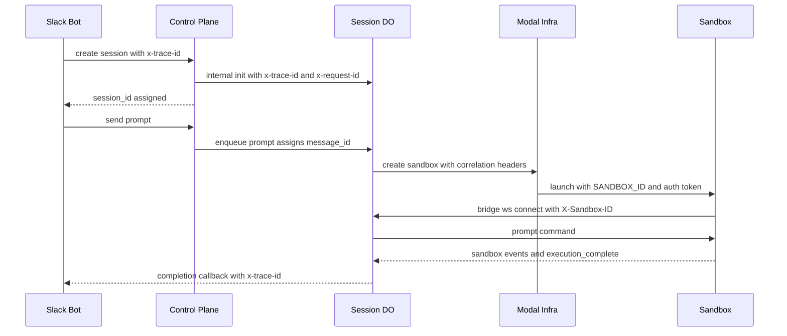

# Observability and Debugging

Open-Inspect is observability-first at the application layer: every service emits flat, single-line
JSON log lines that carry a common envelope, a stable event identifier, and correlation IDs. Wide
events summarize each request (`http.request`, `do.request`, `modal.http_request`) with timing,
outcome, and — inside the control plane — D1 query aggregates collected automatically by an
instrumented database handle. On top of the same D1 data layer sit two analytics stores (session
analytics and PR value-stream analytics) exposed through the `/analytics/*` routes. The
operator-facing reference for day-to-day debugging is `docs/DEBUGGING_PLAYBOOK.md` (envelope,
per-service event catalog, scenario queries); this page documents the mechanisms that produce the
logs and the analytics data.

Related pages: [Control Plane Worker](/openwiki/architecture/control-plane-worker.md) (the router
pipeline that stamps correlation IDs), [Session Durable Object](/openwiki/architecture/session-durable-object.md)
(the `session-do` event vocabulary), [Configuration](/openwiki/operations/configuration.md)
(`LOG_LEVEL`, bindings), and [Prompt Flow](/openwiki/workflows/prompt-flow.md) (the flow being
traced).

## Shared log envelope

All TypeScript services log through one zero-dependency factory,
`createLogger` in `packages/shared/src/logger.ts`. It prints one JSON object per line — the format
Cloudflare Workers Logs automatically indexes — with these logger-owned fields:

| Field       | Meaning                                              |
| ----------- | ---------------------------------------------------- |
| `level`     | `debug` \| `info` \| `warn` \| `error`               |
| `service`   | Owning service (e.g. `control-plane`, `slack-bot`)   |
| `component` | Logical sub-area (`router`, `session-do`, `bridge`)  |
| `msg`       | Stable event identifier used for filtering           |
| `ts`        | Epoch milliseconds                                   |

Key mechanics:

- **Reserved keys.** `level`, `component`, `msg`, `ts`, and `service` are stripped from base
  context and per-call data, so no caller can spoof or overwrite them
  (`RESERVED_KEYS` in `packages/shared/src/logger.ts`).
- **Merge order.** Structured fields (including `event`) are layered base context → child context →
  per-call data; later values override earlier ones. `logger.child(context)` returns a new logger
  with merged context, so one call site can fork correlation without affecting siblings.
- **Severity semantics.** `debug`/`info` emit via `console.log`, `warn` via `console.warn`,
  `error` via `console.error`, so platform alerting sees real severity while the JSON `level` field
  drives programmatic filtering. Lines below the configured minimum level are dropped.
- **Serialization can never crash a request.** `JSON.stringify` is wrapped: on failure (circular
  structures, bigints) the logger emits a guaranteed-serializable `LOG_SERIALIZE_FAILURE` line with
  the original message and level.
- **Error shape.** An `Error` passed as `data.error` is exploded into `error_type` (class name),
  `error_message`, `error_stack`, and `error_code` (when the error carries a string `code`); the
  raw object is deleted. All services report failures through these same fields.

`parseLogLevel` parses the `LOG_LEVEL` env var with an explicit allowlist, defaulting to `info`
when unset or unrecognized. Each package wraps the shared factory and pre-binds its service name so
callers never repeat it: `control-plane` (`packages/control-plane/src/logger.ts`), `slack-bot`,
`linear-bot`, `github-bot`, and `web` (`packages/web/src/lib/logger.ts`, which also parses
`LOG_LEVEL` from the Node process env).

### The Python side

The sandbox runtime and modal-infra share the same envelope through
`packages/sandbox-runtime/src/sandbox_runtime/log_config.py`: a `JSONFormatter` on Python's standard
`logging` module plus a thin `StructuredLogger` wrapper (`log.info(event, **fields)`,
`log.bind(...)`, `log.child(...)`). One JSON line goes to stdout with `level`, `service` (fixed to
`modal-infra`), `component`, the event identifier, and `ts`; exceptions become `error_type`,
`error_message`, and a truncated `error_stack`. Third-party library logs (httpx, websockets) flow
through the same pipeline.

One naming nuance matters when writing queries: the TypeScript envelope puts the stable identifier
in `msg` (and much of the control-plane code repeats it under `event`, e.g.
`log.info("prompt.complete", { event: "prompt.complete", ... })`), while the Python formatter emits
the identifier under the `event` key. So `msg="sandbox.create"` matches the Cloudflare Workers
telemetry, whereas in Modal-side logs the same identifier lives in `event`. The rest of the
envelope — including the snake_case correlation fields — is identical.

## Correlation IDs

`docs/DEBUGGING_PLAYBOOK.md` defines the correlation fields. Include whichever are available at the
call site:

| Field                 | Scope             | Generated by                                    |
| --------------------- | ----------------- | ----------------------------------------------- |
| `trace_id`            | Cross-service     | Router / bot edge (UUID)                        |
| `request_id`          | Single HTTP hop   | Router (8-character short UUID)                 |
| `session_id`          | Session lifetime  | Control plane on create                         |
| `message_id`          | Single prompt run | Control plane on enqueue                        |
| `sandbox_id`          | Sandbox lifetime  | Sandbox backend on create/restore               |
| `opencode_session_id` | OpenCode process  | Sandbox runtime (bridge) on session ensure      |

### Canonical naming and boundary conversion

ADR 0002 (`docs/adr/0002-shared-session-contracts-and-correlation-boundary.md`) makes correlation
naming canonical at every transport boundary:

- Canonical keys are snake_case everywhere outside local in-memory variables:
  `trace_id`, `request_id`, `session_id`, `sandbox_id`, and friends.
- HTTP headers: `x-trace-id`, `x-request-id`, `x-session-id`, `x-sandbox-id`.
- Provider/client requests carry a `correlation` object with the same snake_case keys
  (`correlation.trace_id`, ...).
- If a module uses camelCase internally (the `web` package does), it converts once at the boundary
  and never mixes `traceId` with `trace_id` inside one boundary.

### Where each edge stamps correlation

**Control-plane router.** `handleRequest` (`packages/control-plane/src/router.ts`) builds the
per-request `RequestContext`: `trace_id` taken from the inbound `x-trace-id` header or a fresh
`crypto.randomUUID()`, an 8-character `request_id`, the `RequestMetrics` collector, and the
instrumented database handle. Every response (and the CORS preflight) echoes both IDs in the
`x-request-id` and `x-trace-id` headers, so a caller can correlate against the control plane even
when it did not send a trace.

**Web (Next.js).** `packages/web/src/middleware.ts` matches `/api/:path*` and stamps correlation:
`resolveTraceId` accepts an inbound `x-trace-id` that passes the header grammar
(`TRACE_ID_PATTERN`) or generates one, plus a fresh 8-character request id. The web service
forwards only `x-trace-id` when it calls the control plane — `buildServiceAuthHeaders` in
`packages/shared/src/service-auth.ts` sets `x-trace-id` alongside the `sig1` signature headers — and
the control plane still generates its own per-hop `request_id`.

**Bots.** The Slack bot generates `trace_id` at its edge — `crypto.randomUUID()` in
`routes/events.ts` for Slack events, and `c.req.header("x-trace-id") || crypto.randomUUID()` on the
`/callbacks/*` routes, which accept a trace echoed back by the control plane. The bot passes the
trace through `signedControlPlaneFetch` (so it lands in the `x-trace-id` header of control-plane
calls) and repeats it in its own logs (`control_plane.create_session`,
`control_plane.send_prompt`, `callback.complete`).

**Into the Session Durable Object.** The control-plane runtime client
(`packages/control-plane/src/session/runtime-client.ts`) sets `x-trace-id` and `x-request-id` on
every internal DO fetch. The DO's `SessionHttpDispatcher` reads those headers and binds them into a
per-request child logger — deliberately *not* mutating the shared session logger, so no trace id
from one request can leak into later callbacks or interleaved requests (guarded by an integration
test that fires overlapping requests with distinct trace ids). Separately, the session-scoped
logger (`packages/control-plane/src/session/session-logger.ts`) injects the current public
`session_id` at emit time: the DO id is logged until `/internal/init` writes the session row, and
every component in the graph upgrades to the public id automatically.

**To sandbox providers.** Sandbox provider clients accept a `CorrelationContext` (typed in
`packages/control-plane/src/logger.ts`) and translate it at the boundary: `ModalClient` sets
`x-trace-id`, `x-request-id`, `x-session-id`, and `x-sandbox-id`; the Vercel client sets
`x-trace-id`/`x-request-id` and repeats the values in its request logs.

## Wide events and the outcome convention

Each service logs one **wide event** per unit of work, so a single line answers "what happened,
how long, and with what result":

- `http.request` (control-plane router, one per incoming HTTP request): `http_method`, `http_path`,
  `http_status`, `duration_ms`, `outcome`, the correlation IDs, and — spread in from
  `ctx.metrics.summarize()` — the D1 aggregates described below. `outcome` is `success` or `error`
  (status ≥ 500); a thrown non-`HttpError` logs the error variant with the `error` field and
  returns a generic 500.
- `do.request` (session DO dispatcher, one per internal route): `http_method`, `http_path`,
  `http_status`, `duration_ms`, `handler_ms`, `outcome`. WebSocket upgrades and unmatched routes
  are deliberately excluded from these route metrics.
- `modal.http_request` (modal-infra `_execute_endpoint`, one per Modal endpoint call): wraps auth,
  validation, and the handler; emits `http_status`, `duration_ms`, `outcome`, `endpoint_name`, and
  the correlation fields read from the `x-trace-id`/`x-request-id`/`x-session-id`/`x-sandbox-id`
  headers.

**Outcome convention.** Wide events use `outcome` to classify results, with a shared vocabulary of
`success`, `error`, `rejected` (denied before processing — auth, validation), `timeout`, and
`cancelled`. Events that cover several possible results extend the vocabulary with event-specific
values: `prompt.enqueue` reports `enqueued`, `deduplicated`, `conflict`, or `rejected`
(`queue_full`); `prompt.dispatch` reports `deferred` (no sandbox yet), `sent`, or `send_failed`;
`ws.connect` reports `success`, `auth_failed`, `rejected`, or `auth_timeout` with a `reject_reason`
(`sandbox_id_mismatch`, `token_mismatch`, `session_terminal`, `sandbox_stopped`, ...). When
querying, always filter on `outcome` rather than inferring from level.

Background work is observable too: the `BackgroundTasks` adapter logs
`background_task.failed` with the task name and its correlation context whenever a `waitUntil`
task throws, so fire-and-forget work (callbacks, snapshotting, queue processing) never fails
silently.

## D1 instrumentation

`packages/control-plane/src/db/instrumented-d1.ts` wraps the D1 binding so every query's timing is
collected automatically:

- `createRequestMetrics()` makes the per-request collector: a `d1Queries` array and a `spans` map.
- `instrumentD1(db, metrics)` returns a `SqlDatabase` whose `prepare()` hands out instrumented
  statements. Each terminal call (`run`, `first`, `all`) records a `D1QueryRecord` — wall-clock
  `query_ms` plus the engine-reported `d1_server_ms`, `rows_read`, `rows_written` from the result
  metadata. `bind()` re-wraps so chaining stays instrumented.
- `batch()` unwraps wrapped statements via the `ORIGINAL_STMT` symbol before submission (the raw
  engine can only execute statements it prepared itself — the same-origin contract documented on
  the `SqlDatabase` port) and records one aggregate record for the whole batch.
- `summarize()` folds everything into flat fields for the wide event: `d1_query_count`,
  `d1_total_ms`, `d1_server_total_ms`, `d1_rows_read`, `d1_rows_written`, plus one `<name>_ms` field
  per named span captured with `metrics.time(name, fn)`. Routes use this to time non-D1 work such
  as KV reads (`kv_read`), SCM API calls (`scm_api`), and internal DO fetches (`do_fetch`).

The injection rule that makes this work: the router puts the instrumented handle on
`ctx.db`, and stores accept the `SqlDatabase` port unchanged. An ESLint `no-restricted-syntax` rule
forbids `.DB` access under `packages/control-plane/src` (outside tests), leaving the composition
roots — `router.ts` and the Durable Object constructors — as the only places the raw binding is
read. The WebSocket upgrade path in `packages/control-plane/src/index.ts` builds its own instrumented
handle, so upgrade-time reads are timed too. Because `SqlResult.meta.changes` is the only field
stores may gate correctness on, the observability metadata (`duration`, `rows_read`,
`rows_written`) is explicitly optional and never load-bearing.

## Analytics stores and routes

Two stores in `packages/control-plane/src/db/` serve product analytics; both take the `SqlDatabase`
port, so when the routes construct them with `ctx.db` their queries are timed like everything else.

### Session analytics — `AnalyticsStore`

- **Universe and filter.** Queries the `sessions` table over a `startAt`/`endAt` window,
  restricted to `HUMAN_SPAWN_SOURCES` (`user`, `slack-bot`, `linear-bot`, `github-bot`) unless the
  caller passes explicit `spawnSources` — automation-produced sessions are excluded by default.
- **`getSummary`** returns total sessions, distinct active users, total/average cost, total PRs,
  and a status breakdown (`created`/`active`/`completed`/`failed`/`archived`/`cancelled`).
  Active users count `COUNT(DISTINCT COALESCE(user_id, NULLIF(scm_login, '')))` — the SQL comment
  documents that during the Phase 4→6 rollout window the same person can appear under both keys and
  temporarily inflate the count until the backfill populates `user_id` on historical rows.
- **`getTimeseries`** buckets sessions per day, grouping by user identity with display-name
  resolution (`users.display_name` → `scm_login` → `__unknown__`) and an `__unlinked__` fallback for
  sessions without a user row.
- **`getBreakdown`** groups by `user` or `repo` (repository key is `owner/name`; a null key is
  rendered as "No repository"), reporting sessions, outcomes, cost, PRs, message count, average
  duration over terminal sessions, and last activity.

### PR value-stream analytics — `PullRequestAnalyticsStore`

A deliberately separate contract, per `docs/pr-analytics-design.md`: the universe is pull requests
(`session_pull_requests`), not sessions, and **no spawn-source filter applies** — automation-
produced PRs are output too, surfaced via the `source` dimension. Its invariants:

- **One snapshot.** All reads execute in a single D1 `batch`, so every metric in a response is
  computed from the same database snapshot even while lifecycle webhooks are landing concurrently.
- **Three different populations.** The funnel/repos/sources cohort counts PRs *created in the
  window* (open PRs report as still-open, not failures); `mergedInWindow` and
  `avgTimeToMergeMs` count PRs *merged in the window* so recent merge latency is not biased by old
  cohorts; `openInventory` ignores the window entirely — WIP as of `filters.now`.
- **Creation-time expression.** PR creation time is
  `COALESCE(provider_created_at, created_at)` — exact for creation-path rows, approximate for
  webhook-fallback inserts until read-through repairs them. Merged rows predating the `merged_at`
  column are absent from merged-in-window metrics until repaired but still count in the cohort
  funnel.
- **Response.** `funnel` (created/open/draft/merged/closed), `prSessionCost` (Σ cost of sessions
  that produced ≥ 1 cohort PR — the cost-per-merged-PR basis), `mergedInWindow`,
  `avgTimeToMergeMs`, `openInventory`, a created/merged daily `timeseries`, per-repo and
  per-`spawn_source` breakdowns.

### The `/analytics/*` routes

`packages/control-plane/src/routes/analytics.ts` registers four GET handlers under the
`SCM_AGNOSTIC_USER_OR_SERVICE_ROUTE` policy (user or service principals, any SCM provider):
`/analytics/summary`, `/analytics/timeseries`, `/analytics/breakdown` (`?by=user|repo`), and
`/analytics/pull-requests`. The `days` parameter is validated against the shared allowlist
`ANALYTICS_DAYS = [7, 14, 30, 90]` (default 30; anything else is a 400 listing the valid values),
and the PR filters add a `now` anchor for the open-inventory age computation. Route behavior —
including the default and the invalid-`days` rejection — is covered by
`routes/analytics.test.ts` with mocked stores.

## Querying and alerting

**Platform capture.** Terraform enables Workers Observability on every Cloudflare Worker
(`terraform/modules/cloudflare-worker/main.tf`): observability and logs with `head_sampling_rate = 1`
and invocation logs, so every `console` JSON line becomes queryable telemetry.

**`scripts/cf-logs.ts`.** The log-fetching CLI queries the Cloudflare Workers Observability
Telemetry Query API:

```sh
bun scripts/cf-logs.ts --session <session-id>                 # by session_id
bun scripts/cf-logs.ts --trace <trace-id> --level error       # cross-service trace
bun scripts/cf-logs.ts --request-id <cf-request-id> --json | pbcopy   # inspect event shape for LLMs
bun scripts/cf-logs.ts --search "sandbox.create" --mins 30
```

- Filters: `--session` (matches the application `session_id` field), `--request-id`
  (`$metadata.requestId` — the app-level `request_id` on fetch events, the Cloudflare platform id
  on Durable Object events), `--trace` (`$metadata.traceId`), `--search` (substring on
  `$metadata.message`, which Cloudflare populates from the log line), `--level`, `--script`, and
  `--all`.
- Scope: `--mins` lookback (default 30, max 7 days) and `--limit` (default 1000). Output is
  chronological with a stderr summary (levels, components, sessions, script, outcomes);
  `--json` prints raw events for piping to an LLM.
- Requires `CLOUDFLARE_API_TOKEN` (Workers:Read) and `CLOUDFLARE_ACCOUNT_ID`. Application fields
  live under `source` in each event (`source.msg`, `source.service`, `source.trace_id`, ...), not at
  the top level. Modal-infra logs are *not* in this pipeline — they are stdout JSON captured by the
  Modal platform; join them to Cloudflare logs by `trace_id`/`sandbox_id`.

**Event catalog.** `docs/DEBUGGING_PLAYBOOK.md` maintains the per-service, per-component event
catalog (control plane: `router`, `image-builds:*`, `session-do`, `lifecycle-manager`, provider
clients; modal-infra: `api`, `sandbox`, `supervisor`, `bridge`; slack-bot: `handler`,
`attachments`, `callback`, `completion-media`, `extractor`, `repos`, `classifier`) plus worked
debugging scenarios and dashboard queries. Note its migration call-out: dashboards must use the
outcome-bearing names `sandbox.spawn`/`sandbox.restore` (as emitted by the lifecycle manager) — the
legacy `sandbox.spawned`/`sandbox.spawn_failed` names in older queries are superseded.

**Redaction and levels.** Never log authorization headers, HMAC tokens derived from
`MODAL_API_SECRET`, `sig1` signatures, GitHub App keys or installation tokens, OAuth tokens, or
sandbox auth tokens; body content stays out of logs unless explicitly whitelisted and truncated.
Tune verbosity per service with `LOG_LEVEL` (default `info`; `debug` in staging, `info` or `warn` in
production).

## Tracing a request across services

A prompt run flows slack-bot → control-plane → modal-infra → sandbox. HTTP hops join by
`trace_id`; a specific prompt run narrows by `session_id` + `message_id`.



The same flow as a join across log lines:

1. **Slack edge.** `POST /events` mints the `trace_id` and logs `http.request`; the bot logs
   `control_plane.create_session` and later `control_plane.send_prompt` with
   `trace_id`, `session_id`, and `message_id` once known.
2. **Control plane.** The router's `http.request` wide event carries the same `trace_id`; the DO
   logs `prompt.enqueue` (assigning `message_id`) and then `prompt.dispatch` (`outcome` says
   whether a sandbox was connected or a spawn was deferred).
3. **Provider call.** The sandbox client logs `modal.request` with `session_id`, `sandbox_id`,
   `trace_id`, and `outcome`; modal-infra answers with `modal.http_request` (the same `trace_id`
   from the `x-trace-id` header) and `sandbox.create`/`sandbox.restore` with the provider object
   id. Back in the control plane, the lifecycle manager settles the attempt with
   `sandbox.spawn` or `sandbox.restore` (`outcome`, `duration_ms`).
4. **Sandbox runtime.** The supervisor logs `supervisor.start` and then `sandbox.startup`
   (boot mode, `git_sync_success`, `opencode_ready`, `duration_ms`); the bridge logs
   `bridge.connect` when it dials the control plane, whose `ws.connect` acceptance is the
   control-plane-side confirmation (`ws_type="sandbox"`, `outcome`).
5. **The run.** `message_id` links everything: `prompt.start`/`prompt.run` on the bridge,
   `prompt.complete` in the DO (`total_duration_ms`, `processing_duration_ms`,
   `queue_duration_ms`), and the delivery chain `callback.complete_delivery` (DO) →
   `callback.complete` (bot), with the `trace_id` echoed on the callback request.

Example queries for a full run (Cloudflare Workers telemetry for the Workers services; Modal's log
tooling for modal-infra, joining on `trace_id`/`sandbox_id`):

```
service="slack-bot"      trace_id="<TRACE_ID>" msg="control_plane.send_prompt"
service="control-plane"  msg="prompt.enqueue"    message_id="<MSG_ID>"
service="control-plane"  msg="prompt.complete"   message_id="<MSG_ID>"
service="control-plane"  msg="sandbox.spawn"     session_id="<SESSION_ID>"
service="modal-infra"    trace_id="<TRACE_ID>"   # modal.http_request wide event
```

For durable-object-internal work (alarms, background task failures) there is no request
correlation — the session logger stamps `session_id`, which is the join key there. That is also why
the catalog documents `session_id` as the DO-side correlation field on `prompt.*` and `callback.*`
events.
