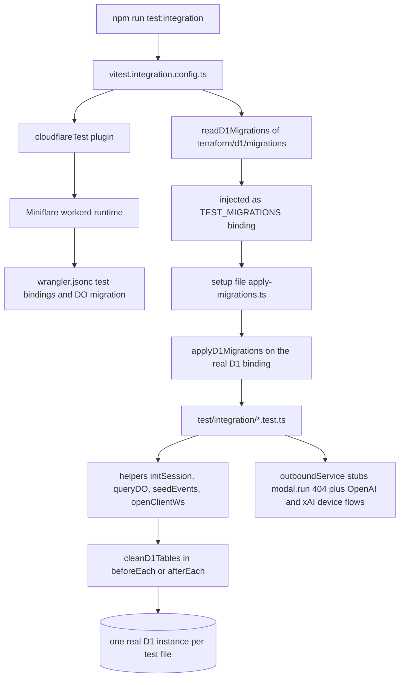

# Testing Strategy

Open-Inspect is tested at two depths for TypeScript (fast co-located unit tests in Node, plus a
control-plane integration suite that boots the real `workerd` runtime with a real D1 database and
the production D1 schema), and one depth for Python (pytest suites for the Modal data plane and the
in-sandbox runtime). Around those suites sits a set of auxiliary gates — ESLint, a report-only
complexity reporter, Prettier, Knip, and lint-staged — and a small family of
[architecture-pinning tests](#architecture-pinning-tests) whose entire job is to fail when a
boundary is quietly weakened. This page is the map: where each suite lives, how to run it, what the
integration harness provides, and which tests an agent must not weaken to make a change green.

## The test matrix

| Suite | Location | Runtime | Command |
| --- | --- | --- | --- |
| control-plane unit | `packages/control-plane/src/**/*.test.ts` (co-located) | Node, Vitest | `npm test -w @open-inspect/control-plane` |
| control-plane integration | `packages/control-plane/test/integration/*.test.ts` | `workerd` via `@cloudflare/vitest-pool-workers` + real D1 | `npm run test:integration -w @open-inspect/control-plane` |
| shared unit | `packages/shared/src/**/*.test.ts` (co-located) | Node, Vitest | `npm test -w @open-inspect/shared` |
| web | `packages/web/src/**/*.test.{ts,tsx}` (co-located) | Node, Vitest | `npm test -w @open-inspect/web` |
| github-bot | `packages/github-bot/test/*.test.ts` (separate `test/`) | Node, Vitest | `npm test -w @open-inspect/github-bot` |
| slack-bot / linear-bot | co-located `src/**/*.test.ts` | Node, Vitest | `npm test -w @open-inspect/slack-bot` / `-w @open-inspect/linear-bot` |
| modal-infra | `packages/modal-infra/tests/test_*.py` | pytest + pytest-asyncio | `cd packages/modal-infra && pytest tests/ -v` |
| sandbox-runtime | `packages/sandbox-runtime/tests/test_*.py` plus `tests/*.test.mjs` | pytest, plus `node --test` for the `.mjs` tools tests | `cd packages/sandbox-runtime && pytest tests/ -v` |

All TypeScript packages use Vitest; Python uses pytest with `asyncio_mode = "auto"`. The root
`vitest.workspace.ts` joins the per-package unit configs (`packages/*/vitest.config.ts`), so every
unit config sets `environment: "node"`, includes only `*.test.ts`/`*.test.tsx` files, and reports
coverage through v8 (`text` + `json`) excluding test files, `.d.ts`, and the worker entrypoint.
The github-bot is the exception to co-location: its tests live in a separate `test/` directory,
and its config includes both `src/**/*.test.ts` and `test/**/*.test.ts`.

The root scripts fan out across workspaces: `npm test` runs every package's unit suite, and
`npm run test:integration` (root) runs `test:integration` in every workspace that defines one —
currently only the control plane.

## Architecture-pinning tests

A subset of the suites exists to make architectural boundaries fail loudly. These are the tests an
agent must **not** weaken (deleting an assertion, loosening a matcher, or casting around a type
error in one of them) to make a change pass. When one fails, the fix belongs in the source change,
not the test:

- **`packages/shared/src/module-boundaries.test.ts`** — parses every production module of
  `@open-inspect/shared` with the TypeScript AST and asserts that implementation modules never
  import the package-root or shared-types barrels (importing `@open-inspect/shared` or
  `@open-inspect/shared/*` from inside the package is also a violation), and that the internal
  dependency graph has **no runtime cycles and no compile-time cycles** (type-only edges are
  separated via the `import()`-type analysis). This keeps the package's export surface and its
  acyclic structure pinned.
- **`packages/shared/src/types/boundary-schemas.test.ts`** — the largest single test file in the
  package; it drives the Zod schemas that guard every client/server boundary
  (`createSessionRequestSchema`, `clientMessageSchema`, `serverMessageSchema`,
  `sendPromptRequestSchema`, `sandboxEventSchema`, the Linear callback schemas, the automation
  repository schemas, …) with valid and malformed payloads. Valid payloads must parse; partial,
  empty-string, and type-confused payloads must be rejected — these schemas are what the web
  client, bots, and sandbox runtime agree on, so a weakening here changes the wire contract.
- **`packages/shared/src/types/type-contracts.test.ts`** — uses `expectTypeOf` to pin the
  `z.input`/`z.output` relationships of the public schemas to their hand-written TypeScript types
  (e.g. `CreateSessionRequest` equals `z.output<typeof createSessionRequestSchema>`), including the
  repository transform boundary where normalization makes the output type stricter than the input.
- **Web client/server auth-boundary ESLint tests** — `client-auth-boundary-eslint.test.ts` and
  `server-auth-boundary-eslint.test.ts` run the *real* repository ESLint flat config against
  synthetic files, pinning that: client code cannot import `next-auth`, raw `fetch` is banned
  everywhere except the two app-owned transports (`browser-api-fetch.ts`,
  `control-plane-transport.ts`), and server routes must use the `getServerAuthSession` seam rather
  than importing `@/lib/auth` or the framework directly. The corresponding rules live in
  `eslint.config.js`; these tests prove the rules stay armed.
- **Control-plane ESLint bans** (enforced by CI lint, not a Vitest file, but same spirit): `.DB`
  member access is banned outside the composition roots — `src/index.ts`,
  `src/session/durable-object.ts`, `src/router.ts`, and the queue consumer each carry a single
  inline `eslint-disable` with a justification comment — and the session composition root
  (`session/components.ts`) may only be imported by the platform adapter
  (`session/durable-object.ts`), which in turn may only be imported by the worker entrypoint
  (`src/index.ts`). Repo-wide `no-restricted-imports` also forces auth-owned and service-auth-owned
  names to be imported from `@open-inspect/shared/auth` and `@open-inspect/shared/service-auth`.
- **`packages/control-plane/src/router.policy.test.ts`** — asserts the route policy table is
  complete (every route declares `authentication` and `supportedScmProviders`) and then pins the
  auth kind of representative routes per class: `public`, `handler-authenticated`, `web-service`,
  `user`, `user-or-service`, `sandbox` (with correct session-id extraction from the path), and
  `user-or-service-with-sandbox-fallback`; that diff authentication is method-specific; that
  management/broker routes are non-cacheable; and that `scm-credentials` is the only GitLab-specific
  SCM exception. The kinds come from the `RouteAuthentication` union in `src/routes/shared.ts`.
- **Cross-plane contract tests** — the Python suite in
  `packages/modal-infra/tests/test_build_sandbox_lifecycle.py` reads the TypeScript sources of
  `packages/shared/src/types/integrations.ts` and
  `packages/control-plane/src/image-builds/timeouts.ts` with a regex and asserts Modal's
  `DEFAULT_BUILD_TIMEOUT_SECONDS` / `MAX_BUILD_TIMEOUT_SECONDS` and its finalization-grace mirror
  stay numerically identical; and both that file and
  `packages/control-plane/src/sandbox/sandbox-env.test.ts` pin the image-build callback env keys to
  the single manifest `packages/sandbox-runtime/src/sandbox_runtime/image_build_callback_env.json`
  (including which side scrubs which reserved key). These tests are why the Python CI triggers
  include two TypeScript file paths.
- **Golden-vector and seam tests** worth knowing about: `shared/src/service-auth.test.ts` verifies
  the sig1 signing scheme against committed vectors in
  `packages/shared/test-fixtures/service-auth-vectors.json`; `src/worker-build.test.ts` builds the
  control-plane bundle and asserts it uses workerd's `node:async_hooks` (no `AsyncLocalStorage`
  polyfill); `shared/src/public-api.test.ts` pins package-root export aliases; and the integration
  suite's `session-do-collaborator-wiring.test.ts` pins the `SessionDO`'s collaborator thunks that
  have success-shaped fallbacks and are otherwise invisible to the rest of the suite.
- **`packages/sandbox-runtime/tests/test_bridge_push.py`** — pins the bridge's git-push semantics
  that security depends on: stderr redaction of embedded tokens (`https://***@github.com/...`),
  the terminate-then-kill timeout ladder with its exact `wait_for` timeouts, and manifest-targeted
  multi-repo push (case-insensitive identity matching, no filesystem access for non-members).

## Control-plane integration suite

`npm run test:integration -w @open-inspect/control-plane` executes
`test/integration/**/*.test.ts` inside a real `workerd` runtime via the `cloudflareTest()` plugin of
`@cloudflare/vitest-pool-workers`, configured in `vitest.integration.config.ts`:



The integration harness: migrations from the Terraform directory are applied automatically to a real D1 binding, and helpers plus stubbed outbound services give tests a production-shaped worker.

- **Real D1 with the production schema.** `readD1Migrations` reads
  `terraform/d1/migrations/` (the same directory Terraform applies in production) and injects the
  parsed list as a `TEST_MIGRATIONS` binding; the global setup file `test/integration/apply-migrations.ts`
  then calls `applyD1Migrations(env.DB, env.TEST_MIGRATIONS)` once per run. Migration-behavior tests
  (e.g. `migration-0066-*`) additionally fish individual migrations out of `env.TEST_MIGRATIONS`
  and replay them against a hand-restored pre-migration schema.
- **Isolation model.** The workers pool isolates D1 storage per test *file*, so files run in
  parallel without cross-file interference. Within a file, tests share one D1 instance and must call
  `cleanD1Tables()` from `test/integration/cleanup.ts` in `beforeEach`/`afterEach` — it issues a
  single `DELETE FROM …` for every table in the schema. Most suites (`d1-session-index.test.ts`,
  `webhooks.test.ts`, `automation-store.test.ts`, …) use the one-liner
  `beforeEach(cleanD1Tables)`; a few add seeding or extra deletes around it.
- **Runtime parity.** Miniflare is pinned to `compatibilityDate: "2024-09-23"` with
  `nodejs_compat` to match the Terraform-managed production runtime rather than the pool's default
  (today's date). The config also aliases `luxon` to its CommonJS entry: vite 8 resolves the ESM
  build, but `cron-parser` (a CJS dependency of `@open-inspect/shared`) requires the CJS shape, and
  without the alias the scheduler silently skips every overdue automation.
- **Stubbed outbound world.** `outboundService` makes `*.modal.run` return 404 ("Modal is
  unavailable in integration tests") and answers the OpenAI and xAI device-flow/token endpoints with
  deterministic fixtures, so provider-account tests run hermetically; any other outbound request
  throws. Test bindings inject the per-service `SERVICE_AUTH_SECRET_*` values, browser-auth secret,
  encryption keys, `queueProducers: ["IMAGE_BUILD_FINALIZATION_QUEUE"]`, and the migration list.
  A Better Auth `APIError` filter in `onUnhandledError` tolerates the framework's internal
  redirect/invalid-token rejections without masking real errors.
- **Helpers** (`test/integration/helpers.ts`): `initSession()` (and `initNamedSession()`) write a
  production-shaped D1 row through `SessionIndexStore` and then `POST /internal/init` on the real
  `SESSION` Durable Object stub; `queryDO(stub, sql, ...)` executes raw SQL inside the DO via
  `runInSessionDO` (the `runInDurableObject` seam in `session-do-access.ts`, the single place that
  types the stub as the `SessionDO` class); `seedEvents()`/`seedMessage()` insert rows directly into
  DO SQLite with a monotonically increasing `timeline_sequence`; `openClientWs()` performs the
  upgrade through `SELF.fetch` (full worker routing) and optionally completes the WS-token
  `subscribe` flow, collecting messages until a predicate matches (`collectMessages` must be
  started *before* the triggering send); `openSandboxWs()`/`seedSandboxAuth()` exercise the sandbox
  edge; `serviceFetch()` signs each request with the production sig1 scheme and, for `service: "web"`,
  additionally seeds a real Better Auth user/session and attaches the signed browser cookie.
- **Typecheck split.** `npm run typecheck -w @open-inspect/control-plane` runs three tsc programs:
  the production `tsconfig.json`, `tsconfig.test.json` (unit tests use Node APIs like `node:crypto`
  and `node:fs`, so Node types are deliberately confined to this pass), and
  `test/integration/tsconfig.json`, which compiles against `@cloudflare/workers-types` plus the
  `cloudflare:test` module — the integration `env` is merged with the production `Env` in
  `test/integration/env.d.ts`.
- **Running it anywhere.** `packages/control-plane/Dockerfile.test` packages a self-contained
  `node:22-slim` image that builds `@open-inspect/shared`, copies the D1 migrations, and runs
  `npm run test:integration` — the same command CI uses. In CI the integration job is sharded
  2× (`-- --shard=1/2` / `2/2`, `fail-fast: false`) with a 10-minute timeout; unit jobs get 5.

Unit-level router tests (`src/router.*.test.ts`) complement the integration suite with a
Node-environment harness: `router.test-support.ts` provides `signedServiceRequest()`, which signs
each request individually with `buildServiceAuthHeaders` (sig1 binds method, URL, and body, so no
reusable header exists) against `TEST_SERVICE_SECRETS`, plus a `TEST_BACKGROUND_TASK_CONTEXT`
double for the `BackgroundTasks` seam.

## Python suites

Both Python packages run `pytest tests/ -v` from their package directory:

- **modal-infra** (`packages/modal-infra/tests/`) covers the FastAPI data-plane API and Modal
  lifecycle: `test_web_api_create_sandbox.py` drives the route functions directly and pins request
  validation (string booleans and invalid typed fields → HTTP 400, missing/empty
  `control_plane_url`/`sandbox_auth_token` → 400, unknown fields forwarded to the session-config
  helper, generic manager failures → HTTP 500 with the request logged but not leaked), while other
  files cover sandbox launch, env-var handling, tunnel ports, VNC/ttyd, build-sandbox lifecycle, and
  deploy wiring.
- **sandbox-runtime** (`packages/sandbox-runtime/tests/`) covers the in-sandbox runtime: the bridge
  (push, ack, SSE, stop, reconnection, attachments, boot warnings), git credential helper and
  signing, diff collection, entrypoint build mode, multi-repo workspace, managed skills, event
  forwarding, and supervisor lifecycle. Three tool tests (`tests/*.test.mjs`) are plain
  `node --test` files for the sandbox's injected JavaScript tools and run via
  `node --test tests/*.test.mjs` (CI installs Node 22 in that job).
- **Isolation backstop.** `tests/conftest.py` installs an autouse fixture that redirects the
  runtime's fixed file paths (repo manifest, boot warnings, tunnel env) to `tmp_path`, because this
  suite routinely executes *inside a live Open-Inspect sandbox* where `/tmp/oi-repo-manifest.json`
  is the running session's real manifest.
- **Cross-plane pins.** As described above, `test_build_sandbox_lifecycle.py` and
  `test_modal_image_build_start.py` keep the Python runtime constants aligned with the TypeScript
  contracts (shared build-timeout constants, finalization grace, the image-build callback env-key
  manifest, and the reserved user-env scrub lists).
- **Formatting.** Python formatting is **ruff**: `ruff check --fix && ruff format` from the package
  directory (CI runs `ruff check` + `ruff format --check`). Both packages extend the shared
  `ruff.toml` (line length 100, isort, bugbear, pyupgrade, …) and configure `src = ["src", "tests"]`.
  MyPy is configured strict but is advisory in CI (`continue-on-error: true`).

The Python CI workflow's path triggers explicitly include
`packages/control-plane/src/image-builds/timeouts.ts` and
`packages/shared/src/types/integrations.ts` — because the Python contract tests read those files —
so a TypeScript constant change re-runs the Python suites.

## Auxiliary gates

CI (`.github/workflows/ci.yml`, TypeScript; `ci-python.yml`, Python) runs on every push/PR to
`main` with `paths` filters. Every TypeScript job that compiles or tests dependent packages builds
`@open-inspect/shared` first (the lint/format/knip job is the exception), since worker packages
import its built `dist/` output. The job layout:

1. **Lint & Format (TypeScript)** — `npm run lint` (ESLint flat config), then
   `npm run test:lint-complexity`, `npm run format:check` (Prettier), and
   `npm run knip -- --no-exit-code`.
2. **TypeCheck (TypeScript)** — build shared, then `npm run typecheck` across all packages.
3. **Build (Web)** — a Next.js production build of the web app.
4. **Test (control-plane unit)** — shared tests, then control-plane unit tests.
5. **Test (control-plane integration 1/2, 2/2)** — the sharded workerd suite.
6. **Test (web)** and **Test (bots)** — web, github-bot, slack-bot, linear-bot unit suites.

The auxiliary gates:

- **Complexity reporter.** `npm run lint:complexity` (`scripts/lint-complexity.mjs`) runs ESLint
  with `complexity: ["warn", { max: 0, variant: "classic" }]` over `packages/**/*.{ts,tsx}` to
  collect every function's cyclomatic complexity, then prints a distribution plus a hotspot table
  (production functions over 20, top 25). It is deliberately **report-only** — findings never affect
  the exit code; test files are counted but excluded from the production hotspot table. Its message
  parser has its own `node --test` suite (`npm run test:lint-complexity`), which is what CI runs, so
  a future ESLint diagnostic-shape change fails loudly instead of silently corrupting the report.
- **Knip (dead code).** `knip.json` defines per-workspace entry points (including
  `test/integration/**/*.test.ts` for the control plane and the sandbox runtime's injected `.js`
  tools) and detects unused exports, files, and dependencies. CI runs it with `--no-exit-code`, so
  it reports without blocking — treat new findings as review items, not failures to suppress.
- **Prettier + ESLint via lint-staged.** The husky `pre-commit` hook runs `lint-staged`:
  `eslint --fix` + `prettier --write` for `*.{ts,tsx}`, `prettier --write` for
  `*.{js,jsx,json,md,yaml,yml,css}`, and `ruff check --fix` + `ruff format` for Python under
  `packages/{daytona-infra,e2b-infra,modal-infra,sandbox-runtime}`. The hook activates the
  modal-infra venv first when present so `ruff` is available.
- **Conventional commits.** Commit subjects use `feat:`, `fix:`, `docs:`, `refactor:`, `chore:`,
  `test:` prefixes and stay under 72 characters; details belong in the PR body.
- **Coverage.** Every Vitest package exposes `test:coverage` (v8 provider, `text` + `json`
  reporters, production sources only). Coverage is not a CI gate.

## Quick reference

```bash
# Build shared first whenever shared types changed
npm run build -w @open-inspect/shared

# TypeScript unit tests
npm test -w @open-inspect/control-plane
npm test -w @open-inspect/web
npm test -w @open-inspect/github-bot
npm test -w @open-inspect/slack-bot
npm test -w @open-inspect/linear-bot
npm test -w @open-inspect/shared

# Control-plane integration (workerd + real D1, migrations auto-applied)
npm run test:integration -w @open-inspect/control-plane

# Python suites
cd packages/modal-infra && pytest tests/ -v
cd packages/sandbox-runtime && pytest tests/ -v
cd packages/sandbox-runtime && node --test tests/*.test.mjs

# Python formatting
cd packages/modal-infra && ruff check --fix && ruff format
cd packages/sandbox-runtime && ruff check --fix && ruff format

# Repo-wide checks
npm run lint
npm run typecheck
npm run format:check
npm run lint:complexity   # report-only
npm run knip              # advisory in CI (--no-exit-code)
```

Related pages: [Control Plane Worker](/openwiki/architecture/control-plane-worker.md) (what the
router policy table and `BackgroundTasks` seam pin), [Data Model](/openwiki/architecture/data-model.md)
(the D1 schema `applyD1Migrations` creates in tests), [Shared Contracts](/openwiki/architecture/shared-contracts.md)
(the schemas pinned by boundary-schema and type-contract tests), [Sandbox Providers & Infra](/openwiki/architecture/sandbox-providers.md)
(the Python planes under test), [Deployment and Infrastructure](/openwiki/operations/deployment.md)
(the CI/CD workflows this page's gates run in).
