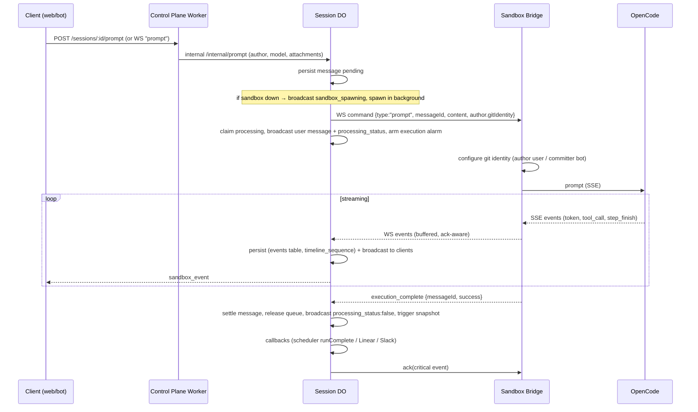

# Prompt Flow Workflow

A prompt travels through all three tiers: a client (web dashboard, Slack/GitHub/Linear bots) submits
it to the session Durable Object, the DO's persisted message queue dispatches it over the sandbox
WebSocket, the sandbox bridge feeds it to OpenCode and streams events back, and the DO persists and
broadcasts those events to every connected client until the turn settles. The moving parts:

- **HTTP enqueue** — `packages/control-plane/src/routes/session-prompt.ts` → the DO's internal
  prompt path (`SessionInternalPaths.prompt` = `/internal/prompt`), boundary in
  `packages/control-plane/src/session/http/handlers/messages.handler.ts`
- **WebSocket enqueue** — client messages `prompt` / `cancel_prompt` / `stop` routed by
  `packages/control-plane/src/session/message-router.ts` into
  `packages/control-plane/src/session/client-command-facade.ts`
- **Queue + dispatch** — `packages/control-plane/src/session/message-queue.ts` (with
  `message-repository.ts` persistence)
- **Sandbox side** — `packages/sandbox-runtime/src/sandbox_runtime/bridge.py` (command handling,
  git identity), `prompt_stream.py` (SSE translation), `event_forwarder.py` (buffered delivery)
- **Event settlement** — `packages/control-plane/src/session/sandbox-events/` (processor + family
  handlers), `event-repository.ts` / `event-stream.ts` (persistence, pagination)
- **Callbacks** — `packages/control-plane/src/session/callback-notification-service.ts`

## Enqueue paths and the enqueue contract

**HTTP.** `POST /sessions/:id/prompt` (`session-prompt.ts`) applies identity enforcement (the author
comes from the verified principal — user → canonical id, bot → asserted actor; an actorless bot
prompt is system-initiated and stays anonymous), validates the body with `sendPromptRequestSchema`
(content required) and the attachment references (max `MAX_SESSION_ATTACHMENTS_PER_MESSAGE` = 6 per
message), and strips `callbackContext` from unauthorized principals (only bots that own callbacks
may attach one; the web client never may). For non-anonymous authors it resolves the canonical user
id and the GitHub enrichment (scm user id, login, display name/email, encrypted access token) via
`resolveGitHubEnrichmentForRequest` under `resolveGitHubCredentialAuthority`, then forwards an
`EnqueuePromptRequest` to the DO's internal prompt path and touches the session index `updated_at`
in the background. The shared contract lives in
`packages/control-plane/src/session/enqueue-prompt-contract.ts`.

**WebSocket.** A connected client sends `{type: "prompt"}` (or `cancel_prompt` / `stop`) over the
session WebSocket; `message-router.ts` validates it against `clientMessageSchema` and dispatches to
`clientCommands.submitPrompt` / `cancelPrompt` / `stopExecution`. Both paths converge on the same
DO enqueue — the message is persisted **pending** in SQLite (via `MessageRepository`) before any
dispatch attempt, which is what makes queued prompts and crash recovery possible.

**Attachments.** Image attachments are uploaded separately: `POST /sessions/:id/attachments`
(`routes/session-attachments.ts`) stores bytes in R2 (`SessionAttachmentStorage` coordinates R2
`put` with the DO record) and the prompt references them by id; screenshot/video media uploads go
through `routes/session-media-upload.ts` with per-session upload limits. Invalid or unhydratable
attachments are skipped with a media warning at prompt time rather than failing the turn.

## The DO message queue

`SessionMessageQueue.processMessageQueue` (`message-queue.ts`) is the single dispatcher, guarded
against re-entrancy by the processing-message claim:

1. If a message is already processing, return. Otherwise take the next **pending** message (FIFO —
   prompts submitted while a turn runs simply queue and dispatch when the turn settles).
2. Resolve the model (message override → session model → default) and check provider
   authentication; an authentication failure fails the message and immediately re-dispatches.
3. If no sandbox WebSocket is connected, broadcast `sandbox_spawning` and spawn the sandbox **in the
   background** (a snapshot restore can take tens of seconds; the HTTP response must not be held
   open past bot request timeouts). The message stays persisted-pending and dispatches when the
   sandbox socket connects.
4. Build the `prompt` `SandboxCommand`: `messageId`, `content`, resolved model and reasoning effort
   (message → session → model default, validated), the **author git identity** (see below), and the
   stored attachments.
5. Claim the message as processing (`startMessageProcessing` — also inserts the user message
   event), send the command over the sandbox WebSocket, and on success broadcast the user message
   event and `processing_status: true`, refresh the prompt-queue broadcast, update last activity,
   arm the **execution timeout alarm** (sharing the DO's single alarm slot with lifecycle checks),
   and fire the `callback.notify_started` background task (Linear sessions get a started
   notification).
6. A failed send reverts the message to pending and terminates the unresponsive sandbox before
   retrying.

### Git identity per prompt author

`resolveParticipantGitIdentity` maps the author participant through
`resolveGitAuthorIdentity` (`session/identity.ts`) into a `PromptGitIdentity`: for GitHub, a valid
numeric SCM user id + login yields `{mode: "attributed-user", name, email}` with the ID-based
noreply email; otherwise `{mode: "agent-only"}`. The bridge applies this per prompt (author =
prompting user, committer = bot) — the full signing story is in
[Git Auth and Pull Requests](git-auth-and-pull-requests.md).

## Sandbox processing

The bridge's `_handle_command` runs the `prompt` command as a **background task** so the WebSocket
listener stays responsive to other commands (push, stop, ack) — prompt tasks survive WS
disconnects. `_handle_prompt`:

1. Parses the explicit git identity and configures signing/author identity (`_configure_git_identity`).
2. Creates the OpenCode session on first use, hydrates and processes attachments (invalid ones emit
   a media warning).
3. Streams OpenCode's SSE response through `OpenCodePromptStream` (`prompt_stream.py`), which
   translates OpenCode events into bridge events (`token`, `tool_call`, `step_finish`, errors),
   attributing assistant messages, buffering out-of-order parts (`MAX_PENDING_PART_EVENTS`), and
   applying Anthropic thinking budgets per reasoning effort. SSE inactivity and prompt-max-duration
   timeouts bound the stream.
4. Emits the terminal `execution_complete` event with `messageId` and `success` — including on
   errors and task cancellation (the done-callback emits a failed `execution_complete` for
   cancelled/excepted tasks), and treats "no output emitted" as an error.
5. The `stop` command cancels the current prompt task and best-effort asks OpenCode to stop.

Events travel back over the sandbox WebSocket through `BufferedEventForwarder`
(`event_forwarder.py`): a bounded (1000-event) buffer that evicts non-critical events first, with
**critical events** (`execution_complete`, `error`, `snapshot_ready`, `push_complete`,
`push_error`) carrying an `ackId` and staying pending until the DO acknowledges them.

## Event settlement, persistence, and broadcast

The DO's `SessionSandboxEventProcessor` (`session/sandbox-events/processor.ts`) validates each
sandbox event and routes it to family handlers — streaming (tokens/tool calls), artifacts
(`pr` artifacts from the create-PR tool, diff artifacts), execution
(`execution_complete` settles the turn: message status projection, queue release, callbacks,
snapshot trigger), and runtime (push results, snapshot readiness, errors). Cross-family concerns
live in the processor: one clock reading, one message-attribution resolution, and the **ack
contract** — the ack for a critical event is sent only after its handler finishes, so an
unacknowledged critical event is safely re-delivered on reconnect.

Every event is persisted in the DO's SQLite `events` table with a monotonic `timeline_sequence`
(`EventRepository`), which gives:

- **Pagination and reconnect backfill** — clients call `fetch_history` with a
  `(timestamp, id, sequence)` cursor (`SessionEventStream.getHistoryPage`), rate-limited to one call
  per 200 ms; a reconnecting client replays everything since its cursor instead of losing history.
- **Broadcast** — each settled event is broadcast to all connected clients via the messenger
  (`sandbox_event`, `processing_status`, prompt-queue updates).

## Stop execution

`SessionMessageQueue.stopExecution` (client `stop` message or `POST .../stop`):

1. Fails the processing message ("Execution was stopped"), marks it **awaiting stop confirmation**
   with a deadline of `STOP_CONFIRMATION_TIMEOUT_MS` = 15 seconds, and schedules the alarm for that
   deadline.
2. Broadcasts `processing_status: false` (plus a synthetic `execution_complete` so clients flush
   buffered tokens), then forwards `{type: "stop"}` to the sandbox.
3. If the sandbox never confirms before the deadline, `recoverStopConfirmationTimeout` terminates
   the unresponsive sandbox and resumes the queue. A send failure at stop time terminates the
   sandbox immediately.

Fatal sandbox failures take the same path: `handleFatalSandboxFailure` terminates the sandbox, fails
the stuck processing message, and resumes the queue.

## Completion callbacks

On `execution_complete`, the execution handler fires `callbackService.notifyComplete` in the
background. `CallbackNotificationService` routes by source:

- **automation** → the scheduler's run-completion function (`AutomationRunCompletion`), closing the
  automation run loop.
- **linear** → the `LINEAR_BOT` worker, HMAC-signed with the destination bot's signing secret
  (payload schema-validated); Linear also gets `notifyStarted` at dispatch time.
- **anything else (including web)** → the `SLACK_BOT` binding for backward compatibility, or
  skipped without a callback context.

Delivery uses `deliverWithRetry` with retry backoff (`callback-delivery.ts`); throttled tool-call
progress callbacks keep bots updated mid-turn.

## Happy-path sequence

## Reconnect and restore

Two layers keep the flow alive when the sandbox bridge drops:

- **Bridge → DO**: `BufferedEventForwarder` holds unsent events in its bounded buffer and pending
  critical acks; on the next `bind()` it recovers the backlog (buffered first, then unacknowledged
  criticals) exactly once, serialized by a recovery lock. On the DO side, a sandbox socket close is
  classified by `disconnect-handler.ts`: the sandbox is not marked terminated if a newer sandbox
  socket is active or reconnect is blocked by the sandbox status, and otherwise the DO awaits
  reconnect and schedules a lifecycle check (eventual snapshot-restore respawn — the session
  lifecycle, including the persisted pending/processing messages, lives in the DO, so a restored
  sandbox re-attaches and queued prompts dispatch).
- **Client → DO**: a reconnecting client replays history with `fetch_history` cursors instead of
  trusting its local buffer; interrupted processing messages are reconciled by the execution-timeout
  and stop-confirmation alarms.
