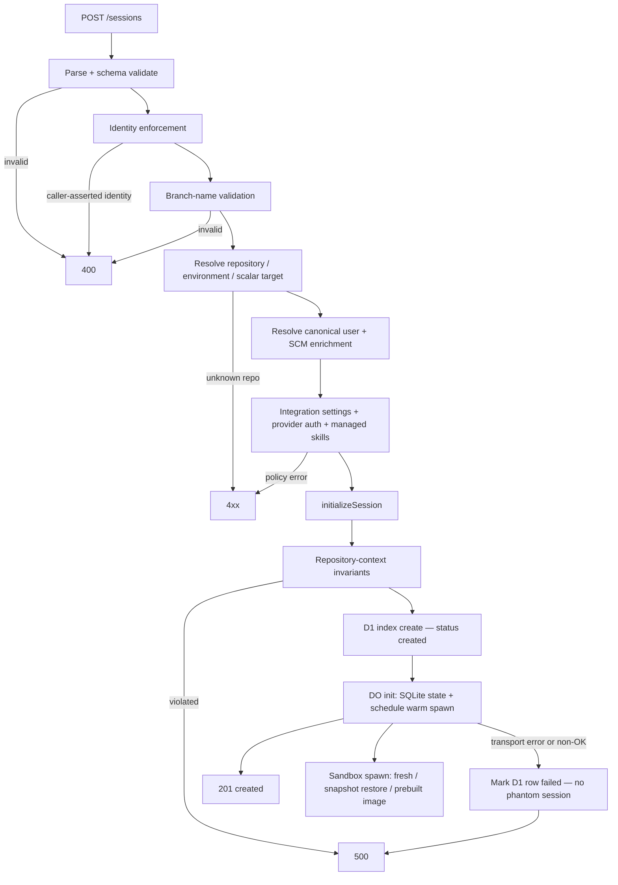

# Session Creation Workflow

Every session — web, bot, automation, or agent-spawned — is created by one function:
`initializeSession` (`packages/control-plane/src/session/initialize.ts`), called by the human-facing
create route and by the child-spawn route alike. The ordering invariant both must respect:
**D1 index first, DO init second** — failures are caught and compensated before any sandbox warms.

Related pages: [Sessions](../concepts/sessions.md),
[Environments and Repositories](../concepts/environments-and-repositories.md),
[Models and Provider Accounts](../concepts/models-and-provider-accounts.md),
[Sandbox Lifecycle](../concepts/sandbox-lifecycle.md), [Prompt Flow](prompt-flow.md).

## `POST /sessions` in order

`handleCreateSession` (`packages/control-plane/src/routes/session-create.ts`) walks a fixed
sequence; each step can reject the request before any state is written:

1. **Input parsing** — `parseCreateSessionInput` (`session/create-session-input.ts`) parses JSON,
   validates against `createSessionInputSchema` (strip-mode), and returns both the typed input and
   the **raw** body — because forbidden-identity-field checks must inspect raw keys, not the
   stripped result.
2. **Identity enforcement** — `applyIdentityEnforcement(ctx, "session-create", raw)`
   (`auth/identity-enforcement.ts`): identity comes only from the verified principal; caller-asserted
   identity/SCM body fields are rejected (`SPAWNING_FORBIDDEN_FIELDS`), and a user principal is
   required. SCM credentials never arrive in the body — they flow only through server-side
   enrichment from the token store. Body display fields (actor display name/email/avatar) stay
   cosmetic.
3. **Branch-name validation** — defense in depth on top of schema validation: a git-ref charset
   pattern (`^[\w.\-/]+$`) over the requested branch and every member's `baseBranch`.
4. **Repository / environment resolution** — the three target modes are mutually exclusive by
   schema: `environmentId` snapshots the environment's members (`resolveEnvironmentTarget`) and
   resolves them like any other list, recording `environment_id` as provenance; an ad-hoc
   `repositories` list resolves each member (`resolveSessionRepositories`, both in
   `repos/resolve.ts`); a scalar `repoOwner`/`repoName` pair is a single lookup
   (`resolveRepoOrError` — repo id + default branch). In list modes the **primary entry
   (position 0) is mirrored into the scalar columns** so filters, settings resolution, and pre-list
   consumers keep working unchanged.
5. **Canonical user resolution** — `resolveCanonicalUserId` resolves the D1 analytics-attributed
   platform user id from the verified principal, failing closed.
6. **SCM enrichment** — on GitHub deployments, `resolveGitHubEnrichmentForRequest` under
   `resolveGitHubCredentialAuthority` fills scm user id/login/name/email and encrypted tokens from
   the token store via the canonical user; a user without a linked GitHub account falls back to the
   GitHub App bot (account linking deliberately deferred).
7. **Model and reasoning effort** — validated once for both DO init and the D1 index
   (`getValidModelOrDefault`, `isValidReasoningEffort`).
8. **Session-scoped integration settings** — `resolveSessionScopedSettings` resolves
   code-server/VNC toggles and sandbox settings from the primary member, layering saved-environment
   overrides on top.
9. **Provider auth resolution** — `resolveSessionProviderAuth`
   (`session/provider-account-resolution.ts`) builds the complete, immutable provider routing
   snapshot from explicit selections (api key or validated provider account) or policy defaults —
   unattended spawns (any non-`user` spawn source) resolve through unattended policy.
10. **Managed skills resolution** — `resolveManagedSkills` (`session/skill-resolution.ts`) resolves
    the skill manifest from the scope (repositories + environment) and the requested selection
    (`all` default, `none`, or a profile), erroring with `SkillResolutionError` on invalid profiles.
11. **Initialize** — `initializeSession` (below) writes D1 then the DO; on failure the route
    answers 500 with a generic message.

## `initializeSession`: D1 first, DO second

`initializeSession` (`packages/control-plane/src/session/initialize.ts`) first re-validates the
repository context invariants (owner/name/id travel together; branch context only with a repo;
`repositories[0]` must equal the scalar mirror, synthesizing a one-entry list for scalar callers
and an empty list for repo-less sessions) and computes the base branch
(`branch || defaultBranch || DEFAULT_BASE_BRANCH`). Then:

1. **D1 index write** — `SessionIndexStore.create` inserts the session row (status `created`,
   parent/lineage columns, skill manifest, provider auth snapshot). This must succeed before any
   sandbox warming starts.
2. **DO init** — the DO is addressed by `env.SESSION.idFromName(sessionId)` and POSTed the init
   payload (session name = id, repo context, repositories, identity/SCM fields, settings, lineage).
   The DO init handler (`session/http/handlers/session-init.handler.ts`) validates the payload,
   writes the DO's SQLite state (session row, participants, member rows — legacy scalar producers
   get a member row so spawn/read paths have one source of truth), and **schedules the warm spawn**.
3. **Compensation** — a transport error or non-OK init response marks the D1 row `failed`
   (`markSessionFailed`, best-effort) so no phantom "created" session appears in listings, then
   rethrows; the route maps it to a 500.

## The spawn handoff

The DO init schedules the warm spawn (`scheduleWarmSandbox`); the actual sandbox start happens in
the lifecycle manager (`packages/control-plane/src/sandbox/lifecycle/manager.ts`), which chooses
the boot path: a **prebuilt image** when spawn-time selection matches the session's own repository
snapshot (see [Image Builds](image-builds.md) — environment sessions match only their environment's
image, single-repo sessions their repo scope, and a restore failure falls back to base), a
**snapshot restore** when a saved sandbox snapshot exists, otherwise a **fresh** boot with full
clone + setup. Spawn identity (sandbox id, sandbox auth token hash) is reserved up front, and a
provider create failure retries from base with a rotated identity.

The first prompt dispatch additionally spawns lazily: a prompt arriving with no sandbox connected
broadcasts `sandbox_spawning` and spawns in the background ([Prompt Flow](prompt-flow.md)).

## Child-session spawn

`POST /sessions/:id/children` (`packages/control-plane/src/routes/session-child-spawn.ts`) is the
tool-called path — the agent inside a sandbox spawns subagents. Its route policy
(`GITHUB_SANDBOX_FALLBACK_ROUTE`) admits sandbox auth, so every guardrail matters:

1. **Parent lookups** — the parent's D1 row supplies its environment id; child sandbox settings
   inherit the parent's settings scope (primary repo + environment overrides).
2. **Guardrails** — `MAX_SPAWN_DEPTH = 2` (parent depth check, 403), total-children cap (429), and
   per-repo concurrent/total child caps resolved from the parent's sandbox settings
   (`DEFAULT_MAX_CONCURRENT_CHILD_SESSIONS` / `DEFAULT_MAX_TOTAL_CHILD_SESSIONS` defaults).
3. **Spawn context** — the parent DO's `/internal/spawn-context` (`ChildSessionsHandler.getSpawnContext`)
   returns the deliberately-scalar `SpawnContext` (`spawn-context.ts`): the parent's **primary**
   repository (children are single-repo by design), model, reasoning effort, base branch, sandbox
   timeout, and the **prompt author** (the participant behind the parent's currently processing
   message — child operations must be triggered by an active prompt, else 400/401). The schema is
   validated after the fetch.
4. **Repository pinning** — a requested repo must match the parent's scalar repository exactly
   (403 otherwise), and no repository context can be added to a repo-less parent.
5. **Model gates** — enabled-model preferences (503 when unavailable), model validity, enablement,
   and reasoning-effort validity for the resolved model.
6. **Provider auth inheritance** — `sessionStore.getCompleteProviderAuth(parentId)` loads the
   parent's exact pinned provider snapshot (503 on failure); each entry is tagged
   `inheritedFromSessionId: parentId`. Skills inherit via `managedSkillsSourceSessionId`.
7. **D1 admission lease** — `acquireChildAdmissionLease` atomically claims parent concurrency
   capacity in D1: it purges expired leases, then inserts a lease token only while
   (live children + live leases) < maxConcurrentChildren, upserting over the caller's own expired
   lease. A lost lease answers 429. The lease is released (by token — only the owner can release)
   after `initializeSession` returns, success or failure; `finalizeChildAdmission` deletes it once
   the child-owned active projection succeeds.
8. **Initialize + first prompt** — `initializeSession` runs (D1 first, DO second, same
   compensation), the initial prompt is enqueued with `source: "agent"` attributed to the parent's
   prompt author (enqueue failure marks the child `failed`), and the parent DO is notified in the
   background (`child_session_update` broadcast so clients render the child row).

**Parent-child verification in both layers.** Later, when a child wants to prompt its parent, it
calls the parent DO's parent-prompt endpoint: the child DO handler verifies its own
`session.parent_session_id` equals the claimed `parentSessionId` before accepting
(`ChildSessionsHandler.parentPrompt`, 404 on mismatch) — D1 lineage columns plus DO-side state must
agree, so a forged or stale parent id cannot inject prompts. Descendant walks in D1 are also
depth-bounded (`MAX_DESCENDANT_DEPTH`) as insurance against corrupt `parent_session_id` cycles.

## Attribution and lineage

D1 records `parent_session_id` (also seeding `root_session_id`), `spawn_source`
(`user | agent | automation | github-bot | linear-bot | slack-bot`), and `spawn_depth` — the child
spawn is attributed `source: "agent"` for prompts and `spawnSource: "agent"` for lineage, with
automation id/run id inherited from the parent so an automation's child work still closes the run.
